# Use Cases — Contracts and Sales Domain

This document describes all use cases in the Contracts and Sales domain of the
koalixCRM system. The domain owns Contract records and the full hierarchy of
commercial documents: Quotation, Invoice, SalesOrder, PurchaseOrder, CreditNote,
DespatchAdvice, and PaymentReminder. It also covers line items
(CommercialDocumentPosition), file attachments (CommercialDocumentMedia), and
Subscriptions (when the subscriptions plugin is active).

All models in this domain are `WorkspaceScopedModel` instances. Every query is
transparently filtered to the active workspace through `WorkspaceAwareManager`,
which reads the workspace from a Django `ContextVar`. All ViewSets apply the same
scope via `WorkspaceScopedViewSetMixin`.

The primary source code lives in `koalixcrm/contracts/`. The REST API is mounted
at `/koalixcrm_contracts/api/v1/<workspace_id>/`. Django Admin screens for Contract
are at `/admin/contract_object_management/contract/`; commercial document admin
screens are at `/admin/contract_object_management/<document-type>/`.

## System Actors

| Actor | Type | Interface |
|---|---|---|
| CRM User | Human | Browser (Django templates) or REST API client |
| Administrator | Human | Django Admin (`/admin/`) |
| Celery Worker | Background process | Not directly relevant to this domain |
| PDF Export Service | External Java service | Reads contract data via internal API; stores generated PDFs |

---

## UC-CS-01: Manage Contracts (CRUD)

**Actor:** CRM User, Administrator

**Interfaces:** Django Admin (`/admin/contract_object_management/contract/`),
REST API (`contracts/`)

### UC-CS-01 Purpose

Create, read, update, and delete Contract records. A Contract is the root
business object that links a buyer party to a supplier party, carries a default
currency, a template set, staff assignment, and postal/phone/email addresses.
All commercial documents (Quotations, Invoices, etc.) reference a Contract.

### UC-CS-01 Preconditions

- The actor is authenticated and has a role in the target workspace
  (see [Access Control](#uc-cs-01-access-control)).
- The active workspace is set — either via the `workspace_id` path segment (REST)
  or via the session workspace selection (Admin).
- At least one Party (buyer) and one Party (supplier) exist in the workspace.
- A currency record for the intended `default_currency` exists.

### UC-CS-01 Main Flow

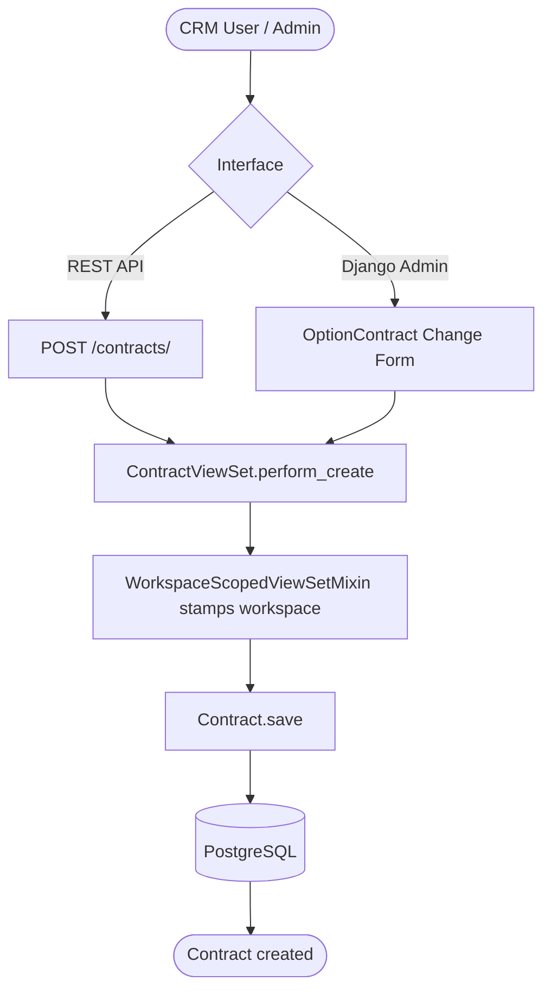

### UC-CS-01 REST Sequence — Create Contract

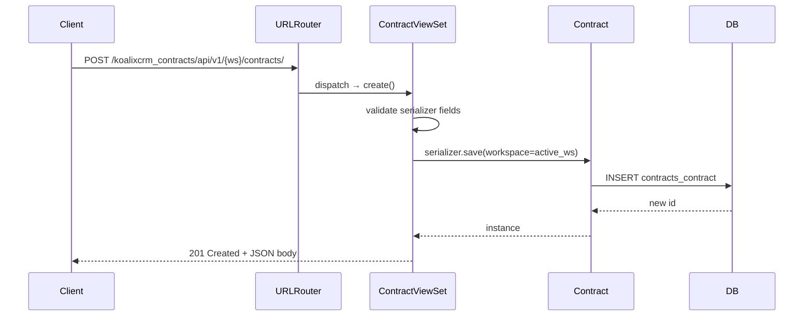

### UC-CS-01 Alternative Flows

- **Read (list):** `GET /contracts/` returns the workspace-scoped list. Django
  Admin list columns: id, description, buyer\_party, supplier\_party, staff,
  default\_currency, date\_of\_creation, last\_modification, last\_modified\_by.
  Admin search is on id and contract description. Admin filters: workspace,
  buyer\_party, supplier\_party, staff, default\_currency.
- **Read (detail):** `GET /contracts/{id}/` or Admin Change Form. The Change Form
  shows collapsible inlines: ContractPostalAddress, ContractPhoneAddress,
  ContractEmailAddress, InlineQuotation, InlineInvoice, InlineCreditNote.
- **Update:** `PUT`/`PATCH` on `contracts/{id}/` or Admin Change Form save.
  The workspace stamp is immutable after creation.
- **Delete:** `DELETE /contracts/{id}/` or Admin delete action. Django cascades
  to all linked commercial documents and address assignments.
- **Superuser without active workspace:** `WorkspaceScopedViewSetMixin` returns
  the unfiltered queryset; `perform_create` falls back to or creates the Default
  Workspace.

### UC-CS-01 Postconditions

- A `contracts_contract` row exists in the database, linked to buyer\_party,
  supplier\_party, default\_currency, and workspace.
- The contract is visible in the workspace-scoped list and through the REST API.

### UC-CS-01 Configuration and Parameterization

> Cross-reference: see `QQ_SD_Configuration.md` (not yet produced).

- Currency choices are driven by the `Currency` model in the core app.
- `TEMPLATE_SET` references drive PDF layout selection; the list of available
  template sets is configured per workspace.
- Staff assignment uses the Django `AUTH_USER_MODEL`.

### UC-CS-01 Access Control

See [QQ_SD_AccessControl.md](../08_cross_cutting_concepts/QQ_SD_AccessControl.md) for the full RBAC model.

- REST API: authenticated users with a `RoleInWorkspace` for the active workspace
  can read and write. Unauthenticated requests receive `401 Unauthorized`.
- Django Admin: staff users (`is_staff=True`) only. Workspace filtering via
  `WorkspaceScopedModelAdmin` (base class of `OptionContract`).

### UC-CS-01 Notes and References

- The Contract model is defined in `koalixcrm/contracts/models/contract.py`.
- `OptionContract` (the admin class) is defined in
  `koalixcrm/contracts/admin/contract_admin.py`.
- Subscriptions add an `InlineSubscription` inline and a `create_subscription`
  action to this admin screen when the plugin is active; see
  [UC-CS-08](#uc-cs-08-manage-subscriptions).

---

## UC-CS-02: Create Commercial Document from Contract

**Actor:** CRM User, Administrator

**Interfaces:** Django Admin bulk action on Contract change-list

### UC-CS-02 Purpose

Generate a new commercial document (Quotation, Invoice, PurchaseOrder, or
CreditNote) directly from one or more selected Contract rows using an Admin bulk
action. The action copies key contract fields (buyer\_party, supplier\_party,
default\_currency, staff, address assignments) into the new document and redirects
the administrator to the newly created record's change form for review and
completion.

### UC-CS-02 Preconditions

- The actor is an Administrator with Django Admin access.
- At least one Contract row is selected in the Admin change-list.
- The target document type's app and model are installed.

### UC-CS-02 Main Flow

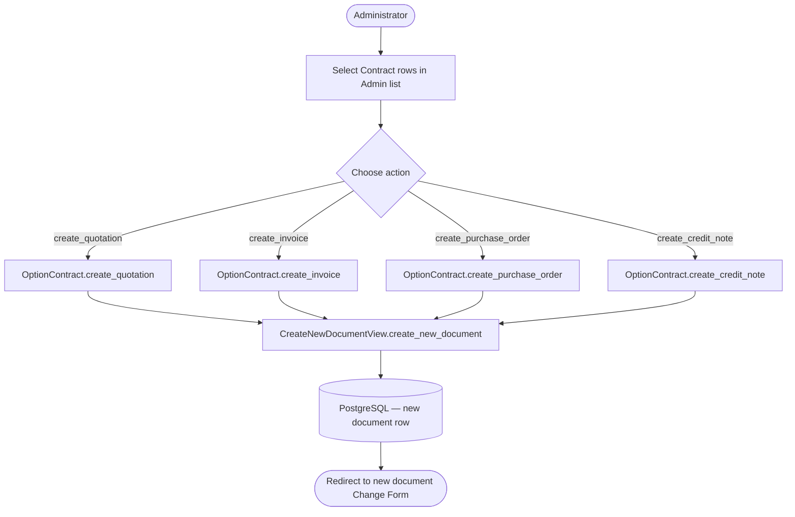

### UC-CS-02 Admin Sequence — Create Quotation from Contract

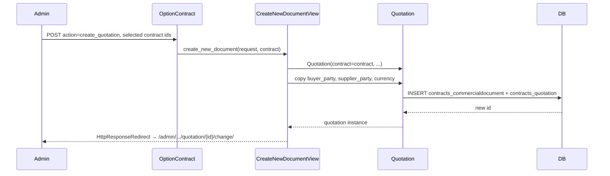

### UC-CS-02 Alternative Flows

- **Multiple contracts selected:** The action iterates over the queryset and
  creates one document per contract, then redirects to the list view with a
  success message (not to a single change form).
- **Cancellation:** No cancellation step exists; the Admin action executes
  immediately. If the resulting document is unwanted, it must be deleted manually.
- **Subscriptions plugin active:** An additional `create_subscription` action
  appears in the action list; see [UC-CS-08](#uc-cs-08-manage-subscriptions).

### UC-CS-02 Postconditions

- A new commercial document row (plus the shared `contracts_commercialdocument`
  parent row via MTI) exists in the database, linked to the source Contract.
- The document is visible in the corresponding document type's Admin list and
  REST endpoint.
- No positions, paragraphs, or addresses are pre-populated; the administrator
  must add these in the resulting change form.

### UC-CS-02 Configuration and Parameterization

> Cross-reference: see `QQ_SD_Configuration.md` (not yet produced).

- The set of available actions (`create_quotation`, `create_invoice`,
  `create_purchase_order`, `create_credit_note`) is declared in the `actions`
  list of `OptionContract` and can be extended by app plugins.
- `create_sales_order` and `create_despatch_advice` are available via the
  respective document admin screens (not from the Contract list).

### UC-CS-02 Access Control

See [QQ_SD_AccessControl.md](../08_cross_cutting_concepts/QQ_SD_AccessControl.md) for the full RBAC model.

- Django Admin staff access required (`is_staff=True`).
- No additional permission check beyond the contract admin's model permission.

### UC-CS-02 Notes and References

- `CreateNewDocumentView` is defined in
  `koalixcrm/contracts/views/newdocument.py`.
- `OptionContract` bulk actions are defined in
  `koalixcrm/contracts/admin/contract_admin.py` (lines `create_quotation`,
  `create_invoice`, `create_purchase_order`, `create_credit_note`).
- Each resulting document starts in a default status appropriate for its type
  (e.g., Quotation status `DR` Draft).

---

## UC-CS-03: Manage Commercial Documents (CRUD and Lifecycle)

**Actor:** CRM User, Administrator

**Interfaces:** Django Admin (per-document-type change screens),
REST API (`quotations/`, `invoices/`, `sales-orders/`, `purchase-orders/`,
`despatch-advices/`, `payment-reminders/`, `credit-notes/`)

### UC-CS-03 Purpose

Create, read, update, and delete any commercial document: Quotation, Invoice,
SalesOrder, PurchaseOrder, CreditNote, DespatchAdvice, or PaymentReminder.
Add and remove line items (positions), text paragraphs, and address assignments.
Every save triggers automatic price recalculation across all positions.

### UC-CS-03 Preconditions

- The actor is authenticated and has a role in the target workspace.
- A Contract for the document exists (required FK).
- Products, units, and tax rates are configured in the workspace (required for
  positions).

### UC-CS-03 Main Flow

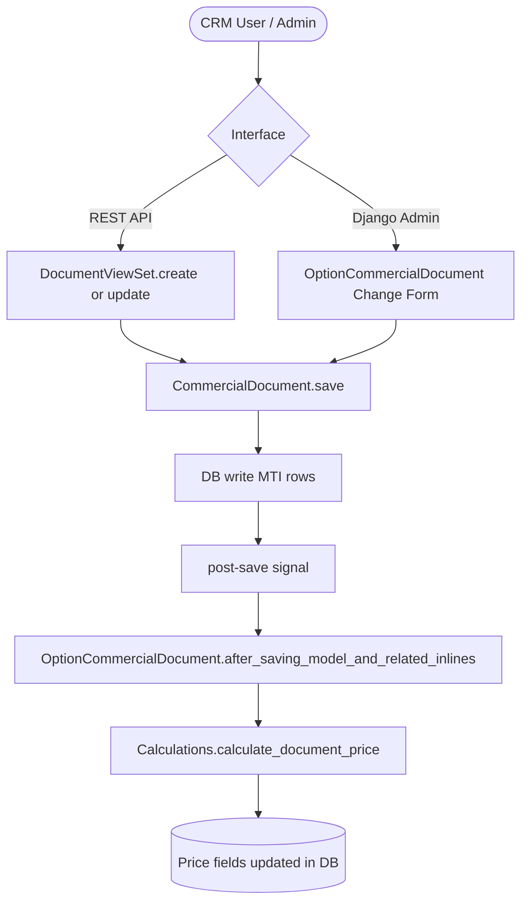

### UC-CS-03 Admin Sequence — Save Quotation with Positions

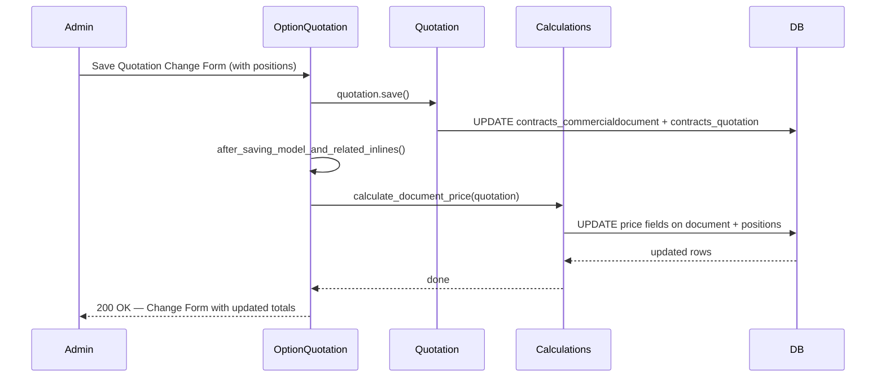

### UC-CS-03 Alternative Flows

- **Read (list):** Each document type's Admin list shows common columns
  (id, contract, status, net total, gross total, currency, date\_of\_creation)
  plus type-specific columns (e.g., Quotation: valid\_until, status; Invoice:
  payable\_until, payment\_bank\_reference). Common filters and search are
  provided by the shared `OptionCommercialDocument` base class.
- **Update via REST API:** `PUT`/`PATCH` on the document endpoint recalculates
  price server-side after the save; the updated price is included in the
  response.
- **Delete:** `DELETE` on the REST endpoint or Admin delete action removes the
  document-type row and the shared `contracts_commercialdocument` row via MTI
  cascade. Positions and media are cascade-deleted.
- **Quotation-specific fields:** `valid_until` (date), `status` (choice field).
- **Invoice-specific fields:** `payable_until` (date), `status` (choice field),
  `payment_bank_reference` (text).

### UC-CS-03 Postconditions

- The commercial document row (plus parent CommercialDocument MTI row) reflects
  the latest saved state.
- Price fields (`net_price`, `gross_price`, VAT amounts) are consistent with the
  current set of positions.
- All inlines (positions, paragraphs, addresses, media) are persisted.

### UC-CS-03 Configuration and Parameterization

| Type | Name | Effect on Use Case |
|------|------|--------------------|
| Setting | `UserExtension.default_currency` | Pre-fills the currency field on new commercial documents created by the user. |
| Setting | `UserExtension.default_template_set` | Determines the XSL-FO template set used when a PDF is generated for this document. |
| Configuration | `S3_PDF_BUCKET` | Destination S3 bucket for asynchronously rendered PDF documents. |
| Configuration | `KOALIXCRM_MICROSERVICE_SQS` | SQS queue for dispatching async PDF export jobs. |
| Parameterization | `QUOTATIONSTATUS` / `INVOICESTATUS` choice sets | Fixed lifecycle state codes enforced at the model and serializer level; adding states requires a code change. |

See [QQ_SD_Configuration.md](../08_cross_cutting_concepts/QQ_SD_Configuration.md), [QQ_SD_Settings.md](../08_cross_cutting_concepts/QQ_SD_Settings.md),
and [QQ_SD_Parameterization.md](../08_cross_cutting_concepts/QQ_SD_Parameterization.md).

### UC-CS-03 Access Control

See [QQ_SD_AccessControl.md](../08_cross_cutting_concepts/QQ_SD_AccessControl.md) for the full RBAC model.

- REST API: workspace-scoped authenticated access.
- Django Admin: staff users only; `OptionCommercialDocument` base class applies
  `WorkspaceScopedModelAdmin` filtering.

### UC-CS-03 Notes and References

- The MTI hierarchy is rooted at `CommercialDocument`
  (`koalixcrm/contracts/models/commercial_document.py`). Each subtype adds its
  own table with extra fields; Django queries both tables via a JOIN.
- `OptionCommercialDocument` (base admin class) is in
  `koalixcrm/contracts/admin/commercial_document_admin.py`. Subtype admin
  classes (`OptionQuotation`, `OptionInvoice`, etc.) extend it.
- The `after_saving_model_and_related_inlines` hook fires after every inline
  formset save, ensuring price consistency even when only a position is modified.

---

## UC-CS-04: Convert Between Document Types

**Actor:** CRM User, Administrator

**Interfaces:** Django Admin bulk action on the source document type's change-list

### UC-CS-04 Purpose

Convert an existing commercial document into a related document type — for
example, a Quotation into a SalesOrder, a SalesOrder into an Invoice, or an
Invoice into a DespatchAdvice. The conversion copies fields and positions from
the source document into the new document, links both to the same Contract, and
redirects the administrator to the newly created document's change form.

### UC-CS-04 Preconditions

- The actor is an Administrator with Django Admin access.
- At least one source document row is selected.
- The target document type's app and model are installed.
- For accounting-related conversions, the accounting app must be installed.

### UC-CS-04 Main Flow

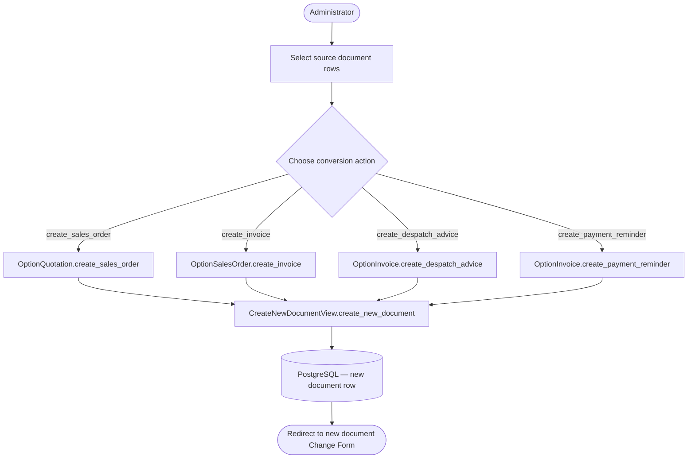

### UC-CS-04 Admin Sequence — Convert Quotation to SalesOrder

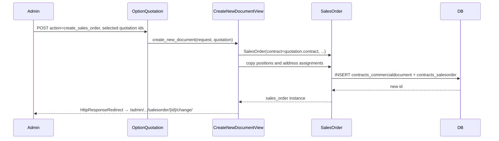

### UC-CS-04 Available Conversion Action Matrix

| Source Document Type | Available Actions |
|---|---|
| Quotation | create\_sales\_order, create\_invoice, create\_despatch\_advice, create\_purchase\_order, create\_payment\_reminder, create\_pdf\_async |
| Invoice | create\_sales\_order, create\_quotation, create\_despatch\_advice, create\_purchase\_order, create\_payment\_reminder, create\_pdf\_async, create\_credit\_note\_from\_invoice |
| SalesOrder | (actions as configured on OptionSalesOrder) |
| PurchaseOrder | (actions as configured on OptionPurchaseOrder) |
| DespatchAdvice | create\_pdf\_async |
| PaymentReminder | create\_pdf\_async |
| CreditNote | create\_pdf\_async |

All document types include `create_pdf_async`; see
[UC-CS-05](#uc-cs-05-register-invoice-in-accounting) and
[UC-CS-06](#uc-cs-06-register-payment-in-accounting) for accounting-specific
actions.

### UC-CS-04 Alternative Flows

- **Multiple source documents selected:** The action iterates and creates one
  target document per source, then redirects to the source list with a bulk
  success message.
- **Source document already converted:** No uniqueness constraint prevents
  repeated conversion; the administrator may create multiple target documents
  from the same source.
- **Accounting actions not available:** If the accounting app is not installed,
  `register_invoice_in_accounting` and `register_payment_in_accounting` are
  absent from the action list.

### UC-CS-04 Postconditions

- A new document of the target type exists in the database, linked to the same
  Contract as the source document.
- Positions are copied into the new document; price is recalculated on first save.
- The source document is unchanged.

### UC-CS-04 Configuration and Parameterization

> Cross-reference: see `QQ_SD_Configuration.md` (not yet produced).

- Enabled actions per document type are declared in the `actions` list of each
  `Option*` admin class and can be extended by plugins.
- The `create_credit_note_from_invoice` action is specific to `OptionInvoice`.

### UC-CS-04 Access Control

See [QQ_SD_AccessControl.md](../08_cross_cutting_concepts/QQ_SD_AccessControl.md) for the full RBAC model.

- Django Admin staff access required.
- No additional model-level permission beyond the source document type's admin
  permission.

### UC-CS-04 Notes and References

- All conversion actions delegate to `CreateNewDocumentView.create_new_document`
  in `koalixcrm/contracts/views/newdocument.py`.
- The source document is passed as a constructor argument; the view determines
  which fields and relations to copy based on the target type.

---

## UC-CS-05: Register Invoice in Accounting

**Actor:** Administrator

**Interfaces:** Django Admin action on Invoice change-list

### UC-CS-05 Purpose

Post a finalized Invoice into the accounting subsystem by executing
`obj.register_invoice_in_accounting(request)`. This creates the corresponding
accounting journal entries for the open receivable. The action is available only
when the accounting app is installed.

### UC-CS-05 Preconditions

- The accounting app (`koalixcrm.accounting` or equivalent) is installed and
  configured.
- The Invoice is in a state suitable for accounting registration (fully filled,
  status not Draft).
- An open-interest account is configured for the workspace.

### UC-CS-05 Main Flow

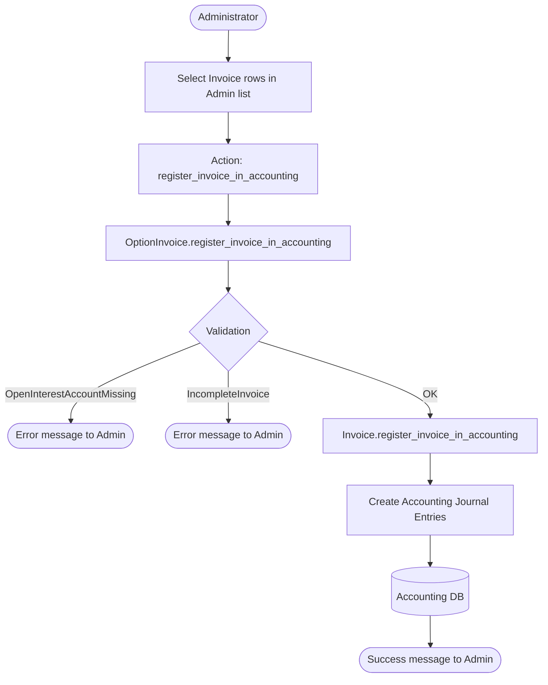

### UC-CS-05 Admin Sequence — Register Invoice

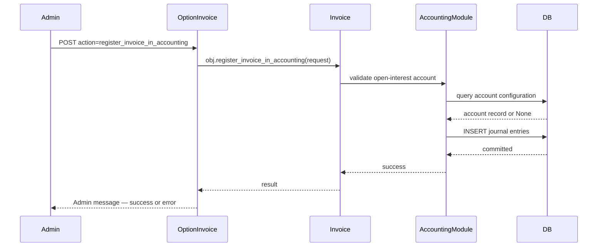

### UC-CS-05 Alternative Flows

- **OpenInterestAccountMissing:** The method raises `OpenInterestAccountMissing`;
  the admin action catches it and displays an error message. No journal entries
  are created.
- **IncompleteInvoice:** The method raises `IncompleteInvoice` if required fields
  (e.g., buyer address, line items) are absent. An error message is shown.
- **Already registered:** No idempotency guard is defined at the model layer;
  re-running the action creates duplicate journal entries. The administrator must
  prevent double-registration manually.

### UC-CS-05 Postconditions

- On success: accounting journal entries for the invoice's open receivable exist
  in the accounting subsystem.
- The Invoice record itself is not mutated by this action (status update, if any,
  is defined by the accounting module).

### UC-CS-05 Configuration and Parameterization

> Cross-reference: see `QQ_SD_Configuration.md` (not yet produced).

- The open-interest account is selected from the accounting chart of accounts
  configured per workspace. Its absence causes `OpenInterestAccountMissing`.
- Accounting app availability is determined by Django's `INSTALLED_APPS`.

### UC-CS-05 Access Control

See [QQ_SD_AccessControl.md](../08_cross_cutting_concepts/QQ_SD_AccessControl.md) for the full RBAC model.

- Django Admin staff access required.
- Additional `is_superuser` or accounting-specific permission may be enforced by
  the accounting module.

### UC-CS-05 Notes and References

- `register_invoice_in_accounting` is defined on the `Invoice` model in
  `koalixcrm/contracts/models/invoice.py`.
- `OptionInvoice` (admin class) is in
  `koalixcrm/contracts/admin/invoice_admin.py`.
- The accounting module defines `OpenInterestAccountMissing` and
  `IncompleteInvoice` exception classes.

---

## UC-CS-06: Register Payment in Accounting

**Actor:** Administrator

**Interfaces:** Django Admin two-step wizard on Invoice (action
`register_payment_in_accounting`)

### UC-CS-06 Purpose

Record a payment against a finalized Invoice through a two-step Admin wizard.
The administrator enters the payment amount and selects a payment account; the
system then calls `invoice.register_payment_in_accounting(request, amount, account)`
to create the corresponding clearing journal entries. The wizard is available only
when the accounting app is installed.

### UC-CS-06 Preconditions

- The accounting app is installed and configured.
- The Invoice has been registered in accounting (see
  [UC-CS-05](#uc-cs-05-register-invoice-in-accounting)).
- At least one account of type `"A"` (payment/bank account) exists in the
  workspace's chart of accounts.

### UC-CS-06 Main Flow

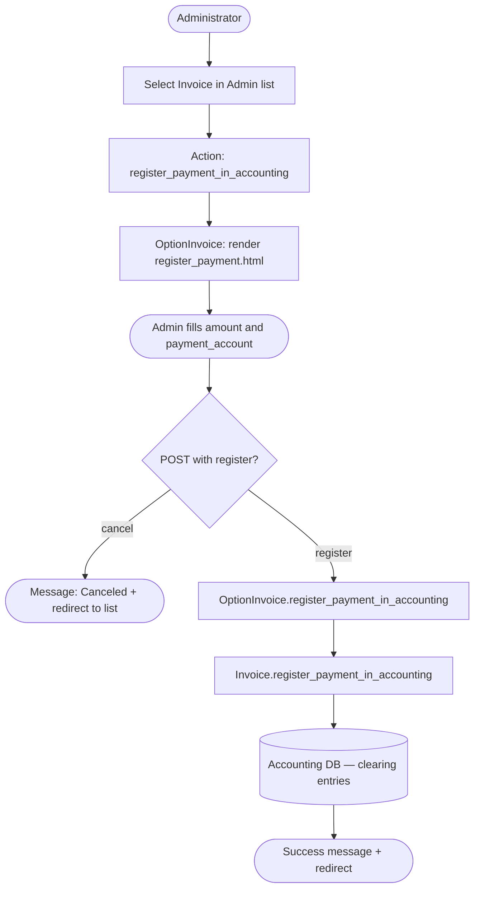

### UC-CS-06 Admin Wizard Sequence — Register Payment

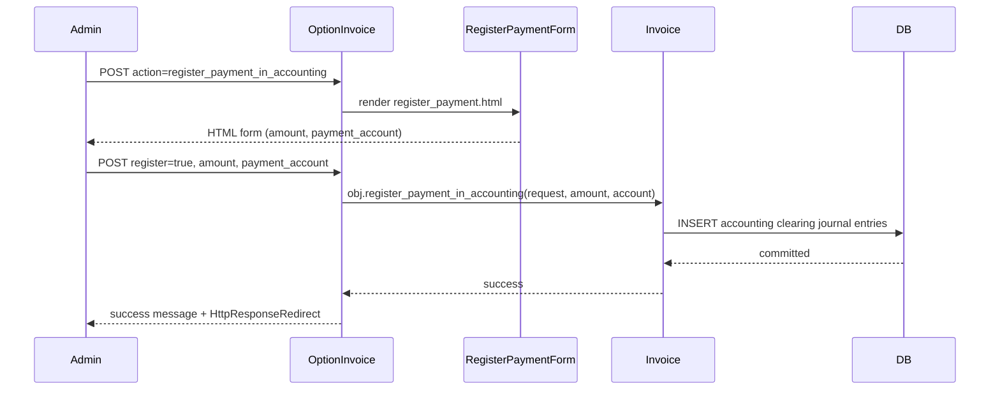

### UC-CS-06 Alternative Flows

- **Cancel:** If the administrator clicks Cancel in the wizard form, the action
  adds the message "Canceled" and redirects to the Invoice change-list without
  creating any accounting entries.
- **Invalid amount:** Django form validation rejects non-numeric or negative
  amounts before the model method is called.
- **No payment accounts of type "A":** The `payment_account` `ModelChoiceField`
  is empty; the administrator cannot proceed until accounts are configured.

### UC-CS-06 Postconditions

- On successful registration: clearing journal entries exist in the accounting
  subsystem, reducing the open receivable by the entered amount.
- The Invoice record may be marked as paid if the accounting module updates its
  status on full payment.

### UC-CS-06 Configuration and Parameterization

> Cross-reference: see `QQ_SD_Configuration.md` (not yet produced).

- The `payment_account` field is a `ModelChoiceField` filtered to accounts of
  type `"A"` (asset/bank accounts) in the workspace chart of accounts.
- The wizard template is `register_payment.html`, rendered via Django's Admin
  template system.

### UC-CS-06 Access Control

See [QQ_SD_AccessControl.md](../08_cross_cutting_concepts/QQ_SD_AccessControl.md) for the full RBAC model.

- Django Admin staff access required.
- The accounting module may enforce additional superuser or role checks.

### UC-CS-06 Notes and References

- The two-step wizard flow is implemented in `OptionInvoice.register_payment_in_accounting`
  in `koalixcrm/contracts/admin/invoice_admin.py`.
- `Invoice.register_payment_in_accounting` is the model-layer method in
  `koalixcrm/contracts/models/invoice.py`.
- The `register_payment.html` template must be present in the Django template
  search path for the wizard form to render.

---

## UC-CS-07: Manage Commercial Document Line Items and Attachments

**Actor:** CRM User, Administrator

**Interfaces:** Django Admin inline (CommercialDocumentInlinePosition,
CommercialDocumentMediaInline), REST API (`commercial-document-positions/`,
`commercial-document-media/`)

### UC-CS-07 Purpose

Add, edit, and delete line items (CommercialDocumentPosition) and file attachments
(CommercialDocumentMedia) on any commercial document. Each position links a product
unit, quantity, unit price, tax rate, and optional discount to the parent document.
Each media record attaches a file (e.g., a drawing or specification) to the document.
Saving positions triggers automatic price recalculation on the parent document.

### UC-CS-07 Preconditions

- A parent commercial document exists and is accessible to the actor.
- For positions: the relevant products, units, and tax rates are configured.
- For media: the Django file storage backend is configured and writable.

### UC-CS-07 Main Flow

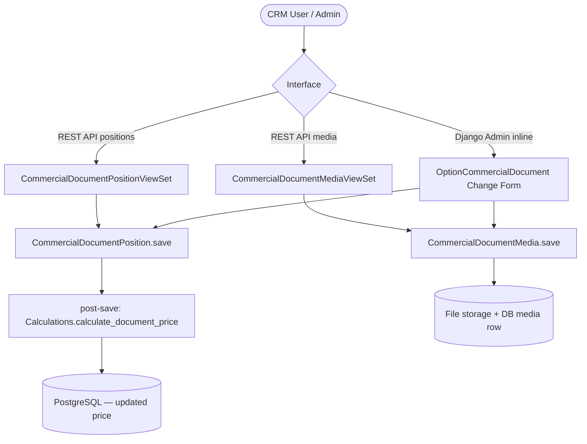

### UC-CS-07 REST Sequence — Add Position via API

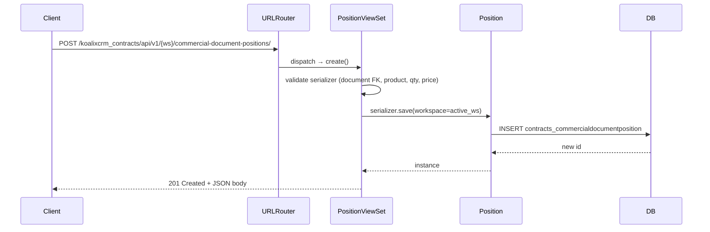

### UC-CS-07 Alternative Flows

- **Update position:** `PUT`/`PATCH` on `commercial-document-positions/{id}/`
  or editing the inline row in the Admin Change Form. Price is recalculated on save.
- **Delete position:** `DELETE /commercial-document-positions/{id}/` or removing
  the inline row and saving the parent form. Price is recalculated after deletion.
- **Add media via Admin:** The CommercialDocumentMediaInline appears at the bottom
  of every commercial document change form. The administrator selects a file via
  the file upload widget; Django stores it via the configured `DEFAULT_FILE_STORAGE`.
- **Delete media:** Remove the media inline row and save; the file is removed from
  storage per Django's media file deletion behavior.
- **Text paragraphs:** CommercialDocumentTextParagraph inline allows free-text
  paragraphs (e.g., cover letter, terms and conditions) to be attached to a document;
  these appear in the PDF output but are not positions.

### UC-CS-07 Postconditions

- Position rows exist in `contracts_commercialdocumentposition` and are linked to
  the parent document.
- The parent document's price fields are updated to reflect the current positions.
- Media rows exist in `contracts_commercialdocumentmedia`; files are stored in the
  configured media storage.

### UC-CS-07 Configuration and Parameterization

> Cross-reference: see `QQ_SD_Configuration.md` (not yet produced).

- `DEFAULT_FILE_STORAGE` and `MEDIA_ROOT`/`MEDIA_URL` Django settings control
  where attachment files are stored.
- Unit of measure choices, tax rate records, and product catalogue are configured
  per workspace.
- `Calculations.calculate_document_price` aggregation logic (netting, VAT grouping)
  is defined in `koalixcrm/contracts/models/calculations.py`.

### UC-CS-07 Access Control

See [QQ_SD_AccessControl.md](../08_cross_cutting_concepts/QQ_SD_AccessControl.md) for the full RBAC model.

- REST API: workspace-scoped authenticated access; the ViewSets use
  `WorkspaceScopedViewSetMixin`.
- Django Admin: staff access; inline CRUD is controlled by the parent document's
  admin class permissions.

### UC-CS-07 Notes and References

- `CommercialDocumentPositionViewSet` is in
  `koalixcrm/contracts/views/commercial_document_position_view_set.py`.
- `CommercialDocumentMediaViewSet` is in
  `koalixcrm/contracts/views/commercial_document_media_view_set.py`.
- The nested detail mixin (`NestedDetailMixin` in
  `koalixcrm/contracts/views/nested_detail_mixin.py`) may be used to expose
  positions and media as nested resources under their parent document endpoint.
- The PDF Export Service (external Java service) reads position and media data
  from the REST API to compose the rendered PDF; it does not write positions.

---

## UC-CS-08: Manage Subscriptions

**Actor:** Administrator

**Interfaces:** Django Admin at `/admin/subscriptions/subscription/`;
Contract Admin (inline and action when subscriptions plugin is active)

### UC-CS-08 Purpose

View and manage Subscription records linked to Contracts. A Subscription
represents a recurring billing agreement with configurable cancellation period,
automatic extension, and payment interval. The administrator can create an Invoice
or Quotation from a Subscription to bill the next subscription period, and track
SubscriptionEvent records for each generated document.

### UC-CS-08 Preconditions

- The `koalixcrm.subscriptions` plugin (or equivalent) is installed
  (`INSTALLED_APPS`).
- At least one Contract exists to link the subscription to.
- SubscriptionType records with `cancellation_period`, `automatic_contract_extension`,
  and `payment_interval` are configured.

### UC-CS-08 Main Flow

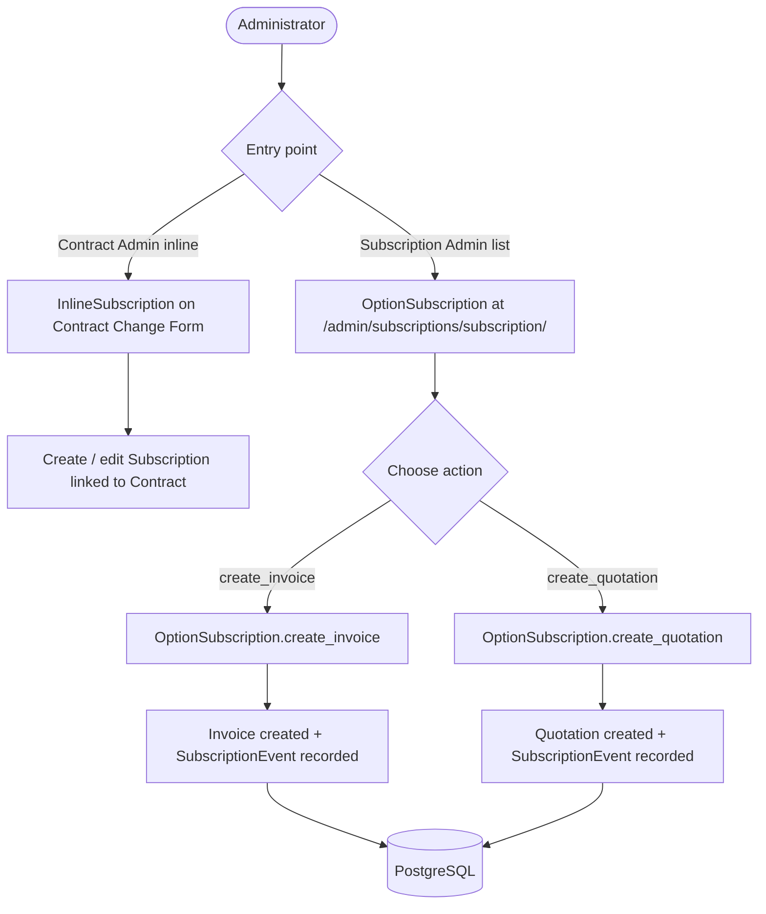

### UC-CS-08 Admin Sequence — Create Invoice from Subscription

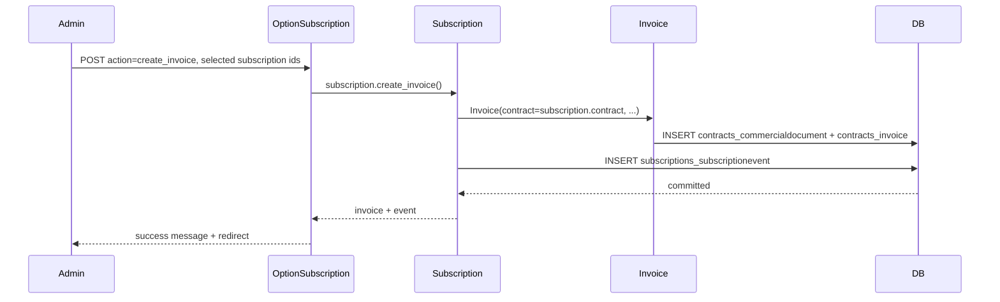

### UC-CS-08 Alternative Flows

- **Create Subscription from Contract Admin:** When the subscriptions plugin is
  active, the `create_subscription` bulk action appears on the Contract Admin
  change-list. It creates a new Subscription linked to the selected Contract and
  redirects to the Subscription change form.
- **Create Quotation from Subscription:** `OptionSubscription.create_quotation`
  follows the same flow as `create_invoice` but produces a Quotation instead of
  an Invoice. A SubscriptionEvent is recorded for the quotation.
- **SubscriptionEvent tracking:** Each billing action (invoice or quotation
  creation) records a SubscriptionEvent row linking the Subscription, the
  generated document, and the date. This provides an audit trail of all billing
  cycles.
- **Automatic extension:** The `automatic_contract_extension` field on
  SubscriptionType controls whether the subscription auto-renews; this is enforced
  by the business logic that triggers the billing actions (typically via Celery
  worker, not covered in this domain's use cases).

### UC-CS-08 Postconditions

- On `create_invoice`: a new Invoice linked to the subscription's Contract exists
  in the database, and a SubscriptionEvent is recorded.
- On `create_quotation`: a new Quotation linked to the subscription's Contract
  exists, and a SubscriptionEvent is recorded.
- The Subscription record itself is unchanged by billing actions.

### UC-CS-08 Configuration and Parameterization

> Cross-reference: see `QQ_SD_Configuration.md` (not yet produced).

- `SubscriptionType` fields (`cancellation_period`, `automatic_contract_extension`,
  `payment_interval`) determine the subscription lifecycle behaviour.
- Plugin activation is controlled via `INSTALLED_APPS`; the plugin injects
  `InlineSubscription` into `OptionContract` at Django app startup.

### UC-CS-08 Access Control

See [QQ_SD_AccessControl.md](../08_cross_cutting_concepts/QQ_SD_AccessControl.md) for the full RBAC model.

- Django Admin staff access required.
- No additional permission beyond `OptionSubscription` model permissions.

### UC-CS-08 Notes and References

- The subscriptions plugin is a separate Django app
  (`koalixcrm/subscriptions/` or equivalent); its admin class is `OptionSubscription`.
- `InlineSubscription` and the `create_subscription` action are injected into
  `OptionContract` via Django's `KoalixcrmPluginInterface` mechanism, which allows
  third-party apps to extend core admin classes without modifying them.
- SubscriptionEvent acts as the audit log for all billing events per subscription.
- For recurring automated billing (Celery-triggered), see the Celery Worker actor
  in the system context; that flow is out of scope for this document.

---

## PDF Export Service Interaction

The PDF Export Service is an external Java service that generates PDF renditions
of commercial documents. It interacts with the koalixCRM system as follows:

- It reads commercial document data (header fields, positions, addresses, media
  metadata) by calling the REST API as an authenticated API client.
- The `create_pdf_async` Admin action (available on all document types) triggers
  an asynchronous task (via Celery) that signals the PDF Export Service.
- The PDF Export Service writes the completed PDF back to the koalixCRM file
  storage; the resulting file is accessible as a `CommercialDocumentMedia` record
  attached to the document.
- This service does not modify Contract, CommercialDocument, or Position records.

The `create_pdf_async` action is present on every commercial document type's Admin
action list. The async dispatch mechanism is handled by the Celery Worker actor
(out of scope for the detailed flows above, but listed here for completeness).
