# Use Cases — Products & Pricing

This document covers every use case in the **Products & Pricing** domain of
koalixCRM. The domain is implemented by the `koalixcrm.products` Django app
(`koalixcrm/products/`) and the reference-data portion of `koalixcrm.core`.
An optional peer, `koalixcrm.accounting`, may monkey-patch additional inlines
onto the ProductType admin when it is installed.

All product and pricing models are `WorkspaceScopedModel` instances — every
query and mutation is implicitly filtered to the active workspace resolved from
the URL parameter `<workspace_id>`.

**Actors in this domain**

| Actor | Nature |
|---|---|
| Administrator | Human operating the Django Admin interface (`/admin/`) |
| CRM User | Human or automated client calling the REST API or browsing Django templates |

Celery Worker and PDF Export Service have no direct involvement in this domain.

---

## UC-PP-01 Manage Product Types

**Actor:** Administrator (Django Admin), CRM User (REST API)

**Interface:** Django Admin at `/admin/products/producttype/`; REST API at
`/koalixcrm_products/api/v1/<workspace_id>/products/`

### Purpose

Maintain the product catalog for a workspace. A ProductType is the master
record that groups a set of pricing rules, unit transforms, and currency
transforms. Every contract position references a ProductType to resolve the
applicable price at invoice time.

Fields managed: `product_type_identifier` (human-readable product number),
`title`, `description`, `default_unit` (FK to `core.Unit`), `tax` (FK to
`core.Tax`). Audit fields `last_modification`, `last_modified_by`, and
`date_of_creation` are system-managed.

### Main Flow

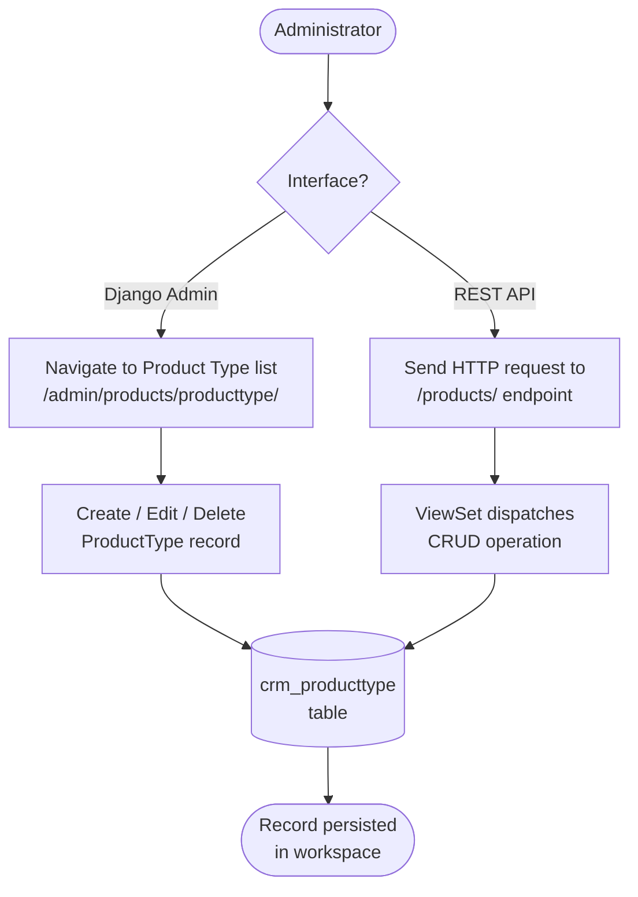

### Sequence Diagram — REST API Create ProductType

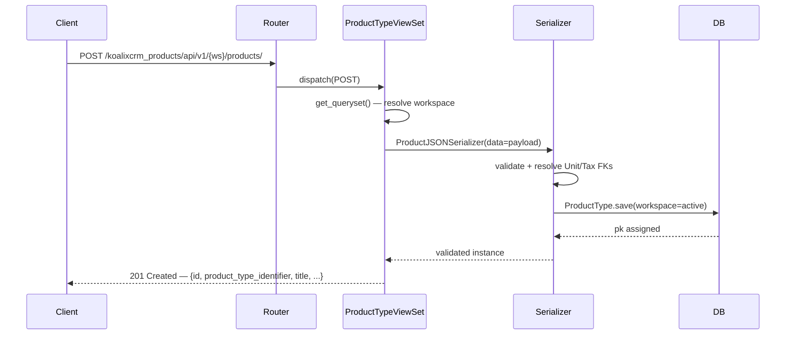

### Alternative Flows

- **Read list (GET /products/)** — `get_queryset()` filters by `active_workspace`
  and returns all ProductType records for that workspace. Superusers without a
  workspace context receive all records across workspaces.
- **Update (PUT/PATCH /products/{id}/)** — `ProductJSONSerializer.update()` resolves
  the nested `default_unit` and `tax` objects by their `id` field before saving.
  Partial updates via PATCH leave unspecified fields unchanged.
- **Delete (DELETE /products/{id}/)** — cascades to all related `ProductPrice`,
  `UnitTransform`, `CurrencyTransform`, and `CustomerGroupTransform` rows. Deletion
  is only possible when no contract positions reference the ProductType.
- **Django Admin create** — the Change-Form presents a `fieldsets` group ("Basics")
  with all four editable fields. Inline sections for prices, transforms, and customer
  group transforms are available on the same page (see UC-PP-02 and UC-PP-03).
- **Superuser fallback** — when `active_workspace` is absent and the caller is a
  superuser, `perform_create` resolves or creates the "Default Workspace" automatically.

### Preconditions

- At least one `core.Unit` record exists in the workspace (required FK).
- At least one `core.Tax` record exists (required FK, non-nullable).
- The caller has `products.add_producttype` / `products.change_producttype` /
  `products.delete_producttype` Django model permission (REST) or Django Admin staff
  access.

### Postconditions

- A `ProductType` row exists in `crm_producttype` scoped to the active workspace.
- `last_modification` and `last_modified_by` are updated on every change.
- Downstream price lookups (`ProductType.get_price()`) will resolve against the new
  or updated record.

### Configuration / Settings / Parameterization

See [QQ_SD_Configuration.md](../08_cross_cutting_concepts/QQ_SD_Configuration.md) (not yet produced).
The REST URL prefix (`/koalixcrm_products/api/v1/`) is defined in
`projectsettings/urls.py`. The Admin change-list filter column is `workspace`.

### Access Control

See [QQ_SD_AccessControl.md](../08_cross_cutting_concepts/QQ_SD_AccessControl.md) for the full RBAC model.
REST permission class: `ModelPermissionsWithListView` (extends
`DjangoModelPermissions`). GET requires `products.view_producttype`; POST requires
`products.add_producttype`; PUT/PATCH require `products.change_producttype`;
DELETE requires `products.delete_producttype`. Django Admin restricts the
`/admin/products/producttype/` URL to staff users only.

### Notes and References

- `ProductJSONSerializer` serializes nested `default_unit` and `tax` with depth 1
  using `OptionUnitJSONSerializer` and `OptionTaxJSONSerializer` for read; writes
  resolve the FK by `id`.
- The REST route name `products` historically maps to `ProductTypeViewSet`
  (not `ProductViewSet`); `ProductViewSet` is exposed under `product-items/`.
- `ProductType.__str__` returns `"{product_type_identifier} {title}"`.
- Related: UC-PP-02 (pricing rules), UC-PP-03 (customer group transforms),
  UC-PP-06 (accounting category assignment).

---

## UC-PP-02 Define Product Pricing Rules

**Actor:** Administrator (Django Admin), CRM User (REST API)

**Interface:** Django Admin — ProductPrice TabularInline on ProductType Change-Form
at `/admin/products/producttype/<pk>/change/`; REST API at
`/koalixcrm_products/api/v1/<workspace_id>/product-prices/`

### Purpose

Attach one or more price rules to a ProductType. Each `ProductPrice` row pins a
monetary amount to a specific currency and unit, and optionally restricts the rule
to a date range and/or a customer group (`PartyGroup`). The price resolution engine
(`ProductType.get_price()`) evaluates all rules for the requested date, currency,
unit, and party, applying unit-transform and currency-transform factors, and returns
the lowest computed result.

Fields on `ProductPrice` (inherits from `Price`): `price` (Decimal, 17,2),
`currency` (FK to `core.Currency`), `unit` (FK to `core.Unit`), `valid_from`
(Date, nullable), `valid_until` (Date, nullable), `party_group` (FK to
`contacts.PartyGroup`, nullable), `product_type` (FK to `ProductType`).

### Main Flow

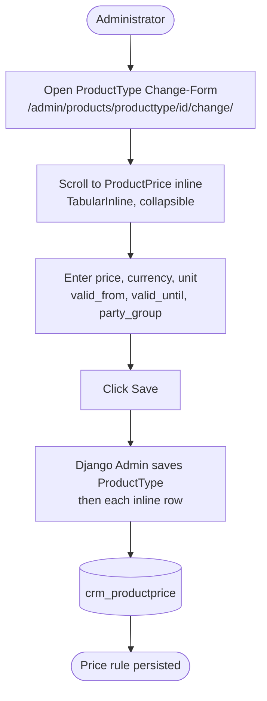

### Sequence Diagram — REST API Create ProductPrice

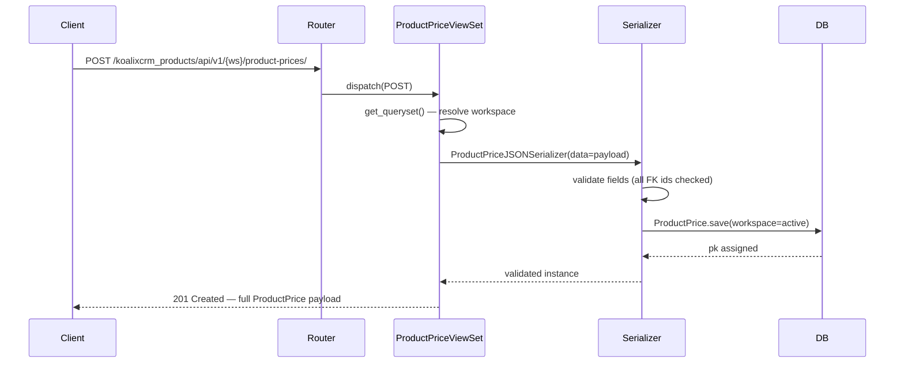

### Alternative Flows

- **Open-ended validity** — `valid_from` and `valid_until` are both nullable.
  When both are null the price is valid for any date (`is_date_in_range` returns
  `True`). When only one bound is set it is treated as a half-open interval.
- **Global price (no party restriction)** — when `party_group` is null, the price
  applies to any party (`is_party_group_criteria_fulfilled` returns `True`).
- **Price selection with transforms** — if the requested currency or unit differs
  from the rule's currency/unit, `get_currency_transform_factor` and
  `get_unit_transform_factor` look up a matching `CurrencyTransform` or
  `UnitTransform` row and multiply the base price by the factor.
- **Multiple matching prices** — all prices that pass the date, currency, unit, and
  party-group gate are collected; `get_price()` returns the lowest transformed
  value (most-favourable-price semantics).
- **No matching price** — `ProductType.NoPriceFound` is raised and propagated to
  the caller (typically a contract creation flow).
- **REST read/update/delete** — same workspace-scoped `get_queryset()` pattern as
  UC-PP-01. `ProductPriceJSONSerializer` exposes `fields = '__all__'`.

### Preconditions

- The parent `ProductType` exists in the workspace.
- At least one `core.Currency` and one `core.Unit` exist.
- If `party_group` is set, the referenced `contacts.PartyGroup` must exist.

### Postconditions

- One or more `ProductPrice` rows linked to the `ProductType` exist in
  `crm_productprice`.
- Subsequent calls to `ProductType.get_price(date, unit, party, currency)` can
  resolve a price for the configured combination.

### Configuration / Settings / Parameterization

See [QQ_SD_Configuration.md](../08_cross_cutting_concepts/QQ_SD_Configuration.md) (not yet produced).
The inline is collapsible (`classes = ['collapse']`) in the Admin; `extra = 1`
row is pre-rendered.

### Access Control

See [QQ_SD_AccessControl.md](../08_cross_cutting_concepts/QQ_SD_AccessControl.md) for the full RBAC model.
REST: `products.view_productprice` (GET), `products.add_productprice` (POST),
`products.change_productprice` (PUT/PATCH), `products.delete_productprice`
(DELETE). Django Admin inherits the ProductType Change-Form staff restriction.

### Notes and References

- `Price.get_party_group_transform_factor()` iterates all group memberships of the
  requesting party and returns the lowest matching `CustomerGroupTransform.factor`
  if a direct group match is not found.
- `ProductPrice` overrides `__str__` to render `"{price} {currency.short_name}"`.
- Related: UC-PP-01 (product type), UC-PP-03 (customer group transforms),
  UC-PP-05 (unit and currency conversions).

---

## UC-PP-03 Manage Customer Group Price Transforms

**Actor:** Administrator (Django Admin), CRM User (REST API)

**Interface:** Django Admin — CustomerGroupTransform TabularInline on ProductType
Change-Form; REST API at
`/koalixcrm_products/api/v1/<workspace_id>/customer-group-transforms/`

### Purpose

Define a multiplicative price adjustment factor between two customer groups for a
specific ProductType. When the price engine cannot find a `ProductPrice` row that
directly matches the requesting party's group, it searches `CustomerGroupTransform`
records to compute an adjusted price. This allows a single base price to serve
multiple pricing tiers without duplicating price rows for every group.

Fields: `from_party_group` (FK to `contacts.PartyGroup`), `to_party_group` (FK to
`contacts.PartyGroup`), `product_type` (FK to `ProductType`), `factor` (Decimal
17,2). The semantic is: *a party in `to_party_group` pays `factor` times the price
defined for `from_party_group`*.

### Main Flow

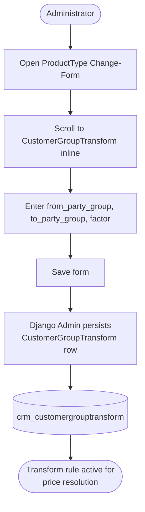

### Sequence Diagram — Price Resolution with Customer Group Transform

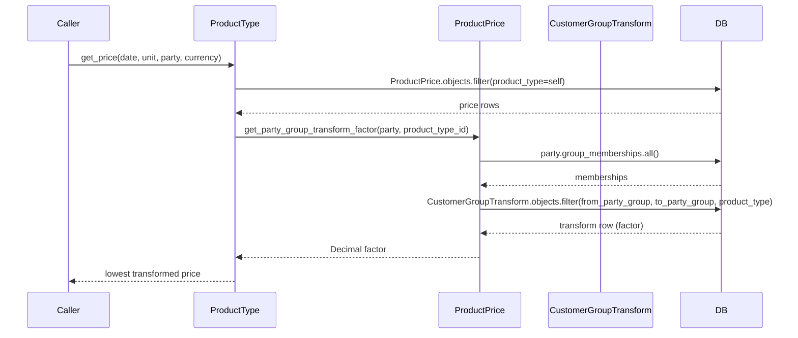

### Alternative Flows

- **Direct group match** — when `self.party_group == group`, `get_party_group_transform_factor`
  returns `1` immediately without consulting `CustomerGroupTransform`.
- **No applicable transform** — if no `CustomerGroupTransform` row covers the
  `(from_party_group, to_party_group, product_type)` combination, the factor
  remains `0` and that price row is excluded from the result set.
- **Multiple group memberships** — the method iterates all memberships and keeps
  the lowest factor found (most-favourable-price semantics mirror the base price
  selection).
- **REST CRUD** — `CustomerGroupTransformViewSet` is scoped identically to the
  other ViewSets: `workspace`-filtered queryset, superuser fallback, same
  `ModelPermissionsWithListView` gate.

### Preconditions

- The parent `ProductType` exists.
- Both `from_party_group` and `to_party_group` exist as `contacts.PartyGroup`
  records (`on_delete=PROTECT` enforces this).
- A `ProductPrice` for `from_party_group` (or `party_group=null`) already exists,
  otherwise the transform has nothing to adjust.

### Postconditions

- A `CustomerGroupTransform` row linked to the `ProductType` exists in
  `crm_customergrouptransform`.
- Parties belonging to `to_party_group` receive a price calculated as
  `base_price * factor` during contract position pricing.

### Configuration / Settings / Parameterization

See [QQ_SD_Configuration.md](../08_cross_cutting_concepts/QQ_SD_Configuration.md) (not yet produced).
The inline uses `extra = 1` and `classes = ['collapse']`.

### Access Control

See [QQ_SD_AccessControl.md](../08_cross_cutting_concepts/QQ_SD_AccessControl.md) for the full RBAC model.
REST: `products.view_customergrouptransform`, `products.add_customergrouptransform`,
`products.change_customergrouptransform`, `products.delete_customergrouptransform`.
Django Admin: staff-only via the ProductType Change-Form.

### Notes and References

- `CustomerGroupTransform.transform(party_group)` is a helper that returns
  `to_party_group` when `from_party_group` matches, used internally.
- Deleting a `PartyGroup` is blocked by `on_delete=PROTECT` on both FK fields, so
  transforms must be removed before a PartyGroup can be deleted.
- Related: UC-PP-02 (pricing rules), UC-PP-01 (product types).

---

## UC-PP-04 Manage Currencies, Taxes, and Units

**Actor:** Administrator (Django Admin), CRM User (REST API)

**Interface:** Django Admin at `/admin/core/currency/`, `/admin/core/tax/`,
`/admin/core/unit/`; REST API at
`/koalixcrm_core/api/v1/<workspace_id>/currencies/`,
`/koalixcrm_core/api/v1/<workspace_id>/taxes/`,
`/koalixcrm_core/api/v1/<workspace_id>/units/`

### Purpose

Maintain the workspace-scoped reference tables that drive product pricing and
contract calculations. Currency, Tax, and Unit are lookup entities required as
foreign keys on ProductType, ProductPrice, and numerous contract models. These
tables must be populated before any product catalog entry can be created.

**Currency** fields: `description`, `short_name` (3-char ISO code displayed next
to amounts), `rounding`. **Tax** fields: `tax_rate` (Decimal percentage), `name`.
**Unit** fields: `description`, `short_name` (≤3 chars, appended to quantities),
`is_a_fraction_of` (self-FK for hierarchical units), `fraction_factor_to_next_higher_unit`.

### Main Flow

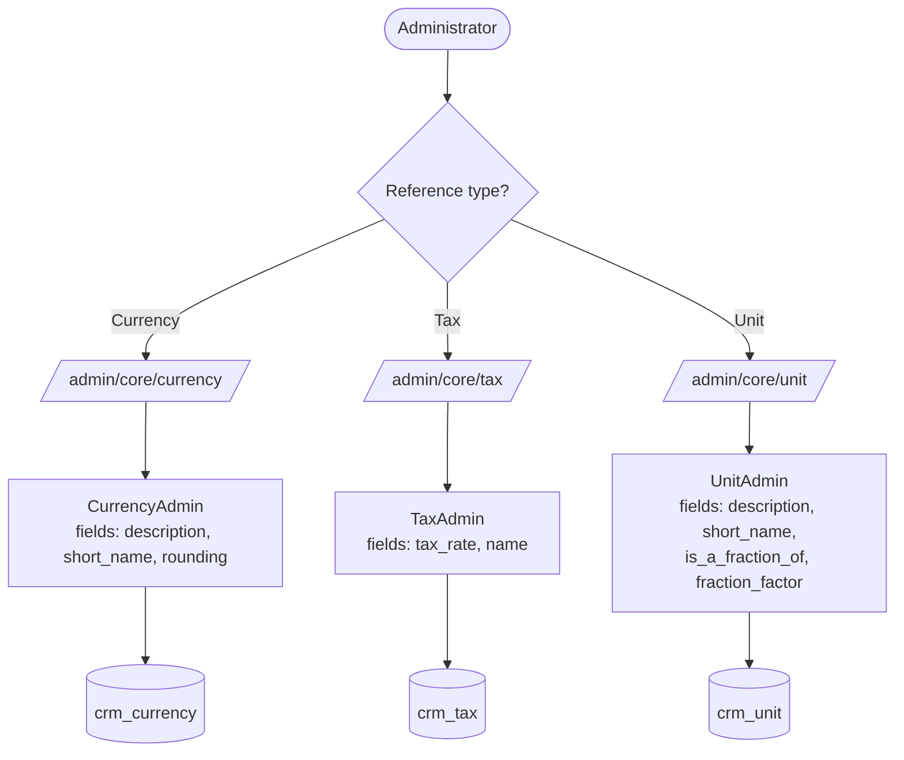

### Sequence Diagram — REST API Create Currency

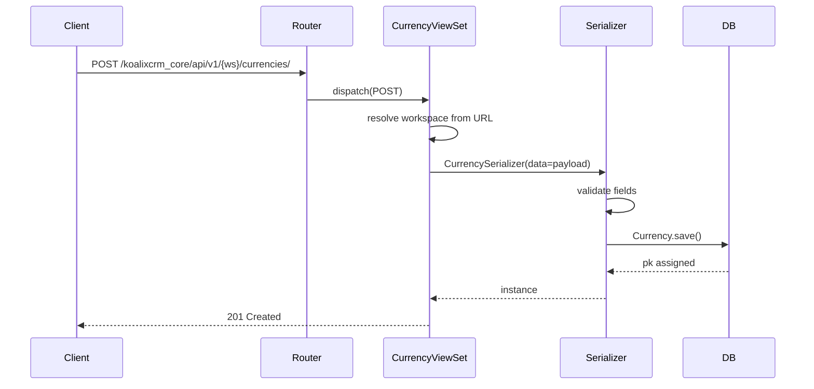

### Alternative Flows

- **Tax with accounting installed** — when `koalixcrm.accounting` is installed, the
  `TaxAdmin` is augmented with a `TaxAccountAssignmentInline` (monkey-patched by
  `accounting.admin_hooks._patch_tax_admin()`). `Tax.clean()` then validates that
  both `activa_account` and `passiva_account` are set on the assignment, raising
  `ValidationError` if either is missing.
- **Unit hierarchy** — `Unit.is_a_fraction_of` is a nullable self-FK; units can
  form a parent-child tree (e.g. gram → kilogram). `fraction_factor_to_next_higher_unit`
  stores the conversion ratio. Circular references are not prevented at the model
  level and must be avoided by the administrator.
- **REST read/update/delete** — the `core` app's ViewSets follow the same
  `BaseModelViewSet` / `ModelPermissionsWithListView` pattern as the products app.
- **Currency rounding** — the `rounding` field on Currency controls how monetary
  values are rounded when displayed on documents.

### Preconditions

- The Administrator has staff access to Django Admin or the appropriate model
  permissions for the REST API.
- No hard prerequisites for creating these reference records; they are the root
  of the reference data hierarchy.

### Postconditions

- New Currency / Tax / Unit records are available as FK targets for ProductType,
  ProductPrice, contract positions, and invoice documents throughout the workspace.

### Configuration / Settings / Parameterization

See [QQ_SD_Configuration.md](../08_cross_cutting_concepts/QQ_SD_Configuration.md) (not yet produced).
REST URL prefix for core resources: `/koalixcrm_core/api/v1/` (defined in
`koalixcrm/core/urls.py` and mounted in `projectsettings/urls.py`).

### Access Control

See [QQ_SD_AccessControl.md](../08_cross_cutting_concepts/QQ_SD_AccessControl.md) for the full RBAC model.
REST gate: `core.view_currency` / `core.add_currency` etc. for each model.
Django Admin: staff-only.
When accounting is installed, saving a Tax via Admin additionally requires the
`TaxAccountAssignment` to be complete.

### Notes and References

- `Currency.short_name` is used in `ProductPrice.__str__` and appears on all
  generated invoice PDFs.
- `Tax` intentionally carries no direct FK to accounting accounts since CR-2c;
  the linkage lives in `accounting.TaxAccountAssignment`.
- Related: UC-PP-01 (Unit and Tax are required FK on ProductType),
  UC-PP-02 (Currency and Unit are required FK on ProductPrice),
  UC-PP-05 (UnitTransform and CurrencyTransform build on Unit and Currency).

---

## UC-PP-05 Manage Unit and Currency Conversions

**Actor:** Administrator (Django Admin), CRM User (REST API)

**Interface:** Django Admin — UnitTransform and CurrencyTransform TabularInlines on
ProductType Change-Form at `/admin/products/producttype/<pk>/change/`; REST API at
`/koalixcrm_core/api/v1/<workspace_id>/unit-transforms/` and
`/koalixcrm_core/api/v1/<workspace_id>/currency-transforms/`

### Purpose

Define conversion factors that allow the price engine to price a product in a unit
or currency different from the one the price rule is denominated in. Both transform
models are product-type-specific — a conversion from kilograms to grams may carry
a different factor for product type A than for product type B.

**UnitTransform** fields: `from_unit`, `to_unit`, `product_type`, `factor`
(Decimal 17,2). Stored in `crm_unittransform`.

**CurrencyTransform** fields: `from_currency`, `to_currency`, `product_type`,
`factor` (Decimal 17,2). Stored in `crm_currencytransform`.

### Main Flow

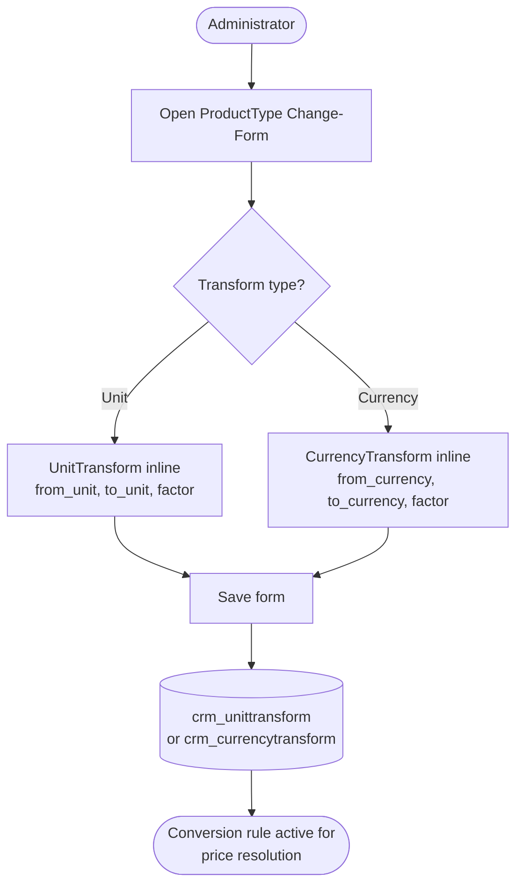

### Sequence Diagram — Price Engine Uses Unit Transform

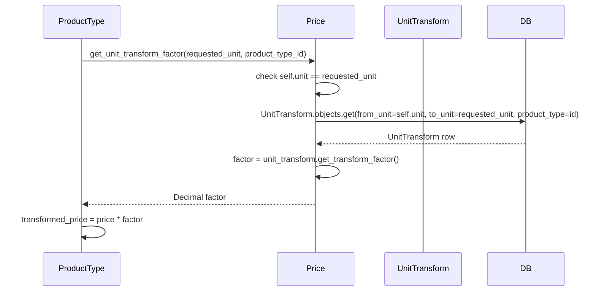

### Alternative Flows

- **Identity match** — if `self.unit == requested_unit` (or `self.currency ==
  requested_currency`), the factor is returned as `1` without a database lookup.
- **No transform defined** — if no `UnitTransform` / `CurrencyTransform` row covers
  the requested combination, `objects.get()` raises `DoesNotExist`; the calling
  code (`get_unit_transform_factor` / `get_currency_transform_factor`) does not
  catch this exception, so it propagates as an unhandled error. An administrator
  must define the transform row to enable cross-unit/cross-currency pricing.
- **REST CRUD** — `UnitTransformViewSet` and `CurrencyTransformViewSet` are
  registered in `core/urls.py` and follow the same `BaseModelViewSet` pattern;
  they are not workspace-scoped at the model level (no `workspace` field) but are
  protected by `ModelPermissionsWithListView`.
- **Admin inlines** — both transforms appear as collapsible `TabularInline`
  sections (`classes = ['collapse']`, `extra = 1`) on the ProductType Change-Form,
  co-located with price rules and customer group transforms.

### Preconditions

- The parent `ProductType` exists.
- Both referenced `Unit` records (from/to) or both `Currency` records (from/to)
  already exist in the database.
- A `ProductPrice` row denominated in `from_unit` / `from_currency` exists;
  otherwise the transform has no base to convert from.

### Postconditions

- A `UnitTransform` row in `crm_unittransform` or a `CurrencyTransform` row in
  `crm_currencytransform` exists for the specified product type and direction.
- `ProductType.get_price()` can now resolve prices for the target unit or currency
  combination.

### Configuration / Settings / Parameterization

See [QQ_SD_Configuration.md](../08_cross_cutting_concepts/QQ_SD_Configuration.md) (not yet produced).
Transform factors are stored with `max_digits=17, decimal_places=2`.

### Access Control

See [QQ_SD_AccessControl.md](../08_cross_cutting_concepts/QQ_SD_AccessControl.md) for the full RBAC model.
REST: `core.view_unittransform`, `core.add_unittransform`, etc.; same pattern for
`currencytransform`. Django Admin: staff-only via the ProductType Change-Form.

### Notes and References

- `UnitTransform.transform(unit)` is a convenience helper returning `to_unit` when
  `from_unit` matches; not used in the price engine directly.
- Transforms are directional: a row for `kg → g` does not imply the reverse.
  Administrators must add both directions if bidirectional conversion is needed.
- `CurrencyTransform` is not a market exchange-rate service; factors are manually
  maintained and product-type-specific.
- Related: UC-PP-02 (price engine that consumes these transforms),
  UC-PP-04 (Unit and Currency entities that serve as FK targets).

---

## UC-PP-06 Assign Product Category (accounting integration)

**Actor:** Administrator

**Interface:** Django Admin — ProductCategoryAssignment StackedInline on ProductType
Change-Form at `/admin/products/producttype/<pk>/change/`; only visible when
`koalixcrm.accounting` is installed.

### Purpose

Associate a ProductType with an `accounting.ProductCategory` so that bookings and
revenue recognition processes can classify product-related transactions into the
correct accounting category. This linkage was historically a direct FK on
`ProductType`; since CR-2c it lives in the separate `accounting.ProductCategoryAssignment`
model (a OneToOneField from `ProductType`) to preserve fork-isolation for deployments
that do not install accounting.

The inline is injected at Django startup by
`AccountingConfig.ready()` → `admin_hooks._patch_product_type_admin()`, which
appends `ProductCategoryAssignmentInline` to `ProductTypeAdmin.inlines` via
class-level monkey-patching. When accounting is not installed the inline is absent
and the admin form is unchanged.

### Main Flow

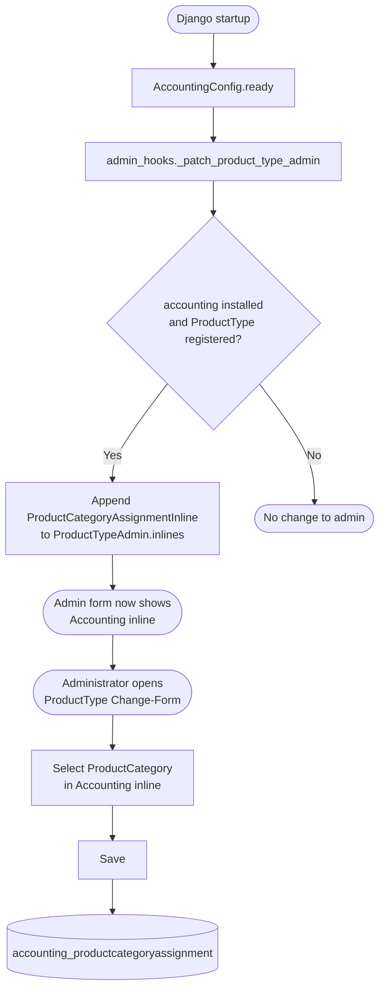

### Sequence Diagram — Save Category Assignment via Admin

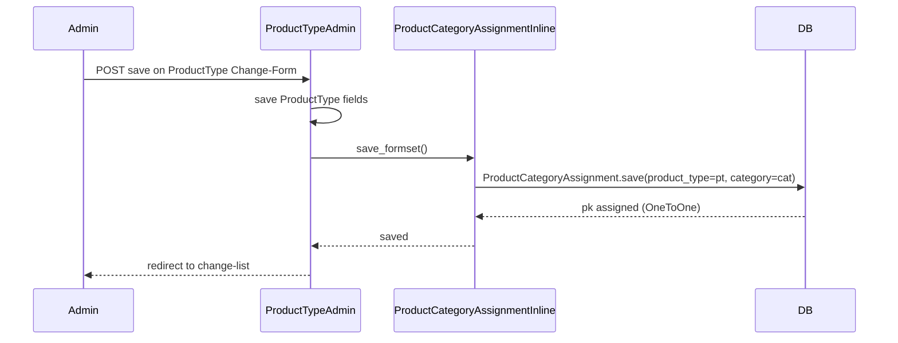

### Alternative Flows

- **First-time assignment** — if no `ProductCategoryAssignment` exists for the
  ProductType, the inline creates a new row (`max_num = 1`, `extra = 0` means no
  empty row is pre-rendered unless explicitly added by the admin user).
- **Remove assignment** — `can_delete = True` allows the administrator to check the
  delete checkbox and remove the assignment; the `ProductType` record itself is
  unaffected.
- **Update assignment** — changing the `category` FK via the inline updates the
  existing `ProductCategoryAssignment` row in place.
- **No REST endpoint** — `ProductCategoryAssignment` has no dedicated REST
  ViewSet in the products app. The accounting app's REST API exposes category
  management separately (see `accounting/views/product_category_view_set.py`).

### Preconditions

- `koalixcrm.accounting` is listed in `INSTALLED_APPS` and its migrations have run.
- At least one `accounting.ProductCategory` exists.
- The target `ProductType` exists.
- The administrator has staff access and the Django Admin session is active.

### Postconditions

- An `accounting.ProductCategoryAssignment` row exists with a OneToOne link from
  the `ProductType` to a `ProductCategory`.
- Accounting booking workflows can now classify transactions originating from this
  product type.
- The `ProductType.__str__` representation remains unchanged; accounting category
  info is accessible via the reverse relation `product_type.product_category_assignment`.

### Configuration / Settings / Parameterization

See [QQ_SD_Configuration.md](../08_cross_cutting_concepts/QQ_SD_Configuration.md) (not yet produced).
The patch is conditional on `INSTALLED_APPS` containing `koalixcrm.accounting`.
`ProductCategoryAssignmentInline` uses `max_num = 1` (one category per product type).
The inline fieldset label is "Accounting".

### Access Control

See [QQ_SD_AccessControl.md](../08_cross_cutting_concepts/QQ_SD_AccessControl.md) for the full RBAC model.
Access is controlled by Django Admin staff restriction only; no separate REST
permission is defined for this operation in the products app.
The accounting app's `ProductCategoryAssignmentAdmin` also provides a standalone
Admin list at `/admin/accounting/productcategoryassignment/` for bulk management.

### Notes and References

- The monkey-patch in `admin_hooks.py` is idempotent: it checks whether
  `ProductCategoryAssignmentInline` is already in `inlines` before appending.
- Relocation of the FK from `products.ProductType` to
  `accounting.ProductCategoryAssignment` was introduced in migration
  `accounting/migrations/0003_tax_and_category_assignments.py` and
  `products/migrations/0006_drop_accounting_product_category.py`.
- Related: UC-PP-01 (ProductType is the anchor for this assignment),
  accounting domain use cases (not covered in this document).
