# Use Cases — Reporting and Document Export Domain

This document describes all use cases in the Reporting and Document Export domain of
the koalixCRM system. The reporting app lives at `koalixcrm/reporting/` and is an
optional module (not shipped to WFS). It covers project and task management, time
tracking (work entry recording), resource agreement management, reporting-period
lifecycle, and an event-driven asynchronous PDF generation pipeline that is shared
with the commercial documents of the core CRM.

All models are `WorkspaceScopedModel` instances, except `Booking`.
Every query is transparently filtered to the active workspace through
`WorkspaceAwareManager`, which reads the workspace from a Django `ContextVar`.
All viewsets apply the same scope via `WorkspaceScopedViewSetMixin`.

The REST API is mounted at `/koalixcrm_reporting/api/v1/<workspace_id>/`.
Django Admin screens are under `/admin/reporting/`.
Legacy template-based views are under `/koalixcrm/crm/reporting/`.

## System Actors

| Actor | Type | Interface |
|---|---|---|
| CRM User | Human | Browser (Django templates) or REST API client |
| Administrator | Human | Django Admin (`/admin/`) |
| Celery Worker | Background process | Internal; currently no active task routes — SQS poller dispatches `CommandEnvelope` but `TASK_ROUTES` is empty |
| PDF Export Service | External Java service | Polls SQS; fetches source data via REST; renders PDFs via Apache FOP / XSL-FO; stores result in S3 |

---

## UC-REP-01: Manage Projects and Tasks

**Actor:** CRM User, Administrator

**Interfaces:** Django Admin (`/admin/reporting/project/`, `/admin/reporting/task/`),
REST API (`projects/`, `tasks/`, `agreements/`, `estimations/`, `reporting-periods/`,
and supporting reference-data endpoints)

### UC-REP-01 Purpose

Create, read, update, and delete Project and Task records — the structural backbone
of the reporting domain. A Project aggregates tasks, reporting periods, resource
agreements, effort estimations, and links (generic project and task links). The Admin
change form exposes all relationships as inlines. The REST API surfaces the same
data through individual viewsets.

### UC-REP-01 Preconditions

- The actor is authenticated and has a role in the target workspace.
- At least one `ProjectStatus` and one `TaskStatus` record exist (reference data
  administered through the corresponding REST endpoints or Admin).
- The active workspace is set — via the `workspace_id` path segment (REST) or via
  the session workspace selection (Admin).

### UC-REP-01 Main Flow

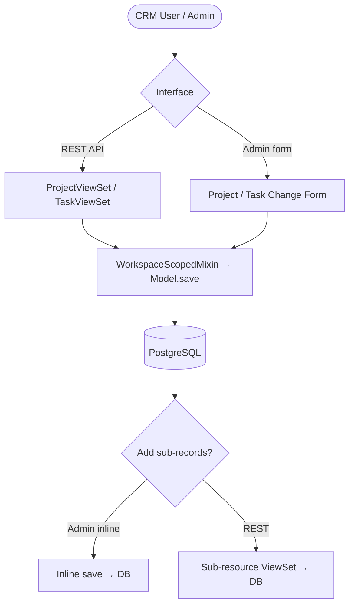
```mermaid
flowchart TD
    A([CRM User / Admin]) --> B{Interface}
    B -->|REST API| C[ProjectViewSet / TaskViewSet]
    B -->|Admin form| D[Project / Task Change Form]
    C --> E[WorkspaceScopedMixin → Model.save]
    D --> E
    E --> F[(PostgreSQL)]
    F --> G{Add sub-records?}
    G -->|Admin inline| H[Inline save → DB]
    G -->|REST| I[Sub-resource ViewSet → DB]
```

### UC-REP-01 Admin Sequence — Create Project with Tasks

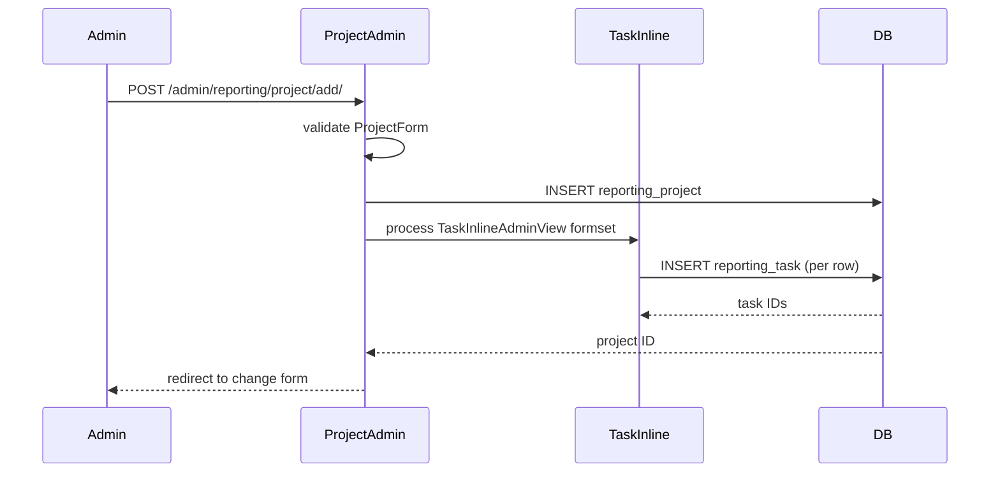
```mermaid
sequenceDiagram
    participant Admin
    participant ProjectAdmin
    participant TaskInline
    participant DB

    Admin->>ProjectAdmin: POST /admin/reporting/project/add/
    ProjectAdmin->>ProjectAdmin: validate ProjectForm
    ProjectAdmin->>DB: INSERT reporting_project
    ProjectAdmin->>TaskInline: process TaskInlineAdminView formset
    TaskInline->>DB: INSERT reporting_task (per row)
    DB-->>TaskInline: task IDs
    DB-->>ProjectAdmin: project ID
    ProjectAdmin-->>Admin: redirect to change form
```

### UC-REP-01 REST Sequence — Create Task under Project

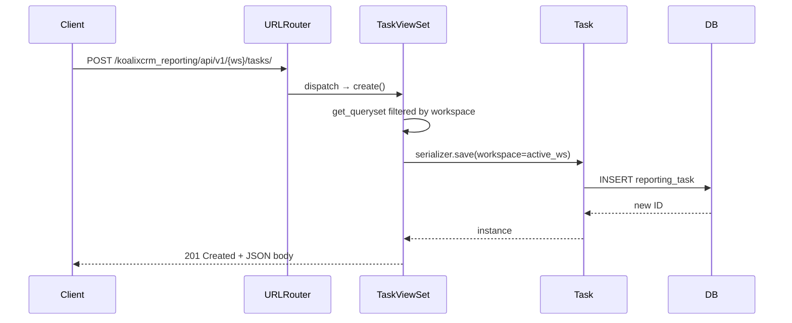
```mermaid
sequenceDiagram
    participant Client
    participant URLRouter
    participant TaskViewSet
    participant Task
    participant DB

    Client->>URLRouter: POST /koalixcrm_reporting/api/v1/{ws}/tasks/
    URLRouter->>TaskViewSet: dispatch → create()
    TaskViewSet->>TaskViewSet: get_queryset filtered by workspace
    TaskViewSet->>Task: serializer.save(workspace=active_ws)
    Task->>DB: INSERT reporting_task
    DB-->>Task: new ID
    Task-->>TaskViewSet: instance
    TaskViewSet-->>Client: 201 Created + JSON body
```

### UC-REP-01 Alternative Flows

- **Read (list/detail):** `GET /projects/` and `GET /tasks/` return workspace-scoped
  lists. The Admin project change-list shows: id, project\_name, project\_manager,
  project\_status, planned\_total\_costs, planned\_duration, effective\_duration,
  effective\_effort, effective\_costs\_confirmed, effective\_costs\_not\_confirmed.
  The task change-list is filterable by project.
- **Update:** `PUT`/`PATCH` on the REST endpoint or via the Admin Change Form.
  The workspace stamp is immutable after creation.
- **Delete:** `DELETE` on the REST endpoint or Admin delete action. Cascades to
  linked tasks, reporting periods, agreements, estimations, and generic links.
- **Reference data maintenance:** Project status, task status, project link types,
  task link types, and generic link records are managed through their respective
  viewsets (`project-status/`, `task-status/`, `project-link-types/`,
  `task-link-types/`, `generic-project-links/`, `generic-task-links/`).
- **Superuser without active workspace:** Returns unfiltered queryset; `perform_create`
  falls back to or creates the Default Workspace.

### UC-REP-01 Postconditions

- A `reporting_project` row (and optionally child `reporting_task` rows) exists in
  the database, scoped to the active workspace.
- The project is visible in the workspace-scoped project list and task list.
- Related records (agreements, estimations, reporting periods) can be added in
  subsequent operations.

### UC-REP-01 Configuration and Parameterization

> Cross-reference: see `QQ_SD_Configuration.md` (not yet produced).

- `ProjectStatus` and `TaskStatus` records are reference data — they must be seeded
  before projects and tasks can be created.
- `ProjectLinkType` and `TaskLinkType` govern which link categories are available for
  generic-link inlines.

### UC-REP-01 Access Control

See [QQ_SD_AccessControl.md](../08_cross_cutting_concepts/QQ_SD_AccessControl.md) for the full RBAC model.

- REST API: authenticated users with a `RoleInWorkspace` for the active workspace can
  read and write. Unauthenticated requests receive `401 Unauthorized`.
- Django Admin: `WorkspaceScopedModelAdmin` applies workspace filtering; requires
  `is_staff=True`. The `TaskInlineAdminView` is read-only (no add/delete).

### UC-REP-01 Notes and References

- The Project Admin change form includes three inlines: `TaskInlineAdminView`
  (read-only summary), `GenericLinkInlineAdminView`, and
  `ReportingPeriodInlineAdminView`.
- Effective-cost and effort fields (e.g., `effective_duration`, `effective_effort`,
  `effective_costs_confirmed`) are computed from aggregated work and agreement records
  — they are not directly writable.

---

## UC-REP-02: Record Work (Time Tracking — Formset Screen)

**Actor:** CRM User

**Interface:** Browser at `/koalixcrm/crm/reporting/time_tracking/`
(function-based view `work_report`, decorated `@login_required`)

### UC-REP-02 Purpose

Allow a CRM User to record multiple work entries in a single date-bounded formset
screen. Each row captures a project, a task (AJAX-filtered by project to only show
tasks where `is_reporting_allowed` is `True`), a start and stop datetime, worked
hours, and a description. Existing entries in the date range are pre-populated for
editing. The user can add rows, delete rows, and save the entire formset in one
POST.

### UC-REP-02 Preconditions

- The actor is authenticated (`@login_required`).
- The actor's Django user has a linked `UserExtension` record; otherwise the view
  redirects to an error page.
- A `HumanResource` record exists for the user's `UserExtension`; otherwise redirected
  to an error page.
- At least one `ReportingPeriod` with status "open" exists in the workspace;
  otherwise redirected to an error page.

### UC-REP-02 Main Flow

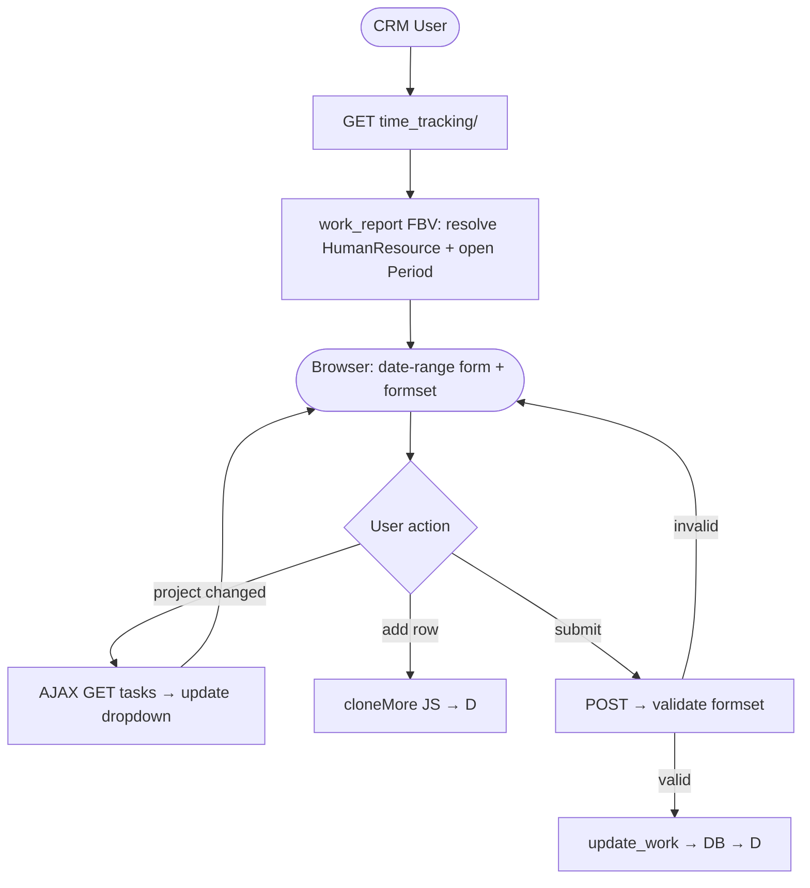
```mermaid
flowchart TD
    A([CRM User]) --> B[GET time_tracking/]
    B --> C[work_report FBV: resolve HumanResource + open Period]
    C --> D([Browser: date-range form + formset])
    D --> E{User action}
    E -->|project changed| F[AJAX GET tasks → update dropdown]
    F --> D
    E -->|add row| G[cloneMore JS → D]
    E -->|submit| H[POST → validate formset]
    H -->|valid| I[update_work → DB → D]
    H -->|invalid| D
```

### UC-REP-02 Sequence — AJAX Task Filter on Project Change

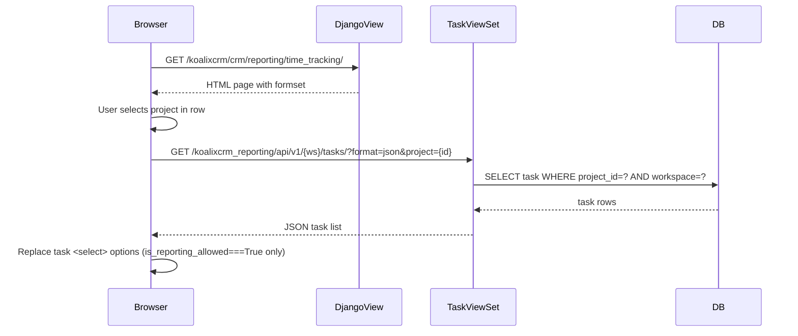
```mermaid
sequenceDiagram
    participant Browser
    participant DjangoView
    participant TaskViewSet
    participant DB

    Browser->>DjangoView: GET /koalixcrm/crm/reporting/time_tracking/
    DjangoView-->>Browser: HTML page with formset
    Browser->>Browser: User selects project in row
    Browser->>TaskViewSet: GET /koalixcrm_reporting/api/v1/{ws}/tasks/?format=json&project={id}
    TaskViewSet->>DB: SELECT task WHERE project_id=? AND workspace=?
    DB-->>TaskViewSet: task rows
    TaskViewSet-->>Browser: JSON task list
    Browser->>Browser: Replace task <select> options (is_reporting_allowed===True only)
```

### UC-REP-02 Sequence — POST Save Formset

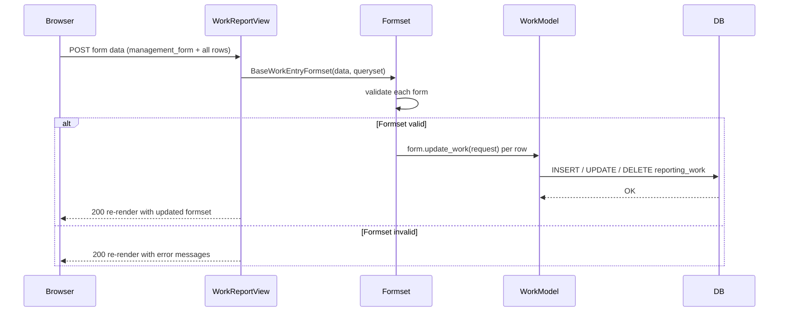
```mermaid
sequenceDiagram
    participant Browser
    participant WorkReportView
    participant Formset
    participant WorkModel
    participant DB

    Browser->>WorkReportView: POST form data (management_form + all rows)
    WorkReportView->>Formset: BaseWorkEntryFormset(data, queryset)
    Formset->>Formset: validate each form
    alt Formset valid
        Formset->>WorkModel: form.update_work(request) per row
        WorkModel->>DB: INSERT / UPDATE / DELETE reporting_work
        DB-->>WorkModel: OK
        WorkReportView-->>Browser: 200 re-render with updated formset
    else Formset invalid
        WorkReportView-->>Browser: 200 re-render with error messages
    end
```

### UC-REP-02 Alternative Flows

- **Date range navigation:** The user changes the date-range filter on the GET form;
  the view re-queries existing work entries for the new range and re-renders.
- **Delete row:** The user checks the DELETE checkbox on a row. `update_work` removes
  the work entry from the database, provided the associated reporting period is not
  in "done" status (enforced in the model layer).
- **Error redirects:** Missing `UserExtension` → redirect to
  `/koalixcrm/crm/reporting/error_user_not_setup/`; missing `HumanResource` →
  redirect to `/koalixcrm/crm/reporting/error_human_resource_not_setup/`; no open
  period → redirect to `/koalixcrm/crm/reporting/error_no_reporting_period/`.
- **Timezone:** The view offers a timezone-selection screen at
  `/koalixcrm/crm/reporting/set_timezone/` which sets `request.session['django_timezone']`
  before redirecting back; this affects how datetime fields are displayed.

### UC-REP-02 Postconditions

- `reporting_work` rows are created, updated, or deleted in the database according to
  the formset submission.
- The re-rendered page shows the current state of work entries for the selected date
  range.

### UC-REP-02 Configuration and Parameterization

> Cross-reference: see `QQ_SD_Configuration.md` (not yet produced).

- `is_reporting_allowed` on `Task` controls which tasks appear in the AJAX-filtered
  dropdown.
- The open `ReportingPeriod` determines which period a new work entry is assigned to.
- The `UserExtension.default_template_set` is used in PDF generation (see
  [UC-REP-07](#uc-rep-07-generate-work-report-pdf-async)), not for this screen.

### UC-REP-02 Access Control

See [QQ_SD_AccessControl.md](../08_cross_cutting_concepts/QQ_SD_AccessControl.md) for the full RBAC model.

- `@login_required` — unauthenticated requests redirect to the login page.
- The view implicitly scopes work entries to the authenticated user's own
  `HumanResource`; users can only see and edit their own time entries through this
  screen.
- Administrators managing other users' entries use the Admin CRUD screen (see
  [UC-REP-03](#uc-rep-03-record-work-single-entry--admin-crud)).

### UC-REP-02 Notes and References

- `cloneMore('#single_form', 'form')` is the client-side JavaScript function that
  clones the last formset row and increments all `__prefix__`-style management indices.
- The task filtering AJAX call uses `$.getJSON` (jQuery); the `format=json` query
  parameter selects the DRF JSON renderer.
- The `BaseWorkEntryFormset` validates inter-field constraints (e.g., `stop_time` must
  be after `start_time`).

---

## UC-REP-03: Record Work (Single Entry — Admin CRUD)

**Actor:** Administrator

**Interfaces:** Django Admin (`/admin/reporting/work/`),
REST API (`works/`)

### UC-REP-03 Purpose

Create, read, update, and delete individual work entries directly through the Django
Admin interface or the REST API. This path is used by administrators to correct or
supplement entries, to manage work for human resources other than themselves, and to
delete entries in bulk using the `delete_work` Admin action.

### UC-REP-03 Preconditions

- The actor is authenticated with `is_staff=True` (Admin) or has a valid workspace
  role (REST API).
- The `Task` and `HumanResource` referenced in the entry exist in the workspace.
- The `ReportingPeriod` referenced is not in "done" status if the intent is to mutate
  the entry (deletion of a work entry in a done period is blocked by the action logic).

### UC-REP-03 Main Flow

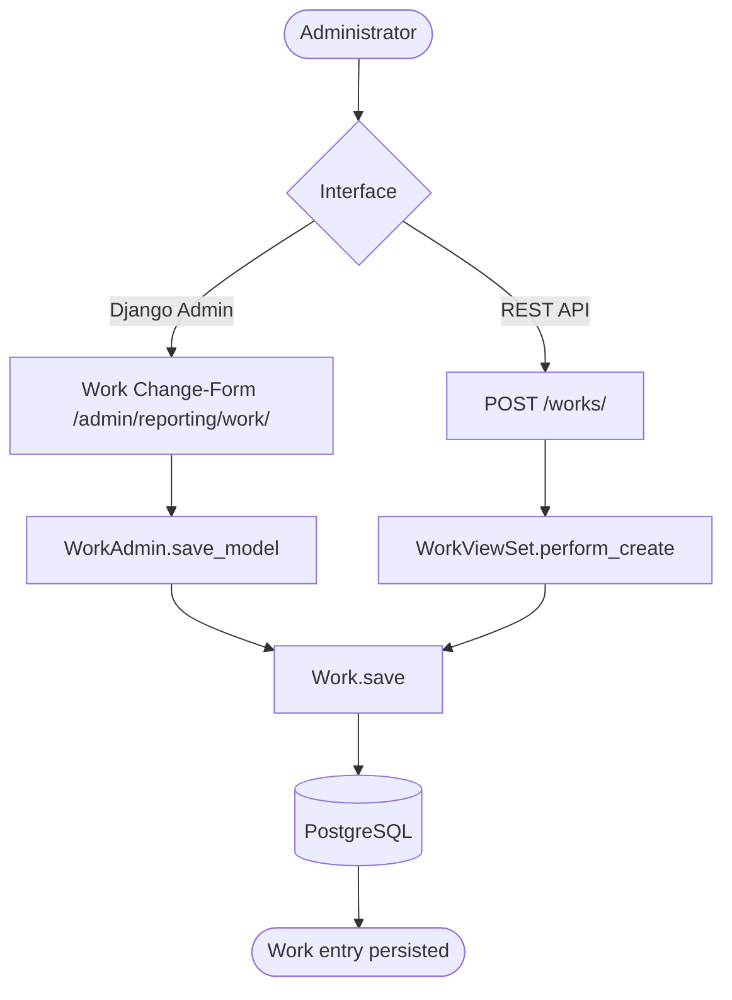
```mermaid
flowchart TD
    A([Administrator]) --> B{Interface}
    B -->|Django Admin| C[Work Change-Form /admin/reporting/work/]
    B -->|REST API| D[POST /works/]
    C --> E[WorkAdmin.save_model]
    D --> F[WorkViewSet.perform_create]
    E --> G[Work.save]
    F --> G
    G --> H[(PostgreSQL)]
    H --> I([Work entry persisted])
```

### UC-REP-03 Sequence — Admin delete_work Bulk Action

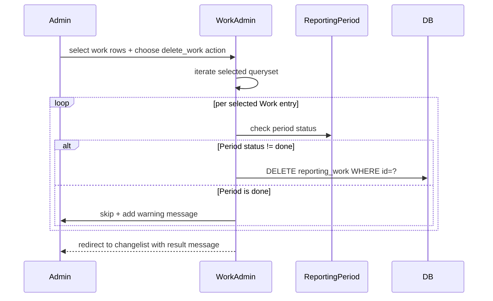
```mermaid
sequenceDiagram
    participant Admin
    participant WorkAdmin
    participant ReportingPeriod
    participant DB

    Admin->>WorkAdmin: select work rows + choose delete_work action
    WorkAdmin->>WorkAdmin: iterate selected queryset
    loop per selected Work entry
        WorkAdmin->>ReportingPeriod: check period status
        alt Period status != done
            WorkAdmin->>DB: DELETE reporting_work WHERE id=?
        else Period is done
            WorkAdmin->>Admin: skip + add warning message
        end
    end
    WorkAdmin-->>Admin: redirect to changelist with result message
```

### UC-REP-03 Alternative Flows

- **Read (list):** Admin change-list shows: link\_to\_work, human\_resource, task,
  get\_short\_description, date, reporting\_period, effort\_as\_string, confirmed.
  Filterable by task and date.
- **Update:** Admin Change Form fields: human\_resource, date, start\_time, stop\_time,
  worked\_hours, short\_description, description, task, reporting\_period.
  `PUT`/`PATCH` available on `works/{id}/` via REST.
- **REST delete:** `DELETE /works/{id}/` — enforcement of the "done period" guard is
  in the model layer.
- **Confirmed flag:** The `confirmed` field signals that the work entry has been
  reviewed; confirmed entries may carry additional business rules in downstream
  cost-aggregation logic.

### UC-REP-03 Postconditions

- `reporting_work` rows are created, updated, or deleted.
- Effective-cost and effort aggregates on the parent Project are updated on the next
  aggregation pass.

### UC-REP-03 Configuration and Parameterization

> Cross-reference: see `QQ_SD_Configuration.md` (not yet produced).

- The `delete_work` action guards against deleting entries in reporting periods whose
  status equals "done" — the exact status code is a reference-data value, not a
  hard-coded constant.

### UC-REP-03 Access Control

See [QQ_SD_AccessControl.md](../08_cross_cutting_concepts/QQ_SD_AccessControl.md) for the full RBAC model.

- Django Admin: `is_staff=True` required.
- REST API: workspace-scoped role required. The `WorkViewSet` applies
  `WorkspaceScopedViewSetMixin`.

### UC-REP-03 Notes and References

- The `effort_as_string` displayed in the Admin list is a computed property
  (formatted duration), not a stored column.
- `link_to_work` in the list view is a hyperlink rendered by a custom list-display
  method rather than a raw field value.
- For bulk time entry by the CRM User themselves, see
  [UC-REP-02](#uc-rep-02-record-work-time-tracking--formset-screen).

---

## UC-REP-04: Manage Resource Agreements and Estimations

**Actor:** Administrator

**Interfaces:** Django Admin — Task Change Form inlines
(`AgreementInlineAdminView`, `EstimationInlineAdminView`) at `/admin/reporting/task/`;
REST API (`agreements/`, `estimations/`, `agreement-status/`, `agreement-types/`,
`estimation-status/`, `human-resources/`, `resources/`, `resource-types/`,
`resource-managers/`, `resource-prices/`)

### UC-REP-04 Purpose

Define which human resources or resources are assigned to a task (Agreements) and
what effort is estimated per reporting period for that task (Estimations). Agreements
capture the "who does what, at what cost" contract between the project and a resource;
estimations capture the "how long we expect it to take" forecast per reporting period.
Both are managed as inlines on the Task Admin form or via dedicated REST endpoints.

### UC-REP-04 Preconditions

- The parent `Task` exists in the workspace.
- At least one `HumanResource` or `Resource` exists (for Agreement creation).
- At least one `ReportingPeriod` exists scoped to the task's project (for
  Estimation creation).
- `AgreementStatus`, `AgreementType`, and `EstimationStatus` reference data exist.

### UC-REP-04 Main Flow

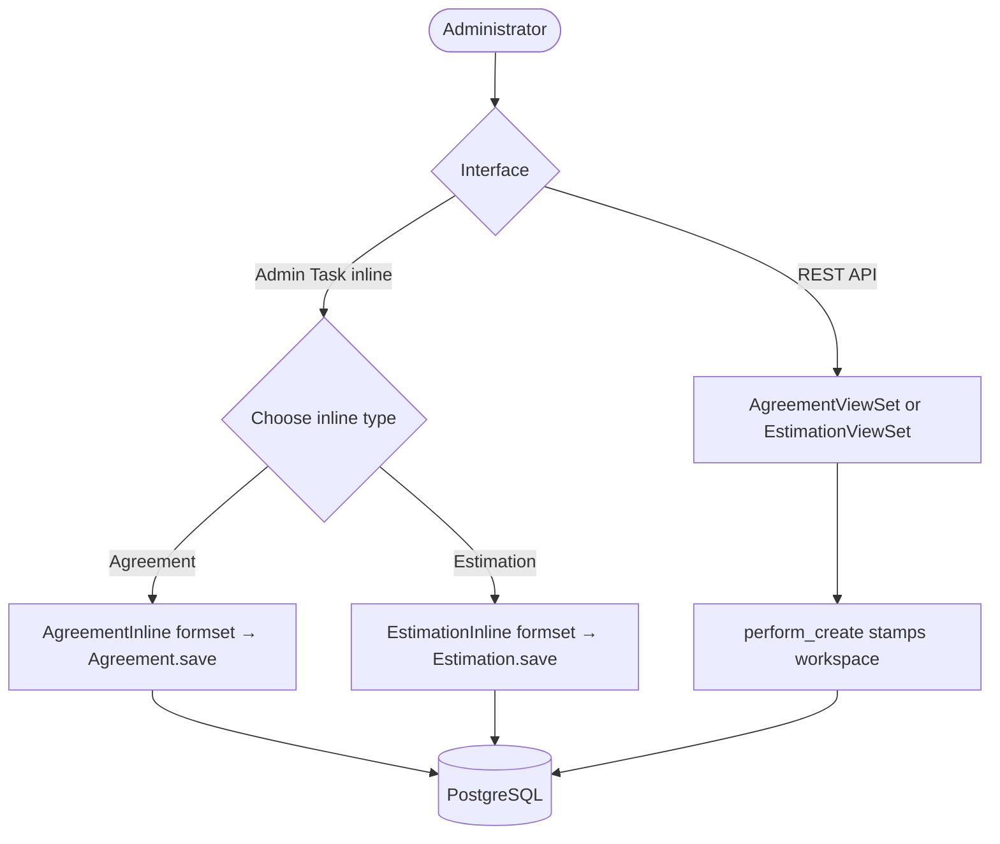
```mermaid
flowchart TD
    A([Administrator]) --> B{Interface}
    B -->|Admin Task inline| C{Choose inline type}
    B -->|REST API| D[AgreementViewSet or EstimationViewSet]
    C -->|Agreement| E[AgreementInline formset → Agreement.save]
    C -->|Estimation| F[EstimationInline formset → Estimation.save]
    D --> G[perform_create stamps workspace]
    E --> H[(PostgreSQL)]
    F --> H
    G --> H
```

### UC-REP-04 Sequence — Create Agreement via REST

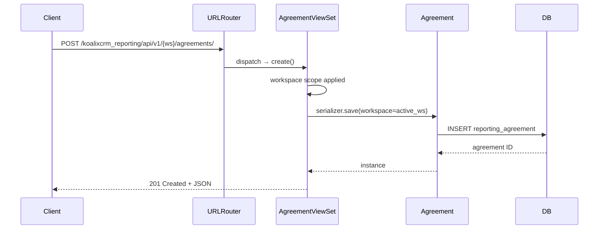
```mermaid
sequenceDiagram
    participant Client
    participant URLRouter
    participant AgreementViewSet
    participant Agreement
    participant DB

    Client->>URLRouter: POST /koalixcrm_reporting/api/v1/{ws}/agreements/
    URLRouter->>AgreementViewSet: dispatch → create()
    AgreementViewSet->>AgreementViewSet: workspace scope applied
    AgreementViewSet->>Agreement: serializer.save(workspace=active_ws)
    Agreement->>DB: INSERT reporting_agreement
    DB-->>Agreement: agreement ID
    Agreement-->>AgreementViewSet: instance
    AgreementViewSet-->>Client: 201 Created + JSON
```

### UC-REP-04 Alternative Flows

- **Resource pricing:** `ResourcePrice` records are managed via
  `resource-prices/` and also as an inline (`ResourcePriceInlineAdminView`) on the
  `HumanResource` Admin form. They define the billable rate for a resource in a given
  date range.
- **Resource hierarchy:** `ResourceType` classifies resources
  (`resource-types/`); `ResourceManager` groups resources
  (`resource-managers/`); individual `Resource` records are at `resources/`;
  `HumanResource` links a resource to a Django user.
- **Update / delete:** Standard `PUT`/`PATCH`/`DELETE` on each endpoint, or edit /
  delete inline rows in the Admin form.
- **Estimation status:** `EstimationStatus` reference data drives workflow transitions
  for estimation records (e.g., draft → approved).

### UC-REP-04 Postconditions

- `reporting_agreement` and/or `reporting_estimation` rows exist, scoped to the
  workspace and linked to the parent task.
- Cost aggregates on the parent project are updated on the next aggregation pass.

### UC-REP-04 Configuration and Parameterization

> Cross-reference: see `QQ_SD_Configuration.md` (not yet produced).

- `AgreementType` and `AgreementStatus` reference data control the available agreement
  classification and lifecycle values.
- `EstimationStatus` reference data controls the estimation lifecycle.

### UC-REP-04 Access Control

See [QQ_SD_AccessControl.md](../08_cross_cutting_concepts/QQ_SD_AccessControl.md) for the full RBAC model.

- Django Admin: `is_staff=True`; workspace-scoped.
- REST API: workspace role required for read/write on all sub-resource endpoints.

### UC-REP-04 Notes and References

- `Agreement` links a `HumanResource` (or `Resource`) to a `Task` with an agreed
  allocation and billing rate; it is distinct from a commercial `Contract` in the
  CRM's sales domain.
- `Estimation` ties a task to a `ReportingPeriod` with an estimated effort value;
  used to compute planned vs. actual divergence in project reports.

---

## UC-REP-05: Manage Reporting Periods

**Actor:** Administrator

**Interfaces:** Django Admin (`/admin/reporting/reportingperiod/`),
REST API (`reporting-periods/`, `reporting-period-status/`)

### UC-REP-05 Purpose

Create, read, update, and delete `ReportingPeriod` records that define time-bounded
intervals scoped to a project. A reporting period drives which work entries belong
to a given month/sprint/quarter, whether new entries can be added (open) or the
period is locked (done), and which periods are available to the time-tracking formset
screen.

### UC-REP-05 Preconditions

- The actor is authenticated with `is_staff=True` (Admin) or has a workspace role
  (REST).
- The parent `Project` exists.
- `ReportingPeriodStatus` reference data exists.

### UC-REP-05 Main Flow

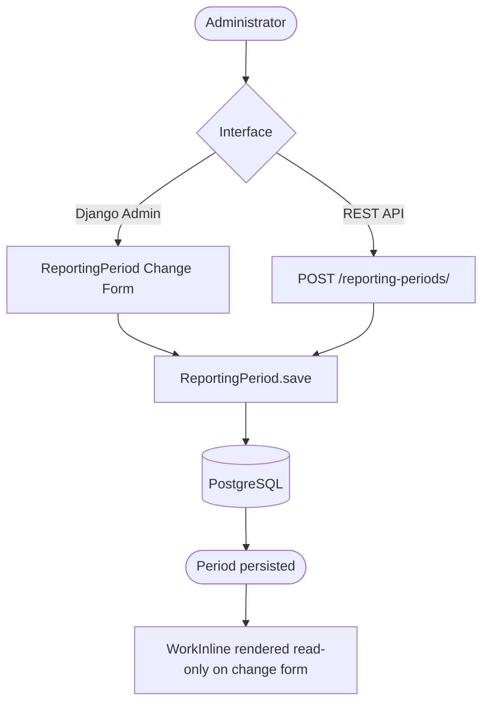
```mermaid
flowchart TD
    A([Administrator]) --> B{Interface}
    B -->|Django Admin| C[ReportingPeriod Change Form]
    B -->|REST API| D[POST /reporting-periods/]
    C --> E[ReportingPeriod.save]
    D --> E
    E --> F[(PostgreSQL)]
    F --> G([Period persisted])
    G --> H[WorkInline rendered read-only on change form]
```

### UC-REP-05 Sequence — Close a Reporting Period

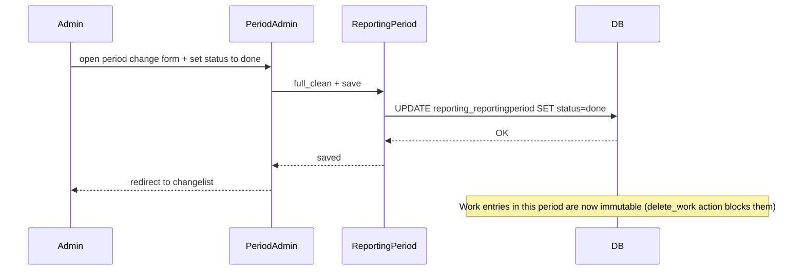
```mermaid
sequenceDiagram
    participant Admin
    participant PeriodAdmin
    participant ReportingPeriod
    participant DB

    Admin->>PeriodAdmin: open period change form + set status to done
    PeriodAdmin->>ReportingPeriod: full_clean + save
    ReportingPeriod->>DB: UPDATE reporting_reportingperiod SET status=done
    DB-->>ReportingPeriod: OK
    ReportingPeriod-->>PeriodAdmin: saved
    PeriodAdmin-->>Admin: redirect to changelist
    note over DB: Work entries in this period are now immutable (delete_work action blocks them)
```

### UC-REP-05 Alternative Flows

- **Read (list):** Admin change-list columns: id, project, title, begin, end, status.
  `WorkspaceScopedModelAdmin` filters to the active workspace.
- **Embedded work entries:** The `WorkInlineAdminView` on the reporting-period change
  form is read-only — administrators can review the work entries that belong to the
  period but cannot add or delete them from this screen; they use the Work Admin
  (see [UC-REP-03](#uc-rep-03-record-work-single-entry--admin-crud)) instead.
- **Project-report trigger:** The `create_report_pdf` Admin action on this form
  enqueues a PDF export for this period (see
  [UC-REP-06](#uc-rep-06-generate-project-report-pdf-async)).
- **REST status management:** `ReportingPeriodStatus` reference data is managed at
  `reporting-period-status/`.

### UC-REP-05 Postconditions

- `reporting_reportingperiod` row created / updated / deleted in the database.
- If the period is transitioned to "done", the `delete_work` action will thereafter
  refuse to delete work entries belonging to it.
- Work entries submitted through the time-tracking formset are only accepted if an
  open reporting period exists for the workspace.

### UC-REP-05 Configuration and Parameterization

> Cross-reference: see `QQ_SD_Configuration.md` (not yet produced).

- `ReportingPeriodStatus` reference data determines the set of valid status values
  and which value is considered "done" (i.e., locked).

### UC-REP-05 Access Control

See [QQ_SD_AccessControl.md](../08_cross_cutting_concepts/QQ_SD_AccessControl.md) for the full RBAC model.

- Django Admin: `WorkspaceScopedModelAdmin`; requires `is_staff=True`.
- REST API: workspace role required.

### UC-REP-05 Notes and References

- A `ReportingPeriod` is scoped to a single `Project`; there is no cross-project
  period concept.
- The `begin` and `end` date fields define the period boundary; work entries are
  assigned to a period by the user at entry time, not by date auto-assignment.

---

## UC-REP-06: Generate Project Report PDF (Async)

**Actor:** CRM User, Administrator

**Interface:** Django Admin action `create_report_pdf` on
`Project` (`/admin/reporting/project/`) and on
`ReportingPeriod` (`/admin/reporting/reportingperiod/`)

### UC-REP-06 Purpose

Produce a project-level or period-level PDF report (rendered from the
`monthly_project_summary_template` XSL-FO template) by enqueuing an asynchronous
`PDFExportProcess`. The Java PDF Export Service picks up the job from SQS, fetches
the source data through the REST API, renders the PDF via Apache FOP, stores the
result in S3, and writes the result URL back to the `PDFExportProcess` record.

### UC-REP-06 Preconditions

- The actor is authenticated with `is_staff=True`.
- A `Project` or `ReportingPeriod` record is selected in the Admin change-list.
- The `monthly_project_summary_template` XSL-FO template is stored in S3 and
  reachable by the PDF Export Service.
- The SQS PDF export queue is reachable from the Django application.
- The `PDFExportProcess` Admin action `create_report_pdf` is registered on both
  `ProjectAdmin` and `ReportingPeriodAdmin`.

### UC-REP-06 Main Flow

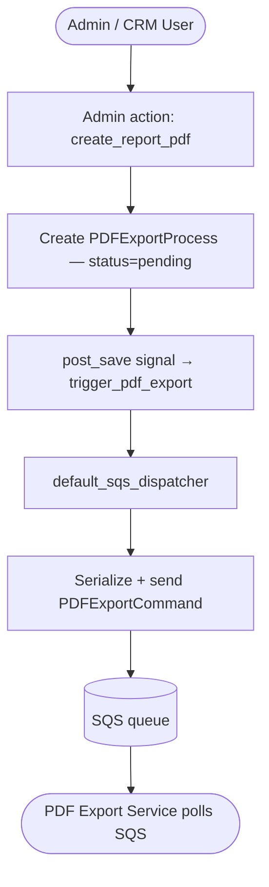
```mermaid
flowchart TD
    A([Admin / CRM User]) --> B[Admin action: create_report_pdf]
    B --> C[Create PDFExportProcess — status=pending]
    C --> D[post_save signal → trigger_pdf_export]
    D --> E[default_sqs_dispatcher]
    E --> F[Serialize + send PDFExportCommand]
    F --> G[(SQS queue)]
    G --> H([PDF Export Service polls SQS])
```

### UC-REP-06 Sequence — Full Async PDF Lifecycle

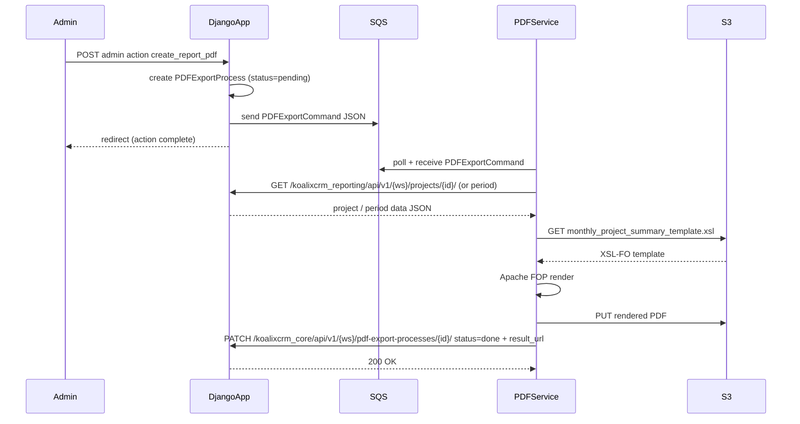
```mermaid
sequenceDiagram
    participant Admin
    participant DjangoApp
    participant SQS
    participant PDFService
    participant S3

    Admin->>DjangoApp: POST admin action create_report_pdf
    DjangoApp->>DjangoApp: create PDFExportProcess (status=pending)
    DjangoApp->>SQS: send PDFExportCommand JSON
    DjangoApp-->>Admin: redirect (action complete)
    PDFService->>SQS: poll + receive PDFExportCommand
    PDFService->>DjangoApp: GET /koalixcrm_reporting/api/v1/{ws}/projects/{id}/ (or period)
    DjangoApp-->>PDFService: project / period data JSON
    PDFService->>S3: GET monthly_project_summary_template.xsl
    S3-->>PDFService: XSL-FO template
    PDFService->>PDFService: Apache FOP render
    PDFService->>S3: PUT rendered PDF
    PDFService->>DjangoApp: PATCH /koalixcrm_core/api/v1/{ws}/pdf-export-processes/{id}/ status=done + result_url
    DjangoApp-->>PDFService: 200 OK
```

### UC-REP-06 Alternative Flows

- **Dispatcher override:** The `KOALIXCRM_PDF_EXPORT_DISPATCHER` Django setting can
  point to a custom dispatcher callable instead of `default_sqs_dispatcher`. In
  testing, a synchronous in-process dispatcher may be substituted.
- **PDF Export Service failure:** If FOP rendering fails, the Java service updates
  `PDFExportProcess` with `status=error` and an error message. The Admin can then
  inspect the record and retry.
- **Multiple records selected:** The Admin action iterates over the selected queryset;
  one `PDFExportProcess` is created per selected project or reporting period.

### UC-REP-06 Postconditions

- A `PDFExportProcess` record exists with `status=pending` immediately after the
  action runs.
- Asynchronously, `status` transitions to `done` and `result_url` is populated with
  the S3 URL of the generated PDF.
- The PDF can be retrieved by polling (see
  [UC-REP-09](#uc-rep-09-poll-pdf-export-process-status)).

### UC-REP-06 Configuration and Parameterization

| Type | Name | Effect on Use Case |
|------|------|--------------------|
| Configuration | `KOALIXCRM_MICROSERVICE_SQS` | SQS queue name used by `get_sqs_queue()` to dispatch the `PDFExportProcess` message; defaults to `'koalixcrm-microservice-sqs'`. |
| Configuration | `SQS_ENDPOINT_URL` | When set, routes SQS calls to ElasticMQ (local dev) instead of AWS. |
| Configuration | `S3_PDF_BUCKET` | S3 bucket where the Java PDF service stores the generated PDF; defaults to `'koalixcrm-pdf-exports'`. |
| Configuration | `CELERY_WORKER_M2M_OIDC_ISSUER` / `CELERY_WORKER_M2M_CLIENT_ID` | M2M credentials used by the Java PDF service to authenticate against the REST API when fetching source data. |
| Configuration | `PRESIGNED_URL_EXPIRES_IN` | Lifetime of presigned S3 URLs served to the Java PDF service for XSL/FOP template downloads; defaults to 300 s. |
| Setting | `UserExtension.default_template_set` | Determines which XSL-FO template is used for the project report; must be configured for the triggering user. |
| Parameterization | SQS `VisibilityTimeout` (60 s in poller, 3600 s in Celery broker) | Must exceed the total rendering time; too low causes duplicate delivery. |

See [QQ_SD_Configuration.md](../08_cross_cutting_concepts/QQ_SD_Configuration.md), [QQ_SD_Settings.md](../08_cross_cutting_concepts/QQ_SD_Settings.md),
and [QQ_SD_Parameterization.md](../08_cross_cutting_concepts/QQ_SD_Parameterization.md).

### UC-REP-06 Access Control

See [QQ_SD_AccessControl.md](../08_cross_cutting_concepts/QQ_SD_AccessControl.md) for the full RBAC model.

- Django Admin action: `is_staff=True` required.
- The REST endpoint consumed by the PDF Export Service authenticates with service
  credentials (not the human user's session).

### UC-REP-06 Notes and References

- `PDFExportProcess` is defined in `koalixcrm/core/`; it is shared by all PDF export
  triggers (project, work, commercial documents, accounting).
- The `post_save` signal is registered in `CoreConfig.ready()`, ensuring it is wired
  once at application startup.
- For polling the result, see [UC-REP-09](#uc-rep-09-poll-pdf-export-process-status).

---

## UC-REP-07: Generate Work Report PDF (Async)

**Actor:** Administrator

**Interface:** Django Admin action `create_work_report_pdf` on
`HumanResource` (`/admin/reporting/humanresource/`)

### UC-REP-07 Purpose

Produce a work report PDF for a human resource by enqueuing an asynchronous
`PDFExportProcess`. The template used is the `work_report_template` from the
`UserExtension.default_template_set` of the human resource's linked user. The Java
PDF Export Service fetches work data via the REST API, renders the PDF via Apache
FOP, and stores the result in S3.

### UC-REP-07 Preconditions

- The actor is authenticated with `is_staff=True`.
- One or more `HumanResource` records are selected in the Admin change-list.
- The linked user's `UserExtension` has a `default_template_set` configured.
- The `work_report_template` XSL-FO template is stored in S3.
- The SQS PDF export queue is reachable.

### UC-REP-07 Main Flow

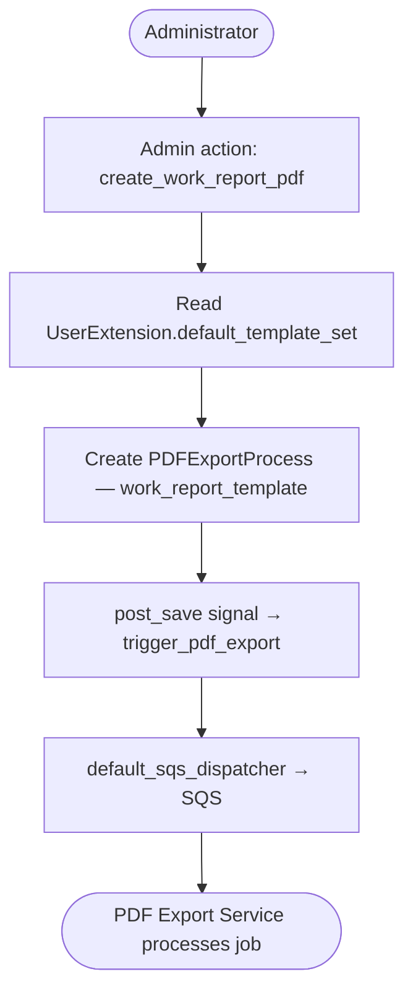
```mermaid
flowchart TD
    A([Administrator]) --> B[Admin action: create_work_report_pdf]
    B --> C[Read UserExtension.default_template_set]
    C --> D[Create PDFExportProcess — work_report_template]
    D --> E[post_save signal → trigger_pdf_export]
    E --> F[default_sqs_dispatcher → SQS]
    F --> G([PDF Export Service processes job])
```

### UC-REP-07 Sequence — Work Report PDF Dispatch

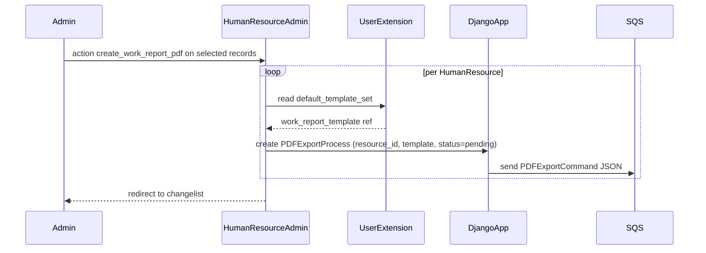
```mermaid
sequenceDiagram
    participant Admin
    participant HumanResourceAdmin
    participant UserExtension
    participant DjangoApp
    participant SQS

    Admin->>HumanResourceAdmin: action create_work_report_pdf on selected records
    loop per HumanResource
        HumanResourceAdmin->>UserExtension: read default_template_set
        UserExtension-->>HumanResourceAdmin: work_report_template ref
        HumanResourceAdmin->>DjangoApp: create PDFExportProcess (resource_id, template, status=pending)
        DjangoApp->>SQS: send PDFExportCommand JSON
    end
    HumanResourceAdmin-->>Admin: redirect to changelist
```

### UC-REP-07 Alternative Flows

- **Missing default_template_set:** If the user's `UserExtension` has no
  `default_template_set`, the action raises a configuration error and no
  `PDFExportProcess` is created for that record.
- **Multiple records selected:** One `PDFExportProcess` is created per selected
  `HumanResource`; they are dispatched independently and can be tracked separately.
- **PDF Export Service rendering:** Same async lifecycle as project reports —
  FOP render → S3 PUT → PATCH `PDFExportProcess` with `result_url`.

### UC-REP-07 Postconditions

- A `PDFExportProcess` record exists per selected `HumanResource` with
  `status=pending`.
- Asynchronously, `status` transitions to `done` and `result_url` is set to the S3
  URL of the rendered work report PDF.

### UC-REP-07 Configuration and Parameterization

| Type | Name | Effect on Use Case |
|------|------|--------------------|
| Setting | `UserExtension.default_template_set` | Provides the `work_report_template` XSL-FO key used for this report; must be configured for the user linked to the `HumanResource`. Missing causes the admin action to log an error and skip the record. |
| Configuration | `KOALIXCRM_MICROSERVICE_SQS` | SQS queue name used to dispatch the `PDFExportProcess` message. |
| Configuration | `S3_PDF_BUCKET` | S3 bucket where the rendered work report PDF is stored. |
| Configuration | `PRESIGNED_URL_EXPIRES_IN` | Lifetime of presigned URLs for template asset downloads by the Java PDF service; defaults to 300 s. |
| Parameterization | SQS `VisibilityTimeout` (60 s in poller) | Must exceed render time; too short causes redelivery of the same job. |

See [QQ_SD_Configuration.md](../08_cross_cutting_concepts/QQ_SD_Configuration.md), [QQ_SD_Settings.md](../08_cross_cutting_concepts/QQ_SD_Settings.md),
and [QQ_SD_Parameterization.md](../08_cross_cutting_concepts/QQ_SD_Parameterization.md).

### UC-REP-07 Access Control

See [QQ_SD_AccessControl.md](../08_cross_cutting_concepts/QQ_SD_AccessControl.md) for the full RBAC model.

- Django Admin action: `is_staff=True` required.
- The `HumanResource` Admin (`/admin/reporting/humanresource/`) also displays an
  inline `ResourcePriceInlineAdminView` and lists: id, user, resource\_manager,
  resource\_type.

### UC-REP-07 Notes and References

- The `HumanResource` change-list Admin action `create_work_report_pdf` is the only
  entry point for this report type; there is no equivalent REST API action trigger.
- For the shared PDF export lifecycle (SQS → FOP → S3), see the sequence diagram in
  [UC-REP-06](#uc-rep-06-generate-project-report-pdf-async).
- For polling the result, see [UC-REP-09](#uc-rep-09-poll-pdf-export-process-status).

---

## UC-REP-08: Generate Commercial Document PDF (Async)

**Actor:** CRM User, Administrator

**Interface:** Django Admin action `create_pdf_async` on any commercial document
Admin (Invoice, Quotation, SalesOrder, and other commercial document types in
`koalixcrm/core/` or `koalixcrm/crm/`)

### UC-REP-08 Purpose

Produce a PDF rendering of a commercial document (invoice, quotation, sales order,
etc.) by enqueuing an asynchronous `PDFExportProcess`. This is the same underlying
pipeline used by project and work reports, but triggered from the commercial
documents portion of the CRM. The Java PDF Export Service reads the document data
from the REST API, renders via the appropriate XSL-FO template, stores in S3, and
writes the result URL back.

### UC-REP-08 Preconditions

- The actor is authenticated with `is_staff=True` (Admin).
- One or more commercial document records are selected in the Admin change-list.
- The appropriate XSL-FO template for the document type is stored in S3.
- The SQS PDF export queue is reachable.

### UC-REP-08 Main Flow

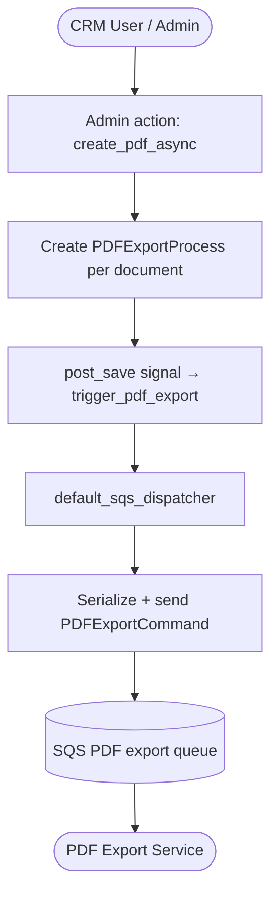
```mermaid
flowchart TD
    A([CRM User / Admin]) --> B[Admin action: create_pdf_async]
    B --> C[Create PDFExportProcess per document]
    C --> D[post_save signal → trigger_pdf_export]
    D --> E[default_sqs_dispatcher]
    E --> F[Serialize + send PDFExportCommand]
    F --> G[(SQS PDF export queue)]
    G --> H([PDF Export Service])
```

### UC-REP-08 Sequence — Commercial Document PDF Full Lifecycle

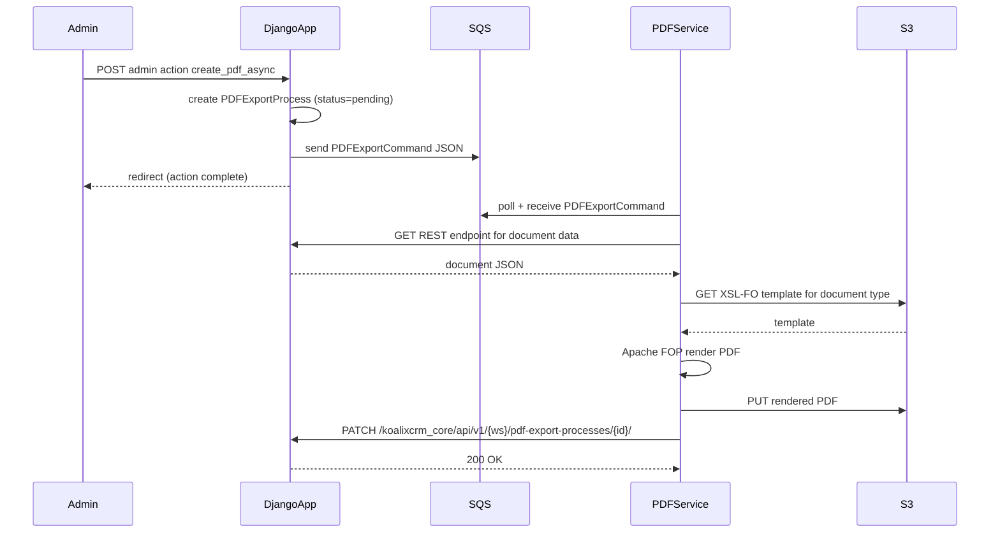
```mermaid
sequenceDiagram
    participant Admin
    participant DjangoApp
    participant SQS
    participant PDFService
    participant S3

    Admin->>DjangoApp: POST admin action create_pdf_async
    DjangoApp->>DjangoApp: create PDFExportProcess (status=pending)
    DjangoApp->>SQS: send PDFExportCommand JSON
    DjangoApp-->>Admin: redirect (action complete)
    PDFService->>SQS: poll + receive PDFExportCommand
    PDFService->>DjangoApp: GET REST endpoint for document data
    DjangoApp-->>PDFService: document JSON
    PDFService->>S3: GET XSL-FO template for document type
    S3-->>PDFService: template
    PDFService->>PDFService: Apache FOP render PDF
    PDFService->>S3: PUT rendered PDF
    PDFService->>DjangoApp: PATCH /koalixcrm_core/api/v1/{ws}/pdf-export-processes/{id}/
    DjangoApp-->>PDFService: 200 OK
```

### UC-REP-08 Alternative Flows

- **Multiple documents selected:** One `PDFExportProcess` is created per selected
  record; each is dispatched and tracked independently.
- **Dispatcher override:** `KOALIXCRM_PDF_EXPORT_DISPATCHER` substitutes the
  dispatcher. Useful in integration tests.
- **FOP render error:** Java service patches `PDFExportProcess` with
  `status=error`; the Admin can inspect the error details and retry.
- **Template not found in S3:** The PDF Export Service fails to fetch the template
  and updates `PDFExportProcess` with `status=error`.

### UC-REP-08 Postconditions

- A `PDFExportProcess` record exists per commercial document with `status=pending`.
- Asynchronously, `status` transitions to `done` and `result_url` points to the
  rendered PDF in S3.

### UC-REP-08 Configuration and Parameterization

| Type | Name | Effect on Use Case |
|------|------|--------------------|
| Setting | `UserExtension.default_template_set` | Provides the XSL-FO template key for the specific document type; must be configured for the triggering user. |
| Configuration | `KOALIXCRM_MICROSERVICE_SQS` | SQS queue name consumed by `get_sqs_queue()` for dispatching the PDF job. |
| Configuration | `S3_PDF_BUCKET` | Destination S3 bucket for the rendered commercial document PDF. |
| Configuration | `CELERY_WORKER_M2M_OIDC_ISSUER` / `CELERY_WORKER_M2M_CLIENT_ID` | M2M credentials used by the Java PDF service to authenticate when reading document data from the REST API. |
| Configuration | `PRESIGNED_URL_EXPIRES_IN` | Presigned URL TTL for template asset downloads; defaults to 300 s. |

See [QQ_SD_Configuration.md](../08_cross_cutting_concepts/QQ_SD_Configuration.md), [QQ_SD_Settings.md](../08_cross_cutting_concepts/QQ_SD_Settings.md),
and [QQ_SD_Parameterization.md](../08_cross_cutting_concepts/QQ_SD_Parameterization.md).

### UC-REP-08 Access Control

See [QQ_SD_AccessControl.md](../08_cross_cutting_concepts/QQ_SD_AccessControl.md) for the full RBAC model.

- Django Admin action: `is_staff=True` required.
- The REST endpoint consumed by the PDF Export Service to read document data is
  authenticated with service credentials.

### UC-REP-08 Notes and References

- The `create_pdf_async` action and the `PDFExportProcess` model are defined in
  `koalixcrm/core/`; they are shared infrastructure used by commercial, reporting,
  and accounting domains.
- The accounting domain (balance sheet, profit-and-loss) triggers the same pipeline
  via actions on `AccountingPeriod` Admin — documented in the Accounting domain use
  cases.
- For polling the result, see [UC-REP-09](#uc-rep-09-poll-pdf-export-process-status).

---

## UC-REP-09: Poll PDF Export Process Status

**Actor:** CRM User, PDF Export Service

**Interfaces:**
- Django Admin: `PDFExportProcess` change-list (in core Admin, not in reporting Admin)
- REST API: `GET /koalixcrm_core/api/v1/<workspace_id>/pdf-export-processes/<id>/`

### UC-REP-09 Purpose

Query the current status and result URL of a `PDFExportProcess` job. This use case
is performed by a CRM User waiting for a PDF to become available, and by the PDF
Export Service when it writes the result back after rendering. The same REST endpoint
serves both: the Java service uses `PATCH` to update status and result URL; the human
user uses `GET` to poll.

### UC-REP-09 Preconditions

- A `PDFExportProcess` record has been created by one of the PDF-generating actions
  (UC-REP-06, UC-REP-07, UC-REP-08, or an accounting domain action).
- The actor has access to the `pdf-export-processes` REST endpoint or Admin screen.

### UC-REP-09 Main Flow

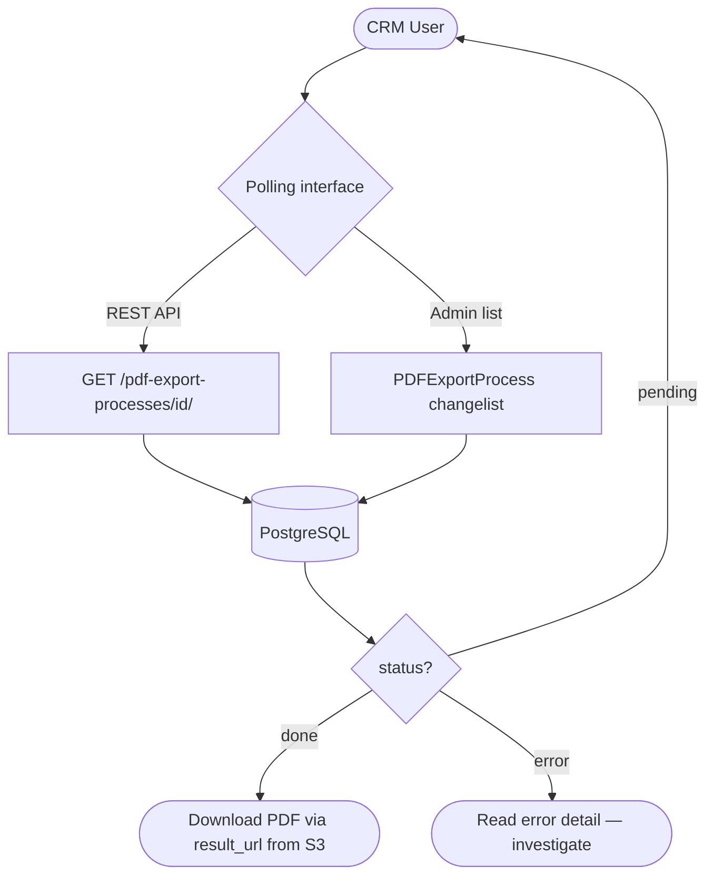
```mermaid
flowchart TD
    A([CRM User]) --> B{Polling interface}
    B -->|REST API| C[GET /pdf-export-processes/id/]
    B -->|Admin list| D[PDFExportProcess changelist]
    C --> E[(PostgreSQL)]
    D --> E
    E --> F{status?}
    F -->|pending| A
    F -->|done| G([Download PDF via result_url from S3])
    F -->|error| H([Read error detail — investigate])
```

### UC-REP-09 Sequence — Human User REST Poll Loop

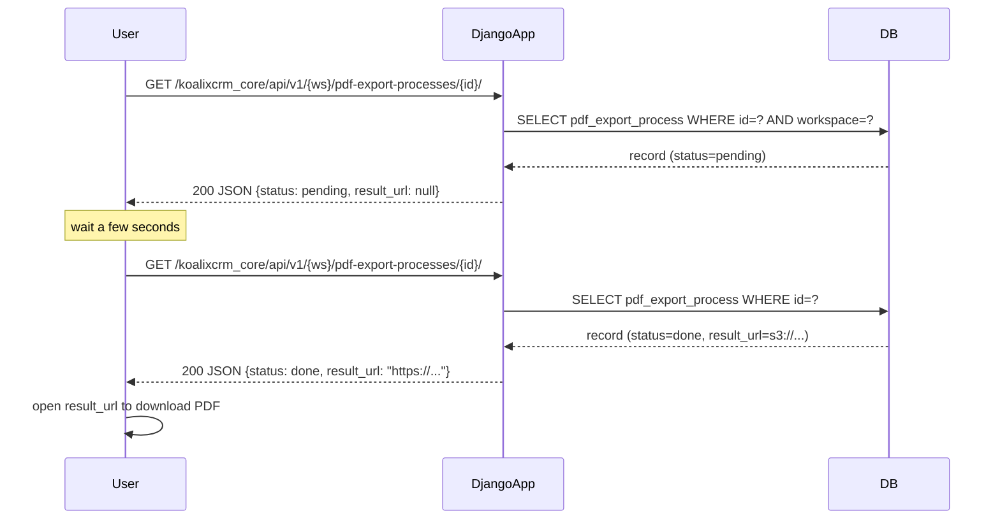
```mermaid
sequenceDiagram
    participant User
    participant DjangoApp
    participant DB

    User->>DjangoApp: GET /koalixcrm_core/api/v1/{ws}/pdf-export-processes/{id}/
    DjangoApp->>DB: SELECT pdf_export_process WHERE id=? AND workspace=?
    DB-->>DjangoApp: record (status=pending)
    DjangoApp-->>User: 200 JSON {status: pending, result_url: null}
    note over User: wait a few seconds
    User->>DjangoApp: GET /koalixcrm_core/api/v1/{ws}/pdf-export-processes/{id}/
    DjangoApp->>DB: SELECT pdf_export_process WHERE id=?
    DB-->>DjangoApp: record (status=done, result_url=s3://...)
    DjangoApp-->>User: 200 JSON {status: done, result_url: "https://..."}
    User->>User: open result_url to download PDF
```

### UC-REP-09 Sequence — PDF Export Service Writing Result

```mermaid
sequenceDiagram
    participant PDFService
    participant DjangoApp
    participant DB

    PDFService->>DjangoApp: PATCH /koalixcrm_core/api/v1/{ws}/pdf-export-processes/{id}/
    note right of PDFService: body: {status: done, result_url: s3_presigned_or_public_url}
    DjangoApp->>DB: UPDATE pdf_export_process SET status=done, result_url=?
    DB-->>DjangoApp: OK
    DjangoApp-->>PDFService: 200 OK
```

### UC-REP-09 Alternative Flows

- **Admin polling:** A staff user navigates to the `PDFExportProcess` Admin
  change-list, which shows the status column. Refreshing the page polls the database.
  There is no push/webhook mechanism — polling is the only retrieval path.
- **Error status:** If `status=error`, the `PDFExportProcess` record contains an
  error detail field populated by the Java service. The administrator inspects this
  via the Admin detail view or REST API.
- **Expired or missing result\_url:** If the S3 URL uses a pre-signed expiry, the
  PDF may become unreachable after the TTL. The process record itself remains in the
  database.

### UC-REP-09 Postconditions

- The actor has read the current status of the `PDFExportProcess` record.
- If `status=done`, the actor has a URL to retrieve the rendered PDF from S3.

### UC-REP-09 Configuration and Parameterization

> Cross-reference: see `QQ_SD_Configuration.md` (not yet produced).

- The `result_url` format (pre-signed S3 URL vs. public S3 URL) is determined by the
  PDF Export Service configuration, not by the Django application.
- No polling interval is enforced by the system; the client is responsible for its
  own retry cadence.

### UC-REP-09 Access Control

See [QQ_SD_AccessControl.md](../08_cross_cutting_concepts/QQ_SD_AccessControl.md) for the full RBAC model.

- REST API `GET`: workspace role required; the record must belong to the active
  workspace. `WorkspaceScopedViewSetMixin` enforces workspace isolation.
- REST API `PATCH` (used by PDF Export Service): the Java service authenticates with
  service credentials that have write access to `pdf-export-processes`.
- Django Admin: `is_staff=True` required.

### UC-REP-09 Notes and References

- The `PDFExportProcess` model and its viewset are in `koalixcrm/core/`, not in the
  reporting app. The REST URL prefix is `/koalixcrm_core/api/v1/<ws>/`, not the
  reporting prefix.
- All PDF export triggers (UC-REP-06, UC-REP-07, UC-REP-08, and accounting actions)
  produce `PDFExportProcess` records that are monitored through this same use case.
- The Celery Worker actor has no active role in the PDF pipeline at this time:
  `TASK_ROUTES` is empty, so no Celery tasks are routed through the worker for PDF
  generation. The pipeline runs entirely through the post-save signal chain → SQS →
  Java PDF Export Service.
