# Use Cases — User Extensions Domain

This document describes all use cases in the User Extensions domain of the koalixCRM system.
The User Extensions domain owns the `DocumentTemplate` hierarchy (10 concrete subtypes via
Multi-Table Inheritance), the `TemplateSet` aggregate, the `UserExtension` record that
associates a Django user with a default template set and default currency, and the
user-specific contact information assignments (`UserAddressAssignment`,
`UserPhoneAssignment`, `UserEmailAssignment`).

All models in this domain are `WorkspaceScopedModel` instances. The domain is implemented
in the `koalixcrm/djangoUserExtension/` application. There is no REST API registered
directly in the `djangoUserExtension` app; the `DocumentTemplate` parent model is
exposed through a single read-oriented REST endpoint registered in the core URLs. All
write operations on templates, template sets, and user extensions are performed through
the Django Admin interface.

An optional peer dependency exists with the `reporting` app: `HumanResource` records
reference `UserExtension` via the Django `User` FK, and the work-report PDF action
retrieves the `work_report_template` from the user's `default_template_set`.

## System Actors

| Actor | Type | Interface |
|---|---|---|
| Administrator | Human | Django Admin (`/admin/djangouserextension/`) |
| CRM User | Human | Browser (Django templates) or REST API client |
| PDF Export Service | External Java service | REST API read — `document-templates/` |

---

## UC-UEX-01: Manage Document Templates

**Actor:** Administrator

**Interface:** Django Admin — one dedicated change-list and change-form per template subtype,
at `/admin/djangouserextension/<templatetype>/`

### UC-UEX-01 Purpose

Upload and manage the XSL stylesheet, Apache FOP configuration file, and logo for each of
the 10 document types supported by the system. Optionally attach free-text `InlineTextParagraph`
blocks (header text, footer text) to a template. A `DocumentTemplate` record provides the
PDF Export Service with the file-storage path it needs to retrieve the XSL file and
produce the rendered PDF.

The 10 template subtypes and their admin routes are:

| Subtype | Admin route |
|---|---|
| `InvoiceTemplate` | `/admin/djangouserextension/invoicetemplate/` |
| `QuotationTemplate` | `/admin/djangouserextension/quotationtemplate/` |
| `DespatchAdviceTemplate` | `/admin/djangouserextension/despatchadvicetemplate/` |
| `PaymentReminderTemplate` | `/admin/djangouserextension/paymentremindertemplate/` |
| `PurchaseOrderTemplate` | `/admin/djangouserextension/purchaseordertemplate/` |
| `SalesOrderTemplate` | `/admin/djangouserextension/salesordertemplate/` |
| `ProfitLossStatementTemplate` | `/admin/djangouserextension/profitlossstatementtemplate/` |
| `BalanceSheetTemplate` | `/admin/djangouserextension/balancesheettemplate/` |
| `MonthlyProjectSummaryTemplate` | `/admin/djangouserextension/monthlyprojectsummarytemplate/` |
| `WorkReportTemplate` | `/admin/djangouserextension/workreporttemplate/` |

### UC-UEX-01 Preconditions

- The actor is authenticated as a Django staff user (`is_staff=True`).
- The active workspace is selected in the Admin session.
- File storage (S3 or MinIO) is reachable so that the filebrowser widget can upload files.
- At least one workspace exists; `WorkspaceScopedModelAdmin` applies workspace filtering
  on the change-list.

### UC-UEX-01 Main Flow

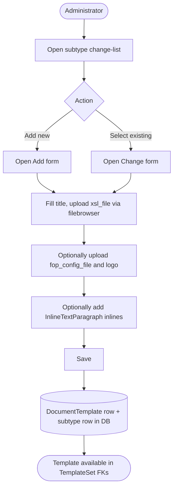

### UC-UEX-01 Admin Sequence — Create Template with Text Paragraphs

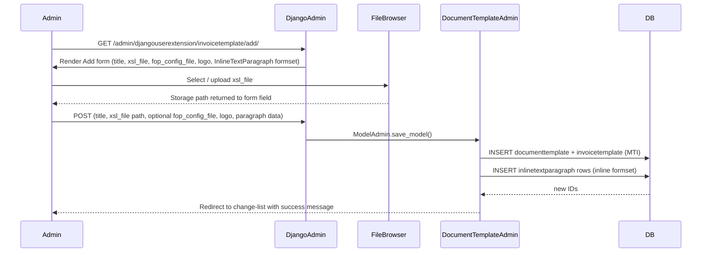

### UC-UEX-01 Alternative Flows

- **Read (list):** The change-list displays columns `id` and `title`, with filters for
  `workspace` and search on `id` and `title`. Each subtype change-list is independent;
  browsing `/admin/djangouserextension/invoicetemplate/` shows only Invoice templates.
- **Update:** Open the change form for an existing record, replace file uploads, edit
  title, add or remove `InlineTextParagraph` inlines, and save. Django replaces the
  stored file path when a new file is selected in the filebrowser widget.
- **Delete:** Use the Admin delete action or the delete button on the change form.
  Deleting a `DocumentTemplate` cascades to its `InlineTextParagraph` rows and
  removes the MTI child row. Any `TemplateSet` that references this template will
  have its FK nulled (or raise an integrity error if the FK is non-nullable — verify
  schema before bulk deleting).
- **No text paragraphs:** All `InlineTextParagraph` inlines are optional. A template
  with only `xsl_file` set is valid and sufficient for PDF rendering.
- **Missing fop_config_file or logo:** These are optional fields. The PDF Export
  Service falls back to defaults baked into the Java service when they are absent.

### UC-UEX-01 Postconditions

- A `DocumentTemplate` parent row and a corresponding subtype row (e.g.
  `InvoiceTemplate`) exist in the database, linked by MTI.
- The template's `xsl_file` storage path is persisted and can be retrieved by the
  PDF Export Service.
- Zero or more `InlineTextParagraph` rows are linked to the template.
- The template is selectable as a FK value in `TemplateSet` forms for its document
  type slot.

### UC-UEX-01 Configuration and Parameterization

| Type | Name | Effect on Use Case |
|------|------|--------------------|
| Configuration | `S3_ENDPOINT_URL` | When set, `TemplateFileStorage` uses MinIO instead of AWS S3 for XSL/FOP file storage. |
| Configuration | `S3_PDF_BUCKET` | The S3 bucket into which template files are uploaded; defaults to `'koalixcrm-pdf-exports'`. |
| Configuration | `AWS_ACCESS_KEY_ID` / `AWS_SECRET_ACCESS_KEY` | Credentials for `TemplateFileStorage` to authenticate with S3 or MinIO. |
| Parameterization | `TemplateFileStorage.location` (`"templates"`) | Hard-coded S3 key prefix for all uploaded template files. |
| Parameterization | `FILEBROWSER_EXTENSIONS` | Fixed set of file types the Grappelli filebrowser accepts; restricts uploads to XML, XSL, JPG, PNG, GIF, TTF. |

See [QQ_SD_Configuration.md](../08_cross_cutting_concepts/QQ_SD_Configuration.md) and [QQ_SD_Parameterization.md](../08_cross_cutting_concepts/QQ_SD_Parameterization.md).

### UC-UEX-01 Access Control

See [QQ_SD_AccessControl.md](../08_cross_cutting_concepts/QQ_SD_AccessControl.md) for the full RBAC model.

- Django Admin access requires `is_staff=True`.
- `WorkspaceScopedModelAdmin` filters the change-list to the active workspace; an
  Administrator sees only templates that belong to workspaces they administer.
- No REST write endpoint exists for this domain; all mutations are Admin-only.

### UC-UEX-01 Notes and References

- MTI persistence: Django writes one row in `documenttemplate` (parent) and one row in
  the subtype table (e.g. `invoicetemplate`) per template. The subtype PK is also a FK
  back to the parent.
- The `xsl_file` field path is what the PDF Export Service reads; ensure the storage
  path is reachable from the Java service at render time.
- For how templates are grouped into named sets, see
  [UC-UEX-02](#uc-uex-02-manage-template-sets).
- For how a template is resolved during PDF rendering, see
  [UC-UEX-05](#uc-uex-05-read-document-template-via-rest-api).

---

## UC-UEX-02: Manage Template Sets

**Actor:** Administrator

**Interface:** Django Admin — `/admin/djangouserextension/templateset/`

### UC-UEX-02 Purpose

Group one `DocumentTemplate` instance of each document type into a named
`TemplateSet`. A `TemplateSet` is referenced by `Contract.default_template_set`,
`UserExtension.default_template_set`, and `Project.default_template_set` so that
the correct XSL stylesheet is selected at PDF render time without per-document
template selection by the end user. Creating and maintaining `TemplateSet` records
is a prerequisite for enabling PDF generation in all parts of the system.

### UC-UEX-02 Preconditions

- The actor is authenticated as a Django staff user (`is_staff=True`).
- The active workspace is selected.
- At least one `DocumentTemplate` subtype record exists for each slot that will be
  populated (all 10 slots are optional FK fields; a partially populated set is valid
  but PDF generation will fail for the missing document types).

### UC-UEX-02 Main Flow

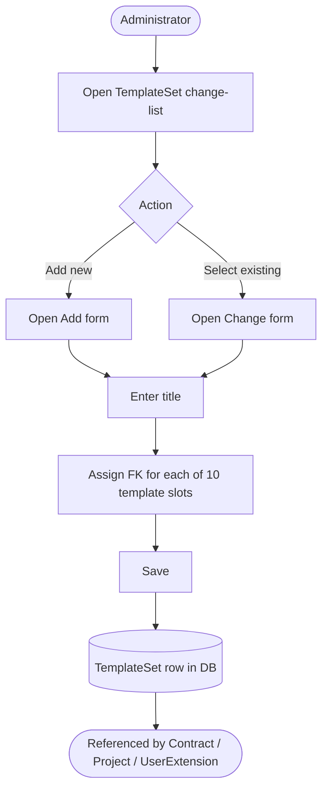

### UC-UEX-02 Admin Sequence — Create TemplateSet

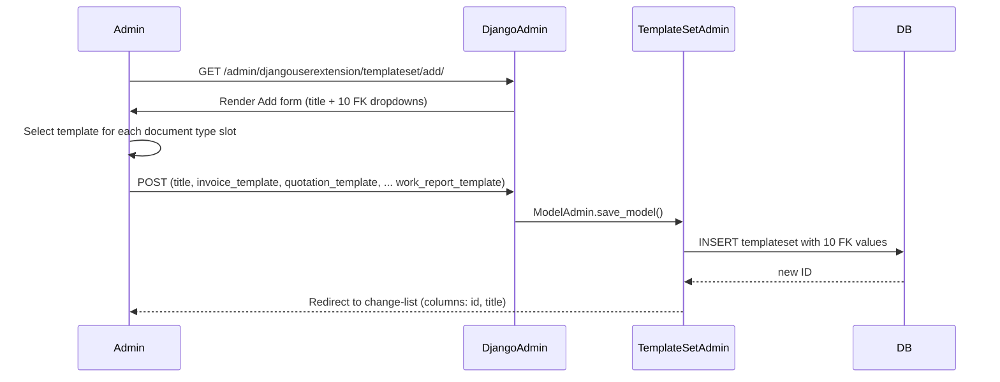

### UC-UEX-02 Alternative Flows

- **Read (list):** The change-list shows columns `id` and `title`. Workspace filter
  is active. An administrator can identify which template sets are configured for
  the active workspace.
- **Update:** Open the change form, modify the `title` or reassign any FK slot, and
  save. Changes take effect immediately for all `Contract`, `Project`, and
  `UserExtension` records that reference this `TemplateSet`.
- **Delete:** Deleting a `TemplateSet` will leave a dangling FK in any
  `Contract`, `Project`, or `UserExtension` that referenced it. Verify referencing
  records before deleting. Django does not automatically null these FKs unless the
  schema is declared with `on_delete=SET_NULL`.
- **Partial set:** Not all 10 template slots must be filled. Rendering a document
  type whose template slot is null will fail at PDF generation time; the system
  should surface an error at that point rather than at `TemplateSet` save time.

### UC-UEX-02 Postconditions

- A `TemplateSet` row exists in the database with a `title` and up to 10 FK
  references to `DocumentTemplate` subtype records.
- `Contract`, `Project`, and `UserExtension` FK dropdowns for `default_template_set`
  now include this `TemplateSet` as a selectable option.

### UC-UEX-02 Configuration and Parameterization

> Cross-reference: see `QQ_SD_Configuration.md` (not yet produced).

- The list of 10 FK slots is fixed by the `TemplateSet` model definition in
  `djangoUserExtension/models.py`. Adding a new document type requires a model
  migration and a corresponding FK field on `TemplateSet`.
- The change-list `list_display` is `(id, title)` and `list_filter` covers
  `workspace`. Search fields cover `id` and `title`.
- The `koalixcrm_install_defaulttemplates` management command seeds a default
  `TemplateSet` during initial setup; see
  [UC-UEX-06](#uc-uex-06-bootstrap-default-templates).

### UC-UEX-02 Access Control

See [QQ_SD_AccessControl.md](../08_cross_cutting_concepts/QQ_SD_AccessControl.md) for the full RBAC model.

- Django Admin access requires `is_staff=True`.
- `WorkspaceScopedModelAdmin` scopes the change-list to the active workspace.
- There is no REST endpoint for `TemplateSet`; all mutations are Admin-only.

### UC-UEX-02 Notes and References

- A `TemplateSet` is the central configuration object for PDF rendering. The PDF
  Export Service receives the XSL file path by first resolving the applicable
  `TemplateSet` and then reading the relevant template's `xsl_file` field.
- For how the PDF Export Service reads the resolved template, see
  [UC-UEX-05](#uc-uex-05-read-document-template-via-rest-api).
- For bootstrapping an initial `TemplateSet` with default XSL files, see
  [UC-UEX-06](#uc-uex-06-bootstrap-default-templates).
- For the `UserExtension` that references a `TemplateSet`, see
  [UC-UEX-03](#uc-uex-03-manage-user-extensions).

---

## UC-UEX-03: Manage User Extensions

**Actor:** Administrator

**Interface:** Django Admin — `/admin/djangouserextension/userextension/`

### UC-UEX-03 Purpose

Associate a Django `User` account with a default `TemplateSet` and a default
`Currency`. A `UserExtension` record is required for any user who will generate
work-report PDFs or for whom the system must resolve a default PDF template set
without an explicit contract or project-level override. When the optional `reporting`
app is installed, `HumanResource` records are linked to the same Django `User` and
the work-report action retrieves `work_report_template` via the user's
`UserExtension.default_template_set`.

### UC-UEX-03 Preconditions

- The actor is authenticated as a Django staff user (`is_staff=True`).
- The active workspace is selected.
- A `TemplateSet` exists to assign (see [UC-UEX-02](#uc-uex-02-manage-template-sets)).
- A `Currency` exists in the system (seeded by `koalixcrm_install_defaulttemplates`
  or created manually in the currency admin).
- The target Django `User` account exists (`auth.User`).

### UC-UEX-03 Main Flow

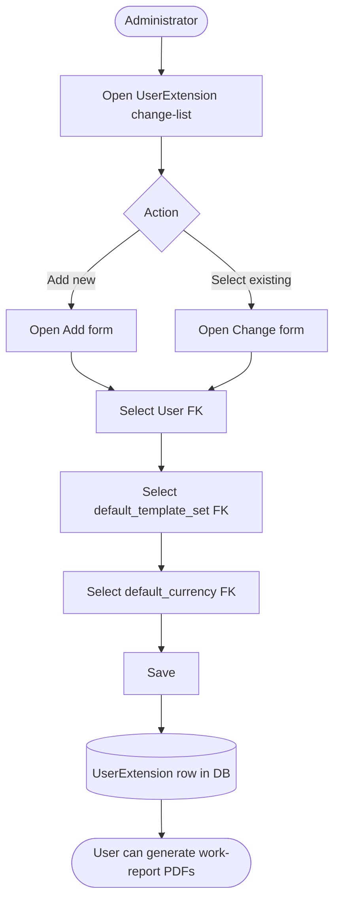

### UC-UEX-03 Admin Sequence — Create UserExtension

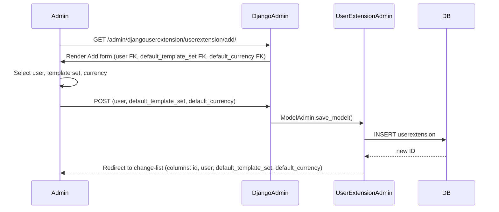

### UC-UEX-03 Alternative Flows

- **Read (list):** The change-list displays `id`, `user`, `default_template_set`, and
  `default_currency`. Workspace filter is applied; search is available on `id`.
- **Update:** Open the change form and reassign the `default_template_set` or
  `default_currency`. The `user` FK is typically immutable after creation (one
  `UserExtension` per `User`).
- **Delete:** Deleting a `UserExtension` removes the record. Any `HumanResource`
  record (in the `reporting` app) linked to the same `User` will lose its implicit
  template resolution path; work-report PDF generation will fail for that user until
  a new `UserExtension` is created.
- **reporting app absent:** When the `reporting` app is not installed, `UserExtension`
  still provides the default template set and currency for the user without the
  `HumanResource` cross-reference.
- **Automated seeding:** The `koalixcrm_install_defaulttemplates` management command
  creates one `UserExtension` for the first Django `User` automatically; see
  [UC-UEX-06](#uc-uex-06-bootstrap-default-templates).

### UC-UEX-03 Postconditions

- A `UserExtension` row links the `User`, a `TemplateSet`, and a `Currency` in the
  active workspace.
- PDF generation actions that resolve templates via the user (e.g. work-report PDF)
  can now look up `UserExtension` by `user` FK and obtain `default_template_set`.
- The `UserExtension` is available as a reference in the `reporting` app's
  `HumanResource` work-report flow.

### UC-UEX-03 Configuration and Parameterization

| Type | Name | Effect on Use Case |
|------|------|--------------------|
| Setting | `UserExtension.default_template_set` | Written by this use case; determines the XSL-FO templates used for all PDF exports triggered by this user. Missing causes `UserExtensionMissing` on export. |
| Setting | `UserExtension.default_currency` | Written by this use case; pre-fills the currency field on new financial documents created by this user. |
| Configuration | `POSTGRES_*` / `DB_CHOICE` | Determines the database backend where `UserExtension` records are persisted. |
| Parameterization | App `optional_peers`: `koalixcrm.djangoUserExtension` | The `contracts` and `accounting` apps list `djangoUserExtension` as an optional peer; its presence enables the `UserExtension`-dependent PDF export paths. |

See [QQ_SD_Configuration.md](../08_cross_cutting_concepts/QQ_SD_Configuration.md), [QQ_SD_Settings.md](../08_cross_cutting_concepts/QQ_SD_Settings.md),
and [QQ_SD_Parameterization.md](../08_cross_cutting_concepts/QQ_SD_Parameterization.md).

### UC-UEX-03 Access Control

See [QQ_SD_AccessControl.md](../08_cross_cutting_concepts/QQ_SD_AccessControl.md) for the full RBAC model.

- Django Admin access requires `is_staff=True`.
- `WorkspaceScopedModelAdmin` scopes the change-list to the active workspace.
- No REST endpoint exists for `UserExtension`; all mutations are Admin-only.
- An Administrator with access to the Admin interface can view and modify the
  `UserExtension` of any user visible in the workspace.

### UC-UEX-03 Notes and References

- One `UserExtension` per Django `User` is the expected cardinality. The model does
  not enforce this with a `unique` constraint on `user`; the Admin interface relies on
  convention and the `koalixcrm_install_defaulttemplates` bootstrap to maintain it.
- For the template set assigned here, see
  [UC-UEX-02](#uc-uex-02-manage-template-sets).
- For the user contact assignments that complement `UserExtension`, see
  [UC-UEX-04](#uc-uex-04-manage-user-contact-information).
- For bootstrap seeding of the initial `UserExtension`, see
  [UC-UEX-06](#uc-uex-06-bootstrap-default-templates).

---

## UC-UEX-04: Manage User Contact Information

**Actor:** Administrator

**Interface:** Django Admin — `/admin/djangouserextension/useraddressassignment/`,
`/admin/djangouserextension/userphoneassignment/`,
`/admin/djangouserextension/useremailassignment/`

### UC-UEX-04 Purpose

Assign postal addresses, phone numbers, and email addresses to individual Django
`User` accounts. These assignments are distinct from Party or contact-level address
assignments (which are documented in the Contacts domain). User-level contact
information is used during PDF document generation to populate sender/author
address blocks and contact details on documents such as invoices, quotations, and
work reports.

Three assignment models cover the three contact information types:

| Model | Admin route |
|---|---|
| `UserAddressAssignment` | `/admin/djangouserextension/useraddressassignment/` |
| `UserPhoneAssignment` | `/admin/djangouserextension/userphoneassignment/` |
| `UserEmailAssignment` | `/admin/djangouserextension/useremailassignment/` |

### UC-UEX-04 Preconditions

- The actor is authenticated as a Django staff user (`is_staff=True`).
- The active workspace is selected.
- The target Django `User` account exists.
- For `UserAddressAssignment`: a postal address record exists in the Contacts domain
  to assign.
- For `UserPhoneAssignment` / `UserEmailAssignment`: corresponding phone/email records
  exist in the Contacts domain to assign.

### UC-UEX-04 Main Flow

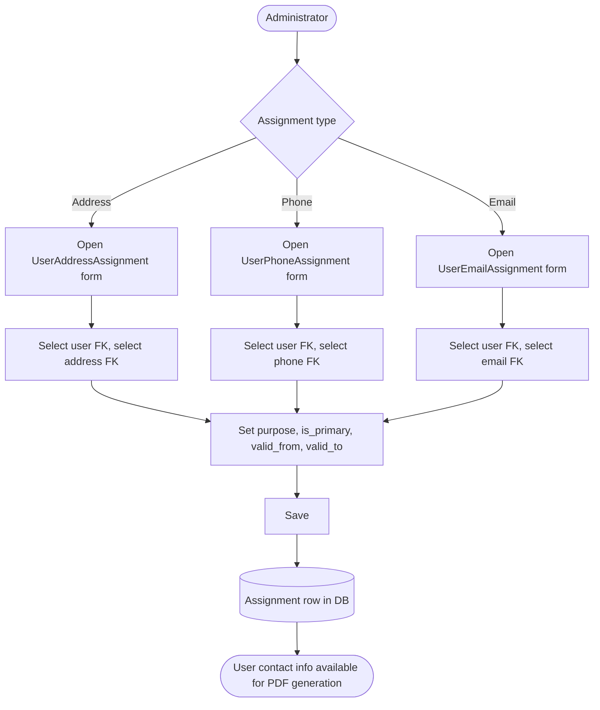

### UC-UEX-04 Admin Sequence — Create UserAddressAssignment

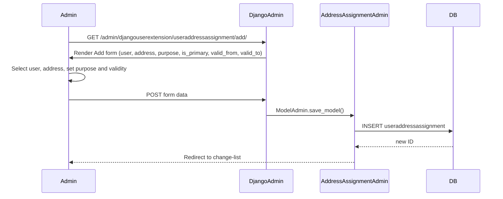

### UC-UEX-04 Alternative Flows

- **Read (list) — UserAddressAssignment:** Change-list displays `id`, `user`,
  `address`, `purpose`, `is_primary`, `valid_from`, and `valid_to`. Filters are
  available for `purpose`, `is_primary`, and `workspace`.
- **Read (list) — UserPhoneAssignment / UserEmailAssignment:** Change-list columns
  and filters follow the same pattern adapted for phone/email fields.
- **Update:** Open the change form, modify purpose, primary flag, or validity dates,
  and save. The `user` FK and the assigned address/phone/email FK can also be
  changed to correct assignment errors.
- **Delete:** Remove the assignment row. The underlying address/phone/email record in
  the Contacts domain is not affected.
- **Multiple assignments per user:** A user may have multiple address assignments
  (e.g. one billing address and one delivery address), distinguished by the `purpose`
  field. The `is_primary` flag marks the default for a given purpose.
- **Validity window:** `valid_from` and `valid_to` define the date range during which
  the assignment is active. Document generation logic should evaluate these dates when
  selecting the appropriate address for a historical document.

### UC-UEX-04 Postconditions

- One or more assignment rows link the `User` to address, phone, or email records
  within the active workspace.
- PDF generation can query these assignments by `user` FK and `purpose` to populate
  sender contact blocks on rendered documents.

### UC-UEX-04 Configuration and Parameterization

> Cross-reference: see `QQ_SD_Configuration.md` (not yet produced).

- `purpose` choices are defined by a choices constant in the model (e.g.
  `ADDRESS_PURPOSE_CHOICES`); the exact choices control which contact-information
  purpose labels appear in Admin dropdowns.
- `is_primary` is a boolean flag; the system does not enforce a uniqueness constraint
  preventing more than one primary assignment per user per purpose — the Admin relies
  on operator discipline.
- `valid_from` / `valid_to` are date fields; the Admin does not enforce that
  `valid_from <= valid_to` at the model level (verify in `clean()` if required).

### UC-UEX-04 Access Control

See [QQ_SD_AccessControl.md](../08_cross_cutting_concepts/QQ_SD_AccessControl.md) for the full RBAC model.

- Django Admin access requires `is_staff=True`.
- `WorkspaceScopedModelAdmin` filters all three change-lists by the active workspace.
- No REST endpoint exists for user contact assignments; all mutations are Admin-only.

### UC-UEX-04 Notes and References

- User contact assignments are distinct from Party-level address/phone/email
  assignments (Contacts domain). The two systems share the same underlying address/
  phone/email reference data models but assign them via separate join tables.
- The separation allows a user's personal document-generation contact details to
  differ from their Party contact record (e.g. a work mobile vs. a personal mobile
  on the Party record).
- For the `UserExtension` record that ties the user to a template set, see
  [UC-UEX-03](#uc-uex-03-manage-user-extensions).

---

## UC-UEX-05: Read Document Template via REST API

**Actor:** CRM User, PDF Export Service

**Interface:** REST API — `/koalixcrm_core/api/v1/<workspace_id>/document-templates/`

### UC-UEX-05 Purpose

Retrieve `DocumentTemplate` metadata — in particular the `xsl_file` storage path,
the `fop_config_file` path, the `logo` path, and associated `InlineTextParagraph`
content — programmatically. The primary consumer is the external PDF Export Service
(Java), which calls this endpoint to resolve the XSL file path before fetching the
file from storage and rendering the PDF with Apache FOP. CRM Users may also call
this endpoint from REST API clients (e.g. custom integrations) to inspect available
templates.

The `DocumentTemplateViewSet` is registered under the core REST router; it is
workspace-scoped via `WorkspaceScopedViewSetMixin`.

### UC-UEX-05 Preconditions

- The caller is authenticated (session cookie or token — depending on the DRF
  authentication classes configured).
- A `workspace_id` path parameter identifies the active workspace.
- At least one `DocumentTemplate` record exists in the workspace.

### UC-UEX-05 Main Flow

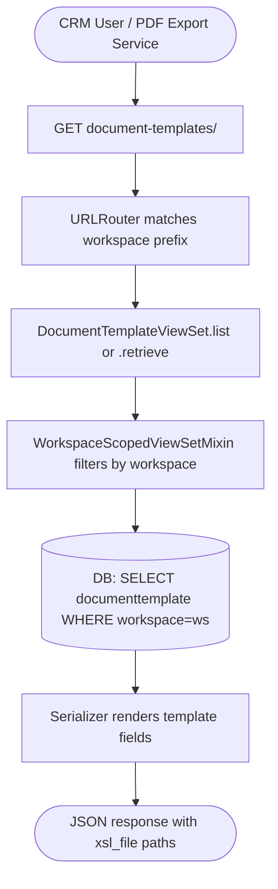

### UC-UEX-05 REST Sequence — Retrieve Template by ID

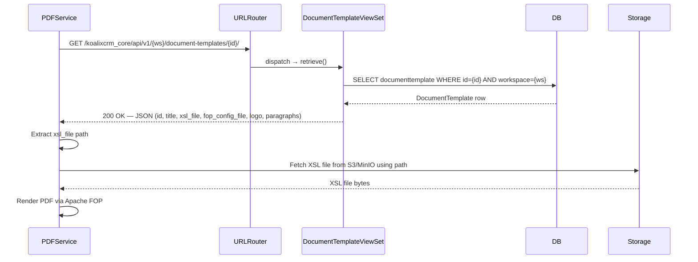

### UC-UEX-05 Alternative Flows

- **List all templates:** `GET /koalixcrm_core/api/v1/{ws}/document-templates/`
  returns all `DocumentTemplate` records in the workspace as a JSON array. All 10
  subtypes share the parent table; the response includes the concrete subtype
  discriminator if serialized.
- **Template not found:** If `{id}` does not exist or belongs to a different workspace,
  the viewset returns `404 Not Found`.
- **Unauthenticated request:** DRF authentication classes return `401 Unauthorized`
  or `403 Forbidden` depending on configuration.
- **Filtering:** If the viewset supports query parameter filtering (e.g.
  `?title=Invoice`), the caller can narrow results without knowing the template ID.
- **Write operations not supported here:** `DocumentTemplateViewSet` is registered
  as a read-oriented endpoint in this domain. Template creation and modification go
  through the Django Admin (see
  [UC-UEX-01](#uc-uex-01-manage-document-templates)).

### UC-UEX-05 Postconditions

- The PDF Export Service has the `xsl_file` path and can fetch the file from storage.
- The caller receives the full template metadata in JSON format; no state change
  occurs in the database.

### UC-UEX-05 Configuration and Parameterization

> Cross-reference: see `QQ_SD_Configuration.md` (not yet produced).

- The REST URL prefix `/koalixcrm_core/api/v1/<workspace_id>/` is registered in the
  core app's `urls.py`; changing the prefix requires updating the core URL
  configuration.
- DRF authentication classes and permission classes for `DocumentTemplateViewSet`
  are configured in `settings.py` (`REST_FRAMEWORK` dict) and optionally overridden
  on the viewset class itself.
- The file storage backend URL (S3/MinIO endpoint) is configured via Django storage
  settings; the `xsl_file` value returned in the JSON is a relative storage key or
  a signed URL depending on the storage backend configuration.

### UC-UEX-05 Access Control

See [QQ_SD_AccessControl.md](../08_cross_cutting_concepts/QQ_SD_AccessControl.md) for the full RBAC model.

- REST API: authenticated users (or service accounts) with membership in the
  workspace can read `DocumentTemplate` records. Unauthenticated requests are
  rejected.
- The PDF Export Service authenticates with a service account credential; this
  credential must have read access to the workspace.
- `WorkspaceScopedViewSetMixin` ensures that only templates belonging to the
  requested workspace are returned, preventing cross-workspace data leakage.

### UC-UEX-05 Notes and References

- This is the only REST endpoint in the User Extensions domain. All write operations
  for templates, template sets, and user extensions go through the Django Admin.
- The PDF Export Service is an external Java process; it is not part of the Django
  monolith. The sequence above (fetch XSL path → fetch file from storage → render)
  is the integration contract between the two systems.
- For the template structure that determines which `xsl_file` is resolved, see
  [UC-UEX-01](#uc-uex-01-manage-document-templates) and
  [UC-UEX-02](#uc-uex-02-manage-template-sets).

---

## UC-UEX-06: Bootstrap Default Templates

**Actor:** Administrator

**Interface:** Django management command — `koalixcrm_install_defaulttemplates`

### UC-UEX-06 Purpose

Seed the system with a complete default configuration for the User Extensions
domain during initial installation or when setting up a fresh workspace. The command
creates: one default `DocumentTemplate` instance (all 10 subtypes) referencing the
bundled XSL files, a default `TemplateSet` grouping all 10 default templates, a
default `Currency`, and a default `UserExtension` for the first Django `User`.
Running this command is the recommended starting point before any PDF generation
can be tested or used in production.

### UC-UEX-06 Preconditions

- Django is installed and the database migrations have been applied
  (`python manage.py migrate`).
- At least one Django `User` account exists (the command targets the first user).
- The bundled default XSL files are present in the expected location within the
  application's static or media storage (the exact path is configured in the command
  implementation).
- The administrator has shell access to the Django application server or the
  container running the Django process.

### UC-UEX-06 Main Flow

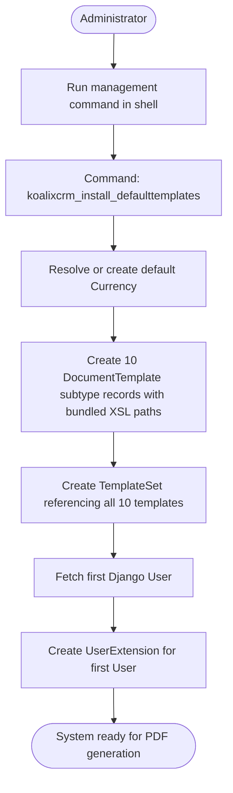

### UC-UEX-06 Command Sequence — Full Bootstrap

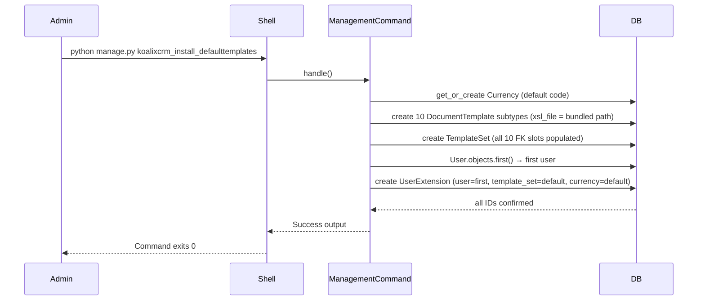

### UC-UEX-06 Alternative Flows

- **Re-run on existing data:** If default records already exist, the command may use
  `get_or_create` semantics to avoid duplicates, or it may raise an error if unique
  constraints are violated. The exact behavior depends on the command implementation;
  check the source before running on a live system.
- **No users exist:** If `User.objects.first()` returns `None`, the command cannot
  create a `UserExtension` and will either skip that step with a warning or raise an
  exception. Create at least one superuser with `createsuperuser` before running the
  bootstrap command.
- **Custom XSL files:** After running the command, the Administrator can update
  individual `DocumentTemplate` records via the Admin to replace the bundled default
  XSL files with organization-specific stylesheets (see
  [UC-UEX-01](#uc-uex-01-manage-document-templates)).
- **Additional users:** The command creates a `UserExtension` only for the first user.
  Additional users require manual `UserExtension` creation via the Admin
  (see [UC-UEX-03](#uc-uex-03-manage-user-extensions)).
- **Already configured workspace:** If run against a workspace that already has a
  full `TemplateSet` and `UserExtension`, it is safe to skip or the operator should
  review the command output carefully to avoid overwriting customized templates.

### UC-UEX-06 Postconditions

- One `Currency` record exists (created or pre-existing).
- Ten `DocumentTemplate` subtype rows exist, each with a bundled default XSL file
  path.
- One `TemplateSet` exists with all 10 template FK slots populated.
- One `UserExtension` exists for the first Django `User`, referencing the default
  `TemplateSet` and `Currency`.
- The system is ready for PDF generation without further template configuration.

### UC-UEX-06 Configuration and Parameterization

> Cross-reference: see `QQ_SD_Configuration.md` (not yet produced).

- The bundled XSL file paths are hardcoded or configured as constants within the
  management command (`koalixcrm/djangoUserExtension/management/commands/
  koalixcrm_install_defaulttemplates.py`).
- The default currency code (e.g. `CHF`) is set as a constant in the command; change
  it before running if the deployment uses a different base currency.
- The command respects Django's `DEFAULT_FILE_STORAGE` setting for placing bundled
  XSL files into storage; ensure storage is writable at command execution time.

### UC-UEX-06 Access Control

See [QQ_SD_AccessControl.md](../08_cross_cutting_concepts/QQ_SD_AccessControl.md) for the full RBAC model.

- The command runs in the Django management command context, which requires shell
  access to the server or container. It is not accessible via the web interface.
- Only operators with shell access (DevOps, system administrators) should run this
  command. It modifies the database directly and bypasses all web-layer permission
  checks.
- In production environments, restrict shell access to the Django application
  container to authorized personnel only.

### UC-UEX-06 Notes and References

- This command is the fastest path to a working PDF generation setup. It is safe
  to run as part of the container entrypoint or a post-deployment hook for fresh
  installations.
- For updating individual templates after initial bootstrap, see
  [UC-UEX-01](#uc-uex-01-manage-document-templates).
- For creating additional `TemplateSet` configurations (e.g. per-client branding),
  see [UC-UEX-02](#uc-uex-02-manage-template-sets).
- For adding `UserExtension` records for additional users, see
  [UC-UEX-03](#uc-uex-03-manage-user-extensions).

---
