# Use Cases: Workspace & Authentication

This document covers all use cases in the **Workspace & Authentication** domain.
The domain spans identity verification, multi-tenant workspace selection, role
management, and the background and REST API authentication paths that depend on the
same OIDC and session infrastructure.

## System Actors

| Actor | Kind | Interface |
|---|---|---|
| CRM User | Human | Browser (Django Admin / Grappelli) or REST API |
| Administrator | Human | Django Admin interface or management command CLI |
| Celery Worker | Automated background service | REST API (M2M Bearer JWT) |
| PDF Export Service | External Java service | REST API (M2M Bearer JWT) |

---

## UC-WA-01 Login via OIDC

**Actor.** Administrator, CRM User.

**Interface.** Browser — Django Admin protected by the `LoginRequiredMixin`
or Grappelli redirect to `/auth/login/`.

**Purpose.** Establish an authenticated Django session so the user can access the
Admin interface and workspace-scoped data. The primary path uses the OIDC
Authorization Code Flow with PKCE against a Keycloak-compatible Identity Provider.
When OIDC is not configured, the system falls back to the Django username/password
login form served at the same URL.

### Preconditions

- The browser is not authenticated (no valid Django session cookie).
- At least one `OIDC_PROVIDER` entry is present in settings (primary path), or
  Django's built-in `ModelBackend` is enabled (fallback path).
- The Identity Provider (Keycloak) is reachable and the client ID / client secret
  are configured.

### Main Flow — OIDC Authorization Code Flow

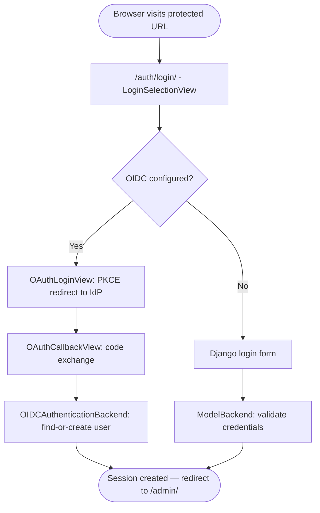

Figure 1 — Login decision tree: OIDC primary path and Django form fallback

### Sequence Diagram — OIDC Primary Path

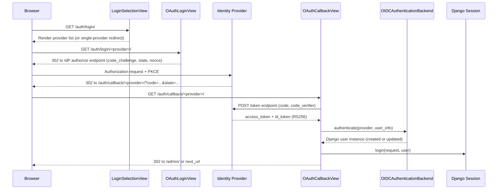

Figure 2 — OIDC Authorization Code Flow with PKCE (browser login)

### Alternative Flow — Django Form Fallback

When `OIDC_PROVIDER` is absent or empty, `LoginSelectionView` renders the standard
Django authentication form instead of a provider list. The user submits their
username and password. Django's `ModelBackend` validates the credentials against
`auth_user`. On success, `django.contrib.auth.login` creates the session identically
to the OIDC path. No redirect to an external IdP takes place.

### Postconditions

- A Django session cookie is set in the browser.
- `request.user` resolves to the authenticated `User` instance on all subsequent
  requests within the session lifetime.
- The user's last login timestamp is updated.

### Configuration / Settings / Parameterization

| Type | Name | Effect on Use Case |
|------|------|--------------------|
| Configuration | `ADMIN_OIDC_ISSUER` | When set, the login view redirects to the OIDC provider; when absent, the Django username/password form is used as fallback. |
| Configuration | `ADMIN_OIDC_CLIENT_ID` | OAuth client identifier sent to the IdP during the Authorization Code flow. |
| Configuration | `ADMIN_OIDC_CLIENT_SECRET` | Client secret used in the token exchange request (`client_secret_post`). |
| Configuration | `SITE_URL` | Used to construct the OAuth redirect URI (`redirect_uri`); when absent, derived from the request (may be incorrect behind a reverse proxy). |
| Configuration | `DJANGO_SECRET_KEY` | Signs the Django session cookie; a weak or default key compromises session integrity. |
| Parameterization | JWT algorithm `RS256` | Enforces asymmetric signature validation on all OIDC tokens; hard-coded in `koalixcrm/auth/oidc_utils.py`. |
| Parameterization | OAuth scope `'openid profile email'` | Fixed set of scopes requested during the Authorization Code flow; hard-coded in `koalixcrm/auth/oidc_views.py`. |
| Parameterization | OAuth PKCE method `'S256'` | Hard-coded code-challenge method; must match IdP client configuration. |
| Parameterization | `AUTHENTICATION_BACKENDS` | Fixed list ordering (`OIDCAuthenticationBackend` → `ModelBackend`); OIDC path is tried first. |

See [QQ_SD_Configuration.md](../08_cross_cutting_concepts/QQ_SD_Configuration.md) for the full configuration key reference
and [QQ_SD_Parameterization.md](../08_cross_cutting_concepts/QQ_SD_Parameterization.md) for the full parameterization inventory.

### Access Control

See [QQ_SD_AccessControl.md](../08_cross_cutting_concepts/QQ_SD_AccessControl.md)
for the full authentication model.

| Required Role(s) | Required Permission(s) | Access Control Effect |
|---|---|---|
| None (public entry point) | None | This use case establishes the authenticated identity. Downstream workspace-level checks depend on the session created here. Non-staff users are logged out with HTTP 403 when they attempt to access an `/admin` URL after callback. |

### Notes and References

- `LoginSelectionView` is implemented in `koalixcrm/auth/oidc_views.py`.
- `OAuthLoginView` and `OAuthCallbackView` use the `authlib` `django_client.OAuth`
  instance registered at module import time.
- `OIDCAuthenticationBackend` applies three fallback strategies to extract user info
  from the token response before calling `find_or_create_user`.
- The `authlib` `OAuth` instance is a module-level singleton; each horizontally
  scaled process holds its own copy of the static configuration.
- See [QQ_ML_Doc_Auth.md](../05_building_block_view/koalixcrm/auth/QQ_ML_Doc_Auth.md)
  for the full component interaction diagram and class relationships.

---

## UC-WA-02 Logout

**Actor.** Administrator, CRM User.

**Interface.** Browser — navigates to `/auth/logout/` or clicks a logout control
in the Grappelli header.

**Purpose.** Terminate the Django session and, when OIDC was used to authenticate,
redirect the browser to the Identity Provider's end-session endpoint so the IdP
session is also revoked. This prevents the user from being silently re-logged in
via the IdP's SSO cookie on the next visit.

### Preconditions

- The user holds a valid Django session (is authenticated).

### Main Flow

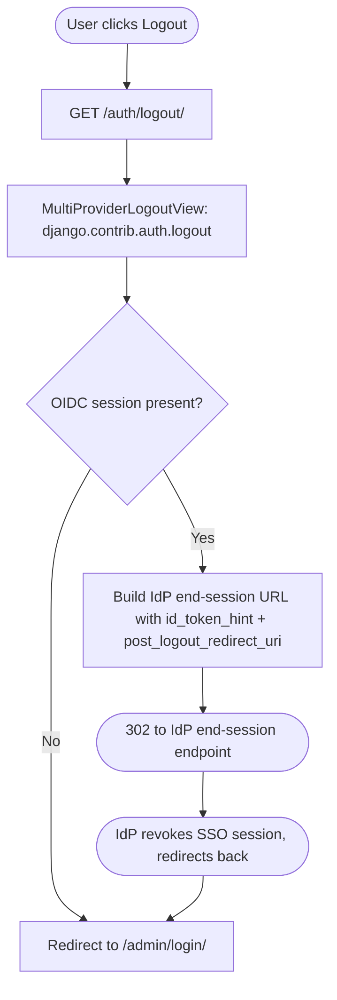

Figure 3 — Logout flow with OIDC end-session redirect

### Postconditions

- The Django session is deleted server-side and the session cookie is cleared.
- The IdP session is revoked (primary path), preventing silent re-authentication.
- The browser is redirected to the Admin login page.

### Configuration / Settings / Parameterization

| Type | Name | Effect on Use Case |
|------|------|--------------------|
| Configuration | `ADMIN_OIDC_ISSUER` | When set, `MultiProviderLogoutView` fetches the IdP `end_session_endpoint` and redirects the browser there; when absent, redirects directly to the admin login page. |
| Configuration | `ADMIN_OIDC_CLIENT_ID` | Appended as `client_id` parameter to the IdP end-session redirect URL. |
| Configuration | `SITE_URL` | Used to construct the `post_logout_redirect_uri` returned to the IdP after federated logout. |
| Parameterization | `OIDC_DISCOVERY_CACHE_TIMEOUT` (3600 s) | The discovery document (which contains `end_session_endpoint`) is cached for this duration; IdP endpoint URL changes take up to 1 hour to propagate. |

See [QQ_SD_Configuration.md](../08_cross_cutting_concepts/QQ_SD_Configuration.md) and [QQ_SD_Parameterization.md](../08_cross_cutting_concepts/QQ_SD_Parameterization.md).

### Access Control

See [QQ_SD_AccessControl.md](../08_cross_cutting_concepts/QQ_SD_AccessControl.md)
for the full authentication model.

| Required Role(s) | Required Permission(s) | Access Control Effect |
|---|---|---|
| Any authenticated user | None | No workspace role is required. Any authenticated user may terminate their own session. The local Django session is destroyed before the federated IdP redirect. |

### Notes and References

- `MultiProviderLogoutView` is implemented in `koalixcrm/auth/oidc_views.py`.
- Django's `logout()` is called before the IdP redirect to ensure the local session
  is destroyed even if the IdP redirect fails or the browser blocks the redirect.

---

## UC-WA-03 Switch Active Workspace

**Actor.** Administrator, CRM User.

**Interface.** Browser — Django Admin workspace header band (rendered by
`workspace_header.html`) or the Grappelli dashboard workspace switcher module
(`workspace_switcher.html`). Both submit a POST request to
`/admin/core/workspace/switch/`.

**Purpose.** Change the tenant context of the current session to a different
workspace. All subsequent Admin pages and REST API calls (for the same session) will
be scoped to the newly selected workspace. The switch is gated on the user holding
a `RoleInWorkspace` record for the target workspace.

### Preconditions

- The user is authenticated (has a valid Django session).
- The target workspace is active (`is_active=True`).
- The user belongs to at least one Django auth `Group` that has a `RoleInWorkspace`
  entry linking that `Group` to the target workspace.

### Main Flow

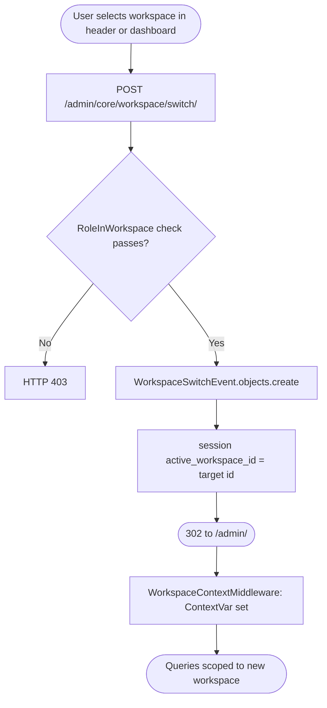

Figure 4 — Workspace switch: authorization check, audit event, session write, and
middleware activation on the subsequent request

### Sequence Diagram

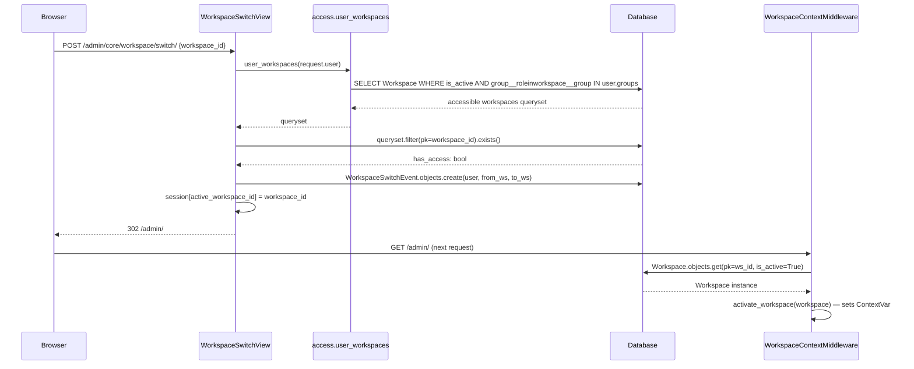

Figure 5 — Workspace switch sequence: authorization check, audit event, session
update, and middleware activation

### Postconditions

- `session['active_workspace_id']` contains the new workspace primary key.
- A `WorkspaceSwitchEvent` audit record exists linking the user, the previous
  workspace, and the new workspace.
- `WorkspaceContextMiddleware` sets the `ContextVar` on the immediately following
  request, making `WorkspaceAwareManager` querysets return only objects belonging to
  the new workspace.
- `request.active_workspace` is the new `Workspace` instance for the remainder of
  that request.

### Configuration / Settings / Parameterization

| Type | Name | Effect on Use Case |
|------|------|--------------------|
| Setting | `active_workspace_id` (session) | Session key that stores the user's selected workspace; written by this use case. Absent on first login — `WorkspaceContextMiddleware` then picks the lowest-pk accessible workspace as default. |
| Parameterization | `MIDDLEWARE` list / `WorkspaceContextMiddleware` | Middleware must be positioned after `AuthenticationMiddleware` in the fixed `MIDDLEWARE` list; its position determines that workspace resolution runs on every request following authentication. |

See [QQ_SD_Configuration.md](../08_cross_cutting_concepts/QQ_SD_Configuration.md), [QQ_SD_Settings.md](../08_cross_cutting_concepts/QQ_SD_Settings.md),
and [QQ_SD_Parameterization.md](../08_cross_cutting_concepts/QQ_SD_Parameterization.md).

### Access Control

See [QQ_SD_AccessControl.md](../08_cross_cutting_concepts/QQ_SD_AccessControl.md)
for the full RBAC model and workspace isolation details.

| Required Role(s) | Required Permission(s) | Access Control Effect |
|---|---|---|
| Any `RoleInWorkspace` in the target workspace | None (checked via `user_workspaces()`) | `access.user_workspaces(user)` filters the `RoleInWorkspace` join table; only workspaces where the user's groups hold a role are accessible. Superusers bypass the check and have access to all active workspaces. HTTP 403 is returned for any attempt to switch to an inaccessible workspace. |

### Notes and References

- `WorkspaceSwitchView` is implemented in
  `koalixcrm/core/views/workspace_switch.py`.
- The audit model `WorkspaceSwitchEvent` is defined in `koalixcrm/core/models/`.
- The `WorkspaceContextMiddleware` implementation detail and the ContextVar-based
  isolation pattern are documented in
  [QQ_ML_Doc_Core.md](../05_building_block_view/koalixcrm/core/QQ_ML_Doc_Core.md).
- The workspace header band template is at
  `koalixcrm/core/templates/admin/workspace_header.html`; the dashboard module at
  `koalixcrm/core/templates/admin/dashboard/workspace_switcher.html`.

---

## UC-WA-04 Manage Workspaces (Admin CRUD)

**Actor.** Administrator.

**Interface.** Django Admin — change-list at `/admin/core/workspace/` and
change-form at `/admin/core/workspace/<id>/change/`.

**Purpose.** Create, read, update, and deactivate `Workspace` records. A workspace
is the top-level tenant container; all business objects (contacts, contracts,
reporting entries) belong to exactly one workspace via `WorkspaceScopedModel`. The
Administrator controls the workspace lifecycle, including its display name,
associated organisation, accent colour, and active/inactive status.

### Preconditions

- The Administrator is authenticated with Django superuser privileges or holds the
  `ADMIN` role in at least one workspace (for read; write requires superuser or
  object-level permission if CR-10 is implemented).

### Main Flow

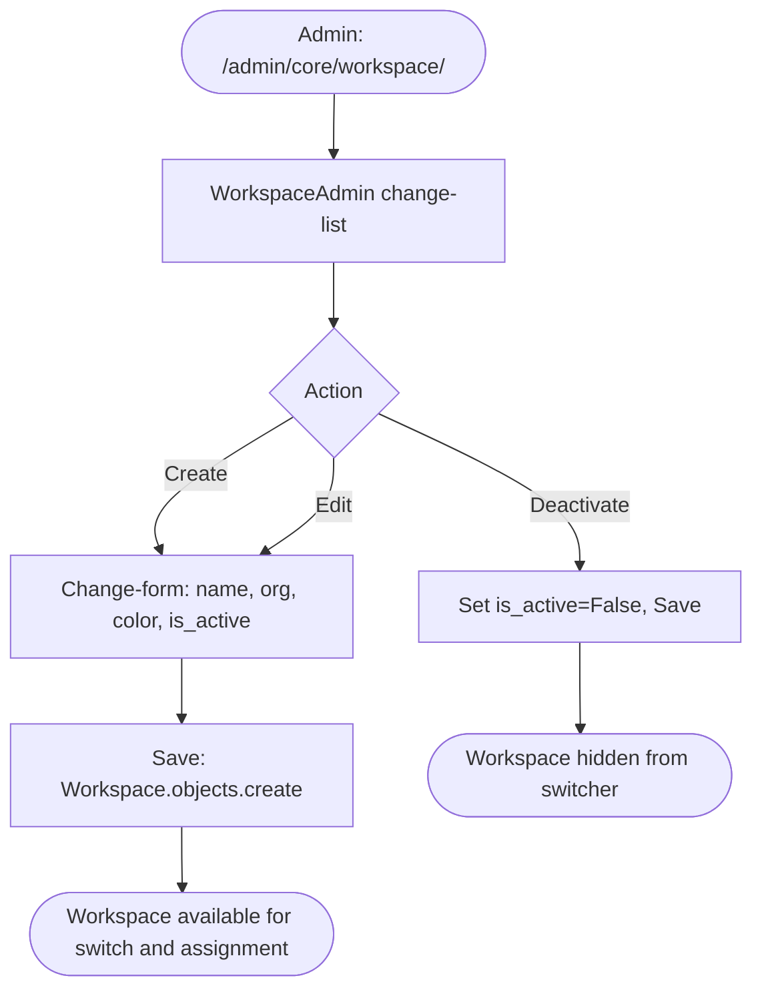

Figure 6 — Workspace CRUD flow in Django Admin

### Key Fields

| Field | Description |
|---|---|
| `name` | Human-readable workspace label shown in the header band and switcher |
| `organization` | FK to `contacts.Organization`; the legal entity owning this workspace |
| `color` | Hex accent colour applied to the workspace header band on every Admin page |
| `is_active` | Boolean; inactive workspaces are excluded from `user_workspaces` queries and the switcher |
| `external_workspace_reference` | Opaque string for integration with external systems |
| `date_added` | Auto-set timestamp; displayed in the change-list |

### Postconditions

- On create: the new `Workspace` row is persisted; it becomes available in the
  workspace switcher for any user who has a `RoleInWorkspace` entry for it.
- On deactivation: `WorkspaceAwareManager` excludes the workspace from all scoped
  queries; existing data is retained but not visible through normal application paths.

### Configuration / Settings / Parameterization

| Type | Name | Effect on Use Case |
|------|------|--------------------|
| Parameterization | `Workspace.color` (hex field) | Per-workspace hex color code configured in this form; applied by the workspace header template as a visual cue to prevent workspace mix-ups. |
| Configuration | `POSTGRES_*` / `DB_CHOICE` | Determines the database backend that persists `Workspace` records. |

See [QQ_SD_Configuration.md](../08_cross_cutting_concepts/QQ_SD_Configuration.md) and [QQ_SD_Parameterization.md](../08_cross_cutting_concepts/QQ_SD_Parameterization.md).

### Access Control

See [QQ_SD_AccessControl.md](../08_cross_cutting_concepts/QQ_SD_AccessControl.md)
for the full authorization model.

| Required Role(s) | Required Permission(s) | Access Control Effect |
|---|---|---|
| Django Admin staff (`is_staff=True`) | `core.add_workspace`, `core.change_workspace` | Only staff users can create or modify workspace records via the Admin. Workspace deactivation (`is_active=False`) removes the workspace from all user switchers immediately. |

### Notes and References

- The `WorkspaceAdmin` class is registered in `koalixcrm/core/admin/`.
- See [QQ_ML_Doc_Core.md](../05_building_block_view/koalixcrm/core/QQ_ML_Doc_Core.md)
  for the `Workspace` model field and manager documentation.
- Workspace deactivation is a soft-delete: the row remains and all FK references
  from business objects are preserved, but `is_active=False` removes the workspace
  from all active UI paths.

---

## UC-WA-05 Manage Role Assignments (Admin CRUD)

**Actor.** Administrator.

**Interface.** Django Admin — change-list at `/admin/core/roleinworkspace/` and
change-form at `/admin/core/roleinworkspace/<id>/change/`.

**Purpose.** Assign Django auth `Group` objects to `Workspace` records at a named
`Role` level. This is the primary RBAC configuration act: adding a `RoleInWorkspace`
row grants every member of the nominated `Group` the specified role within the
specified workspace. Removing or changing the row immediately alters the access
check performed by `access.user_workspaces` and `access.effective_roles`.

### Preconditions

- The Administrator is authenticated with Django Admin access.
- The target `Group` and `Workspace` already exist.

### Main Flow

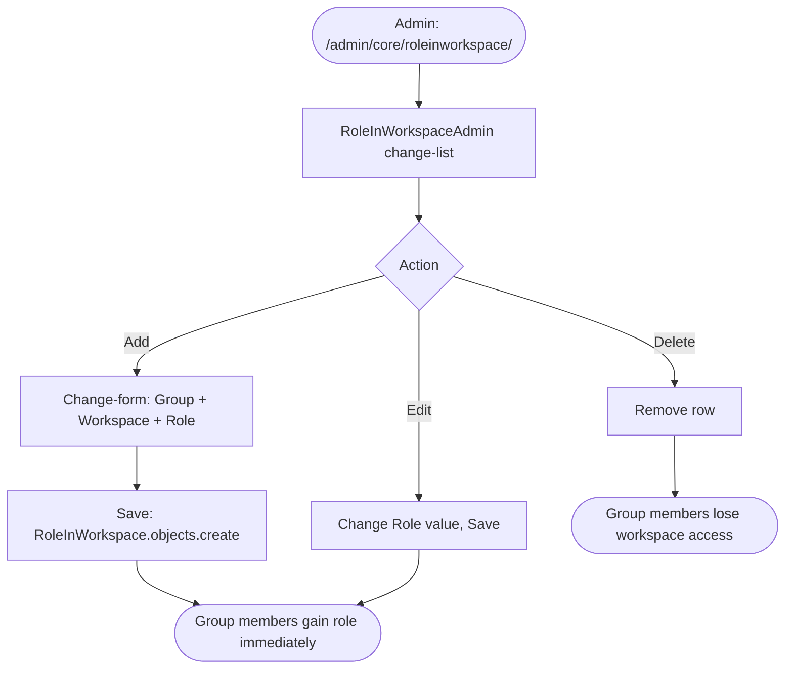

Figure 7 — RoleInWorkspace CRUD: assigning and revoking workspace roles

### Role Values

| Role | Intended Capability Level |
|---|---|
| `ADMIN` | Full read/write within the workspace, including workspace-level configuration |
| `EDITOR` | Create and modify business objects |
| `VIEWER` | Read-only access to business objects |
| `COMMENTER` | Read plus add comments (domain-specific extension point) |
| `EMPLOYEE` | Access to own time-reporting and task records |
| `LINE_MANAGER` | Access to team time-reporting and resource agreements |
| `PROJECT_MANAGER` | Full project and reporting access within the workspace |

### Postconditions

- The `RoleInWorkspace` row is persisted; `access.user_workspaces` reflects the
  change immediately on the next request (no cache flush required — the query is
  executed per-request via the ORM).
- `access.effective_roles(user, obj)` returns the updated role set for any object
  belonging to the modified workspace, affecting permission checks in
  `WorkspaceScopedModelAdmin`.

### Configuration / Settings / Parameterization

| Type | Name | Effect on Use Case |
|------|------|--------------------|
| Configuration | `POSTGRES_*` / `DB_CHOICE` | Determines the database backend that persists `RoleInWorkspace` records. Changes take effect immediately on the next request because `user_workspaces` issues a fresh ORM query per request. |

See [QQ_SD_Configuration.md](../08_cross_cutting_concepts/QQ_SD_Configuration.md) and [QQ_SD_Parameterization.md](../08_cross_cutting_concepts/QQ_SD_Parameterization.md).

### Access Control

See [QQ_SD_AccessControl.md](../08_cross_cutting_concepts/QQ_SD_AccessControl.md)
for the full RBAC model.

| Required Role(s) | Required Permission(s) | Access Control Effect |
|---|---|---|
| Django Admin staff (`is_staff=True`) | `core.add_roleinworkspace`, `core.change_roleinworkspace`, `core.delete_roleinworkspace` | Editing `RoleInWorkspace` records is the primary RBAC configuration act; changes take effect immediately on the next request (no cache flush required). Only superusers or users explicitly granted these model permissions should have access. |

### Notes and References

- The `RoleInWorkspaceAdmin` class is registered in `koalixcrm/core/admin/`.
- The RBAC query functions `effective_roles` and `user_workspaces` are defined in
  `koalixcrm/core/access.py`.
- See [QQ_ML_Doc_Core.md](../05_building_block_view/koalixcrm/core/QQ_ML_Doc_Core.md)
  for the RBAC pattern description and the `RoleInWorkspace` model fields.

---

## UC-WA-06 Initialize Default Templates (Admin CLI)

**Actor.** Administrator.

**Interface.** Management command CLI — `python manage.py koalixcrm_install_defaulttemplates`.

**Purpose.** Bootstrap a freshly installed koalixCRM instance with a complete,
working set of default data: a default workspace, a default currency, default XSL
document templates (invoices, quotations, purchase orders, etc.), a default template
set, and a default user extension including a postal address and contact details.
This command is idempotent in design — re-running it on an already-seeded database
will not create duplicates, because it uses `get_or_create` semantics throughout.

### Preconditions

- Django migrations have been applied (`manage.py migrate`).
- The `filebrowser` media root is accessible and writable (XSL files are copied
  there).
- The optional `koalixcrm.accounting` app, if installed, must also be migrated
  (the command conditionally seeds accounting XSL files when the app is present).

### Main Flow

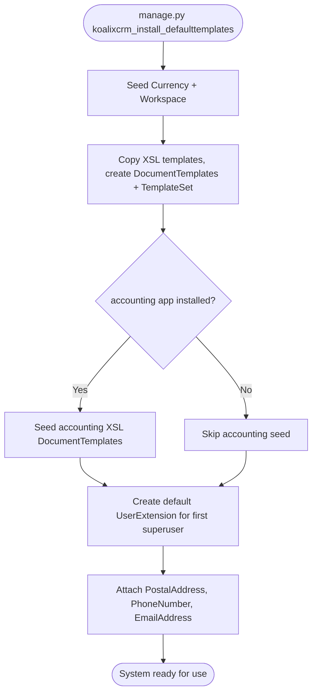

Figure 8 — koalixcrm_install_defaulttemplates seed sequence

### Seeded Objects

| Object Type | Description |
|---|---|
| `Currency` | Swiss Franc (CHF) as the default currency |
| `Workspace` | A single default workspace scoping all seeded reference data |
| `DocumentTemplate` | One record per XSL file; covers invoices, quotations, sales orders, purchase orders, despatch advices, work reports, and project reports in German and English |
| `TemplateSet` | A default set grouping all seeded `DocumentTemplate` records |
| `UserExtension` | Extended profile attached to the first superuser account |
| `PostalAddress` | Placeholder postal address linked to the `UserExtension` |
| `PhoneNumber` | Placeholder phone number linked to the `UserExtension` |
| `EmailAddress` | Placeholder email address linked to the `UserExtension` |

### Postconditions

- All seeded objects exist in the database; the system can render PDF documents
  using the default XSL templates without any additional configuration.
- The first superuser has a usable `UserExtension` and can generate PDF documents
  immediately after login.

### Configuration / Settings / Parameterization

| Type | Name | Effect on Use Case |
|------|------|--------------------|
| Configuration | `STATIC_ROOT` / `MEDIA_ROOT` (via `base_settings.py`) | Controls where the management command reads XSL source files and writes them to the media root. |
| Parameterization | `FILEBROWSER_DIRECTORY` (`'uploads/'`) | The subdirectory within `MEDIA_ROOT` targeted by the filebrowser; XSL templates are copied here. |
| Parameterization | App `optional_peers` for `koalixcrm.accounting` | The command conditionally seeds accounting XSL templates only when `koalixcrm.accounting` is in `INSTALLED_APPS`. |

See [QQ_SD_Configuration.md](../08_cross_cutting_concepts/QQ_SD_Configuration.md) and [QQ_SD_Parameterization.md](../08_cross_cutting_concepts/QQ_SD_Parameterization.md).

### Access Control

See [QQ_SD_AccessControl.md](../08_cross_cutting_concepts/QQ_SD_AccessControl.md).

| Required Role(s) | Required Permission(s) | Access Control Effect |
|---|---|---|
| System operator (OS-level access) | Database write access and file-system write access to `MEDIA_ROOT` | The management command runs outside the Django permission model. No workspace role or model permission is evaluated. |

### Notes and References

- Command source:
  `koalixcrm/core/management/commands/koalixcrm_install_defaulttemplates.py`.
- See [QQ_SD_EntryPoints.md](../03_system_scope_and_context/QQ_SD_EntryPoints.md)
  for the full management command inventory.
- The companion command `sync_split_migrations` reconciles legacy migration history
  and should be run once after upgrading from a pre-split schema; it does not seed
  any business data.

---

## UC-WA-07 Set Display Timezone

**Actor.** CRM User.

**Interface.** Browser — the timezone selection form rendered at
`/koalixcrm/crm/reporting/set_timezone/` (served by
`koalixcrm/core/views/set_timezone.py`, template
`koalixcrm/core/templates/crm/admin/set_timezone.html`).

**Purpose.** Allow the CRM User to specify the timezone in which all datetimes are
displayed for their current session. The selection is persisted in the Django session
key `django_timezone`. The `TimezoneMiddleware` reads this key on every subsequent
request and activates the corresponding `zoneinfo.ZoneInfo` instance so that Django's
template `|date` and `|time` filters, as well as any explicit `localtime()` calls,
produce output in the user's local time.

### Preconditions

- The user is authenticated (has a valid Django session).
- `TimezoneMiddleware` is active in the `MIDDLEWARE` list.

### Main Flow

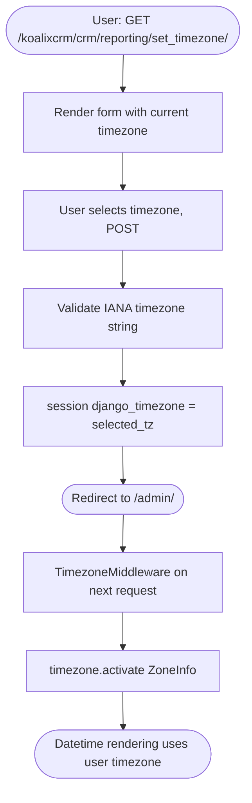

Figure 9 — Timezone selection: session write and middleware activation

### Postconditions

- `session['django_timezone']` contains the IANA timezone identifier chosen by
  the user.
- All subsequent datetime rendering in the session uses the selected timezone.
- The change is per-session; it does not affect other users and resets to the server
  default when the session expires.

### Configuration / Settings / Parameterization

| Type | Name | Effect on Use Case |
|------|------|--------------------|
| Setting | `django_timezone` (session key) | Written by this use case. Read by `TimezoneMiddleware` on every subsequent request. Absent means the system `TIME_ZONE` is used. |
| Parameterization | `TIME_ZONE = 'UTC'` (base_settings) | System-level timezone fallback applied when `django_timezone` is not set in the session. |
| Parameterization | `MIDDLEWARE` list / `TimezoneMiddleware` | Middleware must be present and correctly positioned; its absence means the session preference is never applied. |

See [QQ_SD_Configuration.md](../08_cross_cutting_concepts/QQ_SD_Configuration.md), [QQ_SD_Settings.md](../08_cross_cutting_concepts/QQ_SD_Settings.md),
and [QQ_SD_Parameterization.md](../08_cross_cutting_concepts/QQ_SD_Parameterization.md).

### Access Control

See [QQ_SD_AccessControl.md](../08_cross_cutting_concepts/QQ_SD_AccessControl.md).

| Required Role(s) | Required Permission(s) | Access Control Effect |
|---|---|---|
| Any authenticated user | None | Any authenticated user may update their own session timezone. No workspace role is required. The setting is per-session and does not affect other users. |

### Notes and References

- `TimezoneMiddleware` is implemented in `koalixcrm/core/middleware/`.
- The view `set_timezone` is implemented in `koalixcrm/core/views/set_timezone.py`.
- See [QQ_UI_Doc_CoreAdminScreens.md](../08_cross_cutting_concepts/QQ_UI_Doc_CoreAdminScreens.md)
  for the rendered form screen documentation.

---

## UC-WA-08 Authenticate via REST API

**Actor.** CRM User (user-facing access token), Celery Worker, PDF Export Service
(M2M Client Credentials token).

**Interface.** REST API endpoints under
`/koalixcrm_core/api/v1/<workspace_id>/` and the other app-level API prefixes. All
endpoints are protected by DRF's authentication chain.

**Purpose.** Authenticate programmatic callers — human users accessing the API
directly and automated services — so that DRF views can authorize the request and
scope database queries to the correct workspace. Two distinct token types are
supported: user-facing Bearer JWTs from the OIDC provider (validated by
`OIDCAccessTokenAuthentication`) and M2M Client Credentials JWTs for service-to-service
calls (validated by `CeleryWorkerM2MAuthentication`). Session and Basic authentication
are also active in the chain for development convenience.

### Preconditions

- The caller holds a valid Bearer JWT (obtained from the OIDC provider's token
  endpoint).
- For M2M callers: the `client_id` in the token matches a known service account; a
  `User` record exists or will be created on first contact.
- The target workspace is active and, for user tokens, the user holds a
  `RoleInWorkspace` entry in the target workspace.

### Main Flow — User Bearer JWT

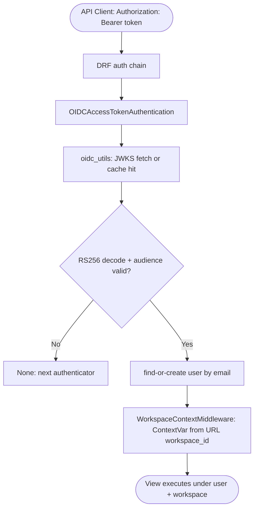

Figure 10 — REST API user Bearer JWT authentication chain

### Sequence Diagram — M2M Client Credentials

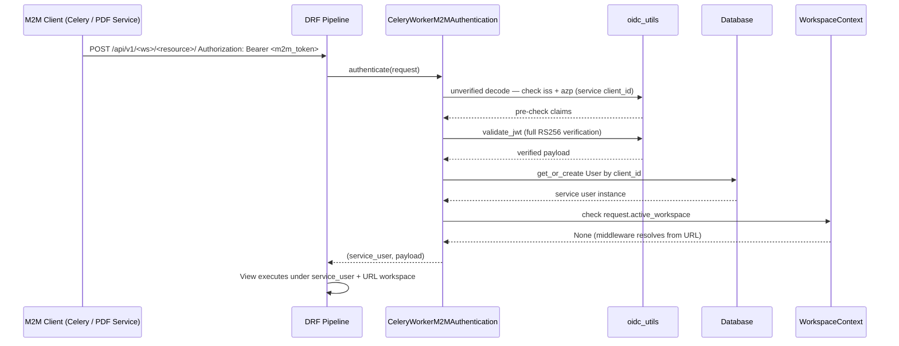

Figure 11 — M2M Client Credentials authentication sequence

### Authentication Class Priority

DRF tries each class in order and uses the first non-`None` result:

| Priority | Class | Token Type |
|---|---|---|
| 1 | `CeleryWorkerM2MAuthentication` | M2M Client Credentials JWT (service clients) |
| 2 | `OIDCAccessTokenAuthentication` | User Bearer JWT (OIDC access token) |
| 3 | `SessionAuthentication` | Django session cookie (browser / development) |
| 4 | `BasicAuthentication` | HTTP Basic (development only; disabled in production) |

### Postconditions

- `request.user` is set to the authenticated `User` instance.
- `request.auth` holds the decoded JWT payload for use in views.
- `WorkspaceContextMiddleware` activates the `Workspace` identified by the
  `<workspace_id>` path segment, scoping all `WorkspaceAwareManager` queries.

### Configuration / Settings / Parameterization

| Type | Name | Effect on Use Case |
|------|------|--------------------|
| Configuration | `OIDC_ISSUER` | OIDC provider issuer URL for user Bearer JWT validation; when absent, `OIDCAccessTokenAuthentication` returns `None` for all requests. |
| Configuration | `OIDC_ACCEPTED_AUDIENCES` | Comma-separated accepted audience values; empty list disables audience checking. |
| Configuration | `CELERY_WORKER_M2M_OIDC_ISSUER` | Issuer URL trusted for M2M Client Credentials tokens; when absent, M2M authentication is disabled. |
| Configuration | `CELERY_WORKER_M2M_CLIENT_ID` | Expected `azp`/`client_id` claim in M2M tokens; tokens from other clients are rejected. |
| Parameterization | `JWKS_CACHE_TIMEOUT` (3600 s) | Signing key responses are cached for 1 hour; IdP key rotations take up to 1 hour to propagate. |
| Parameterization | JWT algorithm `RS256` | The only accepted signing algorithm; hard-coded in `koalixcrm/auth/oidc_utils.py`. |
| Parameterization | `DEFAULT_AUTHENTICATION_CLASSES` order | `CeleryWorkerM2MAuthentication` is tried before `OIDCAccessTokenAuthentication`; a token matching both paths resolves to M2M. |

See [QQ_SD_Configuration.md](../08_cross_cutting_concepts/QQ_SD_Configuration.md) and [QQ_SD_Parameterization.md](../08_cross_cutting_concepts/QQ_SD_Parameterization.md).

### Access Control

See [QQ_SD_AccessControl.md](../08_cross_cutting_concepts/QQ_SD_AccessControl.md)
for the full DRF authentication chain and RBAC model.

| Required Role(s) | Required Permission(s) | Access Control Effect |
|---|---|---|
| None (authentication step) | None at this step | This use case establishes `request.user`. After authentication, DRF permission classes (`IsAuthenticated` and `ModelPermissionsWithListView`) evaluate whether the identity may perform the requested operation. The `workspace_id` URL path segment is resolved by `WorkspaceContextMiddleware` and must correspond to a workspace in which the user holds a `RoleInWorkspace` entry; otherwise the `WorkspaceAwareManager` returns an empty queryset or the view returns 403. |

### Notes and References

- `OIDCAccessTokenAuthentication` and `CeleryWorkerM2MAuthentication` are
  implemented in `koalixcrm/auth/`.
- JWKS responses are cached in Django's default cache backend to avoid IdP
  round-trips on every request.
- See [QQ_ML_Doc_Auth.md](../05_building_block_view/koalixcrm/auth/QQ_ML_Doc_Auth.md)
  for full sequence diagrams and the `oidc_utils` module documentation.
- The OpenAPI security schemes for both authenticators are registered via
  `koalixcrm/auth/openapi_extensions.py` and appear in the per-app Swagger UI
  at `/api/swagger/v1/`.

---

## List of Figures

| Figure | Title |
|---|---|
| Figure 1 | Login decision tree: OIDC primary path and Django form fallback |
| Figure 2 | OIDC Authorization Code Flow with PKCE (browser login) |
| Figure 3 | Logout flow with OIDC end-session redirect |
| Figure 4 | Workspace switch: validation, event creation, session write, and middleware activation |
| Figure 5 | Workspace switch sequence: authorization check, audit event, session update, and middleware activation |
| Figure 6 | Workspace CRUD flow in Django Admin |
| Figure 7 | RoleInWorkspace CRUD: assigning and revoking workspace roles |
| Figure 8 | koalixcrm_install_defaulttemplates seed sequence |
| Figure 9 | Timezone selection: session write and middleware activation |
| Figure 10 | REST API user Bearer JWT authentication chain |
| Figure 11 | M2M Client Credentials authentication sequence |
