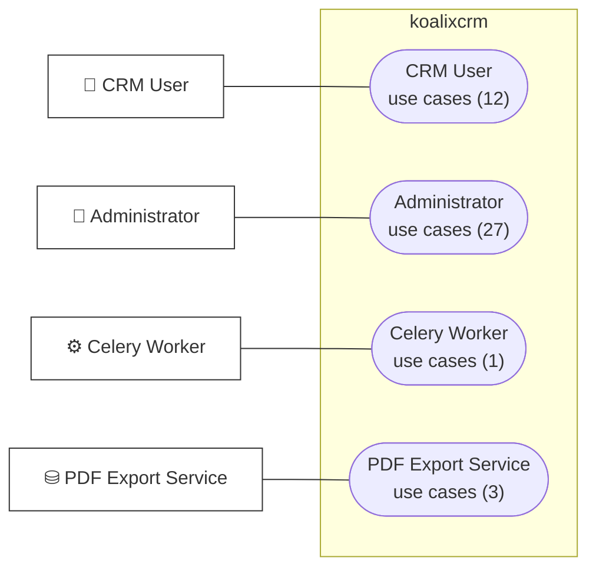
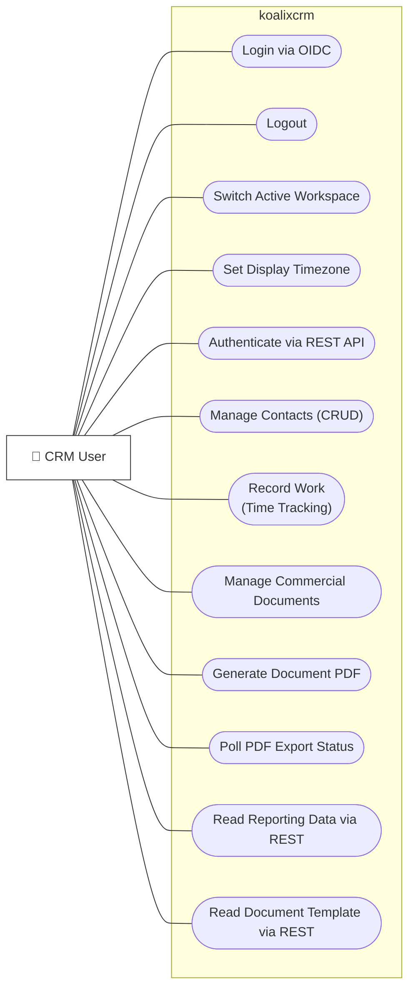
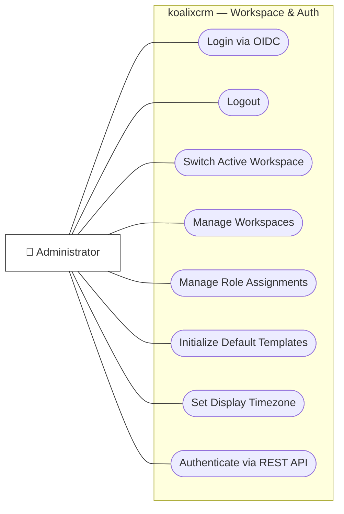
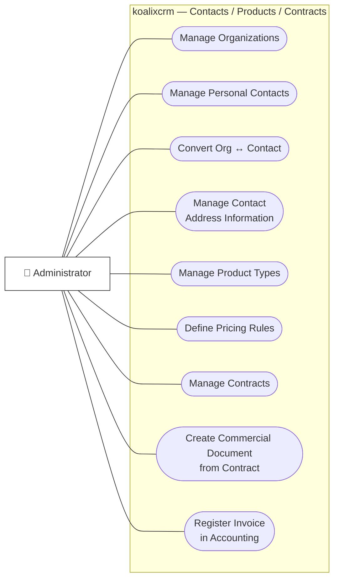
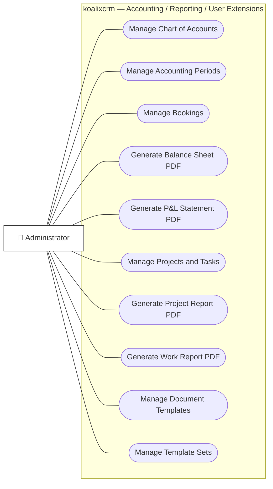
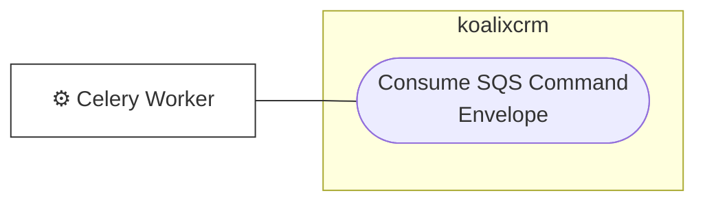
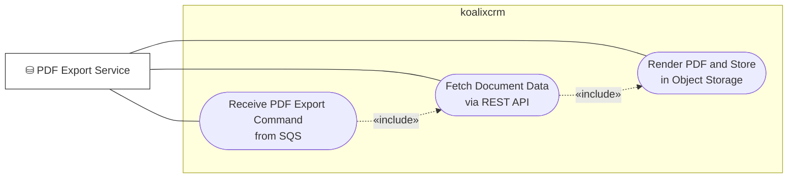

# Runtime View

This chapter documents the dynamic behaviour of koalixcrm through structured use cases that
describe how the four actors interact with the system at runtime. Each use case specifies the
actor and interface involved, the main flow of events, relevant sequence diagrams, alternative
and exceptional flows, preconditions, postconditions, and cross-references to access control and
configuration.

## Actors

| Actor | Description |
|---|---|
| CRM User | Business user operating the CRM via browser (Django templates) or the REST API with a Bearer JWT |
| Administrator | Operations staff configuring workspaces, users, products, and templates via the Django Admin (Grappelli) interface; also runs management commands |
| Celery Worker | Background job container consuming `CommandEnvelope` messages from the microservice SQS queue; currently has no active task routes |
| PDF Export Service | External Java service that polls the PDF export SQS queue, fetches document data from the REST API, renders PDFs via Apache FOP and XSL-FO templates stored in S3, and writes the result back to a `PDFExportProcess` record |

## Use Case Overview Diagram

The diagram below provides a collapsed overview of all use-case packages grouped by actor. Each
package node links to the detail subsection for that actor.

*Figure 1: Use-case overview — actors and use-case packages. See the per-actor detail sections below for individual use cases.*

---

## CRM User use cases

*Figure 2: CRM User use cases.*

---

## Administrator use cases

### Administrator — Workspace and Authentication

*Figure 3: Administrator use cases — Workspace and Authentication domain.*

### Administrator — Contacts, Products, and Contracts

*Figure 4: Administrator use cases — Contacts, Products, and Contracts domains.*

### Administrator — Accounting, Reporting, and User Extensions

*Figure 5: Administrator use cases — Accounting, Reporting, and User Extensions domains.*

---

## Celery Worker use cases

*Figure 6: Celery Worker use cases. The TASK\_ROUTES dispatch table is currently empty; the worker receives CommandEnvelope messages from the microservice SQS queue but has no registered task handlers. See [QQ_SD_Use_Case_ReportingExport.md](QQ_SD_Use_Case_ReportingExport.md) for context on the SQS offload path.*

---

## PDF Export Service use cases

*Figure 7: PDF Export Service use cases. The three steps form a single composite interaction; they are listed separately because each targets a distinct system interface. See [QQ_SD_Use_Case_ReportingExport.md](QQ_SD_Use_Case_ReportingExport.md) for the full sequence.*

---

## System-Design Use Cases (geplant)

Die folgenden Use Cases beschreiben die Geschäftsprozesse der System-Design-Phase
(Produktkatalog, Lagerverwaltung und Bestandsbuchung):

- [Use-Case-Verzeichnis](use_cases.md)
- [UC-0001: Produkt anlegen und klassifizieren](use_case_0001.md)
- [UC-0002: Erweiterbare Attribute für ein Produkt pflegen](use_case_0002.md)
- [UC-0003: Produktübersetzung verwalten](use_case_0003.md)
- [UC-0004: Preisliste und Produktpreise verwalten](use_case_0004.md)
- [UC-0005: Stückliste für ein Fertigprodukt pflegen](use_case_0005.md)
- [UC-0006: Dienstleistungsprofil für ein SERVICE-Produkt anlegen und bearbeiten](use_case_0006.md)
- [UC-0007: Mietangebot für eine Einzeleinheit erstellen und Verfügbarkeit prüfen](use_case_0007.md)
- [UC-0008: Komponenten-Bestandssuche mit Stellplatz-Anzeige](use_case_0008.md)
- [UC-0009: Komponentenentnahme mit Bestandsbestätigung (Ad-hoc-Zykluszählung)](use_case_0009.md)
- [UC-0010: Wareneingang mit Lieferschein und Lagerplatzvorschlag](use_case_0010.md)
- [UC-0011: Produktfamilie mit Varianten anlegen und Attribute kaskadieren](use_case_0011.md)
- [UC-0012: Kit kommissionieren und Fertigprodukt montieren](use_case_0012.md)

---

## Use Case Summary Table

| Use Case | Actor(s) | Interface | Domain File |
|---|---|---|---|
| Login via OIDC | CRM User, Administrator | Browser — OIDC Authorization Code Flow / Django form fallback | [WorkspaceAuth](QQ_SD_Use_Case_WorkspaceAuth.md) |
| Logout | CRM User, Administrator | Browser — OIDC end-session / Django session flush | [WorkspaceAuth](QQ_SD_Use_Case_WorkspaceAuth.md) |
| Switch Active Workspace | CRM User, Administrator | Django Admin header band / dashboard POST | [WorkspaceAuth](QQ_SD_Use_Case_WorkspaceAuth.md) |
| Manage Workspaces | Administrator | Django Admin `/admin/core/workspace/` | [WorkspaceAuth](QQ_SD_Use_Case_WorkspaceAuth.md) |
| Manage Role Assignments | Administrator | Django Admin `/admin/core/roleinworkspace/` | [WorkspaceAuth](QQ_SD_Use_Case_WorkspaceAuth.md) |
| Initialize Default Templates | Administrator | Management command `koalixcrm_install_defaulttemplates` | [WorkspaceAuth](QQ_SD_Use_Case_WorkspaceAuth.md) |
| Set Display Timezone | CRM User, Administrator | Browser `/koalixcrm/crm/reporting/set_timezone/` | [WorkspaceAuth](QQ_SD_Use_Case_WorkspaceAuth.md) |
| Authenticate via REST API | CRM User, Celery Worker, PDF Export Service | REST API — Bearer JWT (OIDC or M2M Client Credentials) | [WorkspaceAuth](QQ_SD_Use_Case_WorkspaceAuth.md) |
| Manage Organizations | CRM User, Administrator | Django Admin + REST API `organizations/` | [Contacts](QQ_SD_Use_Case_Contacts.md) |
| Manage Personal Contacts | CRM User, Administrator | Django Admin + REST API `party-contacts/` | [Contacts](QQ_SD_Use_Case_Contacts.md) |
| Convert Organization to Contact (and vice versa) | Administrator | Django Admin bulk action | [Contacts](QQ_SD_Use_Case_Contacts.md) |
| Manage Contact Address Information | CRM User, Administrator | Django Admin + REST API `addresses/`, `phone-numbers/`, `party-emails/` and assignment endpoints | [Contacts](QQ_SD_Use_Case_Contacts.md) |
| Manage Party Groups | Administrator | Django Admin + REST API `party-groups/` | [Contacts](QQ_SD_Use_Case_Contacts.md) |
| Manage Party Roles and Memberships | Administrator | Django Admin + REST API `party-roles/`, `organization-memberships/` | [Contacts](QQ_SD_Use_Case_Contacts.md) |
| Manage Organization Relationships | Administrator | Django Admin + REST API `organization-relationships/` | [Contacts](QQ_SD_Use_Case_Contacts.md) |
| Manage Product Types | Administrator | Django Admin + REST API `products/` | [ProductsPricing](QQ_SD_Use_Case_ProductsPricing.md) |
| Define Product Pricing Rules | Administrator | Django Admin ProductPrice inline + REST API `product-prices/` | [ProductsPricing](QQ_SD_Use_Case_ProductsPricing.md) |
| Manage Customer Group Price Transforms | Administrator | Django Admin CustomerGroupTransform inline + REST API `customer-group-transforms/` | [ProductsPricing](QQ_SD_Use_Case_ProductsPricing.md) |
| Manage Currencies, Taxes, and Units | Administrator | Django Admin + REST API `currencies/`, `taxes/`, `units/` | [ProductsPricing](QQ_SD_Use_Case_ProductsPricing.md) |
| Manage Unit and Currency Conversions | Administrator | Django Admin + REST API `unit-transforms/`, `currency-transforms/` | [ProductsPricing](QQ_SD_Use_Case_ProductsPricing.md) |
| Assign Product Category | Administrator | Django Admin ProductType Change-Form (accounting monkey-patched inline) | [ProductsPricing](QQ_SD_Use_Case_ProductsPricing.md) |
| Manage Contracts | CRM User, Administrator | Django Admin + REST API `contracts/` | [ContractsSales](QQ_SD_Use_Case_ContractsSales.md) |
| Create Commercial Document from Contract | CRM User, Administrator | Django Admin bulk action | [ContractsSales](QQ_SD_Use_Case_ContractsSales.md) |
| Manage Commercial Documents (CRUD and Lifecycle) | CRM User, Administrator | Django Admin + REST API `invoices/`, `quotations/`, `sales-orders/`, etc. | [ContractsSales](QQ_SD_Use_Case_ContractsSales.md) |
| Convert Between Document Types | CRM User, Administrator | Django Admin bulk action (cross-document type actions) | [ContractsSales](QQ_SD_Use_Case_ContractsSales.md) |
| Register Invoice in Accounting | Administrator | Django Admin action on Invoice | [ContractsSales](QQ_SD_Use_Case_ContractsSales.md) |
| Register Payment in Accounting | Administrator | Django Admin two-step wizard on Invoice | [ContractsSales](QQ_SD_Use_Case_ContractsSales.md) |
| Manage Commercial Document Line Items and Attachments | CRM User, Administrator | Django Admin inline + REST API `commercial-document-positions/`, `commercial-document-media/` | [ContractsSales](QQ_SD_Use_Case_ContractsSales.md) |
| Manage Subscriptions | Administrator | Django Admin `/admin/subscriptions/subscription/` | [ContractsSales](QQ_SD_Use_Case_ContractsSales.md) |
| Manage Chart of Accounts | Administrator | Django Admin + REST API `accounts/` | [Accounting](QQ_SD_Use_Case_Accounting.md) |
| Manage Accounting Periods | Administrator | Django Admin + REST API `accounting-periods/` | [Accounting](QQ_SD_Use_Case_Accounting.md) |
| Manage Double-Entry Bookings | Administrator | Django Admin + REST API `bookings/` | [Accounting](QQ_SD_Use_Case_Accounting.md) |
| Manage Product Categories | Administrator | Django Admin + REST API `product-categories/` | [Accounting](QQ_SD_Use_Case_Accounting.md) |
| Assign Tax Accounts | Administrator | Django Admin Tax Change-Form (accounting monkey-patched inline) | [Accounting](QQ_SD_Use_Case_Accounting.md) |
| Generate Balance Sheet PDF | Administrator | Django Admin AccountingPeriod action | [Accounting](QQ_SD_Use_Case_Accounting.md) |
| Generate Profit/Loss Statement PDF | Administrator | Django Admin AccountingPeriod action | [Accounting](QQ_SD_Use_Case_Accounting.md) |
| Register Invoice in Accounting (Accounting domain view) | Administrator | Django Admin Invoice action | [Accounting](QQ_SD_Use_Case_Accounting.md) |
| Register Payment in Accounting (Accounting domain view) | Administrator | Django Admin Invoice two-step wizard | [Accounting](QQ_SD_Use_Case_Accounting.md) |
| Manage Projects and Tasks | CRM User, Administrator | Django Admin + REST API `projects/`, `tasks/` | [ReportingExport](QQ_SD_Use_Case_ReportingExport.md) |
| Record Work (Time Tracking Formset) | CRM User | Browser `/koalixcrm/crm/reporting/time_tracking/` | [ReportingExport](QQ_SD_Use_Case_ReportingExport.md) |
| Record Work (Single Entry Admin CRUD) | Administrator | Django Admin Work Change-Form + REST API `works/` | [ReportingExport](QQ_SD_Use_Case_ReportingExport.md) |
| Manage Resource Agreements and Estimations | Administrator | Django Admin Task Change-Form inlines + REST API `agreements/`, `estimations/` | [ReportingExport](QQ_SD_Use_Case_ReportingExport.md) |
| Manage Reporting Periods | Administrator | Django Admin + REST API `reporting-periods/` | [ReportingExport](QQ_SD_Use_Case_ReportingExport.md) |
| Generate Project Report PDF (async) | CRM User, Administrator | Django Admin action on Project or ReportingPeriod | [ReportingExport](QQ_SD_Use_Case_ReportingExport.md) |
| Generate Work Report PDF (async) | Administrator | Django Admin action on HumanResource | [ReportingExport](QQ_SD_Use_Case_ReportingExport.md) |
| Generate Commercial Document PDF (async) | CRM User, Administrator | Django Admin action `create_pdf_async` on any commercial document | [ReportingExport](QQ_SD_Use_Case_ReportingExport.md) |
| Poll PDF Export Process Status | CRM User, PDF Export Service | Django Admin + REST API `pdf-export-processes/` | [ReportingExport](QQ_SD_Use_Case_ReportingExport.md) |
| Manage Document Templates | Administrator | Django Admin `/admin/djangouserextension/<templatetype>/` | [UserExtensions](QQ_SD_Use_Case_UserExtensions.md) |
| Manage Template Sets | Administrator | Django Admin `/admin/djangouserextension/templateset/` | [UserExtensions](QQ_SD_Use_Case_UserExtensions.md) |
| Manage User Extensions | Administrator | Django Admin `/admin/djangouserextension/userextension/` | [UserExtensions](QQ_SD_Use_Case_UserExtensions.md) |
| Manage User Contact Information | Administrator | Django Admin UserAddressAssignment / UserPhoneAssignment / UserEmailAssignment | [UserExtensions](QQ_SD_Use_Case_UserExtensions.md) |
| Read Document Template via REST API | CRM User, PDF Export Service | REST API `/koalixcrm_core/api/v1/<ws>/document-templates/` | [UserExtensions](QQ_SD_Use_Case_UserExtensions.md) |
| Bootstrap Default Templates | Administrator | Management command `koalixcrm_install_defaulttemplates` | [UserExtensions](QQ_SD_Use_Case_UserExtensions.md) |
