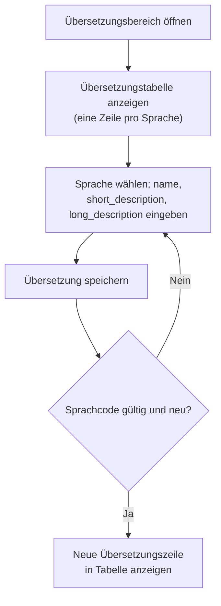
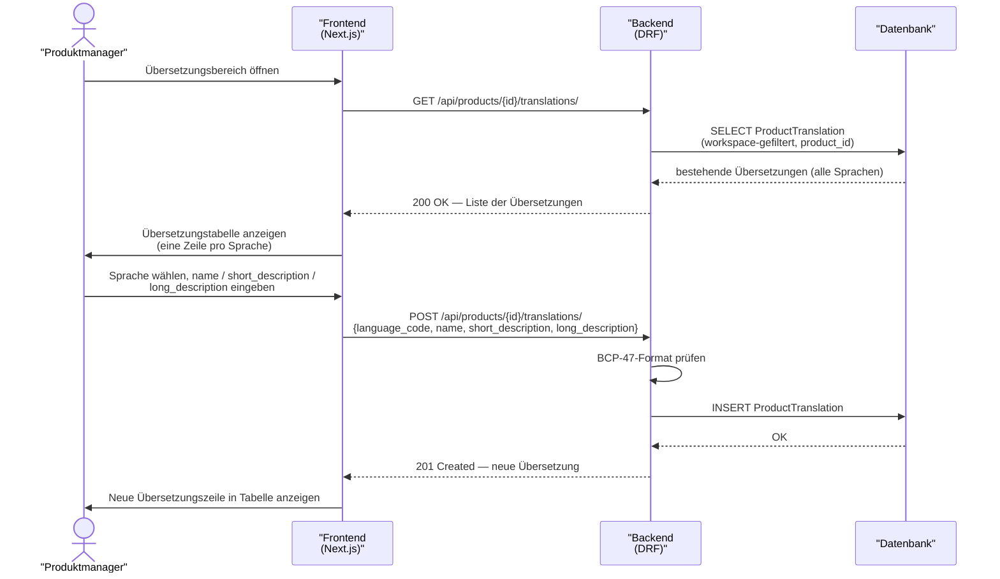

# UC-0003: Produktübersetzung verwalten

**ID:** UC-0003  
**Bezug:** [ADR-0003](../09_architecture_decisions/0003-product-catalog-backbone.md), [REQ-0003](../01_introduction_and_goals/requirements/REQ-0003.md)  
**Lizenzseite:** Open-Source-Backend (Datenmodell und API); Closed-Source-Frontend (UI)

---

## Akteure
- **Primär:** Produktmanager (eingeloggter Benutzer mit Schreibrecht auf den aktiven Workspace)
- **System:** KoalixCRM-Backend (DRF), KoalixCRM-Frontend (Next.js/Refine)

## Vorbedingungen
- Das `Product` existiert im aktiven Workspace.
- Der Produktmanager hat Schreibrecht auf `ProductTranslation`.

## Auslöser
Der Produktmanager öffnet die Produktdetailseite und navigiert zum Übersetzungsbereich.

## Hauptablauf

### Hauptablauf (Übersicht)
Der folgende Ablauf fasst den Standardfall aus Sicht des Produktmanagers zusammen#59; Details zu Schnittstellen zeigt das Sequenzdiagramm darunter.

## Alternativablauf A: Übersetzung bearbeiten
- Der Produktmanager klickt auf eine bestehende Übersetzungszeile.
- Das Frontend sendet PATCH `/api/products/{id}/translations/{language_code}/` mit den geänderten Feldern.
- Das Backend aktualisiert den `ProductTranslation`-Eintrag.

## Alternativablauf B: Ungültiger Sprachcode
- Der Produktmanager gibt einen nicht-BCP-47-konformen Sprachcode ein.
- Das Backend antwortet mit HTTP 400 und einer Fehlermeldung.
- Das Frontend zeigt die Fehlermeldung am Sprachcode-Feld an.

## Alternativablauf C: Doppelter Sprachcode
- Der Produktmanager versucht, eine zweite Übersetzung für einen bereits vorhandenen Sprachcode anzulegen.
- Das Backend antwortet mit HTTP 400 und einer Fehlermeldung.

## Nachbedingungen
- Der neue `ProductTranslation`-Eintrag ist persistiert.
- Abfragen auf das Produkt in der betreffenden Sprache liefern die neue Übersetzung.

## Behavioral Acceptance Criteria

### BAC-1: Übersetzungsübersicht
- [ ] Die Übersetzungstabelle zeigt alle vorhandenen Sprachcodes mit Bezeichnung und Kurzinfo in einer Übersicht.
- [ ] Fehlende Übersetzungen für die workspace-weit konfigurierte Fallback-Sprache werden visuell hervorgehoben.

### BAC-2: Sprachcode-Eingabe
- [ ] Das Sprachcode-Feld schlägt gültige BCP-47-Codes per Autovervollständigung vor.
- [ ] Ein ungültiger Sprachcode zeigt eine inline Fehlermeldung am Feld, bevor der Produktmanager absenden kann.

### BAC-3: Fallback-Anzeige
- [ ] Das Frontend zeigt an, welche Sprache als Fallback-Sprache des Workspace konfiguriert ist.

---

## Referenzen
- [ADR-0003](../09_architecture_decisions/0003-product-catalog-backbone.md) — `ProductTranslation`-Modell
- [REQ-0003](../01_introduction_and_goals/requirements/REQ-0003.md) — governing requirement
- [Glossar](../12_glossary/glossar.md) — Begriffsdefinition (`ProductTranslation`)
