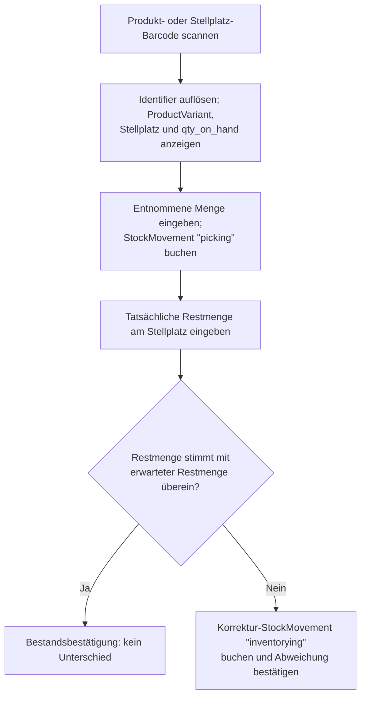
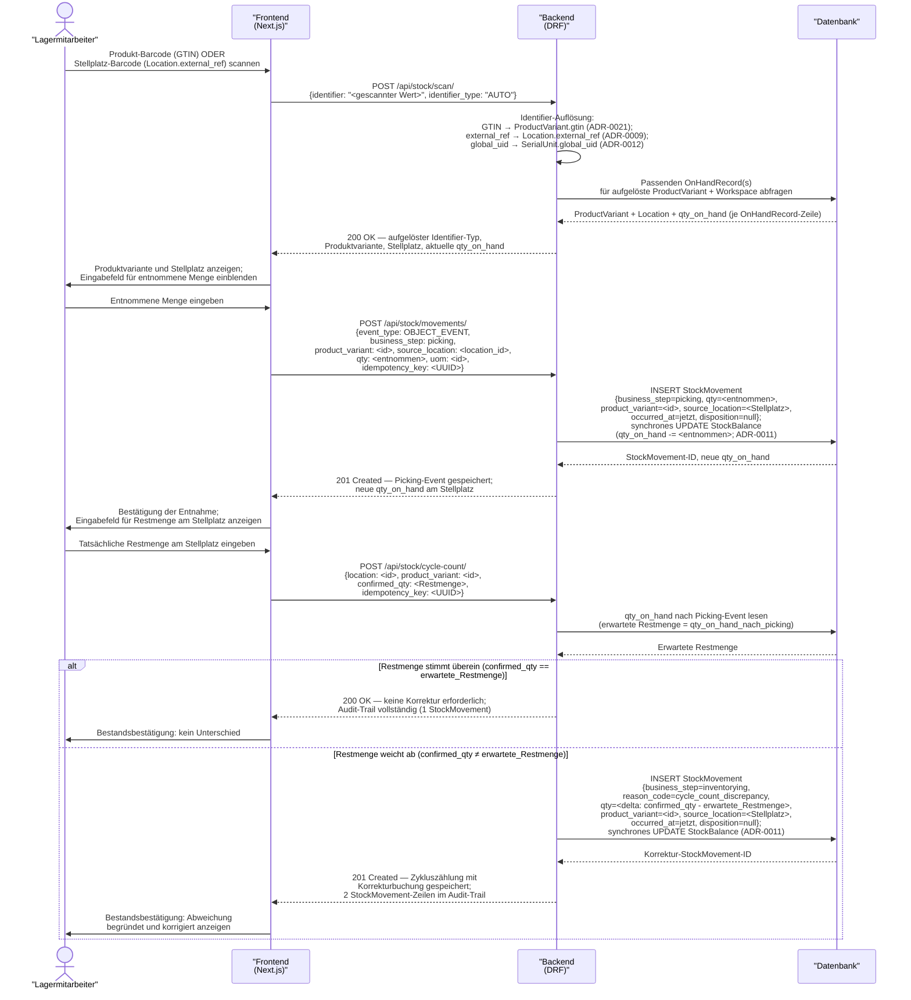

# UC-0009: Komponentenentnahme mit Bestandsbestätigung (Ad-hoc-Zykluszählung)

**ID:** UC-0009
**Bezug:** [ADR-0009](../09_architecture_decisions/0009-stock-domain-backbone.md), [ADR-0010](../09_architecture_decisions/0010-stock-states-and-reservations.md), [ADR-0011](../09_architecture_decisions/0011-stock-movements-and-event-log.md), [ADR-0012](../09_architecture_decisions/0012-lifetime-batch-lot-serial-tracking.md), [ADR-0021](../09_architecture_decisions/0021-produkt-variantengranularitaet-topologie-schluesselung-attributkaskade.md)
**Lizenzseite:** Open-Source-Backend (Datenmodell, Bewegungslogik, Zykluszählungs-Korrektur und API); Closed-Source-Frontend (Scan-Maske, Mengeneingabe-UI, Bestätigungsdialog)

**Warum:** Bei der Ad-hoc-Entnahme von Komponenten entstehen Bestandsabweichungen, wenn die tatsächlich entnommene Menge nicht sofort gebucht wird und der Restbestand am Stellplatz nicht verifiziert wird. Ohne eine kombinierte Picking-Buchung und sofortige Zykluszählung bei Abweichung veraltert der `OnHandRecord` schnell, was zu Fehlkommissionierungen bei nachfolgenden Aufträgen führt.

---

## Akteure

- **Primär:** Lagermitarbeiter (eingeloggter Benutzer mit Schreibrecht auf Lagerbewegungen im aktiven Workspace)
- **System:** KoalixCRM-Backend (DRF), KoalixCRM-Frontend (Next.js/Refine)

## Vorbedingungen

- Der Lagermitarbeiter ist authentifiziert und hat einen aktiven Workspace.
- Die zu entnehmende `ProductVariant` existiert im aktiven Workspace mit mindestens einem `OnHandRecord` an einem identifizierten `Location`-Knoten ([ADR-0021](../09_architecture_decisions/0021-produkt-variantengranularitaet-topologie-schluesselung-attributkaskade.md): „`OnHandRecord` FK → `ProductVariant` ist autoritativer Schlüssel").
- Der Barcode der Variante (GTIN aus `ProductVariant.gtin`) oder der Stellplatz-Barcode (`Location.external_ref`) ist physisch auf dem Produkt bzw. am Stellplatz vorhanden ([ADR-0021](../09_architecture_decisions/0021-produkt-variantengranularitaet-topologie-schluesselung-attributkaskade.md): „`gtin` | `ProductVariant` | GTIN ist die handelsseitige Einheiten-ID").

## Auslöser

Der Lagermitarbeiter entnimmt eine Komponente aus dem Lager und möchte die Entnahme im System erfassen.

---

## Hauptablauf

### Hauptablauf (Übersicht)

Der Happy Path als Geschäftsablauf, ohne Anmeldung und ohne API-Details:

---

## Alternativablauf A: Scan nicht auflösbar

- Das Backend findet für den gescannten Identifier keinen Treffer im aktiven Workspace (weder über `ProductVariant.gtin` noch über `Location.external_ref` noch über `SerialUnit.global_uid`).
- Das Backend antwortet mit HTTP 404 und benennt, welcher Identifier-Typ erkannt wurde (GTIN-Format erkannt, aber keine passende Produktvariante; `external_ref`-Format erkannt, aber kein passender Stellplatz; unbekanntes Format).
- Das Frontend zeigt eine Fehlermeldung mit dem erkannten Identifier-Typ, damit der Lagermitarbeiter den Scan überprüfen oder manuell suchen kann.

## Alternativablauf B: Mengeneingabe überschreitet verfügbaren Bestand

- Der Lagermitarbeiter gibt eine entnommene Menge ein, die größer ist als die aktuelle `qty_on_hand` am Stellplatz.
- Das Backend gibt eine Warnung mit HTTP 422 zurück und nennt die verfügbare Menge.
- Das Frontend zeigt die Warnung; der Lagermitarbeiter bestätigt die Eingabe explizit (erzwungene Korrektur) oder passt die Menge an.
- Wird die Eingabe explizit bestätigt, bucht das Backend die Entnahme dennoch und setzt `qty_on_hand` auf 0 (kein Negativbestand); ein `StockMovement` mit `reason_code = quantity_exceeded` wird gespeichert.

## Alternativablauf C: Restmengeneingabe negativ oder leer

- Der Lagermitarbeiter gibt eine negative Zahl oder keinen Wert als Restmenge ein.
- Das Backend lehnt die Anfrage mit HTTP 400 ab.
- Das Frontend zeigt eine Eingabevalidierungsfehlermeldung; die Zykluszählung wird nicht gespeichert.

---

## Nachbedingungen

- Für die entnommene Menge existiert im `StockMovement`-Log genau ein unveränderlicher Eintrag mit `business_step = picking`, `qty = <entnommen>`, der aufgelösten `ProductVariant` und dem Quell-Stellplatz.
- Hat der Lagermitarbeiter eine abweichende Restmenge bestätigt, existiert ein zweiter unveränderlicher `StockMovement`-Eintrag mit `business_step = inventorying`, `reason_code = cycle_count_discrepancy` und `qty = <delta>`.
- Hat der Lagermitarbeiter keine Abweichung festgestellt, existiert kein zweiter `StockMovement`-Eintrag für diesen Vorgang.
- `StockBalance.qty_on_hand` am betroffenen Stellplatz spiegelt den korrigierten Bestand nach beiden Buchungen wider.
- Beide `StockMovement`-Zeilen sind nach dem Schreiben unveränderlich ([ADR-0011](../09_architecture_decisions/0011-stock-movements-and-event-log.md): „Zeilen werden nach dem Schreiben nicht mehr geändert oder gelöscht").

---

## Behavioral Acceptance Criteria

### BAC-1: Scan-Variante GTIN (Produkt-Barcode)

- [ ] Das Backend löst einen Scan, dessen Wert dem Muster einer GS1-GTIN entspricht, gegen `ProductVariant.gtin` auf ([ADR-0021](../09_architecture_decisions/0021-produkt-variantengranularitaet-topologie-schluesselung-attributkaskade.md): „`gtin` | `ProductVariant` | GTIN ist die handelsseitige Einheiten-ID") und gibt die passende `ProductVariant` mit all ihren `OnHandRecord`-Standorten zurück.
- [ ] Die Antwort benennt `identifier_type = "GTIN"`, damit das Frontend den aufgelösten Typ anzeigen kann.

### BAC-2: Scan-Variante Location.external_ref (Stellplatz-Barcode)

- [ ] Das Backend löst einen Scan, der `Location.external_ref` entspricht, gegen den `Location`-Datensatz des aktiven Workspace auf und gibt alle am Stellplatz befindlichen Produkte mit ihrer `qty_on_hand` zurück ([ADR-0009](../09_architecture_decisions/0009-stock-domain-backbone.md): „`external_ref` (optionaler AS/RS-Adressstring oder Barcode-Klartext)").
- [ ] Die Antwort benennt `identifier_type = "LOCATION_EXTERNAL_REF"`.

### BAC-3: Scan-Variante SerialUnit.global_uid

- [ ] Das Backend löst einen Scan, der dem Format `SerialUnit.global_uid` entspricht, gegen den `SerialUnit`-Datensatz auf und gibt das zugehörige Produkt und den aktuellen Standort zurück ([ADR-0012](../09_architecture_decisions/0012-lifetime-batch-lot-serial-tracking.md): „`global_uid` (nullable — ISO/IEC-15459-kompatibler eindeutiger Identifikator)").
- [ ] Die Antwort benennt `identifier_type = "SERIAL_GLOBAL_UID"`.

### BAC-4: Buchung des Picking-Events

- [ ] Das Backend schreibt nach der Mengeneingabe einen `StockMovement`-Eintrag mit `event_type = OBJECT_EVENT`, `business_step = picking`, `qty = <entnommene Menge>` und `source_location = <Stellplatz>` ([ADR-0011](../09_architecture_decisions/0011-stock-movements-and-event-log.md): `business_step`-Wertebereich enthält `picking`).
- [ ] Das Backend aktualisiert `StockBalance.qty_on_hand` am Stellplatz synchron im selben Datenbank-Transaktion ([ADR-0011](../09_architecture_decisions/0011-stock-movements-and-event-log.md): „`StockMovement`-Events mit `qty != null` aktualisieren `StockBalance`-Felder synchron im selben Datenbank-Transaktion").
- [ ] Der `StockMovement`-Eintrag trägt einen eindeutigen `idempotency_key`; ein zweiter POST mit demselben Key erzeugt keine doppelte Buchung.

### BAC-5: Buchung des Korrektur-Events bei Abweichung

- [ ] Weicht die bestätigte Restmenge von der erwarteten Restmenge ab, schreibt das Backend einen zweiten `StockMovement`-Eintrag mit `business_step = inventorying`, `reason_code = cycle_count_discrepancy` und `qty = confirmed_qty − erwartete_Restmenge`.
- [ ] Das Backend korrigiert `StockBalance.qty_on_hand` um den Delta-Wert synchron im selben Transaktion.

### BAC-6: KEIN zusätzliches Event bei Übereinstimmung

- [ ] Stimmt die bestätigte Restmenge exakt mit der erwarteten Restmenge überein, schreibt das Backend keinen zweiten `StockMovement`-Eintrag.
- [ ] Das Backend antwortet in diesem Fall mit HTTP 200 (nicht 201), um die Abwesenheit einer Korrekturbuchung anzuzeigen.

### BAC-7: Audit-Trail (Unveränderlichkeit)

- [ ] Alle `StockMovement`-Zeilen dieses Use Cases sind nach dem Schreiben unveränderlich; kein `UPDATE` oder `DELETE` auf bereits gespeicherte Zeilen ist zulässig ([ADR-0011](../09_architecture_decisions/0011-stock-movements-and-event-log.md): „Zeilen werden nach dem Schreiben nicht mehr geändert oder gelöscht; Korrekturen erfolgen durch kompensierende Gegenbuchungen").
- [ ] Beide `StockMovement`-Einträge (Picking + ggf. Korrektur) sind über die `StockMovement`-Log-Abfrage für denselben `product_variant`/`location`-Kontext gemeinsam abrufbar.

### BAC-8: Workspace-Scope

- [ ] Das Backend löst Scans ausschließlich gegen `ProductVariant`, `Location` und `SerialUnit`-Einträge des aktiven Workspace auf ([ADR-0001](../09_architecture_decisions/0001-contact-and-party-data-model.md): „Tenant-owned data inherits `WorkspaceScopedModel` and is filtered by `request.active_workspace`").
- [ ] Alle erzeugten `StockMovement`-Einträge gehören dem aktiven Workspace an.

---

## Architectural gaps surfaced

Der Scan-Auflösungsmechanismus (Identifier Registry) über mehrere Identifier-Typen hinweg (GTIN, `external_ref`, `global_uid`) ist als eigenständige Komponente nicht in einem bestehenden ADR spezifiziert. Die vorliegende Auflösungslogik ist in diesem Use Case als Applikationsverhalten beschrieben; die architektonische Entscheidung, ob eine dedizierte Identifier-Registry-Entität oder eine reine Suchfunktion im Endpunkt angemessen ist, obliegt `kxcrm-architect`. Diese Lücke ist in `open_questions.md` als [OQ-0016](../11_risks_and_technical_debt/open_questions.md) erfasst.

Der `business_step`-Wert `inventorying` ist im Wertebereich von [ADR-0011](../09_architecture_decisions/0011-stock-movements-and-event-log.md) nicht aufgeführt. Die geplante Erweiterung des Wertebereichs ist in diesem Use Case als Voraussetzung beschrieben; die formale Aufnahme erfolgt durch `kxcrm-architect` als [ADR-0011](../09_architecture_decisions/0011-stock-movements-and-event-log.md)-Amendment. Diese Lücke ist in `open_questions.md` als [OQ-0017](../11_risks_and_technical_debt/open_questions.md) erfasst.

---

## Referenzen
- [ADR-0009](../09_architecture_decisions/0009-stock-domain-backbone.md) — `Location.external_ref`-Barcode
- [ADR-0010](../09_architecture_decisions/0010-stock-states-and-reservations.md) — `StockBalance`-Kontext
- [ADR-0011](../09_architecture_decisions/0011-stock-movements-and-event-log.md) — `StockMovement`-Log, Unveränderlichkeit, `business_step`-Wertebereich
- [ADR-0012](../09_architecture_decisions/0012-lifetime-batch-lot-serial-tracking.md) — `SerialUnit.global_uid`
- [ADR-0021](../09_architecture_decisions/0021-produkt-variantengranularitaet-topologie-schluesselung-attributkaskade.md) — `OnHandRecord` FK → `ProductVariant`, `gtin` auf `ProductVariant`
- [ADR-0001](../09_architecture_decisions/0001-contact-and-party-data-model.md) — Workspace-Scoping (`WorkspaceScopedModel`)
- [OQ-0016](../11_risks_and_technical_debt/open_questions.md), [OQ-0017](../11_risks_and_technical_debt/open_questions.md) — offene architektonische Lücken dieses Use Cases
- [Glossar](../12_glossary/glossar.md) — Begriffsdefinition (`ProductVariant`)

---

## Änderungsprotokoll
- 2026-07-04: Anpassung an [ADR-0021](../09_architecture_decisions/0021-produkt-variantengranularitaet-topologie-schluesselung-attributkaskade.md): Preis-/Bestands-/GTIN-Schlüsselung auf ProductVariant.
