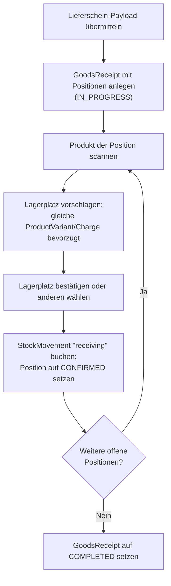
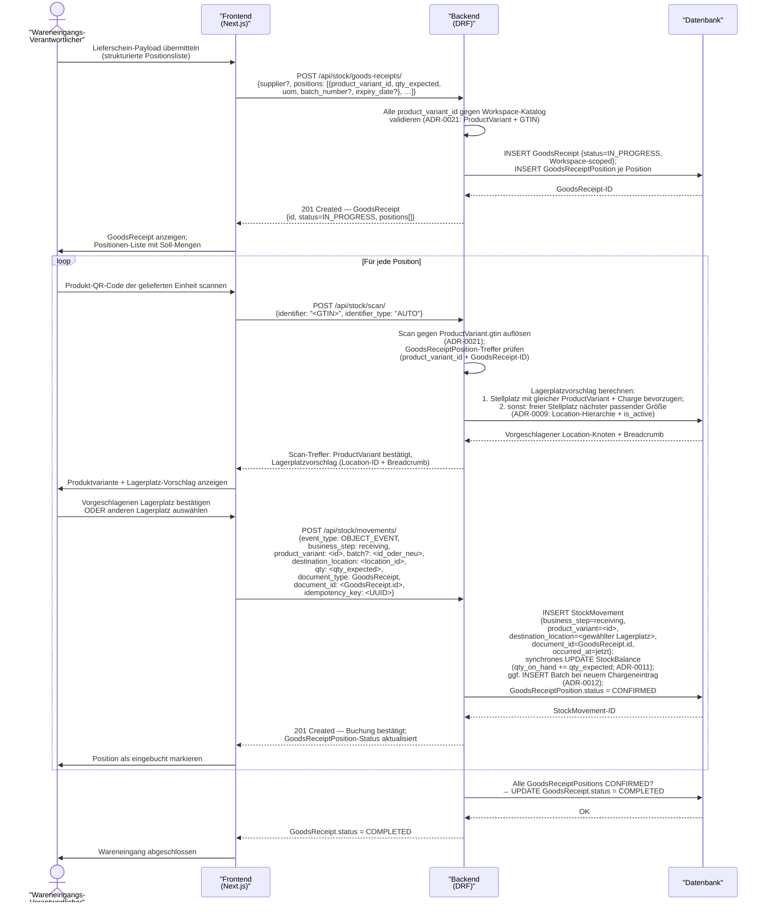

# UC-0010: Wareneingang mit Lieferschein und Lagerplatzvorschlag

**ID:** UC-0010
**Bezug:** [ADR-0002](../09_architecture_decisions/0002-admin-ui-framework.md), [ADR-0003](../09_architecture_decisions/0003-product-catalog-backbone.md), [ADR-0009](../09_architecture_decisions/0009-stock-domain-backbone.md), [ADR-0011](../09_architecture_decisions/0011-stock-movements-and-event-log.md), [ADR-0012](../09_architecture_decisions/0012-lifetime-batch-lot-serial-tracking.md), [ADR-0021](../09_architecture_decisions/0021-produkt-variantengranularitaet-topologie-schluesselung-attributkaskade.md)
**Lizenzseite:** Open-Source-Backend (Datenmodell, GoodsReceipt-Aggregat, Lagerplatzvorschlag-Logik, Bewegungsbuchung und API); Closed-Source-Frontend (Lieferschein-Ingestion-UI, Scan-Maske, Lagerplatz-Override-Dialog)

**Warum:** Ohne eine strukturierte Lieferschein-Erfassung mit positionsgenauer Scan-Bestätigung und einem systemgestützten Lagerplatzvorschlag entstehen fehlerhafte Einlagerungen: Ware landet auf falschen Stellplätzen, Chargen werden nicht erfasst und `StockMovement`-Events fehlen im Audit-Trail. Die Verknüpfung jeder Buchung mit einem `GoodsReceipt`-Dokument stellt die Rückverfolgbarkeit vom physischen Eingang bis zum Lagerort sicher.

---

## Akteure

- **Primär:** Projektleiter oder Wareneingangs-Verantwortlicher (eingeloggter Benutzer mit Schreibrecht auf Wareneingang und Lagerbewegungen im aktiven Workspace)
- **System:** KoalixCRM-Backend (DRF), KoalixCRM-Frontend (Next.js/Refine)

## Vorbedingungen

- Der Benutzer ist authentifiziert und hat einen aktiven Workspace.
- Eine Lieferung mit Lieferschein ist physisch eingetroffen.
- Der Lieferschein-Payload liegt als strukturiertes Datenobjekt vor (Format und Quelle sind Integrationsdetails und nicht Teil dieses Use Cases).
- Alle im Lieferschein aufgeführten Produkte existieren als `ProductVariant` im Produktkatalog des aktiven Workspace ([ADR-0021](../09_architecture_decisions/0021-produkt-variantengranularitaet-topologie-schluesselung-attributkaskade.md): Wareneingangspositionen referenzieren die verkaufbare Einheit, nicht das abstrakte `Product`).

## Auslöser

Eine Lieferung mit Lieferschein trifft ein; der Wareneingangs-Verantwortliche erfasst den Eingang im System.

---

## Hauptablauf

### Hauptablauf (Übersicht)

Der Happy Path als Geschäftsablauf, ohne Anmeldung und ohne API-Details:

---

## Alternativablauf A: Scan stimmt nicht mit Lieferscheinposition überein

- Das Backend löst den gescannten Barcode auf eine `ProductVariant` auf, die in keiner offenen `GoodsReceiptPosition` des aktuellen `GoodsReceipt` auftaucht.
- Das Backend antwortet mit HTTP 422 und nennt die aufgelöste `ProductVariant` sowie die Varianten der offenen Positionen.
- Das Frontend zeigt den Konflikt; der Benutzer kann eine andere Position manuell auswählen oder den Scan wiederholen.

## Alternativablauf B: Produktvariante nicht im Katalog

- Das Backend findet für die im Lieferschein-Payload angegebene `product_variant_id` keinen passenden `ProductVariant`-Eintrag im aktiven Workspace ([ADR-0021](../09_architecture_decisions/0021-produkt-variantengranularitaet-topologie-schluesselung-attributkaskade.md)).
- Das Backend antwortet auf die initiale `POST /api/stock/goods-receipts/`-Anfrage mit HTTP 422 und benennt die fehlende `product_variant_id`.
- Das Backend legt kein `GoodsReceipt`-Aggregat an; der Benutzer muss den fehlenden Katalogeintrag zuerst anlegen.

## Alternativablauf C: Vorgeschlagener Lagerplatz vom Benutzer abgelehnt

- Der Benutzer wählt einen anderen Stellplatz als den vom System vorgeschlagenen.
- Das Backend akzeptiert den benutzergewählten `Location`-Knoten, sofern dieser `is_active = true` trägt und zum aktiven Workspace gehört.
- Das Backend bucht den `StockMovement` auf den benutzergewählten Stellplatz.

## Alternativablauf D: Lieferung unvollständig

- Der Benutzer beendet den Erfassungsvorgang, ohne alle `GoodsReceiptPosition`-Einträge zu bestätigen.
- Das `GoodsReceipt` verbleibt im Status `IN_PROGRESS`.
- Bereits bestätigte Positionen bleiben als `StockMovement`-Einträge unveränderlich im Log; nur die offenen Positionen fehlen.
- Der Benutzer setzt den Eingang zu einem späteren Zeitpunkt fort, indem er das bestehende `GoodsReceipt` öffnet.

## Alternativablauf E: Mehrere Chargen auf einer Position

- Eine `GoodsReceiptPosition` enthält mehrere physische Chargen (unterschiedliche `batch_number`).
- Der Benutzer scannt und bestätigt jede Charge separat als Teillieferung der Position.
- Das Backend legt für jede Charge einen eigenen `StockMovement`-Eintrag (mit FK auf dieselbe `ProductVariant`) und ggf. einen `Batch`-Datensatz an.
- Sobald die Summe der eingebuchten Mengen der Soll-Menge der Position entspricht, wird die Position auf `CONFIRMED` gesetzt.

---

## Nachbedingungen

- Ein `GoodsReceipt`-Aggregat mit Status `COMPLETED` (oder `IN_PROGRESS` bei Teillieferung) existiert im aktiven Workspace.
- Für jede bestätigte `GoodsReceiptPosition` existiert mindestens ein unveränderlicher `StockMovement`-Eintrag mit `business_step = receiving` und `document_id = GoodsReceipt.id`.
- `StockBalance.qty_on_hand` am jeweiligen Einlagerungsstellplatz spiegelt die eingebuchte Menge wider.
- Für jede neu erfasste Charge existiert ein `Batch`-Datensatz mit den übermittelten Feldern ([ADR-0012](../09_architecture_decisions/0012-lifetime-batch-lot-serial-tracking.md): „Chargennummer, Ablaufdatum, Mindesthaltbarkeitsdatum, Produktionsdatum").
- Kein `StockMovement`-Eintrag dieses Use Cases ist nach dem Schreiben veränderbar ([ADR-0011](../09_architecture_decisions/0011-stock-movements-and-event-log.md): „Zeilen werden nach dem Schreiben nicht mehr geändert oder gelöscht").

---

## Behavioral Acceptance Criteria

### BAC-1: Lieferschein-Ingestion über REST

- [ ] Das Backend nimmt einen strukturierten Lieferschein-Payload als JSON-Objekt entgegen und legt daraus ein `GoodsReceipt`-Aggregat mit Status `IN_PROGRESS` an ([ADR-0002](../09_architecture_decisions/0002-admin-ui-framework.md): „Django keeps the existing DRF endpoints in each `*_api_py/` package and serves them under `/api/`").
- [ ] Der Endpunkt akzeptiert ausschließlich strukturierte Positionsdaten (`ProductVariant`-ID, Soll-Menge, Maßeinheit, optional Charge); Bild- oder OCR-Daten sind nicht Teil des Payload-Schemas.

### BAC-2: GoodsReceipt-Statusübergänge

- [ ] Ein neu angelegtes `GoodsReceipt` trägt den Status `IN_PROGRESS`.
- [ ] Sobald alle `GoodsReceiptPosition`-Einträge den Status `CONFIRMED` tragen, setzt das Backend `GoodsReceipt.status = COMPLETED` synchron im selben Transaktion.
- [ ] Ein `GoodsReceipt` mit mindestens einer nicht bestätigten Position verbleibt im Status `IN_PROGRESS`.

### BAC-3: Scan-Auflösung pro Position

- [ ] Das Backend löst den gescannten GTIN-Barcode gegen `ProductVariant.gtin` auf und ordnet den Treffer der passenden offenen `GoodsReceiptPosition` zu ([ADR-0021](../09_architecture_decisions/0021-produkt-variantengranularitaet-topologie-schluesselung-attributkaskade.md): „`gtin` | `ProductVariant` | GTIN ist die handelsseitige Einheiten-ID").
- [ ] Das Backend antwortet mit HTTP 422 und einer Fehlerbeschreibung, wenn der Scan keine `ProductVariant` einer offenen Position trifft.

### BAC-4: Lagerplatzvorschlag-Regel

- [ ] Das Backend schlägt als ersten Kandidaten einen `Location`-Knoten vor, der bereits `OnHandRecord`-Zeilen für dieselbe `ProductVariant` und dieselbe Charge trägt und dessen `is_active = true` gilt ([ADR-0021](../09_architecture_decisions/0021-produkt-variantengranularitaet-topologie-schluesselung-attributkaskade.md): `OnHandRecord` FK → `ProductVariant`).
- [ ] Existiert kein solcher Stellplatz, schlägt das Backend den nächsten freien Stellplatz mit passender Kapazität vor (Kriterium: `is_active = true`, kein bestehender `OnHandRecord` mit `qty_on_hand > 0` für eine andere `ProductVariant`, gleiche Hierarchieebene `BIN`).
- [ ] Das Backend liefert den Vorschlag als `Location`-ID mit vollständigem Breadcrumb-Array.

### BAC-5: Manuelle Override-Möglichkeit

- [ ] Der Benutzer wählt einen anderen als den vorgeschlagenen Stellplatz; das Backend akzeptiert diesen, sofern er `is_active = true` trägt und zum aktiven Workspace gehört.
- [ ] Das Backend bucht den `StockMovement` auf den benutzergewählten Stellplatz, nicht auf den vorgeschlagenen.

### BAC-6: Buchung pro Position als eigener StockMovement

- [ ] Für jede bestätigte `GoodsReceiptPosition` schreibt das Backend einen eigenen `StockMovement`-Eintrag mit `event_type = OBJECT_EVENT`, `business_step = receiving` ([ADR-0011](../09_architecture_decisions/0011-stock-movements-and-event-log.md): `business_step`-Wertebereich enthält `receiving`).
- [ ] Das Backend aktualisiert `StockBalance.qty_on_hand` am Einlagerungsstellplatz synchron im selben Transaktion ([ADR-0011](../09_architecture_decisions/0011-stock-movements-and-event-log.md): „`StockMovement`-Events mit `qty != null` aktualisieren `StockBalance`-Felder synchron im selben Datenbank-Transaktion").

### BAC-7: Verknüpfung über document_id

- [ ] Jeder `StockMovement`-Eintrag dieses Use Cases trägt `document_type = GoodsReceipt` und `document_id = <GoodsReceipt.id>` ([ADR-0011](../09_architecture_decisions/0011-stock-movements-and-event-log.md): „Generische Belegverknüpfung" via `document_type` + `document_id`).
- [ ] Eine Abfrage aller `StockMovement`-Einträge mit `document_id = <GoodsReceipt.id>` liefert genau die Buchungen dieses Wareneingangs.

### BAC-8: Workspace-Scope

- [ ] Das Backend legt `GoodsReceipt`, `GoodsReceiptPosition` und alle `StockMovement`-Einträge im aktiven Workspace an ([ADR-0001](../09_architecture_decisions/0001-contact-and-party-data-model.md): „Tenant-owned data inherits `WorkspaceScopedModel` and is filtered by `request.active_workspace`").
- [ ] Alle `ProductVariant`- und Lagerplatz-Lookups sind auf den aktiven Workspace beschränkt.

### BAC-9: Lizenzgrenze — Endpoint-Schnittstelle

- [ ] Der Backend-Endpunkt `POST /api/stock/goods-receipts/` nimmt ausschließlich strukturierte JSON-Daten entgegen; keine Bildverarbeitung, kein OCR-Processing und keine Dokumenten-Parsing-Logik erfolgen im Open-Source-Backend.
- [ ] Die Lieferschein-Ingestion aus Bildern oder PDFs ist nicht Teil des Open-Source-Backends; dieser Integrationsweg obliegt dem Closed-Source-Frontend oder einem separaten Integrationsdienst.

---

## Architectural gaps surfaced

Die Put-Away-Strategie (Regel zur Lagerplatzvergabe beim Wareneingang) ist architektonisch nicht in einem bestehenden ADR als Service-Algorithmus oder konfigurierbares Produktattribut festgelegt. Dieser Use Case beschreibt die Wunschregel (bestehender Stellplatz mit gleicher `ProductVariant` + Charge zuerst, sonst freier Stellplatz nächster passender Größe); ob diese Logik als eigenständiger Algorithmus im Backend-Service, als konfigurierbare Strategie pro `ProductVariant` oder als mandantenweite Konfiguration implementiert wird, entscheidet `kxcrm-architect`. Diese Lücke ist in `open_questions.md` als [OQ-0015](../11_risks_and_technical_debt/open_questions.md) erfasst.

Das `GoodsReceipt`-Aggregat ist kein definiertes Datenmodell in einem bestehenden ADR. Das vorliegende ADR ([ADR-0017](../09_architecture_decisions/0017-goods-receipt-as-process-aggregate.md) als Kandidat) ist noch nicht geschrieben; `kxcrm-architect` entscheidet über das Datenmodell. Diese Lücke ist in `open_questions.md` als [OQ-0018](../11_risks_and_technical_debt/open_questions.md) erfasst.

Der Identifier-Auflösungsmechanismus für Scan-Operationen ist auch in diesem Use Case relevant (vgl. [UC-0009](use_case_0009.md)) und in keinem bestehenden ADR als eigenständige Identifier-Registry spezifiziert. Diese Lücke ist gemeinsam mit [UC-0009](use_case_0009.md) in `open_questions.md` als [OQ-0016](../11_risks_and_technical_debt/open_questions.md) erfasst.

---

## Referenzen
- [ADR-0002](../09_architecture_decisions/0002-admin-ui-framework.md) — DRF-Endpunkt-Konvention (`/api/`)
- [ADR-0003](../09_architecture_decisions/0003-product-catalog-backbone.md) — Produktkatalog-Kontext
- [ADR-0009](../09_architecture_decisions/0009-stock-domain-backbone.md) — `Location`-Hierarchie, Lagerplatzvorschlag
- [ADR-0011](../09_architecture_decisions/0011-stock-movements-and-event-log.md) — `StockMovement`-Log, generische Belegverknüpfung (`document_type`/`document_id`)
- [ADR-0012](../09_architecture_decisions/0012-lifetime-batch-lot-serial-tracking.md) — `Batch`-Datensatz (Chargennummer, Ablaufdatum)
- [ADR-0021](../09_architecture_decisions/0021-produkt-variantengranularitaet-topologie-schluesselung-attributkaskade.md) — Wareneingangspositionen referenzieren `ProductVariant`, nicht `Product`
- [ADR-0017](../09_architecture_decisions/0017-goods-receipt-as-process-aggregate.md) — `GoodsReceipt`-Aggregat (Kandidat, siehe OQ-0018)
- [ADR-0001](../09_architecture_decisions/0001-contact-and-party-data-model.md) — Workspace-Scoping (`WorkspaceScopedModel`)
- [OQ-0015](../11_risks_and_technical_debt/open_questions.md), [OQ-0016](../11_risks_and_technical_debt/open_questions.md), [OQ-0018](../11_risks_and_technical_debt/open_questions.md) — offene architektonische Lücken dieses Use Cases
- [UC-0009](use_case_0009.md) — gemeinsamer Identifier-Auflösungsmechanismus (Scan-Operationen)
- [Glossar](../12_glossary/glossar.md) — Begriffsdefinition (`ProductVariant`)

---

## Änderungsprotokoll
- 2026-07-04: Anpassung an [ADR-0021](../09_architecture_decisions/0021-produkt-variantengranularitaet-topologie-schluesselung-attributkaskade.md): Preis-/Bestands-/GTIN-Schlüsselung auf ProductVariant.
