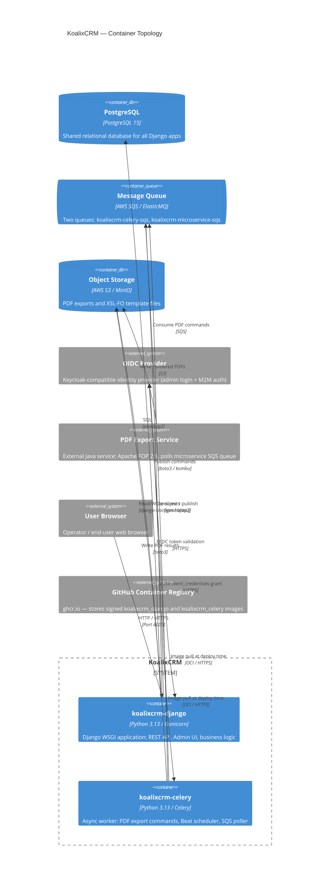
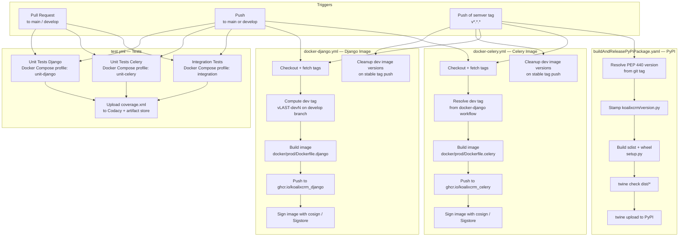

# Deployment View

This chapter documents the CI/CD pipelines, container strategy, build and packaging processes,
and deployment topology for koalixcrm. Two human-authored setup guides are available as
first-class pages in this chapter:

- [Local workstation setup (Docker Desktop)](QQ_IMPORT_docs-setup-local-docker-desktop.md)
- [Linux server setup (headless VPS / VPC)](QQ_IMPORT_docs-setup-linux-server.md)

For configuration, secrets management, and cross-cutting environment settings see
[Chapter 8: Cross-cutting Concepts](../08_cross_cutting_concepts/index.md).

---

## Deployment Overview

koalixcrm is packaged and distributed in two complementary forms:

1. **Container images** — two Docker images (`koalixcrm_django` and `koalixcrm_celery`) published
   to the GitHub Container Registry (`ghcr.io`). These are the primary runtime artefacts for both
   local development and server deployment.
2. **Python package** — a `koalix-crm` package published to [PyPI](https://pypi.org/project/koalix-crm/)
   for installations that embed the library into a custom Django project.

Stack orchestration lives in the sibling repository `koalixcrm_system`, which owns the
`docker-compose.yml` that composes both containers together with their backing services.

### Infrastructure Topology

The diagram below shows the runtime topology of a fully deployed stack. External services
(PostgreSQL, SQS/ElasticMQ, S3/MinIO, OIDC provider, PDF export service) are operated
outside the two koalixcrm containers.



*Figure 1: KoalixCRM container topology — services inside the solution boundary and their external dependencies.*

### Target Environments

| Environment | Purpose | Database | Message broker | Object storage |
|---|---|---|---|---|
| Local development (Docker Desktop) | Developer workstation | PostgreSQL (containerised) or SQLite | ElasticMQ (containerised) | MinIO (containerised) |
| Linux server (self-hosted) | Single-user / demo deployment | SQLite (bind-mounted host file) | ElasticMQ (containerised) | MinIO (containerised) |
| Production (cloud) | Multi-user production | AWS RDS PostgreSQL | AWS SQS | AWS S3 |

---

## CI/CD Pipelines

All pipelines are implemented as **GitHub Actions** workflows stored in
`.github/workflows/`. There are five workflow files covering automated tests, container
image publication, and PyPI package release.

### Pipeline Flow



*Figure 2: GitHub Actions CI/CD pipeline flow — trigger conditions, pipeline stages, and artefact destinations.*

### Workflow: Tests (`test.yml`)

**Trigger:** push or pull request to `main` or `develop`.

The workflow runs three parallel jobs, each pulling the system configuration image
(`koalixcrm_system_config`) from GHCR to obtain the Docker Compose file, then launching
the appropriate Compose profile:

| Job | Compose profile | Coverage output |
|---|---|---|
| Unit Tests Django | `unit-django` | `test_report/coverage.xml` → Codacy + artifact |
| Unit Tests Celery | `unit-celery` | `test_report/coverage-celery.xml` → artifact |
| Integration Tests | `integration` | `test_report/coverage.xml` → artifact |

Integration tests require `secrets.env` populated from the `KOALIXCRM_SECRETS_ENV` GitHub
secret (OIDC credentials). Unit tests create an empty `secrets.env` so Compose can parse
the full file without errors.

The test runner uses **pytest** (version >=8.0.0) with the plugins `pytest-django`,
`pytest-cov`, `selenium`, and `factory_boy`. Coverage is reported in Cobertura XML format
and uploaded to [Codacy](https://www.codacy.com/) for the Django unit-test job.

Source: `.github/workflows/test.yml`

### Workflow: Docker Django Image (`docker-django.yml`)

**Trigger:** push to `main` or `develop` branches, or push of a semver tag `v*.*.*`.

**Image name:** `ghcr.io/<owner>/koalixcrm_django`

**Dockerfile:** `docker/prod/Dockerfile.django`

Versioning logic:

- Push to `develop` branch: the workflow calculates a pre-release dev tag
  `<last-stable-tag>-dev<commit-count>` (e.g. `v1.15.0-dev42`), creates and pushes the
  git tag, then builds the image tagged with that dev version.
- Push of a semver tag (e.g. `v1.15.0`): the image is tagged with the full semver and the
  `major.minor` form. All previously published `-dev` image versions are deleted from GHCR.

Each published image is signed using [cosign](https://github.com/sigstore/cosign) via the
Sigstore Fulcio instance, using GitHub's OIDC identity token. BuildKit layer caching is
enabled via GitHub Actions cache (`cache-from/cache-to: type=gha`).

Build arguments passed to Docker:

| Argument | Value |
|---|---|
| `APP_VERSION` | The resolved git tag (e.g. `v1.15.0-dev42`) |
| `VCS_REF` | The full commit SHA (`github.sha`) |

Source: `.github/workflows/docker-django.yml`

### Workflow: Docker Celery Image (`docker-celery.yml`)

**Trigger:** same as the Django image workflow (push to `main`/`develop` or semver tag).

**Image name:** `ghcr.io/<owner>/koalixcrm_celery`

**Dockerfile:** `docker/prod/Dockerfile.celery`

The Celery workflow reads the dev tag created by the Django workflow (with a 5-second wait
and `git fetch --tags` to ensure the tag is available). Signing, caching, and dev-cleanup
logic are identical to the Django image workflow.

Source: `.github/workflows/docker-celery.yml`

### Workflow: PyPI Package Release (`buildAndReleasePyPiPackage.yaml`)

**Trigger:** push of any git tag matching `v<major>.<minor>.<patch>` or
`v<major>.<minor>.<patch>-dev<N>` (both stable releases and pre-releases).

The dev tags are automatically created by the Docker Django workflow on every push to
`develop`, so every commit to `develop` also triggers a PyPI pre-release upload.

Stages:

1. Resolve the PEP 440 version string from the git tag (e.g. `v1.15.0-dev42` → `1.15.0.dev42`).
2. Stamp `koalixcrm/version.py` with the resolved version.
3. Build source distribution and wheel with `setup.py sdist bdist_wheel` (Python 3.10 runner).
4. Validate the distribution archives with `twine check`.
5. Publish to PyPI using `twine upload` authenticated with the `PYPI_TOKEN` secret.

Source: `.github/workflows/buildAndReleasePyPiPackage.yaml`

### Legacy Workflow: Django CI (`django.yml`)

**Trigger:** push or pull request to `master` or `development`.

This is an older workflow that builds the dev Docker image and runs pytest via
`docker-compose run web`. It reports coverage to Codacy and uploads an XML artifact.
The branches it targets (`master`, `development`) differ from the active branch names
(`main`, `develop`) used by the current workflows, indicating this workflow is a legacy
artefact. It references the deprecated `actions/upload-artifact@v2`.

Source: `.github/workflows/django.yml`

---

## Containerisation

### Image Summary

| Image | Registry | Dockerfile | Server process |
|---|---|---|---|
| `koalixcrm_django` | `ghcr.io/<owner>/koalixcrm_django` | `docker/prod/Dockerfile.django` | Gunicorn (production) / debugpy + runserver (dev) |
| `koalixcrm_celery` | `ghcr.io/<owner>/koalixcrm_celery` | `docker/prod/Dockerfile.celery` | `celery worker -l info -B` (production) / watchmedo auto-restart (dev) |

Both images use **Python 3.13** as the base image. The version is stamped into
`koalixcrm/version.py` at image build time via the `APP_VERSION` build argument, and
exposed as the `KOALIXCRM_VERSION` environment variable inside the container.

OCI labels applied to every image:

| Label | Value |
|---|---|
| `org.opencontainers.image.title` | `koalixcrm-django` or `koalixcrm-celery` |
| `org.opencontainers.image.version` | Resolved git tag |
| `org.opencontainers.image.revision` | Git commit SHA |
| `org.opencontainers.image.source` | `https://github.com/KoalixSwitzerland/koalixcrm` |

### Production Django Image (`docker/prod/Dockerfile.django`)

- Base: `python:3.13`
- System packages installed: `build-essential`, `libpq-dev`, `libcurl4-openssl-dev`, `libssl-dev`
- Python dependencies: `docker/requirements/django.txt` + `gunicorn`
- Application modules copied into the image: `koalixcrm`, `koalixcrm_microservices`,
  `koalixcrm_mq_commands`, `koalixcrm_utils`, `projectsettings`, `manage.py`
- Source code is **copied**, not bind-mounted — the image is self-contained
- Exposed port: 8000
- Entrypoint: `docker/prod/entrypoint.sh`

Entrypoint sequence (`docker/prod/entrypoint.sh`):

1. Sets `DJANGO_SETTINGS_MODULE` to
   `projectsettings.settings.production_docker_postgres_settings` (overridable via environment).
2. Runs `manage.py sync_split_migrations` (ignores errors).
3. Runs `manage.py migrate --noinput` (ignores errors).
4. Runs `manage.py collectstatic --noinput`.
5. Starts Gunicorn bound to `0.0.0.0:8000` with `GUNICORN_WORKERS` workers
   (default: 3) and `GUNICORN_TIMEOUT` seconds (default: 120).

### Production Celery Image (`docker/prod/Dockerfile.celery`)

- Base: `python:3.13`
- System packages installed: `build-essential`, `libpq-dev`, `libcurl4-openssl-dev`, `libssl-dev`
- Python dependencies: `docker/requirements/celery.txt`
- Application modules copied: `koalixcrm_microservices`, `koalixcrm_mq_commands`,
  `koalixcrm_utils` (only the worker-relevant packages; the full Django app is not included)
- Command: `celery -A koalixcrm_microservices.celery_app worker -l info -B`
  (worker with Beat scheduler)

### Development Django Image (`docker/dev/Dockerfile.django`)

- Installs all three requirements files (`django.txt`, `celery.txt`, `test.txt`) plus `debugpy`
- Installs Chromium and chromedriver for Selenium-based front-end tests
- Source code is **not** copied — it is bind-mounted from the host at runtime so that
  Django's auto-reload reflects file changes immediately
- Exposed ports: 8000 (HTTP) and 5678 (debugpy remote debugger)
- Entrypoint starts the Django development server under debugpy without blocking startup
  (`--listen 0.0.0.0:5678`, no `--wait-for-client`)

### Development Celery Image (`docker/dev/Dockerfile.celery`)

- Installs all three requirements files plus `watchdog[watchmedo]`
- Installs Apache FOP 2.9 (`/usr/bin/fop-2.9/fop/fop`) for local PDF generation
- Installs a Java runtime (`default-jre-headless`) required by FOP
- Source code is bind-mounted at runtime
- Command uses `watchmedo auto-restart` to restart the Celery worker automatically on any
  `.py` file change

### Python Dependency Sets

Three separate requirements files allow precise dependency scoping:

| File | Used by | Key packages |
|---|---|---|
| `docker/requirements/django.txt` | Django (dev + prod), dev Celery | Django 5.2.13, DRF, drf-spectacular, django-storages[s3], psycopg2-binary, Pillow, pandas, matplotlib, PyJWT, authlib |
| `docker/requirements/celery.txt` | Celery (dev + prod), dev Django | celery 5.4.0, kombu[sqs], pycurl, boto3, requests |
| `docker/requirements/test.txt` | Dev images only | pytest, pytest-cov, pytest-django, selenium, factory\_boy, pylint, codacy-coverage |

---

## Docker Compose Stack for Local Development

The Docker Compose configuration is maintained in the sibling repository `koalixcrm_system`.
The `koalixcrm` repository contributes only the application source code and the per-environment
Dockerfiles.

The local stack (profile `dev`) starts the following services:

| Service | Image | Purpose |
|---|---|---|
| `backend` | Built from `docker/dev/Dockerfile.django` | Django development server with debugpy |
| `celery` | Built from `docker/dev/Dockerfile.celery` | Celery worker with watchmedo auto-restart |
| ElasticMQ | `softwaremill/elasticmq-native` | Local SQS-compatible message broker |
| MinIO | `minio/minio` | Local S3-compatible object storage |
| PostgreSQL | `postgres:15` | Relational database |

For workstation-specific setup instructions, see
[QQ_IMPORT_docs-setup-local-docker-desktop.md](QQ_IMPORT_docs-setup-local-docker-desktop.md).

### ElasticMQ Configuration (`elasticmq.conf`)

ElasticMQ is configured via `elasticmq.conf` in the repository root. It declares two queues:

| Queue name | Purpose |
|---|---|
| `koalixcrm-celery-sqs` | Celery task queue (Kombu SQS transport) |
| `koalixcrm-microservice-sqs` | Microservice command bus (PDF export commands) |

ElasticMQ binds to port 9324 (SQS API) and 9325 (management UI). The same queue names are
used in production against AWS SQS — the broker endpoint is the only runtime difference,
controlled by the `SQS_ENDPOINT_URL` environment variable.

---

## Production Deployment (Linux Server)

The Linux server setup is covered in detail in the imported guide
[QQ_IMPORT_docs-setup-linux-server.md](QQ_IMPORT_docs-setup-linux-server.md). The key
operational facts are summarised below.

The two required git repositories are cloned side-by-side:

```text
~/koalix/
├── koalixcrm/          # application source (this repository)
├── koalixcrm_system/   # Docker Compose and infrastructure config
└── koalixcrm_data/
    ├── db/             # SQLite database file (bind-mounted into the backend container)
    └── secrets.env     # OIDC credentials and other secrets
```

The stack is started with:

```bash
docker compose --env-file .env.server --profile dev up -d --build
```

As noted in the imported guide, the current compose file uses the **`dev` profile**
(Django `runserver`, `DEBUG=True`). A hardened production profile (Gunicorn, TLS, etc.)
is tracked in the `koalixcrm_system` repository and is not yet part of the published
compose configuration.

For automatic start on host reboot, a systemd unit is provided in the setup guide. The
unit calls `docker compose up -d` on start and `docker compose down` on stop.

### Backup and Restore

The SQLite database file is stored on the host at `koalixcrm_data/db/db.sqlite3`. Backing
up this file is sufficient to preserve all relational data. MinIO blob storage lives in a
named Docker volume (`minio_data`); this volume must be included in any backup strategy if
object storage content (rendered PDFs, template files) needs to be preserved.

No automated backup mechanism is provided within the `koalixcrm` repository itself.

---

## Build and Packaging

### Python Package

koalixcrm is distributed as the `koalix-crm` package on PyPI. The build is configured
via `setup.py` using `setuptools`. `pyproject.toml` configures only the code quality tool
`ruff` (linting and formatting); it does not replace `setup.py` for build purposes.

Version resolution in `setup.py`:

1. If the `KOALIXCRM_VERSION` environment variable is set (as it is during CI), its value
   is used directly.
2. Otherwise the value is read from `koalixcrm/version.py` (the file that CI stamps before
   building, or which carries the `vX.Y.Z-develop` fallback in local development).
3. The raw value is normalised to PEP 440 format: the leading `v` is stripped and
   `-dev<N>` suffixes are converted to `.dev<N>`.

Package metadata from `setup.py`:

| Field | Value |
|---|---|
| Package name | `koalix-crm` |
| Author | Aaron Riedener |
| License | BSD |
| Python requirement | `>=3.11` |
| Install requires | Django 5.2.13 and the full production dependency set |

### Code Quality

`pyproject.toml` configures **ruff** for linting (`E`, `F`, `W`, `I` rule sets) and
formatting (LF line endings, 119-character line length matching Django's contributing
guide). Migration files and build artefact directories are excluded from linting.

---

## Environment Variables and Configuration Management

Environment-specific configuration is managed through a Django settings overlay pattern.
The base module (`projectsettings/settings/base_settings.py`) defines shared defaults; each
deployment environment imports `*` from the base and overrides only the values it needs.

| Settings module | Used when |
|---|---|
| `base_settings` | Not used directly; imported by all overlays |
| `development_docker_settings` | Docker dev stack with PostgreSQL (default), SQLite fallback via `DB_CHOICE=sqlite3` |
| `development_docker_sqlite_settings` | Unit tests (pytest default via `pytest.ini`) |
| `production_docker_postgres_settings` | Production container (set in `docker/prod/entrypoint.sh`) |

Key environment variables consumed at runtime:

| Variable | Default | Purpose |
|---|---|---|
| `DJANGO_SETTINGS_MODULE` | Set by entrypoint | Selects the settings overlay |
| `DJANGO_SECRET_KEY` | `modify_during_deployment` | Django cryptographic secret |
| `DJANGO_DEBUG` | `True` | Enables Django debug mode |
| `KOALIXCRM_VERSION` | `vX.Y.Z-develop` | Application version reported by the app |
| `KOALIXCRM_LANGUAGE_CODE` | `en-us` | UI locale (`de`, `fr`, `es`, `pt-br`) |
| `POSTGRES_DB` / `POSTGRES_USER` / `POSTGRES_PASSWORD` / `POSTGRES_HOST` / `POSTGRES_PORT` | `koalixcrm` / `5432` | PostgreSQL connection |
| `S3_ENDPOINT_URL` | — | S3-compatible endpoint (MinIO URL in dev, empty for AWS default) |
| `S3_PDF_BUCKET` | `koalixcrm-pdf-exports` | Bucket for rendered PDF exports |
| `OIDC_ISSUER` | — | Token issuer for API JWT validation |
| `OIDC_ACCEPTED_AUDIENCES` | — | Comma-separated accepted JWT audiences |
| `ADMIN_OIDC_ISSUER` / `ADMIN_OIDC_CLIENT_ID` / `ADMIN_OIDC_CLIENT_SECRET` | — | Admin OIDC login (Keycloak) |
| `CELERY_WORKER_M2M_OIDC_ISSUER` / `CELERY_WORKER_M2M_CLIENT_ID` / `CELERY_WORKER_M2M_CLIENT_SECRET` / `CELERY_WORKER_M2M_SCOPE` | — | Celery worker machine-to-machine OIDC credentials |
| `SITE_URL` | `""` | Base URL used when constructing OAuth redirect URIs |
| `GUNICORN_WORKERS` | `3` | Number of Gunicorn worker processes |
| `GUNICORN_TIMEOUT` | `120` | Gunicorn request timeout in seconds |
| `DJANGO_PORT` | `8000` | Host port to expose the Django service |

Secrets (OIDC credentials, `DJANGO_SECRET_KEY`, database passwords) are supplied at
runtime via `secrets.env`, which is bind-mounted into the container by Docker Compose.
This file is never committed to the repository; an example template is distributed in the
`koalixcrm_system` repository.

For detailed configuration documentation see
[QQ_SD_Configuration.md](../08_cross_cutting_concepts/QQ_SD_Configuration.md).

---

## References

| Document | Description |
|---|---|
| [QQ_IMPORT_docs-setup-local-docker-desktop.md](QQ_IMPORT_docs-setup-local-docker-desktop.md) | Local Docker Desktop setup guide (human-authored) |
| [QQ_IMPORT_docs-setup-linux-server.md](QQ_IMPORT_docs-setup-linux-server.md) | Linux server setup guide (human-authored) |
| [Chapter 8: Cross-cutting Concepts](../08_cross_cutting_concepts/index.md) | Configuration, settings, parameterisation, and security |
| [QQ_SD_Configuration.md](../08_cross_cutting_concepts/QQ_SD_Configuration.md) | Detailed environment variable and configuration documentation |
| [QQ_SD_Security_Report.md](../08_cross_cutting_concepts/QQ_SD_Security_Report.md) | Security findings relevant to deployment configuration |
