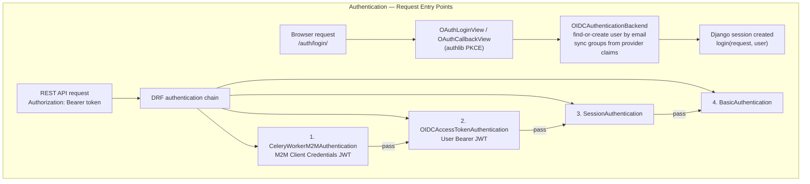
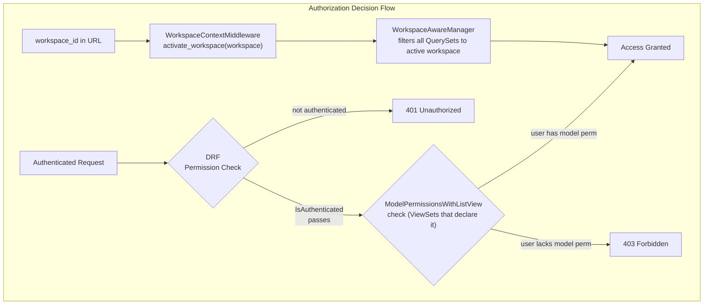
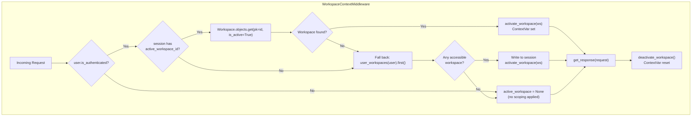
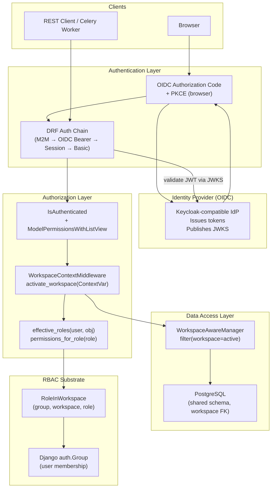

# Access Control

## Summary

| Aspect | Status | Details |
|--------|--------|---------|
| Authentication Model | Implemented | OIDC Authorization Code Flow with PKCE (browser), OIDC access token Bearer JWT (REST API), OAuth 2.0 Client Credentials Grant (M2M), Django session, HTTP Basic |
| Authorization Model | Implemented | RBAC — role grants per workspace via `RoleInWorkspace`; Django model permissions enforced by `ModelPermissionsWithListView` |
| User Groups | N/A (configured at runtime) | Django auth `Group` objects; the RBAC substrate binds groups to workspaces, not individual users |
| Roles | 7 | `admin`, `editor`, `viewer`, `commenter`, `employee`, `line_manager`, `project_manager` |
| Permissions | 4 (Django standard) | `add`, `change`, `delete`, `view` — mapped from roles by `permissions_for_role()` |
| Multi-Tenancy | Yes | Shared-schema multi-tenancy; `Workspace` is the tenant root; `WorkspaceScopedModel` carries a mandatory `workspace` FK; automatic row-level filtering via `WorkspaceAwareManager` |

## Authentication Model

koalixCRM uses four authentication mechanisms in parallel. Each mechanism serves a distinct
caller type and is registered in a specific Django or DRF chain.

### OIDC Authorization Code Flow with PKCE — Browser Session

This is the primary authentication method for human users accessing the Django Admin interface.

- **Identity Provider**: Any Keycloak-compatible OIDC provider. Configured via
  `ADMIN_OIDC_ISSUER`, `ADMIN_OIDC_CLIENT_ID`, and `ADMIN_OIDC_CLIENT_SECRET`.
- **Library**: `authlib` (`OAuth`, `django_client`).
- **PKCE**: The `code_challenge_method = 'S256'` parameter is hard-coded, enforcing
  Proof Key for Code Exchange on all authorization requests.
- **Scope**: `openid profile email` (hard-coded).
- **Views**: `LoginSelectionView`, `OAuthLoginView`, `OAuthCallbackView`,
  `MultiProviderLogoutView` — all in `koalixcrm/auth/oidc_views.py`.
- **Backend**: `OIDCAuthenticationBackend` (`koalixcrm/auth/oidc_backend.py`) — called by
  `OAuthCallbackView` to find or create the Django user. Groups from the provider are
  additively merged into Django groups using three claim locations in priority order:
  `cognito:groups`, `groups`, `realm_access.roles`.
- **Session creation**: `django.contrib.auth.login()` creates a Django session after
  successful authentication.
- **Admin guard**: Non-staff users are logged out with HTTP 403 if they attempt to access
  a URL containing `/admin`.
- **Logout**: `MultiProviderLogoutView` calls `logout()` locally, then discovers the
  `end_session_endpoint` from the OIDC discovery document and redirects the browser there
  for federated single logout.
- **Fallback**: When `ADMIN_OIDC_ISSUER` is not configured (local development and test
  environments), `LoginSelectionView` renders Django's built-in admin login form and
  `ModelBackend` validates credentials.

### OIDC Access Token — REST API Bearer JWT

This is the primary authentication method for human users and front-end clients calling
the REST API.

- **Class**: `OIDCAccessTokenAuthentication` (`koalixcrm/auth/oidc_token_authentication.py`),
  registered as `DEFAULT_AUTHENTICATION_CLASSES` priority 2 in `base_settings.py`.
- **Token format**: JWT signed RS256; extracted from `Authorization: Bearer <token>`.
- **Validation**: JWKS fetched from the OIDC provider's `/.well-known/jwks.json` via
  `oidc_utils.get_jwks()`; key matched by `kid`; `jwt.decode` with `issuer` enforcement.
- **Issuer**: `OIDC_ISSUER` setting.
- **Audience**: `OIDC_ACCEPTED_AUDIENCES` — checked against `aud`, `client_id`, and `azp`
  claims. Empty list disables audience checking.
- **User mapping**: By email (`email` claim or fallback to the OIDC userinfo endpoint).
  Users are auto-provisioned on first login inside a `transaction.atomic()` block.
- **Token lifecycle**: Managed externally by the OIDC provider. Expired tokens receive
  `AuthenticationFailed` (→ HTTP 401). JWKS responses are cached for 3600 seconds.

### OAuth 2.0 Client Credentials Grant — M2M Authentication

This mechanism is used by automated service accounts: the Celery worker and the PDF Export
Service.

- **Class**: `CeleryWorkerM2MAuthentication` (`koalixcrm/auth/m2m_authentication.py`),
  registered as `DEFAULT_AUTHENTICATION_CLASSES` priority 1 in `base_settings.py`.
- **Token format**: JWT signed RS256 via Client Credentials Grant; extracted from
  `Authorization: Bearer <token>`.
- **Issuer**: `CELERY_WORKER_M2M_OIDC_ISSUER` (separate from user-facing OIDC issuer).
- **Client identity**: Verified by matching `azp` or `client_id` claim against
  `CELERY_WORKER_M2M_CLIENT_ID`.
- **Pre-check**: Unverified JWT decode is used first to cheaply check `iss` and
  `azp`/`client_id` before full cryptographic validation, preventing token confusion.
- **User mapping**: `client_id`/`azp` claim mapped to a Django `User` by `username`.
  Service users are auto-provisioned on first contact.
- **Workspace fixup**: Because `WorkspaceContextMiddleware` runs before DRF authentication
  and sees `AnonymousUser`, it cannot resolve a workspace for M2M requests.
  `CeleryWorkerM2MAuthentication` patches `request.active_workspace` by assigning the
  first accessible workspace (`user_workspaces(user).order_by('pk').first()`).

### Django Session Authentication and HTTP Basic Authentication

- **`SessionAuthentication`**: Registered as priority 3. Used by the Django Admin back-end
  for its own API calls and by the DRF browsable API during development. Session cookies are
  created by the browser login flow described above.
- **`BasicAuthentication`**: Registered as priority 4. Intended for development and testing
  only; should not be used in production deployments.

### Authentication Backend Chain

For browser-based requests, Django iterates `AUTHENTICATION_BACKENDS` in order:

1. `koalixcrm.auth.oidc_backend.OIDCAuthenticationBackend` — handles OIDC callbacks.
2. `django.contrib.auth.backends.ModelBackend` — handles username/password fallback.

For REST API requests, DRF iterates `DEFAULT_AUTHENTICATION_CLASSES` in order:

1. `CeleryWorkerM2MAuthentication`
2. `OIDCAccessTokenAuthentication`
3. `SessionAuthentication`
4. `BasicAuthentication`



**Caption: Figure 1 — Authentication entry points and class chains for browser and REST API requests**

### Token and JWKS Caching

OIDC discovery documents and JWKS key sets are cached in Django's cache framework:

| Cached Item | Cache Key Pattern | TTL |
|-------------|-------------------|-----|
| OIDC discovery document | `oidc_discovery_{hash(issuer_url)}` | 3600 s |
| JWKS key set | `oidc_jwks_{hash(authority_url)}` | 3600 s |

Key rotation at the identity provider takes up to one hour to propagate.

## Authorization Model

The authorization model is **Role-Based Access Control (RBAC)** scoped to workspaces.

### Decision Points

Authorization decisions are made at two layers:

1. **DRF permission class** (`ModelPermissionsWithListView`): enforces Django model-level
   permissions (`add`, `change`, `delete`, `view`) per HTTP method on REST API ViewSets.
2. **Django Admin** (`WorkspaceScopedModelAdmin` / Django's built-in admin permission
   checks): restricts admin change-lists and change-forms to staff users with the
   appropriate model permissions.

Both layers depend on Django's model permission system. The bridge between workspace roles
and Django permissions is the `permissions_for_role()` function
(`koalixcrm/core/access.py`), which maps a `Role` value to a set of permission actions.

### Default Access Policy

The global default permission for all REST API endpoints is `IsAuthenticated`
(`DEFAULT_PERMISSION_CLASSES` in `base_settings.py`). Unauthenticated requests receive
`401 Unauthorized`. Authenticated users without the required model permission receive
`403 Forbidden`.

### Authorization Flow



**Caption: Figure 2 — Authorization decision flow combining DRF permission class and workspace queryset scoping**

### `permissions_for_role()` — Role-to-Permission Mapping

Defined in `koalixcrm/core/access.py` (CR-8 §8.2, §9.8):

```text
ADMIN           → {add, change, delete, view}
EDITOR          → {add, change, view}
VIEWER          → {view}
COMMENTER       → {view}
EMPLOYEE        → {view}
LINE_MANAGER    → {add, change, view}
PROJECT_MANAGER → {add, change, view}
```

This mapping is used to translate workspace-level roles into Django model permissions
for per-request authorization decisions.

### `effective_roles()` — Role Resolution

Defined in `koalixcrm/core/access.py` (CR-8 §8.5):

```python
effective_roles(user, obj) -> set[str]
```

Returns the set of `Role` codes the user holds on `obj`, derived by:
`user → user.groups → RoleInWorkspace rows → role codes` filtered by `obj.workspace`.

Special cases:
- Unauthenticated or `None` user: returns empty set.
- Superuser: returns all `Role.values` regardless of workspace membership.
- Object without `.workspace` attribute: returns empty set (guards against unscoped models).

## User Groups

User groups are standard Django `auth.Group` objects. There is no fixed set of groups
defined in code; groups are created and named at deployment time by administrators. Their
role in the RBAC model is to serve as the subject of `RoleInWorkspace` grants.

A user gains workspace access by membership in one or more groups that have a
`RoleInWorkspace` entry linking that group to the target workspace. The same user can
hold different roles in different workspaces by belonging to different groups.

Groups from the OIDC provider are additively merged into Django groups on each successful
login via `_sync_groups_from_provider()`. Existing Django group assignments are never removed
by the OIDC sync.

## Roles

All roles are defined in the `Role` TextChoices enum in
`koalixcrm/core/models/access.py` (CR-8 §8.2).

### `admin`

| Property | Value |
|----------|-------|
| **Name** | `admin` |
| **Display label** | Admin (full control) |
| **Description** | Full read/write within a workspace, including workspace-level configuration |
| **Permissions** | `add`, `change`, `delete`, `view` |
| **Source** | `koalixcrm/core/models/access.py` — `Role.ADMIN` |

### `editor`

| Property | Value |
|----------|-------|
| **Name** | `editor` |
| **Display label** | Editor (edit + read) |
| **Description** | Can create and modify records within a workspace |
| **Permissions** | `add`, `change`, `view` |
| **Source** | `koalixcrm/core/models/access.py` — `Role.EDITOR` |

### `viewer`

| Property | Value |
|----------|-------|
| **Name** | `viewer` |
| **Display label** | Viewer (read only) |
| **Description** | Read-only access to workspace records |
| **Permissions** | `view` |
| **Source** | `koalixcrm/core/models/access.py` — `Role.VIEWER` |

### `commenter`

| Property | Value |
|----------|-------|
| **Name** | `commenter` |
| **Display label** | Commenter (read + comment) |
| **Description** | Read access plus comment rights (commenting is app-specific; the core mapping grants `view`) |
| **Permissions** | `view` |
| **Source** | `koalixcrm/core/models/access.py` — `Role.COMMENTER` |

### `employee`

| Property | Value |
|----------|-------|
| **Name** | `employee` |
| **Display label** | Employee (WFS: workflow participant) |
| **Description** | WFS workflow participant; per-app code can layer in object-level permissions |
| **Permissions** | `view` |
| **Source** | `koalixcrm/core/models/access.py` — `Role.EMPLOYEE` |

### `line_manager`

| Property | Value |
|----------|-------|
| **Name** | `line_manager` |
| **Display label** | Line Manager (WFS: people management) |
| **Description** | Team-lead role with people-management editing rights; no destructive operations |
| **Permissions** | `add`, `change`, `view` |
| **Source** | `koalixcrm/core/models/access.py` — `Role.LINE_MANAGER` |

### `project_manager`

| Property | Value |
|----------|-------|
| **Name** | `project_manager` |
| **Display label** | Project Manager (WFS: project lead) |
| **Description** | Project-lead role with full project and reporting access; no destructive operations |
| **Permissions** | `add`, `change`, `view` |
| **Source** | `koalixcrm/core/models/access.py` — `Role.PROJECT_MANAGER` |

## Permissions

Django uses four standard model-level permission actions. The `ModelPermissionsWithListView`
class maps HTTP methods to these actions:

| HTTP Method | Required Permission |
|-------------|---------------------|
| `GET` | `<app_label>.view_<model_name>` |
| `POST` | `<app_label>.add_<model_name>` |
| `PUT` / `PATCH` | `<app_label>.change_<model_name>` |
| `DELETE` | `<app_label>.delete_<model_name>` |
| `OPTIONS` / `HEAD` | (no permission required) |

| Permission Action | Description | Granted To Roles | Scope |
|---|---|---|---|
| `view` | Read records | `admin`, `editor`, `viewer`, `commenter`, `employee`, `line_manager`, `project_manager` | Per-workspace |
| `add` | Create records | `admin`, `editor`, `line_manager`, `project_manager` | Per-workspace |
| `change` | Update records | `admin`, `editor`, `line_manager`, `project_manager` | Per-workspace |
| `delete` | Delete records | `admin` only | Per-workspace |

## Role-Permission Matrix

| Permission | `admin` | `editor` | `viewer` | `commenter` | `employee` | `line_manager` | `project_manager` |
|---|---|---|---|---|---|---|---|
| `view` | Yes | Yes | Yes | Yes | Yes | Yes | Yes |
| `add` | Yes | Yes | No | No | No | Yes | Yes |
| `change` | Yes | Yes | No | No | No | Yes | Yes |
| `delete` | Yes | No | No | No | No | No | No |

## Multi-Tenancy and Workspace Isolation

koalixCRM implements **shared-schema multi-tenancy**. All tenants share a single database;
tenant ownership is expressed via a `workspace` ForeignKey column present on every
tenant-scoped table.

### Tenant Root: `Workspace`

`Workspace` (`koalixcrm/core/models/workspace.py`, table `crm_workspace`) is the tenant
root entity. Fields relevant to access control:

| Field | Purpose |
|-------|---------|
| `name` | Unique human-readable tenant identifier |
| `is_active` | Inactive workspaces are excluded from `user_workspaces()` and the session switcher |
| `color` | Hex accent color applied to the admin header to prevent workspace mix-ups |

### Tenant Scoping: `WorkspaceScopedModel`

Any model that inherits `WorkspaceScopedModel` (`koalixcrm/core/models/workspace_scoped.py`)
automatically receives:

- A non-nullable `workspace` ForeignKey with `on_delete=CASCADE`.
- The `WorkspaceAwareManager` as its `objects` manager.

### Automatic Row-Level Filtering: `WorkspaceAwareManager`

`WorkspaceAwareManager.get_queryset()` reads a per-task `ContextVar` (`_active_workspace`)
and transparently appends `.filter(workspace=active_workspace)` to every queryset. This
means application code does not need to pass the workspace explicitly on each ORM query.

The `ContextVar` is set and cleared around each request by `WorkspaceContextMiddleware`:

1. Middleware reads `session['active_workspace_id']`.
2. If the session key is valid, it loads the `Workspace` and calls `activate_workspace(ws)`.
3. If there is no valid session key, it falls back to the first accessible workspace for the
   user (lowest PK) and writes it to the session.
4. After the response, `deactivate_workspace()` resets the `ContextVar`.

For M2M requests (no session), `CeleryWorkerM2MAuthentication` performs an equivalent
fixup by calling `user_workspaces(user).order_by('pk').first()` after authenticating the
service user.

### Workspace Context Resolution



**Caption: Figure 3 — WorkspaceContextMiddleware workspace resolution flow**

### Tenant Isolation Scope

Models that are workspace-scoped (inherit `WorkspaceScopedModel`) span all business domains:
Contacts, Products, Contracts, Reporting, User Extensions, and Core (e.g. `PDFExportProcess`).

The `accounting` domain is **not workspace-scoped**: `Account`, `AccountingPeriod`, and
`Booking` are global records shared across all workspaces. The REST API for accounting
carries a `<workspace_id>` path segment for routing consistency, but that segment does not
filter the returned data.

## Access Control Influence on Use Cases

| Use Case | Required Role(s) | Required Permission(s) | Access Control Effect |
|----------|------------------|------------------------|----------------------|
| UC-WA-01 Login via OIDC | None (public) | None | Creates the authenticated identity; all downstream checks depend on the session established here |
| UC-WA-02 Logout | Any authenticated user | None | No workspace role required; any user may terminate their own session |
| UC-WA-03 Switch Active Workspace | Any role in target workspace | None (checked via `user_workspaces()`) | `user_workspaces(user)` filters the accessible workspace set; superusers bypass the check; HTTP 403 returned for inaccessible workspaces |
| UC-WA-04 Manage Workspaces (Admin CRUD) | Django Admin (`is_staff=True`) | `core.add_workspace`, `core.change_workspace` | Only staff users can create or modify workspace records via Admin |
| UC-WA-05 Manage Role Assignments (Admin CRUD) | Django Admin (`is_staff=True`) | `core.add_roleinworkspace`, `core.change_roleinworkspace`, `core.delete_roleinworkspace` | Changes take effect immediately on the next request; no cache flush required |
| UC-WA-06 Initialize Default Templates (Admin CLI) | System operator (OS access) | Database + filesystem write access | Management command; Django permission model does not apply |
| UC-WA-07 Set Display Timezone | Any authenticated user | None | No workspace role required; affects own session only |
| UC-WA-08 Authenticate via REST API | None (public) | None | Creates `request.user`; downstream ViewSet permissions gate further access |
| UC-CON-* Contacts (CRUD) | Any `RoleInWorkspace` in active workspace | `view` (GET), `add` (POST), `change` (PUT/PATCH), `delete` (DELETE) | Unauthenticated requests: 401; insufficient permission: 403; all queries scoped to active workspace |
| UC-CS-* Contracts and Sales (CRUD) | Any `RoleInWorkspace` in active workspace | `view` (GET), `add` (POST), `change` (PUT/PATCH), `delete` (DELETE) | Same pattern as Contacts; all models are `WorkspaceScopedModel` instances |
| UC-PP-* Products and Pricing (CRUD) | Any `RoleInWorkspace` in active workspace | `view`/`add`/`change`/`delete` per HTTP method via `ModelPermissionsWithListView` | Same scoping pattern; `delete` requires `admin` role |
| UC-REP-* Reporting and Export (CRUD) | Any `RoleInWorkspace` in active workspace | `view`/`add`/`change`/`delete` per HTTP method | Same scoping pattern; `TaskInlineAdminView` is read-only (no add/delete) |
| UC-ACC-* Accounting (CRUD) | Django Admin: `is_staff=True`; REST API: authenticated | `view`/`add`/`change`/`delete` | Accounting models are global (not workspace-scoped); all authenticated users can read via REST; write access not restricted beyond authentication |
| UC-UEX-* User Extensions (Admin) | Django Admin: `is_staff=True` | Standard model permissions | No REST write endpoints exist; all mutations are Admin-only; `WorkspaceScopedModelAdmin` scopes change-lists to active workspace |

## Access Control on Interfaces

| Interface | Endpoint / Channel | Auth Required | Role/Permission Required | Notes |
|-----------|-------------------|---------------|--------------------------|-------|
| REST API — all domains | `/<app>/api/v1/<workspace_id>/<resource>/` | Yes — Bearer JWT or Session | `IsAuthenticated` + `ModelPermissionsWithListView` on ViewSets that declare it | Priority-ordered DRF auth chain; 401 for unauthenticated, 403 for insufficient permission |
| REST API — Accounting | `/koalixcrm_accounting/api/v1/<workspace_id>/accounts/`, `accounting-periods/`, `bookings/`, `product-categories/` | Yes | `IsAuthenticated` | Global models; workspace scoping not enforced at data level |
| REST API — pdf-export-processes | `/koalixcrm_core/api/v1/<workspace_id>/pdf-export-processes/` | Yes | `IsAuthenticated`; GET and PATCH only | Creation only via admin action; `http_method_names` restricts to GET and PATCH |
| Django Admin | `/admin/` | Yes — OIDC session | `is_staff=True` | Non-staff users are logged out with HTTP 403 at callback; `WorkspaceScopedModelAdmin` adds workspace filtering |
| OIDC login | `/auth/login/`, `/auth/login/<provider>/`, `/auth/callback/<provider>/` | No (public entry points) | None | Redirect/callback flow; result is session creation |
| OIDC logout | `/auth/logout/` | Yes — active session | None (any authenticated user) | Clears local session; redirects to IdP `end_session_endpoint` if available |
| Workspace switch | `/admin/core/workspace/switch/` | Yes — active session | `RoleInWorkspace` in target workspace | 403 returned by `user_workspaces()` check for inaccessible workspaces |
| OpenAPI schema / Swagger UI | `/<app>/api/schema/v1/`, `/<app>/api/swagger/v1/` | No (schema serve excluded: `SERVE_INCLUDE_SCHEMA = False`) | None | Schema served without authentication; Swagger UI available without login |
| DRF browsable API auth | `/api-auth/` | No (development aid) | None | Session login/logout for DRF browsable API; development environments only |

## Access Control on Configuration and Settings

| Configuration / Setting | Access Restriction | Description |
|------------------------|-------------------|-------------|
| `ADMIN_OIDC_CLIENT_SECRET` | Server-side environment variable; never exposed to clients | Client secret for the admin OIDC application; must be protected at infrastructure level |
| `CELERY_WORKER_M2M_CLIENT_SECRET` | Server-side environment variable | Client secret for the M2M Client Credentials grant; must be protected at infrastructure level |
| `OIDC_ISSUER` / `ADMIN_OIDC_ISSUER` | Server-side environment variable | Trust anchor for JWT validation; tampered values would allow token forgery |
| `CELERY_WORKER_M2M_OIDC_ISSUER` | Server-side environment variable | Separate trust anchor for M2M tokens |
| `OIDC_ACCEPTED_AUDIENCES` | Server-side environment variable | Accepted audience values; empty list disables audience checking |
| `session['active_workspace_id']` (Settings) | User-owned session value; validated against `user_workspaces()` on every switch | The session value is only accepted when the referenced workspace is in the user's accessible set |
| `session['django_timezone']` (Settings) | User-owned session value | No privileged access required; any authenticated user may set their own session timezone |
| `RoleInWorkspace` records | Django Admin — requires `is_staff=True` plus `core.add_roleinworkspace` etc. | Editing role grants requires admin privileges; changes take effect immediately per-request |
| `Workspace.is_active` | Django Admin — requires `is_staff=True` | Deactivating a workspace removes it from all user session switchers immediately |

## Access Control Architecture Diagram



**Caption: Figure 4 — Access control architecture: authentication, authorization, and workspace isolation layers**

## Improvement Opportunities

| Finding | Current State | Recommended Improvement | Priority |
|---------|--------------|------------------------|----------|
| `BasicAuthentication` registered in production | `BasicAuthentication` is listed as priority 4 in `DEFAULT_AUTHENTICATION_CLASSES` and is active in production deployments | Remove `BasicAuthentication` from `DEFAULT_AUTHENTICATION_CLASSES` in all non-development settings; restrict it to a development-only settings file | High |
| No object-level grants (CR-10 deferred) | Only workspace-level grants (`RoleInWorkspace`) are implemented; per-object role grants (`RoleOnObject`) are explicitly deferred to CR-10 | Implement CR-10 object-level grants when fine-grained per-record access control is required; the `effective_roles()` function is already structured to support this extension | Medium |
| Role permissions not enforced as Django model permissions | `permissions_for_role()` maps roles to `{add, change, delete, view}` but this mapping is not automatically applied to the user's Django permissions on each request; it is available as a helper but is not wired into the DRF permission pipeline | Wire `permissions_for_role()` into a custom DRF permission class that translates the user's effective workspace roles into Django model permissions dynamically, rather than relying solely on pre-assigned Django group permissions | Medium |
| Accounting domain missing workspace data scoping | Accounting models (`Account`, `AccountingPeriod`, `Booking`) are global and not `WorkspaceScopedModel` instances; the REST URL carries a `workspace_id` segment that is not used for data filtering | Evaluate whether accounting data should be workspace-scoped; if not, remove the `workspace_id` segment from accounting API URLs or explicitly document that it is ignored | Low |
| JWKS cache invalidation on key rotation | JWKS and OIDC discovery documents are cached for 3600 seconds; provider key rotations take up to one hour to propagate | Add a manual cache invalidation mechanism or reduce cache TTL with a fallback re-fetch on `kid` not found | Low |
| Audit log for privileged admin operations | `WorkspaceSwitchEvent` provides an audit trail for workspace switches, but there is no audit log for `RoleInWorkspace` creation/modification/deletion | Add Django Admin log integration or a signal-based audit log for `RoleInWorkspace` changes to track privilege escalation events | Medium |

## References

- Role and `RoleInWorkspace` models: `koalixcrm/core/models/access.py`
- Access helper functions: `koalixcrm/core/access.py`
- Workspace model: `koalixcrm/core/models/workspace.py`
- WorkspaceScopedModel: `koalixcrm/core/models/workspace_scoped.py`
- WorkspaceAwareManager and context helpers: `koalixcrm/core/managers/workspace_aware.py`
- WorkspaceContextMiddleware: `koalixcrm/core/middleware/workspace_context.py`
- OIDC token authentication: `koalixcrm/auth/oidc_token_authentication.py`
- M2M authentication: `koalixcrm/auth/m2m_authentication.py`
- OIDC browser flow: `koalixcrm/auth/oidc_views.py`
- OIDC backend: `koalixcrm/auth/oidc_backend.py`
- OIDC utilities: `koalixcrm/auth/oidc_utils.py`
- ModelPermissionsWithListView: `koalixcrm/shared/permissions.py`
- Base settings (auth configuration): `projectsettings/settings/base_settings.py`
- Auth package low-level documentation: [QQ_LL_Doc_Auth.md](../05_building_block_view/koalixcrm/auth/QQ_LL_Doc_Auth.md)
- Core models low-level documentation: [QQ_LL_Doc_Core_Models.md](../05_building_block_view/koalixcrm/core/QQ_LL_Doc_Core_Models.md)
- REST interface specifications: [QQ_SD_Interface_REST_Specifications.md](../03_system_scope_and_context/QQ_SD_Interface_REST_Specifications.md)
- Workspace & Authentication use cases: [QQ_SD_Use_Case_WorkspaceAuth.md](../06_runtime_view/QQ_SD_Use_Case_WorkspaceAuth.md)

## List of Figures

| Figure | Title |
|--------|-------|
| Figure 1 | Authentication entry points and class chains for browser and REST API requests |
| Figure 2 | Authorization decision flow combining DRF permission class and workspace queryset scoping |
| Figure 3 | WorkspaceContextMiddleware workspace resolution flow |
| Figure 4 | Access control architecture: authentication, authorization, and workspace isolation layers |
