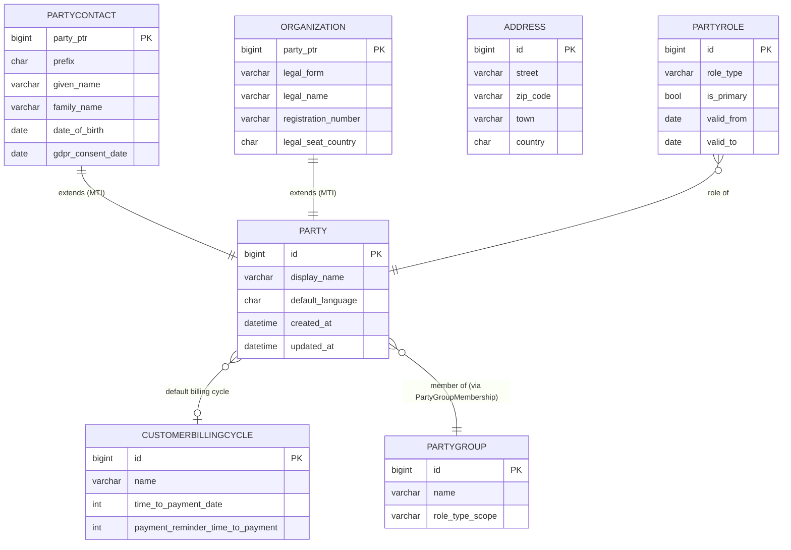
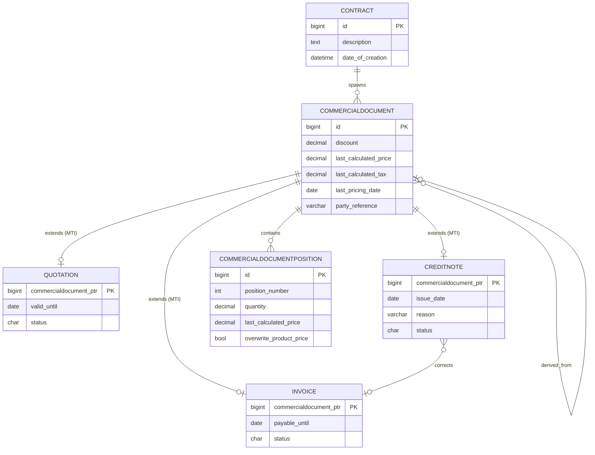
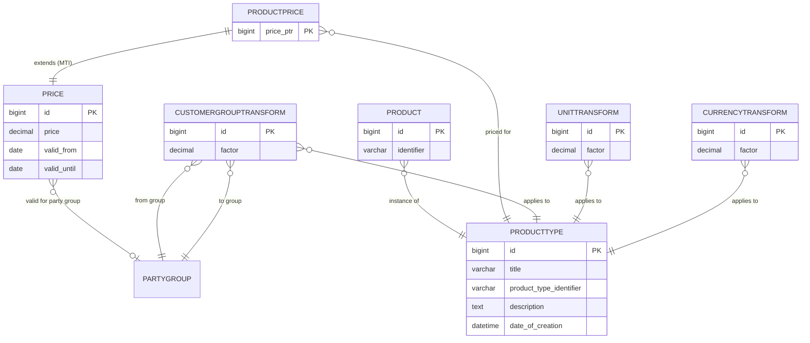
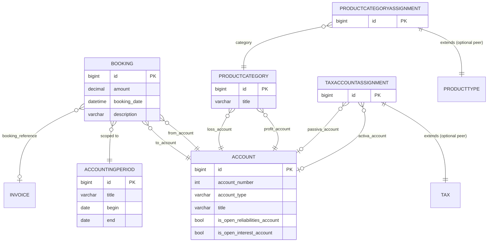
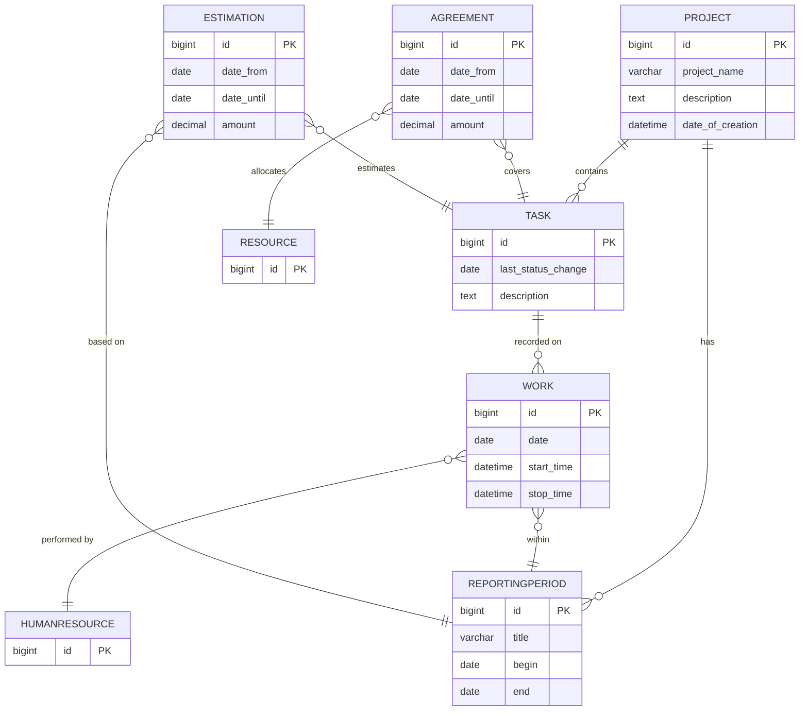
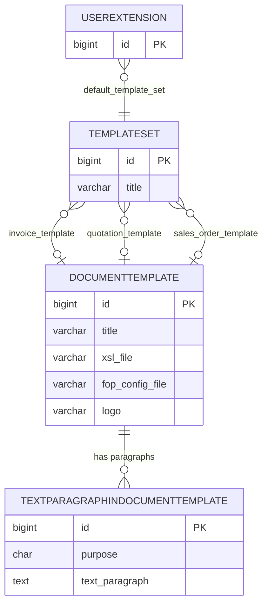
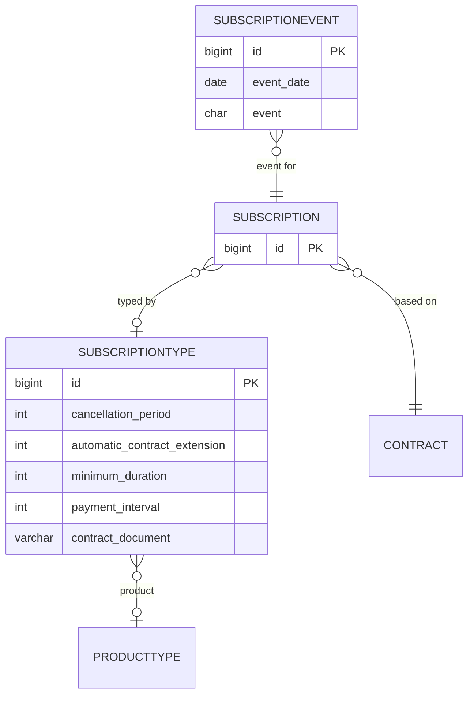
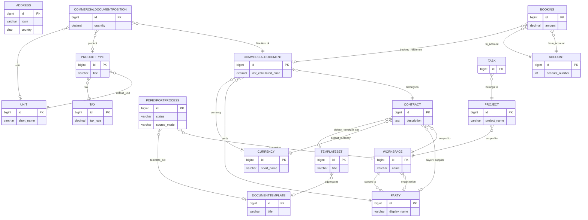

# koalixcrm — Entity Relation Diagram

## Overview

koalixcrm uses a single **PostgreSQL** relational database shared by all eight Django apps. The
persistence layer is managed by the **Django ORM** (code-first, model-driven schema). Schema
lifecycle is handled via Django's built-in migration framework; each app owns its `migrations/`
directory and forward-only migration files. There are no backward migration rollback scripts.

**Connection strategy:** a single database connection pool configured by Django's `DATABASES`
setting, served by Gunicorn workers in the Django container and by the Celery worker container.
The `WorkspaceAwareManager` injects an automatic `filter(workspace=<active>)` clause into every
queryset for all models inheriting `WorkspaceScopedModel`.

**Schema management:** code-first via Django migrations. Migration files are numbered sequentially
per app and applied with `python manage.py migrate`. The `koalixcrm.migration_utils` module provides
the `CreateModelIfNotExists` custom operation for idempotent table creation during multi-deployment
scenarios.

**Inheritance strategy:** Django Multi-Table Inheritance (MTI) is used in four domains:
`Contacts` (Party → Organization / PartyContact), `Contracts` (CommercialDocument → seven subtypes),
`Products` (Price → ProductPrice), and `DjangoUserExtension` (DocumentTemplate → ten subtype
templates).

---

## Entity Summary Table

| Entity | Module | Table | Key Attributes | Relationships |
|--------|--------|-------|----------------|---------------|
| Workspace | core | `crm_workspace` | id PK, name, is_active, external_workspace_reference | FK to Organization; root of all workspace-scoped records |
| RoleInWorkspace | core | `crm_roleinworkspace` | id PK, role | FK to auth.Group, FK to Workspace |
| WorkspaceSwitchEvent | core | `crm_workspaceswitchevent` | id PK, timestamp | FK to auth.User, FK to Workspace (from/to) |
| Currency | core | `crm_currency` | id PK, short_name, rounding | Referenced by CommercialDocument, Price, CurrencyTransform |
| CurrencyTransform | core | `crm_currencytransform` | id PK, factor | FK to Currency (from/to), FK to ProductType |
| Tax | core | `crm_tax` | id PK, tax_rate, name | Referenced by ProductType; extended by TaxAccountAssignment |
| Unit | core | `crm_unit` | id PK, short_name | Self-FK (fraction hierarchy); referenced by Price, Position |
| UnitTransform | core | `crm_unittransform` | id PK, factor | FK to Unit (from/to), FK to ProductType |
| PDFExportProcess | core | `crm_pdfexportprocess` | id PK, source_model, source_id, status, result_url | FK to Workspace, FK to DocumentTemplate, FK to auth.User |
| Party | contacts | `crm_party` | id PK, display_name, default_language | FK to Workspace, FK to CustomerBillingCycle; root of MTI hierarchy |
| PartyContact | contacts | `crm_partycontact` | party_ptr PK, given_name, family_name, gdpr_consent_date | MTI child of Party |
| Organization | contacts | `crm_organization` | party_ptr PK, legal_form, legal_name, registration_number | MTI child of Party; referenced by Workspace |
| Address | contacts | `crm_address` | id PK, street, zip_code, town, country | FK to Workspace; assigned via AddressAssignment |
| AddressAssignment | contacts | `crm_addressassignment` | id PK, purpose, is_primary | FK to Party, FK to Address |
| PartyEmail | contacts | `crm_partyemail` | id PK, email | FK to Workspace; assigned via EmailAssignment |
| PhoneNumber | contacts | `crm_phonenumber` | id PK, phone_e164 | FK to Workspace; assigned via PhoneAssignment |
| EmailAssignment | contacts | `crm_emailassignment` | id PK, purpose, is_primary | FK to Party, FK to PartyEmail |
| PhoneAssignment | contacts | `crm_phoneassignment` | id PK, purpose, is_primary | FK to Party, FK to PhoneNumber |
| CustomerBillingCycle | contacts | `crm_customerbillingcycle` | id PK, name, time_to_payment_date | FK to Workspace |
| PartyRole | contacts | `crm_partyrole` | id PK, role_type, is_primary | FK to Party |
| PartyGroup | contacts | `crm_partygroup` | id PK, name, role_type_scope | FK to Workspace |
| PartyGroupMembership | contacts | `crm_partygroupmembership` | id PK | FK to Party, FK to PartyGroup |
| PartyIdentification | contacts | `crm_partyidentification` | id PK, scheme, value | FK to Party |
| OrganizationMembership | contacts | `crm_organizationmembership` | id PK, title, position, is_primary | FK to PartyContact, FK to Organization |
| OrganizationRelationship | contacts | `crm_organizationrelationship` | id PK, relationship_type | FK to Organization (parent/child) |
| Contract | contracts | `crm_contract` | id PK, description | FK to Workspace, FK to Party (buyer/supplier), FK to Currency, FK to TemplateSet |
| CommercialDocument | contracts | `crm_commercialdocument` | id PK, discount, last_calculated_price, last_calculated_tax | FK to Contract, FK to Party, FK to Currency, FK to DocumentTemplate |
| Invoice | contracts | `crm_invoice` | commercialdocument_ptr PK, payable_until, status | MTI child of CommercialDocument |
| Quotation | contracts | `crm_quotation` | commercialdocument_ptr PK, valid_until, status | MTI child of CommercialDocument |
| SalesOrder | contracts | `crm_salesorder` | commercialdocument_ptr PK | MTI child of CommercialDocument |
| PurchaseOrder | contracts | `crm_purchaseorder` | commercialdocument_ptr PK, status | MTI child of CommercialDocument |
| CreditNote | contracts | `crm_creditnote` | commercialdocument_ptr PK, issue_date, reason, status | MTI child of CommercialDocument; FK to Invoice |
| DespatchAdvice | contracts | `crm_despatchadvice` | commercialdocument_ptr PK, tracking_reference, status | MTI child of CommercialDocument |
| PaymentReminder | contracts | `crm_paymentreminder` | commercialdocument_ptr PK, payable_until, iteration_number | MTI child of CommercialDocument |
| CommercialDocumentPosition | contracts | `crm_commercialdocumentposition` | id PK, position_number, quantity, last_calculated_price | FK to CommercialDocument, FK to ProductType, FK to Unit |
| ContractAddressAssignment | contracts | `crm_contractaddressassignment` | id PK, purpose, is_primary | FK to Contract, FK to Address |
| CommercialDocumentAddressAssignment | contracts | `crm_commercialdocumentaddressassignment` | id PK, purpose, is_primary | FK to CommercialDocument, FK to Address |
| TextParagraphInCommercialDocument | contracts | `crm_textparagraphincommercialdocument` | id PK, purpose, text_paragraph | FK to CommercialDocument |
| ProductType | products | `crm_producttype` | id PK, title, product_type_identifier | FK to Workspace, FK to Unit, FK to Tax |
| Product | products | `crm_product` | id PK, identifier | FK to Workspace, FK to ProductType |
| Price | products | `crm_price` | id PK, price, valid_from, valid_until | FK to Workspace, FK to Unit, FK to Currency, FK to PartyGroup |
| ProductPrice | products | `crm_productprice` | price_ptr PK | MTI child of Price; FK to ProductType |
| CustomerGroupTransform | products | `crm_customergrouptransform` | id PK, factor | FK to Workspace, FK to PartyGroup (from/to), FK to ProductType |
| Account | accounting | (no db_table set) | id PK, account_number, account_type, title | Referenced by Booking, TaxAccountAssignment, ProductCategory |
| AccountingPeriod | accounting | (no db_table set) | id PK, title, begin, end | Referenced by Booking; FK to DocumentTemplate (x2) |
| Booking | accounting | (no db_table set) | id PK, amount, booking_date | FK to Account (from/to), FK to AccountingPeriod, FK to Invoice |
| ProductCategory | accounting | (no db_table set) | id PK, title | FK to Account (profit/loss) |
| TaxAccountAssignment | accounting | (no db_table set) | id PK | OneToOne to Tax; FK to Account (activa/passiva) |
| ProductCategoryAssignment | accounting | (no db_table set) | id PK | OneToOne to ProductType; FK to ProductCategory |
| Project | reporting | `crm_project` | id PK, project_name | FK to Workspace, FK to ProjectStatus, FK to Currency, FK to TemplateSet |
| Task | reporting | `crm_task` | id PK, last_status_change | FK to Project, FK to TaskStatus |
| Work | reporting | `crm_work` | id PK, date, start_time | FK to HumanResource, FK to Task, FK to ReportingPeriod |
| ReportingPeriod | reporting | `crm_reportingperiod` | id PK, title, begin, end | FK to Project, FK to ReportingPeriodStatus |
| HumanResource | reporting | `crm_humanresource` | id PK | FK to UserExtension |
| Resource | reporting | `crm_resource` | id PK | FK to ResourceManager, FK to ResourceType |
| ResourceManager | reporting | `crm_resourcemanager` | id PK | FK to UserExtension |
| ResourcePrice | reporting | `crm_resourceprice` | id PK, price | FK to Resource |
| Agreement | reporting | `crm_agreement` | id PK, date_from, date_until, amount | FK to Task, FK to Resource, FK to Unit, FK to ResourcePrice, FK to AgreementType, FK to AgreementStatus |
| Estimation | reporting | `crm_estimation` | id PK, date_from, date_until, amount | FK to Task, FK to Resource, FK to EstimationStatus, FK to ReportingPeriod |
| GenericProjectLink | reporting | `crm_genericprojectlink` | id PK, object_id | FK to Project, FK to ProjectLinkType; GenericForeignKey |
| GenericTaskLink | reporting | `crm_generictasklink` | id PK, object_id | FK to Task, FK to TaskLinkType; GenericForeignKey |
| ProjectStatus | reporting | `crm_projectstatus` | id PK, title | Referenced by Project |
| TaskStatus | reporting | `crm_taskstatus` | id PK, title, is_done | Referenced by Task |
| ReportingPeriodStatus | reporting | `crm_reportingperiodstatus` | id PK, title, is_done | Referenced by ReportingPeriod |
| AgreementStatus | reporting | `crm_agreementstatus` | id PK, title, is_agreed | Referenced by Agreement |
| AgreementType | reporting | `crm_agreementtype` | id PK, title | Referenced by Agreement |
| EstimationStatus | reporting | `crm_estimationstatus` | id PK, title, is_obsolete | Referenced by Estimation |
| ProjectLinkType | reporting | `crm_projectlinktype` | id PK, title | Referenced by GenericProjectLink |
| TaskLinkType | reporting | `crm_tasklinktype` | id PK, title | Referenced by GenericTaskLink |
| ResourceType | reporting | `crm_resourcetype` | id PK, title | Referenced by Resource |
| Subscription | subscriptions | (no db_table set) | id PK | FK to Contract, FK to SubscriptionType |
| SubscriptionEvent | subscriptions | (no db_table set) | id PK, event_date, event | FK to Subscription |
| SubscriptionType | subscriptions | (no db_table set) | id PK, cancellation_period, payment_interval | FK to ProductType |
| DocumentTemplate | djangoUserExtension | (no db_table set) | id PK, title, xsl_file | FK to Workspace; base of MTI template hierarchy |
| TemplateSet | djangoUserExtension | (no db_table set) | id PK, title | FK to Workspace; FK to ten DocumentTemplate subtypes |
| TextParagraphInDocumentTemplate | djangoUserExtension | `crm_textparagraphindocumenttemplate` | id PK, purpose, text_paragraph | FK to DocumentTemplate |
| UserExtension | djangoUserExtension | (no db_table set) | id PK | FK to Workspace, FK to auth.User, FK to TemplateSet, FK to Currency |
| UserAddressAssignment | djangoUserExtension | (no db_table set) | id PK, purpose, is_primary | FK to auth.User, FK to Address |
| UserPhoneAssignment | djangoUserExtension | (no db_table set) | id PK, purpose, is_primary | FK to auth.User, FK to PhoneNumber |
| UserEmailAssignment | djangoUserExtension | (no db_table set) | id PK, purpose, is_primary | FK to auth.User, FK to PartyEmail |

---

## Entity Relation Diagrams by Module

### Module: Core

The core module defines the tenant isolation infrastructure (`Workspace`, `WorkspaceScopedModel`),
lookup tables (`Currency`, `Tax`, `Unit`), unit/currency conversion records (`UnitTransform`,
`CurrencyTransform`), the asynchronous PDF job tracker (`PDFExportProcess`), and workspace-level
access control (`RoleInWorkspace`).

*Figure 1: Core module — tenant isolation, lookup tables, and workspace access control. `UnitTransform`
and `CurrencyTransform` are not shown here; they appear in the Products cross-module diagram.*

### Module: Contacts

The contacts module manages all legal persons (organizations and individuals) using Multi-Table
Inheritance rooted at `Party`. Contact methods (email, phone, address) are owned as independent
entities and assigned to parties via purpose-tagged assignment tables, allowing shared re-use
across parties. Roles and group memberships are stored as first-class rows, enabling time-bounded
and multi-role party modelling.

*Figure 2: Contacts module — Party MTI hierarchy, address/contact method foundations, and
group/role structures. Assignment join tables (AddressAssignment, EmailAssignment, PhoneAssignment)
and PartyIdentification are omitted for readability.*

### Module: Contracts (Commercial Documents)

The contracts module manages the full lifecycle of commercial activities. A `Contract` is the
root; it spawns `CommercialDocument` subtypes via MTI. All commercial documents carry a `party`
FK, a `currency` FK, and a set of line-item positions. Address and contact-method assignments
are stored in dedicated join tables at both the contract and document level.

*Figure 3: Contracts module — Contract root, CommercialDocument MTI hierarchy (three of seven
subtypes shown), and line-item positions. SalesOrder, PurchaseOrder, DespatchAdvice, and
PaymentReminder also extend CommercialDocument via MTI but are omitted here for readability.*

### Module: Products

The products module defines product catalogue items (`ProductType`, `Product`) and a flexible
price resolution system. `Price` is the abstract MTI parent; `ProductPrice` extends it with a
`product_type` FK. Price applicability is evaluated against date ranges, currency, unit, and
party-group membership. Unit and currency conversion factors are kept in transform tables.

*Figure 4: Products module — product catalogue and multi-axis price resolution. `PARTYGROUP` is
owned by the contacts module; `UNITTRANSFORM` and `CURRENCYTRANSFORM` are owned by the core module.*

### Module: Accounting

The accounting module is an optional app. It implements double-entry bookkeeping. `Account` records
group into `ProductCategory` for profit/loss aggregation. `Booking` records reference the source
`Invoice` and are scoped to an `AccountingPeriod`. Two assignment tables (`TaxAccountAssignment`,
`ProductCategoryAssignment`) keep the accounting-specific FKs off the fork-public `core.Tax` and
`products.ProductType` models.

*Figure 5: Accounting module — double-entry ledger, accounting periods, and the two optional-peer
assignment tables. `TAX` and `PRODUCTTYPE` are owned by the core and products modules respectively.*

### Module: Reporting

The reporting module tracks project work through a `Project` → `Task` → `Work` hierarchy.
Resources (human and material) are linked to tasks via `Agreement` and planned effort via
`Estimation`, both scoped to a `ReportingPeriod`. Generic link tables allow associating
external CRM objects with projects and tasks via Django's `ContentType` framework.

*Figure 6: Reporting module — project/task/work hierarchy, resource allocation agreements, and
effort estimations. Status lookup tables (ProjectStatus, TaskStatus, ReportingPeriodStatus,
AgreementStatus, AgreementType, EstimationStatus, ResourceType) and generic link tables are
omitted for readability.*

### Module: DjangoUserExtension

The djangoUserExtension module ties a Django `auth.User` to CRM configuration data: a
`TemplateSet` (which aggregates ten `DocumentTemplate` subtypes for different document types)
and a default `Currency`. It also manages contact method assignments for users (address, phone,
email) using the same join-table pattern as the contacts module.

*Figure 7: DjangoUserExtension module — DocumentTemplate MTI base and TemplateSet aggregator.
The ten DocumentTemplate MTI subtypes (InvoiceTemplate, QuotationTemplate, SalesOrderTemplate,
etc.) each map to a separate database table via MTI but share the same parent structure shown here.
UserAddressAssignment, UserPhoneAssignment, and UserEmailAssignment are omitted for readability.*

### Module: Subscriptions

The subscriptions module is an optional app. It models recurring service arrangements by linking
a `Contract` to a `SubscriptionType` that defines the billing periodicity and cancellation terms.
Individual lifecycle events are recorded in `SubscriptionEvent`.

*Figure 8: Subscriptions module — recurring service arrangement structure.*

---

## Complete Entity Relation Diagram

The diagram below shows all principal entities and their cross-module foreign-key relationships.
For readability, lookup/status tables, assignment join tables, and MTI child tables are collapsed
into their parents.

*Figure 9: Complete cross-module entity overview. Lookup tables, join tables, MTI subtypes, and
status reference tables are collapsed for readability. See per-module diagrams for full detail.*

---

## Entity Details

### Entity: Workspace

| Property | Value |
|----------|-------|
| **Source File** | `koalixcrm/core/models/workspace.py` |
| **Table** | `crm_workspace` |
| **Module** | core |

**Attributes:**

| Attribute | Type | Constraints | Description |
|-----------|------|-------------|-------------|
| id | bigint | PK | Auto-generated primary key |
| name | varchar(200) | NOT NULL, UNIQUE | Human-readable workspace name |
| organization | FK → contacts.Organization | NULL | Optional legal entity this workspace represents |
| color | varchar(7) | | Hex color for admin header visual cue |
| description | text | | Free-text description |
| external_workspace_reference | varchar(255) | | Short prefix used in human-readable object IDs (e.g. REP-TASK-1) |
| is_active | bool | NOT NULL, INDEX | Soft-delete flag |
| date_added | date | auto_now_add | Creation date |
| last_modified | date | auto_now | Last modification date |

**Relationships:**

| Related Entity | Cardinality | Description |
|---------------|-------------|-------------|
| contacts.Organization | Many-to-One | Optional: the legal entity this workspace represents |
| All WorkspaceScopedModel children | One-to-Many | Every workspace-scoped record belongs to one workspace |

### Entity: Party

| Property | Value |
|----------|-------|
| **Source File** | `koalixcrm/contacts/models/party.py` |
| **Table** | `crm_party` |
| **Module** | contacts |

**Attributes:**

| Attribute | Type | Constraints | Description |
|-----------|------|-------------|-------------|
| id | bigint | PK | Auto-generated primary key |
| workspace | FK → core.Workspace | NOT NULL | Tenant scope (inherited from WorkspaceScopedModel) |
| display_name | varchar(300) | NOT NULL | Human-readable label for the party |
| default_language | char(2) | NULL | ISO 639-1 code (de/fr/it/en) |
| default_billing_cycle | FK → CustomerBillingCycle | NULL | Billing cycle applied when this party acts as a customer |
| last_modified_by | FK → auth.User | NULL | Staff user who last modified this record |
| created_at | datetime | auto_now_add | |
| updated_at | datetime | auto_now | |

**Relationships:**

| Related Entity | Cardinality | Description |
|---------------|-------------|-------------|
| PartyContact | One-to-One | MTI child for natural persons |
| Organization | One-to-One | MTI child for legal entities |
| AddressAssignment | One-to-Many | Assigned postal addresses with purpose and validity period |
| EmailAssignment | One-to-Many | Assigned email addresses |
| PhoneAssignment | One-to-Many | Assigned phone numbers |
| PartyRole | One-to-Many | Roles played by this party |
| PartyGroupMembership | One-to-Many | Group memberships |
| PartyIdentification | One-to-Many | External identifier schemes (VAT number, etc.) |
| CommercialDocument | One-to-Many | Documents where this party is the counterpart |
| Contract | One-to-Many | Contracts where this party is buyer or supplier |

**Validation Rules:**

- `gdpr_consent_date` on `PartyContact` is recorded at GDPR consent time; no automated expiry.

### Entity: CommercialDocument

| Property | Value |
|----------|-------|
| **Source File** | `koalixcrm/contracts/models/commercial_document.py` |
| **Table** | `crm_commercialdocument` |
| **Module** | contracts |

**Attributes:**

| Attribute | Type | Constraints | Description |
|-----------|------|-------------|-------------|
| id | bigint | PK | Auto-generated primary key |
| workspace | FK → core.Workspace | NOT NULL | Tenant scope |
| contract | FK → Contract | NOT NULL | Parent contract |
| party | FK → contacts.Party | NOT NULL | Counterpart (buyer for outgoing, supplier for purchasing) |
| currency | FK → core.Currency | NOT NULL | Document currency |
| template_set | FK → djangoUserExtension.DocumentTemplate | NULL | XSL template used for PDF rendering |
| discount | decimal(5,2) | NULL | Document-level percentage discount |
| description | varchar(100) | NULL | Short label |
| last_pricing_date | date | NULL | Date when price was last recalculated |
| last_calculated_price | decimal(17,2) | NULL | Cached net price (without tax) |
| last_calculated_tax | decimal(17,2) | NULL | Cached tax amount |
| party_reference | varchar(100) | | Counterpart's own reference number |
| ext_business_appl_references | jsonb | default={} | External application cross-references |
| custom_date_field | date | NULL | Application-specific date |
| derived_from_commercial_document | FK → CommercialDocument | NULL | Source document when created by copy-forward |
| last_print_date | datetime | NULL | Last time a PDF was generated |
| date_of_creation | datetime | auto_now_add | |
| last_modification | datetime | auto_now | |

**Relationships:**

| Related Entity | Cardinality | Description |
|---------------|-------------|-------------|
| Contract | Many-to-One | Parent contract |
| Invoice, Quotation, etc. | One-to-One | MTI child subtypes |
| CommercialDocumentPosition | One-to-Many | Line items |
| CommercialDocumentAddressAssignment | One-to-Many | Assigned addresses (billing, shipping, etc.) |
| CommercialDocumentPhoneAssignment | One-to-Many | Assigned phone numbers |
| CommercialDocumentEmailAssignment | One-to-Many | Assigned email addresses |
| TextParagraphInCommercialDocument | One-to-Many | Boilerplate text sections |
| Booking | One-to-Many | Accounting bookings that reference this document |

### Entity: ProductType

| Property | Value |
|----------|-------|
| **Source File** | `koalixcrm/products/models/product_type.py` |
| **Table** | `crm_producttype` |
| **Module** | products |

**Attributes:**

| Attribute | Type | Constraints | Description |
|-----------|------|-------------|-------------|
| id | bigint | PK | |
| workspace | FK → core.Workspace | NOT NULL | Tenant scope |
| title | varchar(200) | NOT NULL | Display name |
| product_type_identifier | varchar(200) | NULL | Human-readable product number |
| description | text | NULL | Long-form description |
| default_unit | FK → core.Unit | NOT NULL | Default unit of measure |
| tax | FK → core.Tax | NOT NULL | Tax rate applied to positions |
| last_modification | datetime | auto_now | |
| date_of_creation | datetime | auto_now_add | |

**Relationships:**

| Related Entity | Cardinality | Description |
|---------------|-------------|-------------|
| Product | One-to-Many | Specific product instances of this type |
| ProductPrice | One-to-Many | Price entries for this product type |
| CustomerGroupTransform | One-to-Many | Customer-group price adjustment factors |
| UnitTransform | One-to-Many | Unit conversion factors |
| CurrencyTransform | One-to-Many | Currency conversion factors |
| CommercialDocumentPosition | One-to-Many | Positions referencing this product type |
| ProductCategoryAssignment | One-to-One | Accounting category (optional peer) |

### Entity: Project

| Property | Value |
|----------|-------|
| **Source File** | `koalixcrm/reporting/models/project.py` |
| **Table** | `crm_project` |
| **Module** | reporting |

**Attributes:**

| Attribute | Type | Constraints | Description |
|-----------|------|-------------|-------------|
| id | bigint | PK | |
| workspace | FK → core.Workspace | NOT NULL | Tenant scope |
| project_name | varchar(100) | NULL | Project title |
| description | text | NULL | Long-form description |
| project_status | FK → ProjectStatus | NULL | Current status |
| default_template_set | FK → djangoUserExtension.TemplateSet | NULL | Default PDF template set |
| default_currency | FK → core.Currency | NOT NULL | Reporting currency |
| project_manager | FK → auth.User | NULL | Responsible staff user |
| date_of_creation | datetime | auto_now_add | |
| last_modification | datetime | auto_now | |

**Relationships:**

| Related Entity | Cardinality | Description |
|---------------|-------------|-------------|
| Task | One-to-Many | Tasks belonging to this project |
| ReportingPeriod | One-to-Many | Time periods for tracking reported work |
| GenericProjectLink | One-to-Many | Generic links to external CRM objects |

### Entity: Account

| Property | Value |
|----------|-------|
| **Source File** | `koalixcrm/accounting/models/account.py` |
| **Table** | Default Django table name (app_label + model name) |
| **Module** | accounting |

**Attributes:**

| Attribute | Type | Constraints | Description |
|-----------|------|-------------|-------------|
| id | bigint | PK | |
| account_number | int | NOT NULL | Ledger account number |
| title | varchar(50) | NOT NULL | Account description |
| account_type | char(1) | NOT NULL | A=Asset, L=Liability, E=Earnings, S=Spending |
| description | text | NULL | |
| is_open_reliabilities_account | bool | NOT NULL | Marks the single open-liabilities account |
| is_open_interest_account | bool | NOT NULL | Marks the single open-interests account |
| is_product_inventory_activa | bool | NOT NULL | Marks product inventory accounts |
| is_a_customer_payment_account | bool | NOT NULL | Marks customer payment accounts |

**Relationships:**

| Related Entity | Cardinality | Description |
|---------------|-------------|-------------|
| Booking | One-to-Many | All bookings from or to this account |
| ProductCategory | One-to-Many | Categories that use this account as profit or loss account |
| TaxAccountAssignment | One-to-One | Maps tax records to activa/passiva accounts |

**Validation Rules:**
- At most one account may have `is_open_reliabilities_account=True`; it must be account type L.
- At most one account may have `is_open_interest_account=True`; it must be account type A.
- `is_a_customer_payment_account` and `is_product_inventory_activa` require account type A.

---

## Database Migration Documentation

### Migration Framework

- **Tool:** Django Migrations (built-in)
- **Configuration:** `DATABASES` Django setting; migration files in each app's `migrations/` directory
- **Entry point:** `python manage.py migrate`
- **Custom operation:** `koalixcrm.migration_utils.CreateModelIfNotExists` — idempotent table
  creation for multi-environment deployment safety

### Migration Strategy

- **Direction:** Forward-only. No `reverse_code` or `RunPython` backward paths are provided in the
  reviewed migrations.
- **Naming Convention:** `NNNN_description.py` — sequential four-digit prefix followed by a
  descriptive snake-case slug.
- **Execution Order:** Sequential, within-app dependency graph enforced by `dependencies = [...]`
  declarations; cross-app `run_before` is used in `accounting.0003_tax_and_category_assignments`
  to guarantee data copy before the source FK columns are dropped in peer apps.

### Migration Inventory

The following table lists structurally significant migrations. Routine auto-generated field
additions and administrative-only changes are omitted.

| App | Migration | Type | Description |
|-----|-----------|------|-------------|
| contacts | `0004_party_data_model` | Structure | Introduces `Party`, `Address`, `PartyEmail`, `PhoneNumber`, `AddressAssignment`, `EmailAssignment`, `PhoneAssignment`, `PartyRole`, `PartyGroup`, `PartyGroupMembership`, `PartyIdentification` — the full party data model replacing the legacy `Customer` model |
| contacts | `0005_backfill_party` | Data | Backfills `Party` rows from legacy `Customer` table |
| contacts | `0007_party_default_billing_cycle` | Structure | Adds `default_billing_cycle` FK on `Party` |
| contacts | `0009_drop_legacy_models` | Structure | Removes the legacy `Customer`, `PostalAddress`, `Email`, `PhoneAddress` models; completes the party data model cutover |
| contacts | `0013_address_split_step1_add` | Structure | Adds structured address fields (`street`, `number`, `additional_address_line_1/2/3`) alongside the old freeform lines |
| contacts | `0014_address_split_step2_data` | Data | Migrates freeform address lines into structured fields |
| contacts | `0015_address_split_step3_remove` | Structure | Removes the old freeform `address_line_*` columns; completes the address field restructure |
| contracts | `0004_rename_sales_document_to_commercial_document` | Structure | Renames the `SalesDocument` MTI parent and all child `*_ptr` fields to `CommercialDocument`; implemented via a custom `RenameParentModel` migration operation that handles MTI pointer field renames atomically |
| contracts | `0005_add_credit_note` | Structure | Adds `CreditNote` as a new MTI child of `CommercialDocument` with `corrects_invoice` FK |
| contracts | `0008_party_fks` | Structure | Replaces legacy `customer` FK on `CommercialDocument` with `party` FK pointing at `contacts.Party` |
| contracts | `0013_contract_address_assignments` | Structure | Adds `ContractAddressAssignment`, `ContractPhoneAssignment`, `ContractEmailAssignment` join tables on `Contract` |
| contracts | `0014_commercial_document_address_assignments` | Structure | Adds `CommercialDocumentAddressAssignment`, `CommercialDocumentPhoneAssignment`, `CommercialDocumentEmailAssignment` join tables on `CommercialDocument` |
| core | `0005_workspace_and_access` | Structure | Introduces `Workspace`, `RoleInWorkspace`, and `WorkspaceSwitchEvent`; uses `CreateModelIfNotExists` for idempotent creation |
| accounting | `0003_tax_and_category_assignments` | Structure + Data | Creates `TaxAccountAssignment` and `ProductCategoryAssignment`; copies existing account FKs from `core.Tax` and `products.ProductType` into the new tables; uses `run_before` to guarantee the copy runs before the source columns are dropped in peer migrations |
| products | `0002_party_group_fks` | Structure | Replaces legacy `CustomerGroup` FKs on `Price` and `CustomerGroupTransform` with `PartyGroup` FKs |

### Migration Patterns

- **Optional-app FK relocation:** The `accounting` app uses assignment tables (`TaxAccountAssignment`,
  `ProductCategoryAssignment`) to hold accounting-specific FKs that previously lived on `core.Tax`
  and `products.ProductType`. This allows the five fork-public apps to be deployed without
  `koalixcrm.accounting` installed.
- **Multi-step data migrations:** The contacts address restructure and party model introduction each
  follow a three-phase pattern: (1) add new columns/tables, (2) backfill data, (3) drop old
  columns/tables. This keeps every intermediate migration state deployable.

### Data Migrations

| Migration | Description | Reversible |
|-----------|-------------|------------|
| `contacts.0005_backfill_party` | Creates `Party` rows from legacy `Customer` records | No |
| `contacts.0008_backfill_party_billing_cycle` | Populates `Party.default_billing_cycle` from legacy `Customer.defaultCustomerBillingCycle` | No |
| `contacts.0014_address_split_step2_data` | Migrates freeform address lines into structured `street`/`number`/`additional_address_line_*` fields | No |
| `accounting.0003_tax_and_category_assignments` | Copies FK values from `core.Tax` and `products.ProductType` into `TaxAccountAssignment` / `ProductCategoryAssignment` | No |

---

## Cross-Module Relationships

| Source Entity (Module) | Target Entity (Module) | Relationship | Coupling Concern |
|------------------------|------------------------|--------------|-----------------|
| Workspace (core) | Organization (contacts) | Workspace optionally represents an Organization | core → contacts import; handled via string FK reference to avoid circular imports |
| Party (contacts) | CustomerBillingCycle (contacts) | Party carries a default billing cycle | Same-app FK; no concern |
| Contract (contracts) | Party (contacts) | Buyer and supplier of a contract | contracts → contacts FK; required peer |
| CommercialDocument (contracts) | Party (contacts) | Counterpart of every commercial document | contracts → contacts FK; required peer |
| CommercialDocumentPosition (contracts) | ProductType (products) | Line items reference a product type | contracts → products FK; optional peer (null allowed when products app absent) |
| ProductType (products) | Tax (core) | Every product type carries a tax rate | products → core FK; required peer |
| ProductType (products) | Unit (core) | Default unit of measure | products → core FK; required peer |
| Price (products) | PartyGroup (contacts) | Price is scoped to a customer group | products → contacts FK; required peer |
| CurrencyTransform (core) | ProductType (products) | Currency conversion is product-type specific | core → products FK; optional peer |
| UnitTransform (core) | ProductType (products) | Unit conversion is product-type specific | core → products FK; optional peer |
| Booking (accounting) | Invoice (contracts) | Accounting bookings reference the source invoice | accounting → contracts FK; accounting is optional |
| TaxAccountAssignment (accounting) | Tax (core) | Links accounting accounts to core tax rates | accounting → core optional-peer pattern |
| ProductCategoryAssignment (accounting) | ProductType (products) | Links accounting categories to product types | accounting → products optional-peer pattern |
| AccountingPeriod (accounting) | DocumentTemplate (djangoUserExtension) | Balance sheet and P&L template references | accounting → djangoUserExtension FK |
| Project (reporting) | Currency (core) | Reporting currency | reporting → core FK |
| Project (reporting) | TemplateSet (djangoUserExtension) | Default PDF template set | reporting → djangoUserExtension FK |
| HumanResource (reporting) | UserExtension (djangoUserExtension) | Links a project resource to a CRM user | reporting → djangoUserExtension FK |
| PDFExportProcess (core) | DocumentTemplate (djangoUserExtension) | PDF job references the XSL template | core → djangoUserExtension FK |
| Subscription (subscriptions) | Contract (contracts) | A subscription is backed by a contract | subscriptions → contracts FK; optional peer |
| SubscriptionType (subscriptions) | ProductType (products) | A subscription type references a product type | subscriptions → products FK; optional peer |
| UserExtension (djangoUserExtension) | Currency (core) | User's default reporting currency | djangoUserExtension → core FK |

---

## Appendix

### Source Files Analyzed

| App | Source Folder |
|-----|--------------|
| core | `koalixcrm/core/models/` |
| contacts | `koalixcrm/contacts/models/` |
| contracts | `koalixcrm/contracts/models/` |
| products | `koalixcrm/products/models/` |
| accounting | `koalixcrm/accounting/models/` |
| reporting | `koalixcrm/reporting/models/` |
| subscriptions | `koalixcrm/subscriptions/models/` |
| djangoUserExtension | `koalixcrm/djangoUserExtension/models/` |

### ORM Configuration

The Django ORM is configured via `projectsettings/settings.py` under the `DATABASES` key
(single database, PostgreSQL backend via `django.db.backends.postgresql`). The ORM uses
the default connection pool provided by Django's database backend.

The `WorkspaceScopedModel` abstract base class in `koalixcrm/core/models/workspace_scoped.py`
replaces the default `Manager` with `WorkspaceAwareManager` (from
`koalixcrm/core/managers/workspace_aware.py`) on all tenant-scoped models.

### Referenced Low-Level Documentation

- [Contacts Models — Low-Level Documentation](../05_building_block_view/koalixcrm/contacts/QQ_LL_Doc_Contacts_Models.md)
- [Contracts Models — Low-Level Documentation](../05_building_block_view/koalixcrm/contracts/QQ_LL_Doc_Contracts_Models.md)
- [Reporting Project/Task Models — Low-Level Documentation](../05_building_block_view/koalixcrm/reporting/QQ_LL_Doc_Reporting_ProjectTaskModels.md)
