# koalixcrm — Entity Relation Diagram

## Overview

koalixcrm uses a single **PostgreSQL** relational database shared by all nine Django apps. The
persistence layer is managed by the **Django ORM** (code-first, model-driven schema). Schema
lifecycle is handled via Django's built-in migration framework; each app owns its `migrations/`
directory and forward-only migration files. There are no backward migration rollback scripts.

**Connection strategy:** a single database connection pool configured by Django's `DATABASES`
setting, served by Gunicorn workers in the Django container and by the Celery worker container.
The `WorkspaceAwareManager` injects an automatic `filter(workspace=<active>)` clause into every
queryset for all models inheriting `WorkspaceScopedModel`.

**Schema management:** code-first via Django migrations. Migration files are numbered sequentially
per app and applied with `python manage.py migrate`. The `koalixcrm.migration_utils` module provides
the `CreateModelIfNotExists` custom operation for idempotent table creation during multi-deployment
scenarios.

**Inheritance strategy:** Django Multi-Table Inheritance (MTI) is used in four domains:
`Contacts` (Party → Organization / PartyContact), `Contracts` (CommercialDocument → seven subtypes),
`Products` (Price → ProductPrice), and `DjangoUserExtension` (DocumentTemplate → ten subtype
templates). The products EAV layer additionally uses an **abstract** base class
(`ProductAttributeValueBase`) shared by the six typed attribute-value tables — abstract
inheritance produces no parent table, unlike MTI.

---

## Entity Summary Table

| Entity | Module | Table | Key Attributes | Relationships |
|--------|--------|-------|----------------|---------------|
| Workspace | core | `crm_workspace` | id PK, name, is_active, external_workspace_reference | FK to Organization; root of all workspace-scoped records |
| RoleInWorkspace | core | `crm_roleinworkspace` | id PK, role | FK to auth.Group, FK to Workspace |
| WorkspaceSwitchEvent | core | `crm_workspaceswitchevent` | id PK, timestamp | FK to auth.User, FK to Workspace (from/to) |
| Currency | core | `crm_currency` | id PK, short_name, rounding | Referenced by CommercialDocument, Price, CurrencyTransform |
| CurrencyTransform | core | `crm_currencytransform` | id PK, factor | FK to Currency (from/to), FK to Product |
| Tax | core | `crm_tax` | id PK, tax_rate, name | Referenced by Product (tax_class); extended by TaxAccountAssignment |
| Unit | core | `crm_unit` | id PK, short_name | Self-FK (fraction hierarchy); referenced by Price, Position, Product, stock quantity records |
| UnitTransform | core | `crm_unittransform` | id PK, factor | FK to Unit (from/to), FK to Product |
| PDFExportProcess | core | `crm_pdfexportprocess` | id PK, source_model, source_id, status, result_url | FK to Workspace, FK to DocumentTemplate, FK to auth.User |
| Party | contacts | `crm_party` | id PK, display_name, default_language | FK to Workspace, FK to CustomerBillingCycle; root of MTI hierarchy |
| PartyContact | contacts | `crm_partycontact` | party_ptr PK, given_name, family_name, gdpr_consent_date | MTI child of Party |
| Organization | contacts | `crm_organization` | party_ptr PK, legal_form, legal_name, registration_number | MTI child of Party; referenced by Workspace |
| Address | contacts | `crm_address` | id PK, street, zip_code, town, country | FK to Workspace; assigned via AddressAssignment |
| AddressAssignment | contacts | `crm_addressassignment` | id PK, purpose, is_primary | FK to Party, FK to Address |
| PartyEmail | contacts | `crm_partyemail` | id PK, email | FK to Workspace; assigned via EmailAssignment |
| PhoneNumber | contacts | `crm_phonenumber` | id PK, phone_e164 | FK to Workspace; assigned via PhoneAssignment |
| EmailAssignment | contacts | `crm_emailassignment` | id PK, purpose, is_primary | FK to Party, FK to PartyEmail |
| PhoneAssignment | contacts | `crm_phoneassignment` | id PK, purpose, is_primary | FK to Party, FK to PhoneNumber |
| CustomerBillingCycle | contacts | `crm_customerbillingcycle` | id PK, name, time_to_payment_date | FK to Workspace |
| PartyRole | contacts | `crm_partyrole` | id PK, role_type, is_primary | FK to Party |
| PartyGroup | contacts | `crm_partygroup` | id PK, name, role_type_scope | FK to Workspace |
| PartyGroupMembership | contacts | `crm_partygroupmembership` | id PK | FK to Party, FK to PartyGroup |
| PartyIdentification | contacts | `crm_partyidentification` | id PK, scheme, value | FK to Party |
| OrganizationMembership | contacts | `crm_organizationmembership` | id PK, title, position, is_primary | FK to PartyContact, FK to Organization |
| OrganizationRelationship | contacts | `crm_organizationrelationship` | id PK, relationship_type | FK to Organization (parent/child) |
| Contract | contracts | `crm_contract` | id PK, description | FK to Workspace, FK to Party (buyer/supplier), FK to Currency, FK to TemplateSet |
| CommercialDocument | contracts | `crm_commercialdocument` | id PK, discount, last_calculated_price, last_calculated_tax | FK to Contract, FK to Party, FK to Currency, FK to DocumentTemplate |
| Invoice | contracts | `crm_invoice` | commercialdocument_ptr PK, payable_until, status | MTI child of CommercialDocument |
| Quotation | contracts | `crm_quotation` | commercialdocument_ptr PK, valid_until, status | MTI child of CommercialDocument |
| SalesOrder | contracts | `crm_salesorder` | commercialdocument_ptr PK | MTI child of CommercialDocument |
| PurchaseOrder | contracts | `crm_purchaseorder` | commercialdocument_ptr PK, status | MTI child of CommercialDocument |
| CreditNote | contracts | `crm_creditnote` | commercialdocument_ptr PK, issue_date, reason, status | MTI child of CommercialDocument; FK to Invoice |
| DespatchAdvice | contracts | `crm_despatchadvice` | commercialdocument_ptr PK, tracking_reference, status | MTI child of CommercialDocument |
| PaymentReminder | contracts | `crm_paymentreminder` | commercialdocument_ptr PK, payable_until, iteration_number | MTI child of CommercialDocument |
| CommercialDocumentPosition | contracts | `crm_commercialdocumentposition` | id PK, position_number, quantity, last_calculated_price | FK to CommercialDocument, FK to Product (field `product_type`), FK to Unit |
| ContractAddressAssignment | contracts | `crm_contractaddressassignment` | id PK, purpose, is_primary | FK to Contract, FK to Address |
| CommercialDocumentAddressAssignment | contracts | `crm_commercialdocumentaddressassignment` | id PK, purpose, is_primary | FK to CommercialDocument, FK to Address |
| TextParagraphInCommercialDocument | contracts | `crm_textparagraphincommercialdocument` | id PK, purpose, text_paragraph | FK to CommercialDocument |
| Product | products | `products_product` | id PK, title, product_type_identifier, kind, lifecycle_status, brand, country_of_origin, kit_mode | FK to Workspace, FK to Unit (base_uom), FK to Tax (tax_class), FK to Party (manufacturer), FK to ProductFamily |
| ProductFamily | products | `products_productfamily` | id PK, name | FK to Workspace; referenced by Product, AttributeSet |
| ProductVariant | products | `products_productvariant` | id PK, sku, gtin, mpn, weight_kg, dimensions, tracking_mode, axis_values | FK to Workspace, FK to Product; referenced by ProductPrice, typed EAV values, and all stock tracking entities |
| ProductTranslation | products | `products_producttranslation` | id PK, language_code, name; UNIQUE(product, language_code) | FK to Workspace, FK to Product |
| ProductMedia | products | `products_productmedia` | id PK, media_type, object_key | FK to Workspace, FK to Product, FK to ProductVariant (both nullable) |
| Classification | products | `products_classification` | id PK, code UNIQUE, name | Global (no workspace FK); parent of ClassificationNode |
| ClassificationNode | products | `products_classificationnode` | id PK, code, name, level; UNIQUE(classification, code) | FK to Classification, self-FK parent; referenced by ProductClassification, AttributeSet |
| ProductClassification | products | `products_productclassification` | id PK; UNIQUE(product, classification_node) | FK to Workspace, FK to Product, FK to ClassificationNode |
| AttributeGroup | products | `products_attributegroup` | id PK, scope, key, name; UNIQUE(workspace, key) | Nullable FK to Workspace (NULL for GLOBAL-scope rows) |
| AttributeDefinition | products | `products_attributedefinition` | id PK, scope, key, canonical_key, label, data_type, min/max/regex/enum_values; UNIQUE(workspace, key) | Nullable FK to Workspace, FK to Unit, FK to AttributeGroup |
| AttributeSet | products | `products_attributeset` | id PK, name, kind | FK to Workspace, FK to ClassificationNode, FK to ProductFamily; M2M to AttributeGroup through AttributeSetGroup |
| AttributeSetGroup | products | `products_attributesetgroup` | id PK, order; UNIQUE(attribute_set, attribute_group) | FK to AttributeSet, FK to AttributeGroup (M2M through table) |
| AttributeSetDefault | products | `products_attributesetdefault` | id PK, default_value; UNIQUE(attribute_set, attribute_definition) | FK to Workspace, FK to AttributeSet, FK to AttributeDefinition |
| AttributeValidationRule | products | `products_attributevalidationrule` | id PK, key, order, is_active, condition, then; UNIQUE(attribute_set, key) | FK to Workspace, FK to AttributeSet |
| ProductAttributeBool | products | `products_productattributebool` | id PK, value; UNIQUE(product, variant, attribute_definition) | FK to Workspace, FK to Product, FK to ProductVariant, FK to AttributeDefinition, FK to ProductAttributeMapping |
| ProductAttributeInt | products | `products_productattributeint` | id PK, value; UNIQUE(product, variant, attribute_definition) | Same FK set as ProductAttributeBool |
| ProductAttributeDecimal | products | `products_productattributedecimal` | id PK, value, unit; UNIQUE(product, variant, attribute_definition) | Same FK set as ProductAttributeBool plus FK to Unit |
| ProductAttributeString | products | `products_productattributestring` | id PK, value; UNIQUE(product, variant, attribute_definition) | Same FK set as ProductAttributeBool |
| ProductAttributeEnum | products | `products_productattributeenum` | id PK, value; UNIQUE(product, variant, attribute_definition) | Same FK set as ProductAttributeBool |
| ProductAttributeReference | products | `products_productattributereference` | id PK, object_id; UNIQUE(product, variant, attribute_definition) | Same FK set as ProductAttributeBool plus FK to ContentType (GenericForeignKey) |
| ProductAttributeMapping | products | `products_productattributemapping` | id PK, source_standard, source_attribute_id, canonical_key, transform; UNIQUE(workspace, source_standard, source_attribute_id) | FK to Workspace; referenced by typed value rows (source_mapping) |
| ProductAttributeMirror | products | `products_productattributemirror` | id PK, data JSONB; UNIQUE(product, variant) | FK to Workspace, FK to Product, FK to ProductVariant |
| PriceList | products | `products_pricelist` | id PK, name, channel; UNIQUE(workspace, name) | FK to Workspace, FK to PartyGroup |
| Price | products | `crm_price` | id PK, price, valid_from, valid_until | FK to Workspace, FK to Unit, FK to Currency, FK to PartyGroup; MTI parent of ProductPrice |
| ProductPrice | products | `crm_productprice` | price_ptr PK | MTI child of Price; FK to ProductVariant, FK to PriceList |
| CustomerGroupTransform | products | `crm_customergrouptransform` | id PK, factor | FK to Workspace, FK to PartyGroup (from/to), FK to Product (field `product_type`) |
| UnitOfMeasureConversion | products | `products_unitofmeasureconversion` | id PK, factor; UNIQUE(product, from_unit, to_unit) | FK to Workspace, FK to Product, FK to Unit (from/to) |
| ProductSupply | products | `products_productsupply` | id PK, supplier_sku, lead_time_days, moq, purchase_price; UNIQUE(product, supplier) | FK to Workspace, FK to Product, FK to Party (supplier), FK to Currency |
| BillOfMaterials | products | `products_billofmaterials` | id PK, name, version | FK to Workspace; OneToOne to Product |
| BomItem | products | `products_bomitem` | id PK, quantity, scrap_pct | FK to Workspace, FK to BillOfMaterials, FK to Product (component + alternative), FK to ProductVariant (default), FK to Unit |
| ServiceProfile | products | `products_serviceprofile` | id PK, billing_model, default_duration, sla_reference | FK to Workspace; OneToOne to Product |
| ProductPassport | products | `products_productpassport` | id PK, passport_data JSONB | FK to Workspace; OneToOne to Product |
| Location | stock | `stock_location` | id PK, location_type, code, name, is_active; UNIQUE(workspace, code), UNIQUE(workspace, external_ref) | FK to Workspace, self-FK parent |
| HandlingUnit | stock | `stock_handlingunit` | id PK, sscc, hu_type, is_open; UNIQUE(workspace, sscc) | FK to Workspace, self-FK parent_handling_unit, FK to Location |
| Batch | stock | `stock_batch` | id PK, batch_number, expiry_date, quarantine; UNIQUE(workspace, variant, batch_number) | FK to Workspace, FK to ProductVariant |
| SerialUnit | stock | `stock_serialunit` | id PK, serial_number, global_uid, condition_state; UNIQUE(workspace, variant, serial_number), UNIQUE(workspace, global_uid) | FK to Workspace, FK to ProductVariant, FK to Batch |
| OnHandRecord | stock | `stock_onhandrecord` | id PK, owner_type, qty_on_hand; UNIQUE(workspace, variant, location, batch, serial_unit, owner_type, owner_party) | FK to Workspace, FK to ProductVariant, FK to Location, FK to Batch, FK to SerialUnit, FK to HandlingUnit, FK to Party (owner), FK to Unit |
| RetentionPolicy | stock | `stock_retentionpolicy` | id PK, retention floor days; UNIQUE(workspace) | FK to Workspace (one policy per workspace) |
| MovementReasonCode | stock | `stock_movementreasoncode` | id PK, code UNIQUE, label_de, label_en, applies_to_business_steps | Global seed table (no workspace FK); referenced by StockMovement |
| MovementReasonCodeExtension | stock | `stock_movementreasoncodeextension` | id PK, code, label_de, label_en; UNIQUE(workspace, code) | FK to Workspace |
| StockMovement | stock | `stock_stockmovement` | id PK, event_type, business_step, occurred_at, qty, disposition, idempotency_key; UNIQUE(workspace, idempotency_key) | FK to Workspace, FK to Product, FK to ProductVariant, FK to Location (source/destination), FK to Batch, FK to SerialUnit, FK to HandlingUnit, FK to MovementReasonCode, FK to Party (owner), FK to ContentType (document), self-FK compensates, FK to auth.User |
| StockBalance | stock | `stock_stockbalance` | id PK, qty_on_hand/booked/reserved_for_document/ordered/in_transit/quarantine; UNIQUE(workspace, variant, location) | FK to Workspace, FK to ProductVariant, FK to Location, FK to Unit |
| StockReservation | stock | `stock_stockreservation` | id PK, kind, reservation_type, reservation_status, qty_reserved, rental_start/end, expires_at | FK to Workspace, FK to ProductVariant, FK to Location, FK to Batch, FK to SerialUnit, FK to ContentType (document), FK to Unit |
| RentalAssignment | stock | `stock_rentalassignment` | id PK, status, rental_start, return_due_date, condition_at_return | FK to Workspace, FK to SerialUnit, FK to OnHandRecord, FK to StockReservation, FK to Party, FK to ContentType (document) |
| GoodsReceipt | stock | `stock_goodsreceipt` | id PK, external_doc_ref, received_at, status | FK to Workspace, FK to Party (supplier), FK to auth.User |
| GoodsReceiptLine | stock | `stock_goodsreceiptline` | id PK, expected_qty, received_qty, line_status | FK to Workspace, FK to GoodsReceipt, FK to ProductVariant, FK to Unit, FK to Batch, FK to SerialUnit, FK to Location (target), FK to StockMovement (posted) |
| ProductionOrder | stock | `stock_productionorder` | id PK, planned_qty, status, planned_start, completed_at, aggregation_group | FK to Workspace, FK to Product, FK to BillOfMaterials, FK to Unit, FK to SerialUnit / Batch (finished output), FK to ContentType (document) |
| ProductionOrderComponent | stock | `stock_productionordercomponent` | id PK, planned_qty, actual_qty | FK to Workspace, FK to ProductionOrder, FK to BomItem, FK to Product, FK to ProductVariant, FK to Batch, FK to Unit, FK to StockReservation |
| BillOfMaterialsExplosion | stock | `stock_billofmaterialsexplosion` | id PK, bom_version, depth, effective_qty, computed_at | FK to Workspace, FK to BillOfMaterials, FK to BomItem, FK to Unit |
| Account | accounting | (no db_table set) | id PK, account_number, account_type, title | Referenced by Booking, TaxAccountAssignment, ProductCategory |
| AccountingPeriod | accounting | (no db_table set) | id PK, title, begin, end | Referenced by Booking; FK to DocumentTemplate (x2) |
| Booking | accounting | (no db_table set) | id PK, amount, booking_date | FK to Account (from/to), FK to AccountingPeriod, FK to Invoice |
| ProductCategory | accounting | (no db_table set) | id PK, title | FK to Account (profit/loss) |
| TaxAccountAssignment | accounting | (no db_table set) | id PK | OneToOne to Tax; FK to Account (activa/passiva) |
| ProductCategoryAssignment | accounting | (no db_table set) | id PK | OneToOne to Product; FK to ProductCategory |
| Project | reporting | `crm_project` | id PK, project_name | FK to Workspace, FK to ProjectStatus, FK to Currency, FK to TemplateSet |
| Task | reporting | `crm_task` | id PK, last_status_change | FK to Project, FK to TaskStatus |
| Work | reporting | `crm_work` | id PK, date, start_time | FK to HumanResource, FK to Task, FK to ReportingPeriod |
| ReportingPeriod | reporting | `crm_reportingperiod` | id PK, title, begin, end | FK to Project, FK to ReportingPeriodStatus |
| HumanResource | reporting | `crm_humanresource` | id PK | FK to UserExtension |
| Resource | reporting | `crm_resource` | id PK | FK to ResourceManager, FK to ResourceType |
| ResourceManager | reporting | `crm_resourcemanager` | id PK | FK to UserExtension |
| ResourcePrice | reporting | `crm_resourceprice` | id PK, price | FK to Resource |
| Agreement | reporting | `crm_agreement` | id PK, date_from, date_until, amount | FK to Task, FK to Resource, FK to Unit, FK to ResourcePrice, FK to AgreementType, FK to AgreementStatus |
| Estimation | reporting | `crm_estimation` | id PK, date_from, date_until, amount | FK to Task, FK to Resource, FK to EstimationStatus, FK to ReportingPeriod |
| GenericProjectLink | reporting | `crm_genericprojectlink` | id PK, object_id | FK to Project, FK to ProjectLinkType; GenericForeignKey |
| GenericTaskLink | reporting | `crm_generictasklink` | id PK, object_id | FK to Task, FK to TaskLinkType; GenericForeignKey |
| ProjectStatus | reporting | `crm_projectstatus` | id PK, title | Referenced by Project |
| TaskStatus | reporting | `crm_taskstatus` | id PK, title, is_done | Referenced by Task |
| ReportingPeriodStatus | reporting | `crm_reportingperiodstatus` | id PK, title, is_done | Referenced by ReportingPeriod |
| AgreementStatus | reporting | `crm_agreementstatus` | id PK, title, is_agreed | Referenced by Agreement |
| AgreementType | reporting | `crm_agreementtype` | id PK, title | Referenced by Agreement |
| EstimationStatus | reporting | `crm_estimationstatus` | id PK, title, is_obsolete | Referenced by Estimation |
| ProjectLinkType | reporting | `crm_projectlinktype` | id PK, title | Referenced by GenericProjectLink |
| TaskLinkType | reporting | `crm_tasklinktype` | id PK, title | Referenced by GenericTaskLink |
| ResourceType | reporting | `crm_resourcetype` | id PK, title | Referenced by Resource |
| Subscription | subscriptions | (no db_table set) | id PK | FK to Contract, FK to SubscriptionType |
| SubscriptionEvent | subscriptions | (no db_table set) | id PK, event_date, event | FK to Subscription |
| SubscriptionType | subscriptions | (no db_table set) | id PK, cancellation_period, payment_interval | FK to Product (field `product_type`) |
| DocumentTemplate | djangoUserExtension | (no db_table set) | id PK, title, xsl_file | FK to Workspace; base of MTI template hierarchy |
| TemplateSet | djangoUserExtension | (no db_table set) | id PK, title | FK to Workspace; FK to ten DocumentTemplate subtypes |
| TextParagraphInDocumentTemplate | djangoUserExtension | `crm_textparagraphindocumenttemplate` | id PK, purpose, text_paragraph | FK to DocumentTemplate |
| UserExtension | djangoUserExtension | (no db_table set) | id PK | FK to Workspace, FK to auth.User, FK to TemplateSet, FK to Currency |
| UserAddressAssignment | djangoUserExtension | (no db_table set) | id PK, purpose, is_primary | FK to auth.User, FK to Address |
| UserPhoneAssignment | djangoUserExtension | (no db_table set) | id PK, purpose, is_primary | FK to auth.User, FK to PhoneNumber |
| UserEmailAssignment | djangoUserExtension | (no db_table set) | id PK, purpose, is_primary | FK to auth.User, FK to PartyEmail |

---

## Entity Relation Diagrams by Module

### Module: Core

The core module defines the tenant isolation infrastructure (`Workspace`, `WorkspaceScopedModel`),
lookup tables (`Currency`, `Tax`, `Unit`), unit/currency conversion records (`UnitTransform`,
`CurrencyTransform`), the asynchronous PDF job tracker (`PDFExportProcess`), and workspace-level
access control (`RoleInWorkspace`).

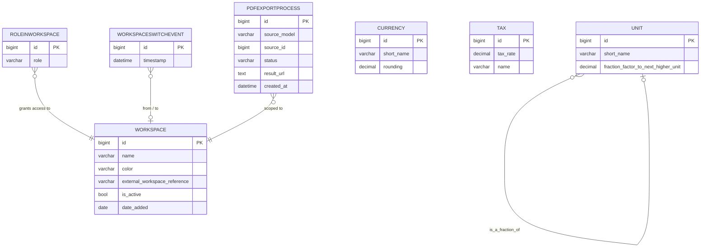

*Figure 1: Core module — tenant isolation, lookup tables, and workspace access control. `UnitTransform`
and `CurrencyTransform` are not shown here; they appear in the Products cross-module diagram.*

### Module: Contacts

The contacts module manages all legal persons (organizations and individuals) using Multi-Table
Inheritance rooted at `Party`. Contact methods (email, phone, address) are owned as independent
entities and assigned to parties via purpose-tagged assignment tables, allowing shared re-use
across parties. Roles and group memberships are stored as first-class rows, enabling time-bounded
and multi-role party modelling.

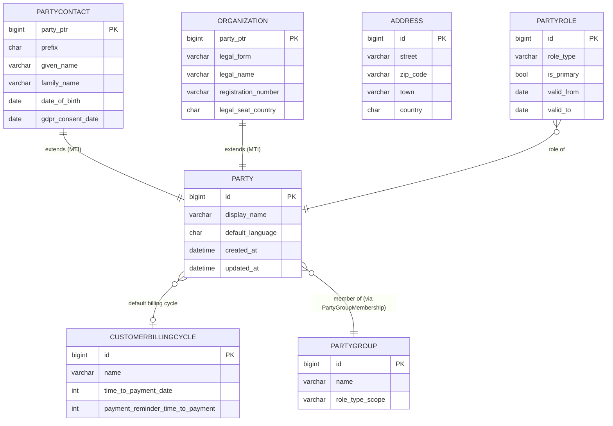

*Figure 2: Contacts module — Party MTI hierarchy, address/contact method foundations, and
group/role structures. Assignment join tables (AddressAssignment, EmailAssignment, PhoneAssignment)
and PartyIdentification are omitted for readability.*

### Module: Contracts (Commercial Documents)

The contracts module manages the full lifecycle of commercial activities. A `Contract` is the
root; it spawns `CommercialDocument` subtypes via MTI. All commercial documents carry a `party`
FK, a `currency` FK, and a set of line-item positions. Address and contact-method assignments
are stored in dedicated join tables at both the contract and document level.

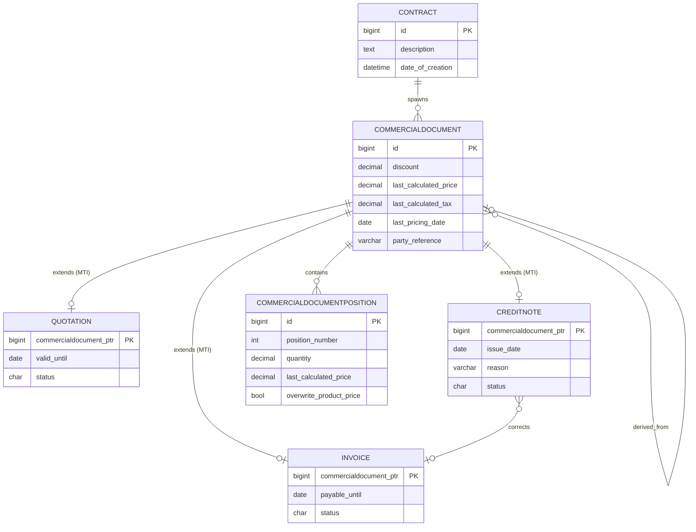

*Figure 3: Contracts module — Contract root, CommercialDocument MTI hierarchy (three of seven
subtypes shown), and line-item positions. SalesOrder, PurchaseOrder, DespatchAdvice, and
PaymentReminder also extend CommercialDocument via MTI but are omitted here for readability.*

### Module: Products

The products module implements the product catalog backbone (ADR-0003/ADR-0021): `Product` is
the catalog root (kind, lifecycle status, base unit of measure, tax class, brand, manufacturer,
country of origin, kit mode), `ProductVariant` is the sellable SKU carrying identifiers and
physical properties, and `ProductFamily` groups related products. Prices are keyed to the
**variant** — `Price` is the MTI parent; `ProductPrice` extends it with `variant` and an optional
`price_list` FK (three-level price precedence). Sourcing (`ProductSupply`), unit conversions
(`UnitOfMeasureConversion`), bill of materials (`BillOfMaterials`/`BomItem`), and the
kind-specific satellites (`ServiceProfile`, `ProductPassport`) complete the backbone. Because
the diagram would be unreadably large as one picture, it is split into two: catalog/pricing/
sourcing and classification/attributes.

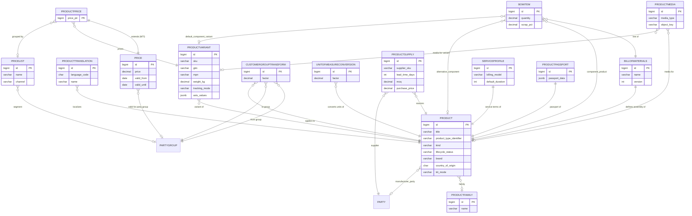

*Figure 4: Products module, part 1 — catalog backbone, variant-keyed pricing, sourcing, and bill
of materials. `PARTY` and `PARTYGROUP` are owned by the contacts module. `UnitTransform` and
`CurrencyTransform` (core module) still exist and now carry an FK to `Product`; FKs to
`core.Unit`, `core.Tax`, and `core.Currency` are omitted for readability.*

The second half of the products module is the classification and attribute (EAV) layer
(ADR-0004/ADR-0018): global classification trees (`Classification`/`ClassificationNode`),
attribute metadata (`AttributeGroup`, `AttributeDefinition`, `AttributeSet` with its through
table `AttributeSetGroup`, `AttributeSetDefault`, `AttributeValidationRule`), six typed
attribute-value tables sharing the abstract `ProductAttributeValueBase`, the import mapping
table `ProductAttributeMapping`, and the denormalized read-model `ProductAttributeMirror`.

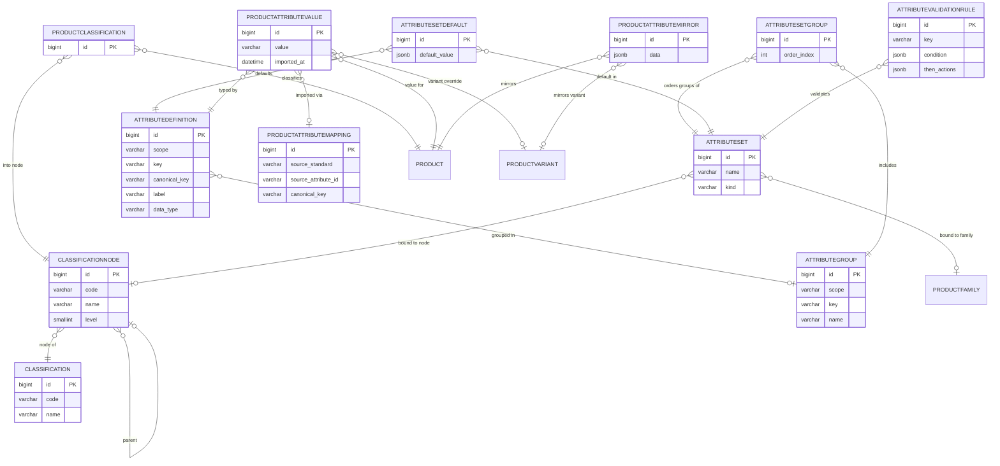

*Figure 5: Products module, part 2 — classification trees and the typed EAV attribute layer.
`PRODUCTATTRIBUTEVALUE` stands for the six concrete tables `ProductAttributeBool` / `Int` /
`Decimal` / `String` / `Enum` / `Reference`, which share the abstract base
`ProductAttributeValueBase` and the unique key `(product, variant, attribute_definition)`.
`Classification`, `ClassificationNode`, and GLOBAL-scope `AttributeGroup` /
`AttributeDefinition` rows are cross-workspace; everything else is workspace-scoped.*

### Module: Stock

The stock module (new with the products/stock domain implementation) provides warehouse
structure, inventory tracking, and the movement ledger. `Location` (hierarchical) and
`HandlingUnit` (SSCC-labelled, nestable) form the physical backbone; `Batch` and `SerialUnit`
implement the variant `tracking_mode` granularities; `OnHandRecord` is the fine-grained on-hand
projection and `StockBalance` the per-variant/location quantity summary. All stock entities are
workspace-scoped except the global `MovementReasonCode` seed table (workspace-specific codes go
into `MovementReasonCodeExtension`).

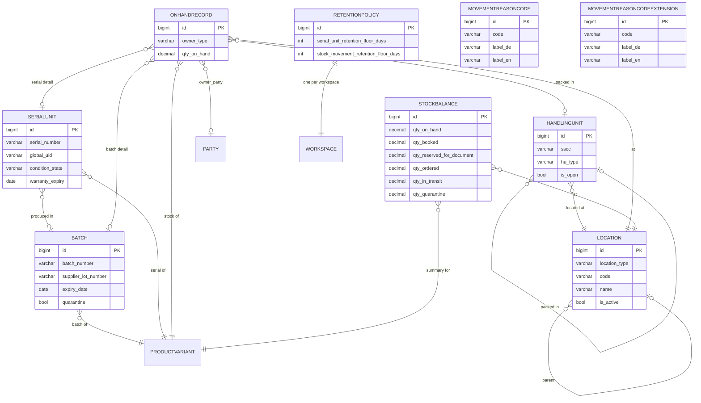

*Figure 6: Stock module, part 1 — location/handling-unit backbone, batch and serial tracking,
and the on-hand projections. `PRODUCTVARIANT` is owned by the products module; `PARTY` by the
contacts module. `MovementReasonCode` is a global seed table; `MovementReasonCodeExtension`
holds workspace-specific additions.*

The second half of the stock module is the event ledger and the process aggregates built on it:
`StockMovement` is the append-only, idempotent movement ledger (EPCIS-style event_type /
business_step / disposition vocabulary, compensation via self-FK); `StockReservation` holds
document- and rental-driven reservations; `RentalAssignment` tracks serialized units out on
rental; `GoodsReceipt`/`GoodsReceiptLine` and `ProductionOrder`/`ProductionOrderComponent` are
the inbound and assembly process aggregates; `BillOfMaterialsExplosion` caches recursive BOM
explosions per version.

```mermaid
erDiagram
    STOCKMOVEMENT {
        bigint id PK
        varchar event_type
        varchar business_step
        datetime occurred_at
        decimal qty
        varchar disposition
        uuid idempotency_key
    }
    STOCKRESERVATION {
        bigint id PK
        varchar kind
        varchar reservation_type
        varchar reservation_status
        decimal qty_reserved
        datetime rental_start
        datetime rental_end
    }
    RENTALASSIGNMENT {
        bigint id PK
        varchar status
        datetime rental_start
        date return_due_date
        varchar condition_at_return
    }
    GOODSRECEIPT {
        bigint id PK
        varchar external_doc_ref
        datetime received_at
        varchar status
    }
    GOODSRECEIPTLINE {
        bigint id PK
        decimal expected_qty
        decimal received_qty
        varchar line_status
    }
    PRODUCTIONORDER {
        bigint id PK
        decimal planned_qty
        varchar status
        datetime planned_start
        datetime completed_at
        uuid aggregation_group
    }
    PRODUCTIONORDERCOMPONENT {
        bigint id PK
        decimal planned_qty
        decimal actual_qty
    }
    BILLOFMATERIALSEXPLOSION {
        bigint id PK
        int bom_version
        int depth
        decimal effective_qty
        datetime computed_at
    }

    STOCKMOVEMENT }o--|| PRODUCT : "moves"
    STOCKMOVEMENT }o--|| PRODUCTVARIANT : "moves variant"
    STOCKMOVEMENT }o--o| LOCATION : "source_location"
    STOCKMOVEMENT }o--o| LOCATION : "destination_location"
    STOCKMOVEMENT }o--o| BATCH : "batch"
    STOCKMOVEMENT }o--o| SERIALUNIT : "serial_unit"
    STOCKMOVEMENT }o--o| HANDLINGUNIT : "handling_unit"
    STOCKMOVEMENT }o--o| MOVEMENTREASONCODE : "reason"
    STOCKMOVEMENT }o--o| PARTY : "owner_party"
    STOCKMOVEMENT }o--o| STOCKMOVEMENT : "compensates"
    STOCKRESERVATION }o--|| PRODUCTVARIANT : "reserves"
    STOCKRESERVATION }o--o| LOCATION : "at"
    STOCKRESERVATION }o--o| BATCH : "batch"
    STOCKRESERVATION }o--o| SERIALUNIT : "serial_unit"
    RENTALASSIGNMENT }o--o| SERIALUNIT : "rents out"
    RENTALASSIGNMENT }o--|| STOCKRESERVATION : "fulfils"
    RENTALASSIGNMENT }o--|| PARTY : "rented to"
    GOODSRECEIPT }o--|| PARTY : "supplier_party"
    GOODSRECEIPTLINE }o--|| GOODSRECEIPT : "line of"
    GOODSRECEIPTLINE }o--|| PRODUCTVARIANT : "receives"
    GOODSRECEIPTLINE }o--o| LOCATION : "target_location"
    GOODSRECEIPTLINE }o--o| STOCKMOVEMENT : "posted_movement"
    PRODUCTIONORDER }o--|| PRODUCT : "produces"
    PRODUCTIONORDER }o--|| BILLOFMATERIALS : "per BOM"
    PRODUCTIONORDER }o--o| SERIALUNIT : "finished_serial_unit"
    PRODUCTIONORDER }o--o| BATCH : "finished_batch"
    PRODUCTIONORDERCOMPONENT }o--|| PRODUCTIONORDER : "component of"
    PRODUCTIONORDERCOMPONENT }o--|| BOMITEM : "planned from"
    PRODUCTIONORDERCOMPONENT }o--|| PRODUCTVARIANT : "consumes"
    PRODUCTIONORDERCOMPONENT }o--o| STOCKRESERVATION : "reserved by"
    BILLOFMATERIALSEXPLOSION }o--|| BILLOFMATERIALS : "explodes"
    BILLOFMATERIALSEXPLOSION }o--|| BOMITEM : "resolved item"
```

*Figure 7: Stock module, part 2 — movement ledger, reservations, rentals, goods receipt, and
production. `PRODUCT`, `PRODUCTVARIANT`, `BILLOFMATERIALS`, and `BOMITEM` are owned by the
products module. Generic document references (`document_type`/`document_id` via ContentType on
StockMovement, StockReservation, RentalAssignment, ProductionOrder), `uom` FKs to `core.Unit`,
and `created_by` FKs to `auth.User` are omitted for readability.*

### Module: Accounting

The accounting module is an optional app. It implements double-entry bookkeeping. `Account` records
group into `ProductCategory` for profit/loss aggregation. `Booking` records reference the source
`Invoice` and are scoped to an `AccountingPeriod`. Two assignment tables (`TaxAccountAssignment`,
`ProductCategoryAssignment`) keep the accounting-specific FKs off the fork-public `core.Tax` and
`products.Product` models.

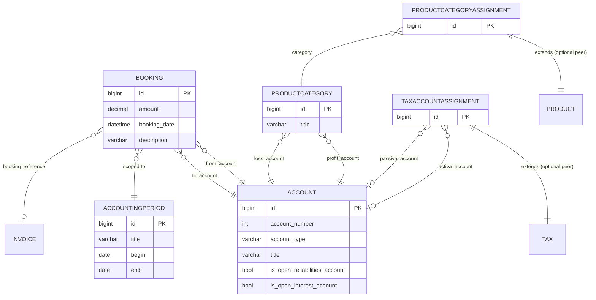

*Figure 8: Accounting module — double-entry ledger, accounting periods, and the two optional-peer
assignment tables. `TAX` and `PRODUCT` are owned by the core and products modules respectively.*

### Module: Reporting

The reporting module tracks project work through a `Project` → `Task` → `Work` hierarchy.
Resources (human and material) are linked to tasks via `Agreement` and planned effort via
`Estimation`, both scoped to a `ReportingPeriod`. Generic link tables allow associating
external CRM objects with projects and tasks via Django's `ContentType` framework.

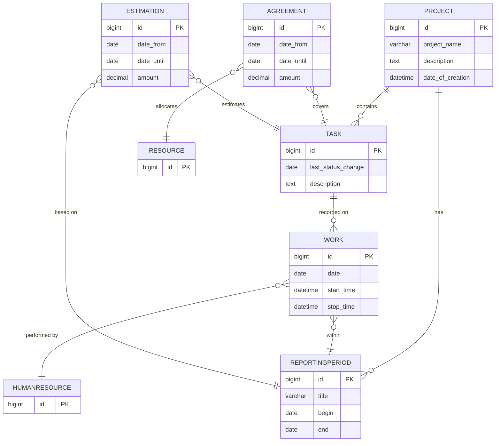

*Figure 9: Reporting module — project/task/work hierarchy, resource allocation agreements, and
effort estimations. Status lookup tables (ProjectStatus, TaskStatus, ReportingPeriodStatus,
AgreementStatus, AgreementType, EstimationStatus, ResourceType) and generic link tables are
omitted for readability.*

### Module: DjangoUserExtension

The djangoUserExtension module ties a Django `auth.User` to CRM configuration data: a
`TemplateSet` (which aggregates ten `DocumentTemplate` subtypes for different document types)
and a default `Currency`. It also manages contact method assignments for users (address, phone,
email) using the same join-table pattern as the contacts module.

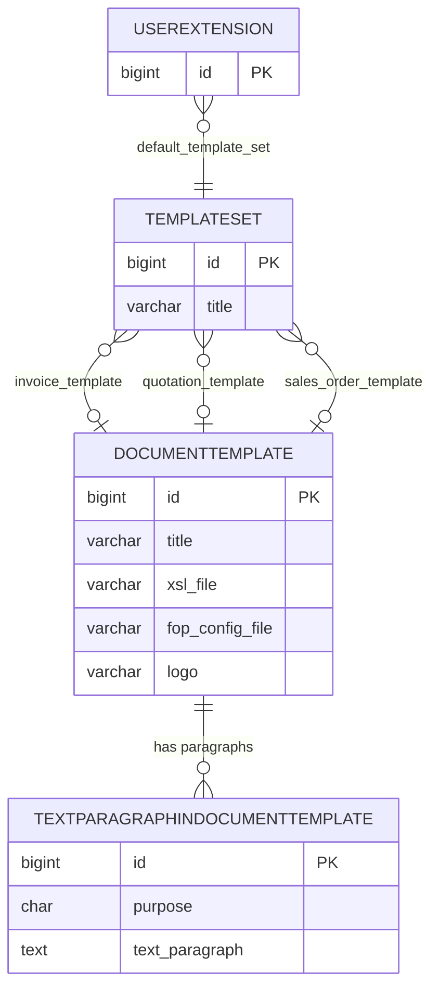

*Figure 10: DjangoUserExtension module — DocumentTemplate MTI base and TemplateSet aggregator.
The ten DocumentTemplate MTI subtypes (InvoiceTemplate, QuotationTemplate, SalesOrderTemplate,
etc.) each map to a separate database table via MTI but share the same parent structure shown here.
UserAddressAssignment, UserPhoneAssignment, and UserEmailAssignment are omitted for readability.*

### Module: Subscriptions

The subscriptions module is an optional app. It models recurring service arrangements by linking
a `Contract` to a `SubscriptionType` that defines the billing periodicity and cancellation terms.
Individual lifecycle events are recorded in `SubscriptionEvent`.

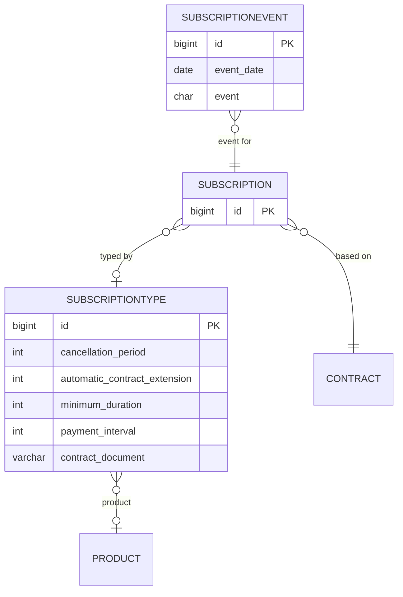

*Figure 11: Subscriptions module — recurring service arrangement structure. `PRODUCT` is owned
by the products module; the FK field is still named `product_type` for historical reasons.*

---

## Complete Entity Relation Diagram

The diagram below shows all principal entities and their cross-module foreign-key relationships.
For readability, lookup/status tables, assignment join tables, and MTI child tables are collapsed
into their parents.

```mermaid
erDiagram
    %% Module: Core
    WORKSPACE {
        bigint id PK
        varchar name
    }
    CURRENCY {
        bigint id PK
        varchar short_name
    }
    TAX {
        bigint id PK
        decimal tax_rate
    }
    UNIT {
        bigint id PK
        varchar short_name
    }
    PDFEXPORTPROCESS {
        bigint id PK
        varchar status
        varchar source_model
    }

    %% Module: Contacts
    PARTY {
        bigint id PK
        varchar display_name
    }
    ADDRESS {
        bigint id PK
        varchar town
        char country
    }

    %% Module: Contracts
    CONTRACT {
        bigint id PK
        text description
    }
    COMMERCIALDOCUMENT {
        bigint id PK
        decimal last_calculated_price
    }
    COMMERCIALDOCUMENTPOSITION {
        bigint id PK
        decimal quantity
    }

    %% Module: Products
    PRODUCT {
        bigint id PK
        varchar title
        varchar kind
        varchar lifecycle_status
    }
    PRODUCTVARIANT {
        bigint id PK
        varchar sku
        varchar tracking_mode
    }

    %% Module: Stock
    LOCATION {
        bigint id PK
        varchar code
        varchar location_type
    }
    STOCKMOVEMENT {
        bigint id PK
        varchar event_type
        varchar business_step
    }
    STOCKBALANCE {
        bigint id PK
        decimal qty_on_hand
    }
    STOCKRESERVATION {
        bigint id PK
        varchar kind
    }

    %% Module: Accounting
    ACCOUNT {
        bigint id PK
        int account_number
    }
    BOOKING {
        bigint id PK
        decimal amount
    }

    %% Module: Reporting
    PROJECT {
        bigint id PK
        varchar project_name
    }
    TASK {
        bigint id PK
    }

    %% Module: DjangoUserExtension
    TEMPLATESET {
        bigint id PK
        varchar title
    }
    DOCUMENTTEMPLATE {
        bigint id PK
        varchar title
    }

    WORKSPACE }o--o| PARTY : "organization"
    PARTY }o--|| WORKSPACE : "scoped to"
    CONTRACT }o--|| WORKSPACE : "scoped to"
    CONTRACT }o--o| PARTY : "buyer / supplier"
    CONTRACT }o--|| CURRENCY : "default_currency"
    CONTRACT }o--o| TEMPLATESET : "default_template_set"
    COMMERCIALDOCUMENT }o--|| CONTRACT : "belongs to"
    COMMERCIALDOCUMENT }o--|| PARTY : "party"
    COMMERCIALDOCUMENT }o--|| CURRENCY : "currency"
    COMMERCIALDOCUMENTPOSITION }o--|| COMMERCIALDOCUMENT : "line item of"
    COMMERCIALDOCUMENTPOSITION }o--o| PRODUCT : "product"
    COMMERCIALDOCUMENTPOSITION }o--o| UNIT : "unit"
    PRODUCT }o--|| UNIT : "base_uom"
    PRODUCT }o--|| TAX : "tax_class"
    PRODUCT }o--o| PARTY : "manufacturer_party"
    PRODUCTVARIANT }o--|| PRODUCT : "variant of"
    STOCKMOVEMENT }o--|| PRODUCTVARIANT : "moves"
    STOCKMOVEMENT }o--o| LOCATION : "source / destination"
    STOCKBALANCE }o--|| PRODUCTVARIANT : "summary for"
    STOCKBALANCE }o--|| LOCATION : "at"
    STOCKRESERVATION }o--|| PRODUCTVARIANT : "reserves"
    LOCATION }o--|| WORKSPACE : "scoped to"
    BOOKING }o--|| ACCOUNT : "from_account"
    BOOKING }o--|| ACCOUNT : "to_account"
    BOOKING }o--o| COMMERCIALDOCUMENT : "booking_reference"
    PROJECT }o--|| WORKSPACE : "scoped to"
    TASK }o--|| PROJECT : "belongs to"
    PDFEXPORTPROCESS }o--|| WORKSPACE : "scoped to"
    PDFEXPORTPROCESS }o--o| DOCUMENTTEMPLATE : "template_set"
    TEMPLATESET }o--o| DOCUMENTTEMPLATE : "aggregates"
```

*Figure 12: Complete cross-module entity overview. Lookup tables, join tables, MTI subtypes,
EAV/classification tables, stock tracking detail (Batch, SerialUnit, HandlingUnit, OnHandRecord),
and status reference tables are collapsed for readability. See per-module diagrams for full
detail.*

---

## Entity Details

### Entity: Workspace

| Property | Value |
|----------|-------|
| **Source File** | `koalixcrm/core/models/workspace.py` |
| **Table** | `crm_workspace` |
| **Module** | core |

**Attributes:**

| Attribute | Type | Constraints | Description |
|-----------|------|-------------|-------------|
| id | bigint | PK | Auto-generated primary key |
| name | varchar(200) | NOT NULL, UNIQUE | Human-readable workspace name |
| organization | FK → contacts.Organization | NULL | Optional legal entity this workspace represents |
| color | varchar(7) | | Hex color for admin header visual cue |
| description | text | | Free-text description |
| external_workspace_reference | varchar(255) | | Short prefix used in human-readable object IDs (e.g. REP-TASK-1) |
| is_active | bool | NOT NULL, INDEX | Soft-delete flag |
| date_added | date | auto_now_add | Creation date |
| last_modified | date | auto_now | Last modification date |

**Relationships:**

| Related Entity | Cardinality | Description |
|---------------|-------------|-------------|
| contacts.Organization | Many-to-One | Optional: the legal entity this workspace represents |
| All WorkspaceScopedModel children | One-to-Many | Every workspace-scoped record belongs to one workspace |

### Entity: Party

| Property | Value |
|----------|-------|
| **Source File** | `koalixcrm/contacts/models/party.py` |
| **Table** | `crm_party` |
| **Module** | contacts |

**Attributes:**

| Attribute | Type | Constraints | Description |
|-----------|------|-------------|-------------|
| id | bigint | PK | Auto-generated primary key |
| workspace | FK → core.Workspace | NOT NULL | Tenant scope (inherited from WorkspaceScopedModel) |
| display_name | varchar(300) | NOT NULL | Human-readable label for the party |
| default_language | char(2) | NULL | ISO 639-1 code (de/fr/it/en) |
| default_billing_cycle | FK → CustomerBillingCycle | NULL | Billing cycle applied when this party acts as a customer |
| last_modified_by | FK → auth.User | NULL | Staff user who last modified this record |
| created_at | datetime | auto_now_add | |
| updated_at | datetime | auto_now | |

**Relationships:**

| Related Entity | Cardinality | Description |
|---------------|-------------|-------------|
| PartyContact | One-to-One | MTI child for natural persons |
| Organization | One-to-One | MTI child for legal entities |
| AddressAssignment | One-to-Many | Assigned postal addresses with purpose and validity period |
| EmailAssignment | One-to-Many | Assigned email addresses |
| PhoneAssignment | One-to-Many | Assigned phone numbers |
| PartyRole | One-to-Many | Roles played by this party |
| PartyGroupMembership | One-to-Many | Group memberships |
| PartyIdentification | One-to-Many | External identifier schemes (VAT number, etc.) |
| CommercialDocument | One-to-Many | Documents where this party is the counterpart |
| Contract | One-to-Many | Contracts where this party is buyer or supplier |

**Validation Rules:**

- `gdpr_consent_date` on `PartyContact` is recorded at GDPR consent time; no automated expiry.

### Entity: CommercialDocument

| Property | Value |
|----------|-------|
| **Source File** | `koalixcrm/contracts/models/commercial_document.py` |
| **Table** | `crm_commercialdocument` |
| **Module** | contracts |

**Attributes:**

| Attribute | Type | Constraints | Description |
|-----------|------|-------------|-------------|
| id | bigint | PK | Auto-generated primary key |
| workspace | FK → core.Workspace | NOT NULL | Tenant scope |
| contract | FK → Contract | NOT NULL | Parent contract |
| party | FK → contacts.Party | NOT NULL | Counterpart (buyer for outgoing, supplier for purchasing) |
| currency | FK → core.Currency | NOT NULL | Document currency |
| template_set | FK → djangoUserExtension.DocumentTemplate | NULL | XSL template used for PDF rendering |
| discount | decimal(5,2) | NULL | Document-level percentage discount |
| description | varchar(100) | NULL | Short label |
| last_pricing_date | date | NULL | Date when price was last recalculated |
| last_calculated_price | decimal(17,2) | NULL | Cached net price (without tax) |
| last_calculated_tax | decimal(17,2) | NULL | Cached tax amount |
| party_reference | varchar(100) | | Counterpart's own reference number |
| ext_business_appl_references | jsonb | default={} | External application cross-references |
| custom_date_field | date | NULL | Application-specific date |
| derived_from_commercial_document | FK → CommercialDocument | NULL | Source document when created by copy-forward |
| last_print_date | datetime | NULL | Last time a PDF was generated |
| date_of_creation | datetime | auto_now_add | |
| last_modification | datetime | auto_now | |

**Relationships:**

| Related Entity | Cardinality | Description |
|---------------|-------------|-------------|
| Contract | Many-to-One | Parent contract |
| Invoice, Quotation, etc. | One-to-One | MTI child subtypes |
| CommercialDocumentPosition | One-to-Many | Line items |
| CommercialDocumentAddressAssignment | One-to-Many | Assigned addresses (billing, shipping, etc.) |
| CommercialDocumentPhoneAssignment | One-to-Many | Assigned phone numbers |
| CommercialDocumentEmailAssignment | One-to-Many | Assigned email addresses |
| TextParagraphInCommercialDocument | One-to-Many | Boilerplate text sections |
| Booking | One-to-Many | Accounting bookings that reference this document |

### Entity: Product

| Property | Value |
|----------|-------|
| **Source File** | `koalixcrm/products/models/product.py` |
| **Table** | `products_product` (renamed from `crm_producttype` in migration `products.0007`) |
| **Module** | products |

**Attributes:**

| Attribute | Type | Constraints | Description |
|-----------|------|-------------|-------------|
| id | bigint | PK | |
| workspace | FK → core.Workspace | NOT NULL | Tenant scope |
| title | varchar(200) | NOT NULL | Display name |
| product_type_identifier | varchar(200) | NULL | Human-readable product number |
| description | text | NULL | Long-form description |
| kind | varchar(32) | NOT NULL, choices | SERVICE / TRADING_GOOD / MANUFACTURED_GOOD / KIT / RAW_MATERIAL |
| lifecycle_status | varchar(32) | NOT NULL, choices | DRAFT / ACTIVE / DISCONTINUED / ARCHIVED / EXTERNAL_ONLY |
| base_uom | FK → core.Unit | NOT NULL | Base unit of measure (renamed from `default_unit`) |
| tax_class | FK → core.Tax | NOT NULL | Tax class (renamed from `tax`) |
| brand | varchar(200) | NULL | Brand name |
| manufacturer_party | FK → contacts.Party | NULL, SET_NULL | Manufacturer |
| country_of_origin | char(2) | NULL | ISO 3166-1 alpha-2 country code |
| product_family | FK → ProductFamily | NULL, SET_NULL | Family grouping |
| kit_mode | varchar(16) | NULL, choices | EXPLODE_ON_PICK / PREASSEMBLE (kits only) |
| last_modified_by | FK → auth.User | NULL | Staff user who last modified this record |
| last_modification | datetime | auto_now | |
| date_of_creation | datetime | auto_now_add | |

**Relationships:**

| Related Entity | Cardinality | Description |
|---------------|-------------|-------------|
| ProductVariant | One-to-Many | Sellable SKUs of this product |
| ProductTranslation | One-to-Many | Localized name/descriptions |
| ProductMedia | One-to-Many | Images, datasheets, certificates |
| ProductClassification | One-to-Many | Classification tree assignments |
| ProductAttribute* value tables | One-to-Many | Typed EAV attribute values |
| ProductAttributeMirror | One-to-Many | Denormalized attribute read-model |
| CustomerGroupTransform | One-to-Many | Customer-group price adjustment factors |
| UnitTransform / CurrencyTransform | One-to-Many | Conversion factors (core module) |
| UnitOfMeasureConversion | One-to-Many | Product-specific UoM conversion factors |
| ProductSupply | One-to-Many | Supplier sourcing records |
| BillOfMaterials | One-to-One | Assembly structure (manufactured goods / kits) |
| ServiceProfile | One-to-One | Billing model and SLA (services) |
| ProductPassport | One-to-One | Digital product passport data |
| CommercialDocumentPosition | One-to-Many | Positions referencing this product (FK field `product_type`) |
| ProductCategoryAssignment | One-to-One | Accounting category (optional peer) |
| StockMovement / ProductionOrder | One-to-Many | Stock ledger events and production orders (stock module) |

### Entity: ProductVariant

| Property | Value |
|----------|-------|
| **Source File** | `koalixcrm/products/models/product_variant.py` |
| **Table** | `products_productvariant` |
| **Module** | products |

**Attributes:**

| Attribute | Type | Constraints | Description |
|-----------|------|-------------|-------------|
| id | bigint | PK | |
| workspace | FK → core.Workspace | NOT NULL | Tenant scope |
| product | FK → Product | NOT NULL, CASCADE | Parent catalog product |
| sku | varchar(200) | NOT NULL | Stock keeping unit |
| gtin | varchar(14) | NULL | Global Trade Item Number |
| mpn | varchar(200) | NULL | Manufacturer part number |
| weight_kg | decimal(12,4) | NULL, >= 0 | Net weight |
| dimensions_length_m / _width_m / _height_m | decimal(12,4) | NULL, >= 0 | Physical dimensions |
| axis_values | jsonb | default={} | Variant axis values (e.g. color x size); placeholder until EAV axes |
| tracking_mode | varchar(16) | NOT NULL, choices | NONE / BATCH / SERIAL — drives stock tracking granularity |
| last_modification | datetime | auto_now | |
| date_of_creation | datetime | auto_now_add | |

**Relationships:**

| Related Entity | Cardinality | Description |
|---------------|-------------|-------------|
| ProductPrice | One-to-Many | Variant-keyed prices (three-level precedence via PriceList) |
| ProductAttribute* value tables | One-to-Many | Variant-level EAV attribute overrides |
| Batch / SerialUnit (stock) | One-to-Many | Tracking granules per `tracking_mode` |
| OnHandRecord / StockBalance (stock) | One-to-Many | On-hand projections |
| StockMovement / StockReservation (stock) | One-to-Many | Ledger events and reservations |
| GoodsReceiptLine / ProductionOrderComponent (stock) | One-to-Many | Inbound and assembly line items |

### Entity: StockMovement

| Property | Value |
|----------|-------|
| **Source File** | `koalixcrm/stock/models/stock_movement.py` |
| **Table** | `stock_stockmovement` |
| **Module** | stock |

**Attributes:**

| Attribute | Type | Constraints | Description |
|-----------|------|-------------|-------------|
| id | bigint | PK | |
| workspace | FK → core.Workspace | NOT NULL | Tenant scope |
| event_type | varchar | NOT NULL, choices | EPCIS-style event vocabulary |
| business_step | varchar | NOT NULL, choices | Business process step (receiving, picking, etc.) |
| occurred_at / recorded_at | datetime | NOT NULL | Event time vs. ledger write time |
| source_location / destination_location | FK → Location | NULL | Movement endpoints |
| product / variant | FK → products.Product / ProductVariant | NOT NULL | Moved item |
| batch / serial_unit / handling_unit | FK → Batch / SerialUnit / HandlingUnit | NULL | Tracking detail |
| parent_serial_unit / parent_batch | FK → SerialUnit / Batch | NULL | Assembly/disassembly parentage |
| aggregation_group | uuid | NULL | Groups movements posted as one business action |
| qty / uom | decimal / FK → core.Unit | NULL | Quantity for non-serialized movements |
| reason_code | FK → MovementReasonCode | NULL | Standardized movement reason |
| document_type / document_id | FK → ContentType / int | NULL | Generic reference to the triggering document |
| owner_type / owner_party | varchar / FK → contacts.Party | NULL | Stock ownership (e.g. consignment) |
| disposition | varchar | NULL, choices | Resulting stock disposition |
| idempotency_key | uuid | NOT NULL, UNIQUE(workspace, idempotency_key) | Guarantees at-most-once posting |
| compensates | FK → StockMovement | NULL | Compensation link (append-only ledger, no updates) |
| created_by | FK → auth.User | NULL | Posting user |

**Relationships:**

| Related Entity | Cardinality | Description |
|---------------|-------------|-------------|
| Location | Many-to-One (x2) | Source and destination |
| ProductVariant | Many-to-One | Moved variant |
| Batch / SerialUnit / HandlingUnit | Many-to-One | Optional tracking granules |
| StockMovement | Many-to-One (self) | Compensating movement |
| GoodsReceiptLine | One-to-Many | Receipt lines posted into this movement |

**Validation Rules:**

- The ledger is append-only: corrections are posted as compensating movements
  (`compensates` self-FK), never as updates or deletes.
- `(workspace, idempotency_key)` is unique — repeated posting of the same business event
  is rejected.

### Entity: Project

| Property | Value |
|----------|-------|
| **Source File** | `koalixcrm/reporting/models/project.py` |
| **Table** | `crm_project` |
| **Module** | reporting |

**Attributes:**

| Attribute | Type | Constraints | Description |
|-----------|------|-------------|-------------|
| id | bigint | PK | |
| workspace | FK → core.Workspace | NOT NULL | Tenant scope |
| project_name | varchar(100) | NULL | Project title |
| description | text | NULL | Long-form description |
| project_status | FK → ProjectStatus | NULL | Current status |
| default_template_set | FK → djangoUserExtension.TemplateSet | NULL | Default PDF template set |
| default_currency | FK → core.Currency | NOT NULL | Reporting currency |
| project_manager | FK → auth.User | NULL | Responsible staff user |
| date_of_creation | datetime | auto_now_add | |
| last_modification | datetime | auto_now | |

**Relationships:**

| Related Entity | Cardinality | Description |
|---------------|-------------|-------------|
| Task | One-to-Many | Tasks belonging to this project |
| ReportingPeriod | One-to-Many | Time periods for tracking reported work |
| GenericProjectLink | One-to-Many | Generic links to external CRM objects |

### Entity: Account

| Property | Value |
|----------|-------|
| **Source File** | `koalixcrm/accounting/models/account.py` |
| **Table** | Default Django table name (app_label + model name) |
| **Module** | accounting |

**Attributes:**

| Attribute | Type | Constraints | Description |
|-----------|------|-------------|-------------|
| id | bigint | PK | |
| account_number | int | NOT NULL | Ledger account number |
| title | varchar(50) | NOT NULL | Account description |
| account_type | char(1) | NOT NULL | A=Asset, L=Liability, E=Earnings, S=Spending |
| description | text | NULL | |
| is_open_reliabilities_account | bool | NOT NULL | Marks the single open-liabilities account |
| is_open_interest_account | bool | NOT NULL | Marks the single open-interests account |
| is_product_inventory_activa | bool | NOT NULL | Marks product inventory accounts |
| is_a_customer_payment_account | bool | NOT NULL | Marks customer payment accounts |

**Relationships:**

| Related Entity | Cardinality | Description |
|---------------|-------------|-------------|
| Booking | One-to-Many | All bookings from or to this account |
| ProductCategory | One-to-Many | Categories that use this account as profit or loss account |
| TaxAccountAssignment | One-to-One | Maps tax records to activa/passiva accounts |

**Validation Rules:**
- At most one account may have `is_open_reliabilities_account=True`; it must be account type L.
- At most one account may have `is_open_interest_account=True`; it must be account type A.
- `is_a_customer_payment_account` and `is_product_inventory_activa` require account type A.

---

## Database Migration Documentation

### Migration Framework

- **Tool:** Django Migrations (built-in)
- **Configuration:** `DATABASES` Django setting; migration files in each app's `migrations/` directory
- **Entry point:** `python manage.py migrate`
- **Custom operation:** `koalixcrm.migration_utils.CreateModelIfNotExists` — idempotent table
  creation for multi-environment deployment safety

### Migration Strategy

- **Direction:** Forward-only. No `reverse_code` or `RunPython` backward paths are provided in the
  reviewed migrations.
- **Naming Convention:** `NNNN_description.py` — sequential four-digit prefix followed by a
  descriptive snake-case slug.
- **Execution Order:** Sequential, within-app dependency graph enforced by `dependencies = [...]`
  declarations; cross-app `run_before` is used in `accounting.0003_tax_and_category_assignments`
  to guarantee data copy before the source FK columns are dropped in peer apps.

### Migration Inventory

The following table lists structurally significant migrations. Routine auto-generated field
additions and administrative-only changes are omitted.

| App | Migration | Type | Description |
|-----|-----------|------|-------------|
| contacts | `0004_party_data_model` | Structure | Introduces `Party`, `Address`, `PartyEmail`, `PhoneNumber`, `AddressAssignment`, `EmailAssignment`, `PhoneAssignment`, `PartyRole`, `PartyGroup`, `PartyGroupMembership`, `PartyIdentification` — the full party data model replacing the legacy `Customer` model |
| contacts | `0005_backfill_party` | Data | Backfills `Party` rows from legacy `Customer` table |
| contacts | `0007_party_default_billing_cycle` | Structure | Adds `default_billing_cycle` FK on `Party` |
| contacts | `0009_drop_legacy_models` | Structure | Removes the legacy `Customer`, `PostalAddress`, `Email`, `PhoneAddress` models; completes the party data model cutover |
| contacts | `0013_address_split_step1_add` | Structure | Adds structured address fields (`street`, `number`, `additional_address_line_1/2/3`) alongside the old freeform lines |
| contacts | `0014_address_split_step2_data` | Data | Migrates freeform address lines into structured fields |
| contacts | `0015_address_split_step3_remove` | Structure | Removes the old freeform `address_line_*` columns; completes the address field restructure |
| contracts | `0004_rename_sales_document_to_commercial_document` | Structure | Renames the `SalesDocument` MTI parent and all child `*_ptr` fields to `CommercialDocument`; implemented via a custom `RenameParentModel` migration operation that handles MTI pointer field renames atomically |
| contracts | `0005_add_credit_note` | Structure | Adds `CreditNote` as a new MTI child of `CommercialDocument` with `corrects_invoice` FK |
| contracts | `0008_party_fks` | Structure | Replaces legacy `customer` FK on `CommercialDocument` with `party` FK pointing at `contacts.Party` |
| contracts | `0013_contract_address_assignments` | Structure | Adds `ContractAddressAssignment`, `ContractPhoneAssignment`, `ContractEmailAssignment` join tables on `Contract` |
| contracts | `0014_commercial_document_address_assignments` | Structure | Adds `CommercialDocumentAddressAssignment`, `CommercialDocumentPhoneAssignment`, `CommercialDocumentEmailAssignment` join tables on `CommercialDocument` |
| core | `0005_workspace_and_access` | Structure | Introduces `Workspace`, `RoleInWorkspace`, and `WorkspaceSwitchEvent`; uses `CreateModelIfNotExists` for idempotent creation |
| accounting | `0003_tax_and_category_assignments` | Structure + Data | Creates `TaxAccountAssignment` and `ProductCategoryAssignment`; copies existing account FKs from `core.Tax` and `products.ProductType` into the new tables; uses `run_before` to guarantee the copy runs before the source columns are dropped in peer migrations |
| products | `0002_party_group_fks` | Structure | Replaces legacy `CustomerGroup` FKs on `Price` and `CustomerGroupTransform` with `PartyGroup` FKs |
| products | `0007_rename_producttype_to_product` | Structure | Deletes the legacy hollow `Product` model (`crm_product`), then renames `ProductType` → `Product` via `SeparateDatabaseAndState` (state-level `RenameModel` + database-level `AlterModelTable` `crm_producttype` → `products_product`), and adds the `kind` field |
| products | `0008_product_catalog_backbone` | Structure | Catalog backbone: renames `default_unit` → `base_uom` and `tax` → `tax_class`; adds `lifecycle_status`, `brand`, `manufacturer_party`, `country_of_origin`, `product_family`; creates `ProductFamily`, `ProductVariant`, `ProductTranslation`, `ProductMedia` |
| products | `0010_classification_attributegroup_attributedefinition_and_more` | Structure | Creates the classification and EAV layer: `Classification`, `ClassificationNode`, `ProductClassification`, `AttributeGroup`, `AttributeDefinition`, `AttributeSet`/`AttributeSetGroup`, `AttributeSetDefault`, `AttributeValidationRule`, the six typed `ProductAttribute*` value tables, `ProductAttributeMapping`, `ProductAttributeMirror` |
| products | `0011_stage3_pricing_sourcing_service_passport` | Structure | Phase 1 of the `ProductPrice` rekey: adds nullable `variant` FK alongside the legacy `product_type` FK; creates `PriceList`, `UnitOfMeasureConversion`, `ProductSupply`, `BillOfMaterials`/`BomItem`, `ServiceProfile`, `ProductPassport` |
| products | `0012_backfill_productprice_variant` | Data | Phase 2 of the `ProductPrice` rekey: backfills `variant` from `product_type` (creating a default variant per product where needed) |
| products | `0013_finalize_productprice_variant_rekey` | Structure | Phase 3 of the `ProductPrice` rekey: drops `product_type` and makes `variant` non-nullable — `ProductPrice` is now keyed to the sellable SKU |
| products | `0014_productvariant_tracking_mode` | Structure | Adds `tracking_mode` (NONE/BATCH/SERIAL) to `ProductVariant` |
| products | `0015_kit_mode` | Structure | Adds `kit_mode` (EXPLODE_ON_PICK/PREASSEMBLE) to `Product` |
| products | `0016_bom_version` | Structure | Adds `version` to `BillOfMaterials` |
| stock | `0001_initial` | Structure | Creates the stock backbone: `Location`, `HandlingUnit`, `Batch`, `SerialUnit`, `OnHandRecord`, `RetentionPolicy`, `StockMovement`, `StockBalance`, `StockReservation`, `RentalAssignment` |
| stock | `0002_movementreasoncode_and_more` | Structure | Adds `MovementReasonCode` (global seed) and `MovementReasonCodeExtension`; extends `RetentionPolicy` with the `StockMovement` retention floor |
| stock | `0003_stage6_assembly_lifecycle_scan_goodsreceipt` | Structure | Adds the process aggregates: `GoodsReceipt`/`GoodsReceiptLine`, `ProductionOrder`/`ProductionOrderComponent`, `BillOfMaterialsExplosion`; adds assembly/lifecycle fields (`parent_serial_unit`, `parent_batch`, `aggregation_group`) to `StockMovement` |

### Migration Patterns

- **Optional-app FK relocation:** The `accounting` app uses assignment tables (`TaxAccountAssignment`,
  `ProductCategoryAssignment`) to hold accounting-specific FKs that previously lived on `core.Tax`
  and `products.ProductType` (today `products.Product`). This allows the fork-public apps to be deployed without
  `koalixcrm.accounting` installed.
- **Multi-step data migrations:** The contacts address restructure, the party model introduction,
  and the `ProductPrice` variant rekey (products `0011` → `0012` → `0013`) each follow a
  three-phase pattern: (1) add new columns/tables, (2) backfill data, (3) drop old
  columns/tables. This keeps every intermediate migration state deployable.
- **State/database split for renames:** The `ProductType` → `Product` rename (products `0007`)
  uses `SeparateDatabaseAndState` so that Django's model state records a `RenameModel` while the
  database only executes an `AlterModelTable` (`crm_producttype` → `products_product`) — no data
  is copied and FKs from peer apps stay intact.

### Data Migrations

| Migration | Description | Reversible |
|-----------|-------------|------------|
| `contacts.0005_backfill_party` | Creates `Party` rows from legacy `Customer` records | No |
| `contacts.0008_backfill_party_billing_cycle` | Populates `Party.default_billing_cycle` from legacy `Customer.defaultCustomerBillingCycle` | No |
| `contacts.0014_address_split_step2_data` | Migrates freeform address lines into structured `street`/`number`/`additional_address_line_*` fields | No |
| `accounting.0003_tax_and_category_assignments` | Copies FK values from `core.Tax` and `products.ProductType` (now `Product`) into `TaxAccountAssignment` / `ProductCategoryAssignment` | No |
| `products.0012_backfill_productprice_variant` | Populates `ProductPrice.variant` from the legacy `product_type` FK; additive only — the legacy column is dropped in `0013` | No |

---

## Cross-Module Relationships

| Source Entity (Module) | Target Entity (Module) | Relationship | Coupling Concern |
|------------------------|------------------------|--------------|-----------------|
| Workspace (core) | Organization (contacts) | Workspace optionally represents an Organization | core → contacts import; handled via string FK reference to avoid circular imports |
| Party (contacts) | CustomerBillingCycle (contacts) | Party carries a default billing cycle | Same-app FK; no concern |
| Contract (contracts) | Party (contacts) | Buyer and supplier of a contract | contracts → contacts FK; required peer |
| CommercialDocument (contracts) | Party (contacts) | Counterpart of every commercial document | contracts → contacts FK; required peer |
| CommercialDocumentPosition (contracts) | Product (products) | Line items reference a catalog product (FK field still named `product_type`) | contracts → products FK; optional peer (null allowed when products app absent) |
| Product (products) | Tax (core) | Every product carries a tax class | products → core FK; required peer |
| Product (products) | Unit (core) | Base unit of measure (`base_uom`) | products → core FK; required peer |
| Product (products) | Party (contacts) | Manufacturer of the product (`manufacturer_party`) | products → contacts FK; nullable, SET_NULL |
| Price (products) | PartyGroup (contacts) | Price is scoped to a customer group | products → contacts FK; nullable |
| PriceList (products) | PartyGroup (contacts) | Price list targets a customer segment | products → contacts FK; nullable |
| ProductSupply (products) | Party (contacts) | Supplier sourcing record per product | products → contacts FK; required |
| ProductSupply (products) | Currency (core) | Purchase price currency | products → core FK; nullable |
| AttributeDefinition (products) | Unit (core) | Measure-type attributes carry a unit | products → core FK; nullable |
| ProductAttributeReference (products) | ContentType (django) | Generic reference attribute values | GenericForeignKey via `content_type`/`object_id` |
| CurrencyTransform (core) | Product (products) | Currency conversion is product specific | core → products FK; optional peer |
| UnitTransform (core) | Product (products) | Unit conversion is product specific | core → products FK; optional peer |
| Batch / SerialUnit (stock) | ProductVariant (products) | Tracking granules are keyed to the sellable variant | stock → products FK; required peer |
| OnHandRecord / StockBalance / StockReservation (stock) | ProductVariant (products) | All quantity projections and reservations are variant-keyed | stock → products FK; required peer |
| StockMovement (stock) | Product / ProductVariant (products) | Movement ledger records both catalog product and variant | stock → products FK; required peer |
| GoodsReceiptLine (stock) | ProductVariant (products) | Inbound receipt lines are variant-keyed | stock → products FK; required peer |
| ProductionOrder (stock) | Product / BillOfMaterials (products) | Production orders build a product per its BOM | stock → products FK; required peer |
| ProductionOrderComponent (stock) | BomItem / Product / ProductVariant (products) | Component consumption planned from BOM lines | stock → products FK; required peer |
| BillOfMaterialsExplosion (stock) | BillOfMaterials / BomItem (products) | Cached recursive BOM explosion | stock → products FK; required peer |
| GoodsReceipt (stock) | Party (contacts) | Supplier of an inbound delivery | stock → contacts FK; required |
| RentalAssignment (stock) | Party (contacts) | Renter of a serialized unit | stock → contacts FK; required |
| OnHandRecord / StockMovement (stock) | Party (contacts) | Owner party for consignment / third-party stock | stock → contacts FK; nullable |
| StockMovement / StockReservation / RentalAssignment / ProductionOrder (stock) | ContentType (django) | Generic `document_type`/`document_id` reference to the triggering business document | GenericForeignKey pattern; avoids hard FK into contracts |
| All stock entities except MovementReasonCode (stock) | Workspace (core) | Workspace-scoped via `WorkspaceScopedModel` | stock → core FK; required peer |
| Booking (accounting) | Invoice (contracts) | Accounting bookings reference the source invoice | accounting → contracts FK; accounting is optional |
| TaxAccountAssignment (accounting) | Tax (core) | Links accounting accounts to core tax rates | accounting → core optional-peer pattern |
| ProductCategoryAssignment (accounting) | Product (products) | Links accounting categories to catalog products | accounting → products optional-peer pattern |
| AccountingPeriod (accounting) | DocumentTemplate (djangoUserExtension) | Balance sheet and P&L template references | accounting → djangoUserExtension FK |
| Project (reporting) | Currency (core) | Reporting currency | reporting → core FK |
| Project (reporting) | TemplateSet (djangoUserExtension) | Default PDF template set | reporting → djangoUserExtension FK |
| HumanResource (reporting) | UserExtension (djangoUserExtension) | Links a project resource to a CRM user | reporting → djangoUserExtension FK |
| PDFExportProcess (core) | DocumentTemplate (djangoUserExtension) | PDF job references the XSL template | core → djangoUserExtension FK |
| Subscription (subscriptions) | Contract (contracts) | A subscription is backed by a contract | subscriptions → contracts FK; optional peer |
| SubscriptionType (subscriptions) | Product (products) | A subscription type references a catalog product (FK field `product_type`) | subscriptions → products FK; optional peer |
| UserExtension (djangoUserExtension) | Currency (core) | User's default reporting currency | djangoUserExtension → core FK |

---

## Appendix

### Source Files Analyzed

| App | Source Folder |
|-----|--------------|
| core | `koalixcrm/core/models/` |
| contacts | `koalixcrm/contacts/models/` |
| contracts | `koalixcrm/contracts/models/` |
| products | `koalixcrm/products/models/` |
| stock | `koalixcrm/stock/models/` |
| accounting | `koalixcrm/accounting/models/` |
| reporting | `koalixcrm/reporting/models/` |
| subscriptions | `koalixcrm/subscriptions/models/` |
| djangoUserExtension | `koalixcrm/djangoUserExtension/models/` |

### ORM Configuration

The Django ORM is configured via `projectsettings/settings.py` under the `DATABASES` key
(single database, PostgreSQL backend via `django.db.backends.postgresql`). The ORM uses
the default connection pool provided by Django's database backend.

The `WorkspaceScopedModel` abstract base class in `koalixcrm/core/models/workspace_scoped.py`
replaces the default `Manager` with `WorkspaceAwareManager` (from
`koalixcrm/core/managers/workspace_aware.py`) on all tenant-scoped models.

### Referenced Low-Level Documentation

- [Contacts Models — Low-Level Documentation](../05_building_block_view/koalixcrm/contacts/QQ_LL_Doc_Contacts_Models.md)
- [Contracts Models — Low-Level Documentation](../05_building_block_view/koalixcrm/contracts/QQ_LL_Doc_Contracts_Models.md)
- [Reporting Project/Task Models — Low-Level Documentation](../05_building_block_view/koalixcrm/reporting/QQ_LL_Doc_Reporting_ProjectTaskModels.md)
