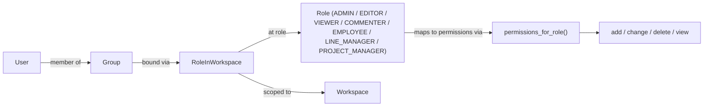

# koalixcrm — Security Report

## Introduction

This document consolidates security-relevant information for the koalixcrm platform. It is derived
from the low-level documentation in `doc/05_building_block_view/`, from the high-level
documentation in
[QQ_HL_Doc_KoalixCRM.md](../05_building_block_view/QQ_HL_Doc_KoalixCRM.md), and from targeted
source code inspection of the files listed in the findings below.

**Coverage:** All eight business-domain apps (`core`, `contacts`, `contracts`, `products`,
`accounting`, `reporting`, `subscriptions`, `djangoUserExtension`) and the infrastructure packages
(`auth`, `shared`, `koalixcrm_microservices`, `koalixcrm_utils`, `projectsettings`).

---

## Security Asset Inventory

The following table lists every security-relevant asset confirmed in the reviewed documentation and
source.

| Asset | Location | Handling | Reference |
|---|---|---|---|
| `DJANGO_SECRET_KEY` | `development_docker_settings.py` | Read from env var; default `'modify_during_deployment'` in dev overlays; hardcoded in SQLite dev settings | [QQ_LL_Doc_ProjectSettings.md](../05_building_block_view/projectsettings/QQ_LL_Doc_ProjectSettings.md) |
| `ADMIN_OIDC_CLIENT_SECRET` | `auth/oidc_views.py` | Read from env var at startup | [QQ_LL_Doc_Auth.md](../05_building_block_view/koalixcrm/auth/QQ_LL_Doc_Auth.md) |
| `CELERY_WORKER_M2M_CLIENT_SECRET` | `shared/api_client.py`, `auth/` | Read from env var | [QQ_LL_Doc_Auth.md](../05_building_block_view/koalixcrm/auth/QQ_LL_Doc_Auth.md) |
| `POSTGRES_PASSWORD` | `development_docker_settings.py` | Read from env var; default `'koalixcrm'` | [QQ_LL_Doc_ProjectSettings.md](../05_building_block_view/projectsettings/QQ_LL_Doc_ProjectSettings.md) |
| `AWS_ACCESS_KEY_ID` / `AWS_SECRET_ACCESS_KEY` | `koalixcrm_utils/aws_clients.py` | Read from env vars; fallback to `'minioadmin'` / `'minioadmin123'` (S3) or `'dummy'` (SQS) when local endpoint is set | [QQ_LL_Doc_Utils.md](../05_building_block_view/koalixcrm_utils/QQ_LL_Doc_Utils.md) |
| MinIO default credentials | `koalixcrm_utils/aws_clients.py` | Hardcoded strings `'minioadmin'` / `'minioadmin123'` activated only when `S3_ENDPOINT_URL` env var is set | [QQ_LL_Doc_Utils.md](../05_building_block_view/koalixcrm_utils/QQ_LL_Doc_Utils.md) |
| Django session cookie | All authenticated requests | Server-side session; `HttpOnly` and `Secure` flags depend on deployment settings | [QQ_LL_Doc_Auth.md](../05_building_block_view/koalixcrm/auth/QQ_LL_Doc_Auth.md) |
| OIDC Bearer JWT (user) | `Authorization: Bearer` header | Validated via RS256, JWKS, issuer, audience | [QQ_LL_Doc_Auth.md](../05_building_block_view/koalixcrm/auth/QQ_LL_Doc_Auth.md) |
| M2M Bearer JWT (service) | `Authorization: Bearer` header | Validated via RS256, JWKS, issuer, `azp`/`client_id` claim | [QQ_LL_Doc_Auth.md](../05_building_block_view/koalixcrm/auth/QQ_LL_Doc_Auth.md) |
| `m2m_token.env` | Container local filesystem | Written only when `KOALIXCRM_TOKEN_SAVE_TO_ENV=true` | [QQ_LL_Doc_Shared.md](../05_building_block_view/koalixcrm/shared/QQ_LL_Doc_Shared.md) |
| Presigned S3 URL | Generated at runtime | 5-minute expiry (default); URL does not embed credentials | [QQ_LL_Doc_Utils.md](../05_building_block_view/koalixcrm_utils/QQ_LL_Doc_Utils.md) |
| `legacy_data.json` (migration tool) | Local filesystem | Full database dump written by `pre_migrate_cleanup.py`; not managed by Django | [QQ_LL_Doc_Utils.md](../05_building_block_view/koalixcrm_utils/QQ_LL_Doc_Utils.md) |
| PII fields on `PartyContact` | `crm_partycontact` table | `date_of_birth`, `gdpr_consent_date` stored as plain fields; no encryption | [QQ_LL_Doc_Contacts_Models.md](../05_building_block_view/koalixcrm/contacts/QQ_LL_Doc_Contacts_Models.md) |
| Email addresses on `PartyEmail` | `crm_partyemail` table | Stored as plain text | [QQ_LL_Doc_Contacts_Models.md](../05_building_block_view/koalixcrm/contacts/QQ_LL_Doc_Contacts_Models.md) |
| Phone numbers on `PhoneNumber` | `crm_phonenumber` table | Stored as plain text (E.164 format) | [QQ_LL_Doc_Contacts_Models.md](../05_building_block_view/koalixcrm/contacts/QQ_LL_Doc_Contacts_Models.md) |
| IBAN on `PartyIdentification` | `crm_partyidentification` table | Stored as plain text under scheme `iban` | [QQ_LL_Doc_Contacts_Models.md](../05_building_block_view/koalixcrm/contacts/QQ_LL_Doc_Contacts_Models.md) |
| `session['active_workspace_id']` | Server-side Django session | Validated against the database on every resolution | [QQ_LL_Doc_Core_Infrastructure.md](../05_building_block_view/koalixcrm/core/QQ_LL_Doc_Core_Infrastructure.md) |

---

## Authentication Analysis

### Authentication Paths

Three distinct authentication paths are implemented in the `koalixcrm/auth/` package:

```mermaid
flowchart TD
    subgraph BrowserPath["Browser path — OIDC Authorization Code Flow with PKCE"]
        B1["/auth/login/ — LoginSelectionView"] --> B2["OAuthLoginView — redirect to IdP"]
        B2 --> B3["OAuthCallbackView — code exchange, session creation"]
    end

    subgraph APIUserPath["REST API — user Bearer JWT"]
        A1["OIDCAccessTokenAuthentication"] --> A2["RS256 validate against OIDC_ISSUER JWKS"]
        A2 --> A3["_find_or_create_user by email"]
    end

    subgraph APIm2mPath["REST API — M2M Bearer JWT"]
        M1["CeleryWorkerM2MAuthentication"] --> M2["Pre-check iss and azp claims (unverified)"]
        M2 --> M3["RS256 validate against CELERY_WORKER_M2M_OIDC_ISSUER JWKS"]
        M3 --> M4["Auto-provision service user + workspace fixup"]
    end

    subgraph FallbackPath["Fallback paths"]
        S1["SessionAuthentication — Django session cookie"]
        S2["BasicAuthentication — HTTP Basic (dev/test only)"]
    end
```

Figure 1 — Authentication paths overview

**Source:** [QQ_LL_Doc_Auth.md](../05_building_block_view/koalixcrm/auth/QQ_LL_Doc_Auth.md),
[QQ_SD_Interface_REST_Specifications.md](../03_system_scope_and_context/QQ_SD_Interface_REST_Specifications.md)

### JWT Validation Chain

The `oidc_utils.validate_jwt` function performs the following validation steps in order:

1. Retrieve JWKS from the configured issuer (cached for 1 hour via Django cache).
2. Extract the `kid` claim from the unverified token header.
3. Match the `kid` against the JWKS and construct a `PyJWK` signing key.
4. Decode the token using RS256 with `PyJWT`.
5. When a `client_id` is provided, validate it against the `aud` claim.
6. When `access_token` and `at_hash` are both present, verify the SHA-256 hash binding
   (OIDC Core §3.3.2.9).

The `CeleryWorkerM2MAuthentication` class adds a pre-validation step: it decodes the token
without verification to cheaply check `iss` and `azp`/`client_id` before performing full
cryptographic validation. This prevents token confusion attacks from other OIDC issuers.

### OIDC Browser Login

The Authorization Code Flow with PKCE is implemented via `authlib` with
`code_challenge_method = 'S256'`. The `OAuthCallbackView` enforces staff-only access to the
Django Admin: non-staff users authenticated by the OIDC provider are logged out and receive
HTTP 403.

When `ADMIN_OIDC_ISSUER` is not configured, `LoginSelectionView` falls back to Django's
built-in admin login form, enabling local development without a live Keycloak instance.

Group membership from the OIDC provider is merged additively into Django groups by
`OIDCAuthenticationBackend._sync_groups_from_provider`. Existing Django group assignments
are never removed by this function.

### DRF Authentication Class Order

The `DEFAULT_AUTHENTICATION_CLASSES` tuple in `base_settings.py` defines the evaluation
order:

| Position | Class | Mechanism |
|---|---|---|
| 1 | `CeleryWorkerM2MAuthentication` | Bearer JWT (Client Credentials Grant) |
| 2 | `OIDCAccessTokenAuthentication` | Bearer JWT (OIDC authorization-code) |
| 3 | `SessionAuthentication` | Django session cookie |
| 4 | `BasicAuthentication` | HTTP Basic (username/password) |

Source: `projectsettings/settings/base_settings.py` line 137–142.

---

## Authorization Analysis

### Workspace-Level RBAC

Authorization uses a workspace-scoped Role-Based Access Control model defined in
`core/access.py` and implemented as `CR-8`.

Figure 2 — RBAC model

**Role-to-permission mapping** (from `core/access.py`, CR §9.8):

| Role | Permissions |
|---|---|
| `ADMIN` | add, change, delete, view |
| `EDITOR` | add, change, view |
| `VIEWER` | view |
| `COMMENTER` | view |
| `EMPLOYEE` | view |
| `LINE_MANAGER` | view |
| `PROJECT_MANAGER` | view |

Superusers (`is_superuser=True`) bypass all workspace-level checks and receive all role values
without a database query.

### ViewSet Permission Enforcement

All ViewSets inherit from `BaseModelViewSet`, which configures:

- `IsAuthenticated` — rejects unauthenticated requests with HTTP 401.
- `ModelPermissionsWithListView` — extends `DjangoModelPermissions` to require
  `{app_label}.view_{model}` for GET requests (list and detail). Without this override, DRF's
  default `DjangoModelPermissions` would not check any permission for GET.

Source: [QQ_LL_Doc_Shared.md](../05_building_block_view/koalixcrm/shared/QQ_LL_Doc_Shared.md)

### Workspace Isolation

Multi-tenant workspace isolation is enforced at three layers:

1. **ORM layer** — `WorkspaceAwareManager` reads a module-level `ContextVar[Workspace | None]`
   inside `get_queryset()` and automatically appends `filter(workspace=active)` to every
   queryset. Because `ContextVar` is scoped per async task or OS thread, concurrent requests
   cannot read each other's active workspace.
2. **Middleware layer** — `WorkspaceContextMiddleware` sets the `ContextVar` at request entry
   and clears it in a `finally` block, preventing leakage across requests.
3. **Admin layer** — `WorkspaceScopedModelAdmin.save_model` raises `PermissionDenied` when an
   object's workspace does not match the session workspace, and cross-checks FK fields.

If `WorkspaceAwareManager` is bypassed via `Party._default_manager` or raw SQL, cross-tenant
access is possible. No guardrail prevents this at the Django ORM level.

Source: [QQ_LL_Doc_Core_Infrastructure.md](../05_building_block_view/koalixcrm/core/QQ_LL_Doc_Core_Infrastructure.md),
[QQ_LL_Doc_Contacts_Models.md](../05_building_block_view/koalixcrm/contacts/QQ_LL_Doc_Contacts_Models.md)

---

## Findings Catalogue

### Finding F-01: BasicAuthentication Active in All Environments

**Severity: High**

`rest_framework.authentication.BasicAuthentication` is registered as the fourth entry in
`DEFAULT_AUTHENTICATION_CLASSES` in `base_settings.py`. This class is shared by all
deployment environments including production, because `base_settings.py` is the single shared
base for all overlays.

In a production deployment with HTTPS enforced at the reverse proxy, the `OIDCAccessTokenAuthentication` 
and `CeleryWorkerM2MAuthentication` classes will match first for authenticated clients. However, 
`BasicAuthentication` remains active and will accept any request that carries a valid 
`Authorization: Basic` header with Django username and password credentials.

HTTP Basic Authentication transmits credentials in Base64 encoding, which is trivially
decodable. While HTTPS at the reverse proxy prevents wire interception, the presence of Basic
Auth allows credential-based brute-force attacks, password spraying, and unintended exposure of
Django admin credentials over the REST API surface.

**Source:** `projectsettings/settings/base_settings.py` line 141;
[QQ_SD_Interface_REST_Specifications.md](../03_system_scope_and_context/QQ_SD_Interface_REST_Specifications.md)
(Security Considerations section).

**Recommendation:** Remove `BasicAuthentication` from `DEFAULT_AUTHENTICATION_CLASSES` in the
production settings overlay. Retain it only in test environment settings files if needed for
automated tests.

---

### Finding F-02: Default Secret Key in Development Overlay

**Severity: High**

`development_docker_settings.py` sets `SECRET_KEY = os.environ.get('DJANGO_SECRET_KEY', 'modify_during_deployment')`.
If `DJANGO_SETTINGS_MODULE` is pointed at this overlay in a production deployment and
`DJANGO_SECRET_KEY` is not set in the environment, the application will use the literal string
`'modify_during_deployment'` as the Django secret key. This key is publicly known via the source
repository and would allow session forgery, CSRF token bypass, and password reset link
manipulation.

`development_docker_sqlite_settings.py` additionally hardcodes a fixed secret key with no
env-var override.

**Source:** `projectsettings/settings/development_docker_settings.py` line 8;
[QQ_LL_Doc_ProjectSettings.md](../05_building_block_view/projectsettings/QQ_LL_Doc_ProjectSettings.md).

**Recommendation:** The production settings module (`production_docker_postgres_settings`,
referenced in `wsgi.py` but not present in the reviewed source) must set `SECRET_KEY` from a
secret manager or environment variable with no fallback default. The development default should
be renamed to make the danger explicit (e.g. `'INSECURE-DO-NOT-USE-IN-PRODUCTION'`).

---

### Finding F-03: Default PostgreSQL Password in Development Overlay

**Severity: High**

`development_docker_settings.py` sets `POSTGRES_PASSWORD` with a fallback of `'koalixcrm'`
(`os.environ.get('POSTGRES_PASSWORD', 'koalixcrm')`). This default password is committed to the
repository. If the environment variable is not overridden in a network-accessible deployment, the
database is reachable with a known credential.

**Source:** `projectsettings/settings/development_docker_settings.py` line 30;
[QQ_LL_Doc_ProjectSettings.md](../05_building_block_view/projectsettings/QQ_LL_Doc_ProjectSettings.md).

**Recommendation:** Remove the fallback default from development settings and require
`POSTGRES_PASSWORD` to be set explicitly via environment variable or secret manager in all
environments.

---

### Finding F-04: Hardcoded MinIO Credentials in Source Code

**Severity: Medium**

`koalixcrm_utils/aws_clients.py` contains hardcoded MinIO credential defaults:
`AWS_ACCESS_KEY_ID` defaults to `'minioadmin'` and `AWS_SECRET_ACCESS_KEY` defaults to
`'minioadmin123'` when `S3_ENDPOINT_URL` is set. These defaults are activated by setting the
`S3_ENDPOINT_URL` environment variable, which is intended only for development and test
environments.

The credentials are not production AWS credentials; they are MinIO development defaults. They
are only applied when the local endpoint URL is set. However, their presence in the source tree
means they will appear in any audit of the repository.

**Source:** `koalixcrm_utils/aws_clients.py` lines 33–34;
[QQ_LL_Doc_Utils.md](../05_building_block_view/koalixcrm_utils/QQ_LL_Doc_Utils.md).

**Recommendation:** Move MinIO development credentials to a `.env` file that is gitignored, and
read them from environment variables with no hardcoded fallback.

---

### Finding F-05: Subscriptions `create_invoice` Null-Guard Missing

**Severity: Medium**

`koalixcrm/subscriptions/models/subscription.py` line 49 reads
`self.contract.defaultcustomer.defaultCustomerBillingCycle.timeToPaymentDate` without null
guards on any of the four chained attribute accesses. The `subscription_type` FK is explicitly
declared `null=True`, and neither `defaultcustomer` nor `defaultCustomerBillingCycle` are
guaranteed to be non-null at the model level. An `AttributeError` raised here will propagate
as an unhandled server error, potentially leaking a stack trace to the caller if `DEBUG=True`
or to the error logging pipeline if `DEBUG=False`.

**Source:** `koalixcrm/subscriptions/models/subscription.py` line 49;
[QQ_LL_Doc_Subscriptions.md](../05_building_block_view/koalixcrm/subscriptions/QQ_LL_Doc_Subscriptions.md).

**Recommendation:** Add null checks on the billing-cycle chain before computing `payable_until`.
Raise an application-level exception (e.g. `ValueError`) with a descriptive message when any
intermediate object is missing.

---

### Finding F-06: `m2m_token.env` File Persistence on Container Filesystem

**Severity: Medium**

`TokenCache` in `koalixcrm/shared/token_cache.py` writes a cached M2M access token to
`m2m_token.env` on the local container filesystem when `KOALIXCRM_TOKEN_SAVE_TO_ENV=true`. This
file is not managed by Django and is readable by any process with access to the container
filesystem. In a container environment where multiple containers share a filesystem layer or a
bind-mounted volume, or where a compromised sidecar can read container files, this token could
be extracted and used to impersonate the service account until it expires.

**Source:** [QQ_LL_Doc_Shared.md](../05_building_block_view/koalixcrm/shared/QQ_LL_Doc_Shared.md).

**Recommendation:** Disable `KOALIXCRM_TOKEN_SAVE_TO_ENV` in production. Use the in-memory
`TokenCache` only, and rely on the OIDC token endpoint to refresh tokens after worker restart.

---

### Finding F-07: Production Settings Module Not Present in Source Tree

**Severity: Medium**

`projectsettings/wsgi.py` sets `DJANGO_SETTINGS_MODULE` to
`koalixcrm.projectsettings.settings.production_docker_postgres_settings` as its default.
This module is not present in the reviewed source tree. Its exact security-relevant settings
— `ALLOWED_HOSTS`, `DEBUG`, `SESSION_COOKIE_SECURE`, `CSRF_COOKIE_SECURE`,
`SECURE_SSL_REDIRECT`, `SECURE_HSTS_SECONDS`, `SECRET_KEY` — cannot be verified from the
available documentation.

Information not available: Production settings file content.

**Source:** [QQ_LL_Doc_ProjectSettings.md](../05_building_block_view/projectsettings/QQ_LL_Doc_ProjectSettings.md).

**Recommendation:** Document or include the production settings module in the repository (with
secret values replaced by env-var references), or add a dedicated settings audit as part of the
security review process.

---

### Finding F-08: TLS Not Enforced at the Application Layer

**Severity: Medium**

TLS termination is documented as occurring at the reverse proxy / load balancer upstream of
Gunicorn. The Django application itself does not set `SECURE_SSL_REDIRECT = True` or
`SECURE_HSTS_SECONDS` in any reviewed settings module. The `django.middleware.security.SecurityMiddleware`
is included in `MIDDLEWARE` in `base_settings.py`, but without the corresponding settings it
operates in a no-op mode for HTTPS enforcement.

This means that if a request reaches the Django application directly (bypassing the reverse
proxy), it will be served over plain HTTP without any redirect or warning.

The `SessionAuthentication` class also does not enforce HTTPS independently. Django's
`SESSION_COOKIE_SECURE` and `CSRF_COOKIE_SECURE` settings are not confirmed to be set in
any reviewed settings file.

**Source:** `projectsettings/settings/base_settings.py`;
[QQ_SD_Interface_REST_Specifications.md](../03_system_scope_and_context/QQ_SD_Interface_REST_Specifications.md).

**Recommendation:** In the production settings module, set `SECURE_SSL_REDIRECT = True`,
`SESSION_COOKIE_SECURE = True`, `CSRF_COOKIE_SECURE = True`, and configure
`SECURE_HSTS_SECONDS` with an appropriate value. Confirm that `SECURE_PROXY_SSL_HEADER`
is correctly configured to trust the `X-Forwarded-Proto` header from the reverse proxy.

---

### Finding F-09: PII Stored Without Field-Level Encryption

**Severity: Medium**

The following personally identifiable information (PII) fields are stored as plain text in the
database with no column-level encryption:

| Field | Model | Table | Data Classification |
|---|---|---|---|
| `date_of_birth` | `PartyContact` | `crm_partycontact` | PII (GDPR Art. 4) |
| `gdpr_consent_date` | `PartyContact` | `crm_partycontact` | GDPR compliance record |
| `email` | `PartyEmail` | `crm_partyemail` | PII (GDPR Art. 4) |
| `phone_e164` | `PhoneNumber` | `crm_phonenumber` | PII (GDPR Art. 4) |
| `value` (scheme `iban`) | `PartyIdentification` | `crm_partyidentification` | Financial identifier |

Access to these fields is controlled at the application layer via workspace RBAC. There is no
model-level encryption, column masking, or pseudonymisation. A direct database access (e.g.
from a compromised migration script, backup restore, or DBA access) exposes all PII in
cleartext.

**Source:** [QQ_LL_Doc_Contacts_Models.md](../05_building_block_view/koalixcrm/contacts/QQ_LL_Doc_Contacts_Models.md).

---

### Finding F-10: No Automated Data Retention or Anonymisation Pipeline

**Severity: Medium**

The `gdpr_consent_date` field on `PartyContact` records when GDPR consent was given. No
automated data retention policy, anonymisation pipeline, or deletion workflow was identified in
the reviewed source or documentation. Downstream processes that send marketing communication
are expected to check this field manually.

**Source:** [QQ_LL_Doc_Contacts_Models.md](../05_building_block_view/koalixcrm/contacts/QQ_LL_Doc_Contacts_Models.md),
[QQ_HL_Doc_KoalixCRM.md](../05_building_block_view/QQ_HL_Doc_KoalixCRM.md) (Data Privacy section).

---

### Finding F-11: Rate Limiting Not Configured

**Severity: Medium**

No DRF throttle class (`DEFAULT_THROTTLE_CLASSES`, `DEFAULT_THROTTLE_RATES`) is configured
in `base_settings.py` or any reviewed overlay. All REST API endpoints — including
authentication-adjacent endpoints such as the workspace switch view — are without rate limiting.

**Source:** `projectsettings/settings/base_settings.py`.

**Recommendation:** Configure DRF throttling at minimum for anonymous and authenticated
request rates. Consider per-view throttle scopes for sensitive endpoints.

---

### Finding F-12: Phone Number Format Not Validated at Model Level

**Severity: Low**

`PhoneNumber.phone_e164` is declared as a plain `CharField(max_length=32)` with no
`validators` enforcing E.164 format at the model or database level. Validation is expected
to be performed by form validators and serializers, but this is not enforced uniformly. An
incorrectly formatted phone number can be inserted via the ORM or raw SQL without rejection.

**Source:** [QQ_LL_Doc_Contacts_Models.md](../05_building_block_view/koalixcrm/contacts/QQ_LL_Doc_Contacts_Models.md).

---

### Finding F-13: `PartyIdentification` and `PartyRole` Uniqueness Not Enforced at Model Level

**Severity: Low**

Uniqueness on `(party, scheme)` for `PartyIdentification` and on `(party, role_type)` for
`PartyRole` is not enforced by a database unique constraint or `Meta.unique_together`. Duplicate
IBAN records or duplicate role assignments are possible via the ORM and must be prevented at
the application layer. This creates a risk of data inconsistency that could affect business
logic downstream.

**Source:** [QQ_LL_Doc_Contacts_Models.md](../05_building_block_view/koalixcrm/contacts/QQ_LL_Doc_Contacts_Models.md).

---

### Finding F-14: JWKS and Discovery Documents Cached in Django Cache

**Severity: Low (informational)**

`oidc_utils.py` caches JWKS and OIDC discovery documents in Django's cache framework for
3600 seconds (1 hour). When the OIDC provider rotates keys, the cache must expire before new
keys are accepted. A key rotation event will cause authentication failures for tokens signed
with the new key until the cache expires.

This is standard behaviour for JWKS caching and does not constitute a security gap, but
operators should be aware that key rotation will cause a transient authentication disruption
of up to one hour.

**Source:** [QQ_LL_Doc_Auth.md](../05_building_block_view/koalixcrm/auth/QQ_LL_Doc_Auth.md).

---

### Finding F-15: `legacy_data.json` Contains Full Database Dump

**Severity: Low**

`pre_migrate_cleanup.py` writes a full database dump to `legacy_data.json` on the local
filesystem. This file is not managed by Django and contains all application data including PII.
If not deleted after a successful migration import, it remains on the filesystem and can be
accessed by any process with filesystem access.

**Source:** [QQ_LL_Doc_Utils.md](../05_building_block_view/koalixcrm_utils/QQ_LL_Doc_Utils.md).

**Recommendation:** Delete `legacy_data.json` immediately after a successful `import`
sub-command execution. Add a deletion step to the migration runbook.

---

### Finding F-16: CORS Policy Not Configured

**Severity: Low (informational)**

No CORS policy (`django-cors-headers` or equivalent) was identified in the reviewed settings
or middleware configuration. The Django `XFrameOptionsMiddleware` is present in `MIDDLEWARE`
(providing `X-Frame-Options: SAMEORIGIN` for clickjacking protection), but cross-origin
request policies for the REST API are not documented.

Information not available: Whether a CORS policy is applied at the reverse proxy layer or
in the production settings module.

---

### Finding F-17: OpenAPI Schema Endpoints Unauthenticated by Default

**Severity: Low (informational)**

Each app exposes a live OpenAPI schema endpoint (e.g. `/koalixcrm_contacts/api/schema/v1/`),
a Swagger UI, and a Redoc UI. `drf-spectacular` sets `SERVE_INCLUDE_SCHEMA = False` in
`SPECTACULAR_SETTINGS`, which controls whether the schema endpoint appears in its own output.
However, whether the schema endpoints themselves require authentication depends on the
`SpectacularAPIView` configuration in `urls.py`.

Information not available: Whether the schema, Swagger UI, and Redoc UI endpoints in
`urls.py` require authentication.

**Recommendation:** Confirm whether the schema endpoints require authentication in production.
If the API is not public, restrict schema endpoint access to authenticated users.

---

### Finding F-18: SQS Messages Not Authenticated End-to-End

**Severity: Low (informational)**

`PDFExportCommand` messages sent to the SQS PDF export queue are JSON payloads with no
message-level signature or authentication. The external Java PDF export service trusts these
messages as authoritative commands. The security boundary relies entirely on IAM queue access
controls preventing unauthorized message publication. If the SQS queue IAM policy is
misconfigured and allows arbitrary principals to publish, a malformed command could cause the
PDF export service to fetch arbitrary resource IDs from the REST API.

**Source:** [QQ_HL_Doc_KoalixCRM.md](../05_building_block_view/QQ_HL_Doc_KoalixCRM.md),
[QQ_SD_Interface_Async_Specifications.md](../03_system_scope_and_context/QQ_SD_Interface_Async_Specifications.md).

---

## GDPR and Data Protection Considerations

### Personal Data Inventory

| Data Category | Fields | Model / Table | Lawful Basis Mechanism |
|---|---|---|---|
| Name | `given_name`, `family_name` on `PartyContact`; `display_name` on `Party` | `crm_party`, `crm_partycontact` | None documented in code |
| Date of birth | `date_of_birth` on `PartyContact` | `crm_partycontact` | None documented in code |
| Email address | `email` on `PartyEmail` | `crm_partyemail` | None documented in code |
| Phone number | `phone_e164` on `PhoneNumber` | `crm_phonenumber` | None documented in code |
| Postal address | `street`, `number`, `zip_code`, `town`, `country` on `Address` | `crm_address` | None documented in code |
| Bank account number (IBAN) | `value` on `PartyIdentification` (scheme `iban`) | `crm_partyidentification` | None documented in code |
| GDPR consent record | `gdpr_consent_date` on `PartyContact` | `crm_partycontact` | Field is the consent record itself |

### GDPR Consent Tracking

`PartyContact.gdpr_consent_date` is the only GDPR-specific field in the data model. A null
value indicates that no explicit consent has been recorded for a natural person. Downstream
processes that send marketing communications are expected to check this field before including
a contact, but no enforcement mechanism is implemented in the reviewed code.

### Data Retention

Information not available: No automated data retention, deletion, or anonymisation pipeline
was identified in the reviewed source. There is no scheduled job, management command, or
signal handler that removes or anonymises PII after a retention period.

### Right to Erasure

Information not available: No specific implementation of a data subject deletion workflow
was identified. Deletion of a `Party` row cascades to `AddressAssignment`, `EmailAssignment`,
`PhoneAssignment`, `PartyGroupMembership`, `PartyIdentification`, and `PartyRole` via Django
`CASCADE` constraints. However, this is a standard ORM cascade, not a privacy-driven erasure
workflow.

---

## Transport Security Summary

| Component | TLS Mechanism | Confirmed |
|---|---|---|
| Browser to Django (Admin / REST) | Reverse proxy / load balancer upstream of Gunicorn | By documentation assumption only; not enforced in application code |
| Django to OIDC Provider (JWKS, discovery, token endpoint) | Stdlib `urlopen` with HTTPS URL | Confirmed (URL scheme from `OIDC_ISSUER` env var) |
| Django to AWS SQS | boto3 over HTTPS (default) | Confirmed (boto3 default) |
| Django to AWS S3 | boto3 over HTTPS; MinIO over HTTP when `S3_ENDPOINT_URL` is set | Confirmed |
| Celery worker to OIDC token endpoint | `http.client.HTTPSConnection` | Confirmed |
| PDF export service to Django REST API | Not documented; assumed HTTPS in production | Information not available |

---

## Secret Management Summary

All production secrets are expected to be delivered via environment variables. No secrets were
found hardcoded in the production code paths. The following secrets have known default values
in development overlays that must not reach production:

| Secret | Development Default | Risk if Leaked |
|---|---|---|
| `DJANGO_SECRET_KEY` | `'modify_during_deployment'` | Session forgery, CSRF bypass, password reset link manipulation |
| `POSTGRES_PASSWORD` | `'koalixcrm'` | Full database read/write access |
| MinIO `AWS_ACCESS_KEY_ID` | `'minioadmin'` | Full MinIO object store access (development only) |
| MinIO `AWS_SECRET_ACCESS_KEY` | `'minioadmin123'` | Full MinIO object store access (development only) |

Information not available: Whether a dedicated secret manager (AWS Secrets Manager, HashiCorp
Vault, Kubernetes Secrets) is used in the production deployment, and whether secrets are rotated
automatically.

---

## Findings Summary

| ID | Severity | Title |
|---|---|---|
| F-01 | High | BasicAuthentication active in all environments |
| F-02 | High | Default secret key in development overlay |
| F-03 | High | Default PostgreSQL password in development overlay |
| F-04 | Medium | Hardcoded MinIO credentials in source code |
| F-05 | Medium | Subscriptions `create_invoice` null-guard missing |
| F-06 | Medium | `m2m_token.env` file persistence on container filesystem |
| F-07 | Medium | Production settings module not present in source tree |
| F-08 | Medium | TLS not enforced at the application layer |
| F-09 | Medium | PII stored without field-level encryption |
| F-10 | Medium | No automated data retention or anonymisation pipeline |
| F-11 | Medium | Rate limiting not configured |
| F-12 | Low | Phone number format not validated at model level |
| F-13 | Low | `PartyIdentification` and `PartyRole` uniqueness not enforced at model level |
| F-14 | Low | JWKS caching may delay key rotation acceptance by up to 1 hour |
| F-15 | Low | `legacy_data.json` contains full database dump |
| F-16 | Low | CORS policy not configured (or not documented) |
| F-17 | Low | OpenAPI schema endpoints may be unauthenticated |
| F-18 | Low | SQS messages not authenticated end-to-end |

---

## References

| Document | Description |
|---|---|
| [QQ_HL_Doc_KoalixCRM.md](../05_building_block_view/QQ_HL_Doc_KoalixCRM.md) | High-level documentation — Security and Data Privacy sections |
| [QQ_LL_Doc_Auth.md](../05_building_block_view/koalixcrm/auth/QQ_LL_Doc_Auth.md) | Authentication package — all auth mechanisms, security asset inventory |
| [QQ_ML_Doc_Auth.md](../05_building_block_view/koalixcrm/auth/QQ_ML_Doc_Auth.md) | Auth package — mid-level overview and sequence diagrams |
| [QQ_LL_Doc_ProjectSettings.md](../05_building_block_view/projectsettings/QQ_LL_Doc_ProjectSettings.md) | Django settings — secret key, password defaults, middleware |
| [QQ_LL_Doc_Contacts_Models.md](../05_building_block_view/koalixcrm/contacts/QQ_LL_Doc_Contacts_Models.md) | Contacts models — PII field inventory and security assets |
| [QQ_LL_Doc_Utils.md](../05_building_block_view/koalixcrm_utils/QQ_LL_Doc_Utils.md) | AWS utilities — credential handling, presigned URLs, MinIO defaults |
| [QQ_LL_Doc_Shared.md](../05_building_block_view/koalixcrm/shared/QQ_LL_Doc_Shared.md) | Shared package — token cache, m2m_token.env persistence |
| [QQ_LL_Doc_Core_Infrastructure.md](../05_building_block_view/koalixcrm/core/QQ_LL_Doc_Core_Infrastructure.md) | Core infrastructure — RBAC access functions, workspace isolation |
| [QQ_LL_Doc_Microservices.md](../05_building_block_view/koalixcrm_microservices/QQ_LL_Doc_Microservices.md) | Celery and SQS poller — AWS credentials, broker configuration |
| [QQ_LL_Doc_Subscriptions.md](../05_building_block_view/koalixcrm/subscriptions/QQ_LL_Doc_Subscriptions.md) | Subscriptions — null-guard gap in `create_invoice` |
| [QQ_SD_Interface_REST_Specifications.md](../03_system_scope_and_context/QQ_SD_Interface_REST_Specifications.md) | REST API specification — authentication schemes, security considerations |
| [QQ_SD_EntityRelationDiagram.md](QQ_SD_EntityRelationDiagram.md) | Physical data model — all 67 entities and their field definitions |

### List of Illustrations

| Figure | Title |
|---|---|
| Figure 1 | Authentication paths overview |
| Figure 2 | RBAC model |
