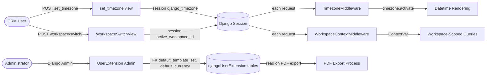

# Settings

This document catalogs all user-specific settings in koalixCRM — values that vary per
authenticated user and that the user can change without administrative intervention. Unlike
Configuration (system-wide, operator-managed) or Parameterization (developer-controlled code
constants), Settings are personal to the individual and persist across or within a single
session.

## Definitions

| Term | Description |
|------|-------------|
| Setting | A user-specific preference that personalizes software behavior or presentation for an individual user. |
| Session-Scoped Setting | A setting that exists only for the duration of a single browser session; lost on logout or session expiry. |
| Workspace Setting | A setting that is scoped to the combination of a user and a workspace (tenant). |
| User Profile Setting | A setting stored in a dedicated database model linked to the user identity. |
| Default Setting | The system-provided value used when the user has not explicitly set a preference. |

## Summary

| Category | Setting Count | Scope | Storage |
|----------|-------------|-------|---------|
| Display & Time | 1 | Session | Django session (key: `django_timezone`) |
| Workspace Context | 1 | Session | Django session (key: `active_workspace_id`) |
| User Extension Profile | 2 | User + Workspace | Database (`djangoUserExtension_userextension`) |
| User Contact Assignments | 3 | User + Workspace | Database (address, phone, email assignment tables) |
| **Total** | **7** | | |

---

## Settings Inventory

### Category: Display & Time

#### Timezone Preference

| Setting | Default Value | Possible Values | Scope | Storage | Description |
|---------|--------------|-----------------|-------|---------|-------------|
| `django_timezone` | System default (`TIME_ZONE = 'UTC'`) | Any valid IANA timezone identifier (e.g., `'Europe/Zurich'`, `'America/New_York'`) | Session | Django session backend (`request.session['django_timezone']`) | The timezone in which all datetimes are displayed for the user's current session. Set via the timezone selection form at `/koalixcrm/crm/reporting/set_timezone/`. Read on every request by `TimezoneMiddleware`. Absent means the system `TIME_ZONE` setting is used. |

**Source Reference:** `koalixcrm/core/middleware/timezoneMiddleware.py`,
`koalixcrm/core/views/set_timezone.py`

**Related UI:** Timezone selection form at `/koalixcrm/crm/reporting/set_timezone/`.
Documented in [QQ_UI_Doc_CoreAdminScreens.md](QQ_UI_Doc_CoreAdminScreens.md).

**Notes.** This setting is session-scoped: it resets to the server default when the
session expires or the user logs out. There is no persistent per-user storage; the value
is not carried over to the next login session.

---

### Category: Workspace Context

#### Active Workspace Selection

| Setting | Default Value | Possible Values | Scope | Storage | Description |
|---------|--------------|-----------------|-------|---------|-------------|
| `active_workspace_id` | First accessible workspace ordered by primary key | Any `Workspace.pk` the user has a `RoleInWorkspace` entry for (or any for superusers) | Session | Django session backend (`request.session['active_workspace_id']`) | The workspace (tenant) that is active for the current session. All workspace-scoped database queries are filtered to this workspace. Set on first request by `WorkspaceContextMiddleware` (defaults to the lowest-pk accessible workspace) or explicitly by the user via the workspace switcher POST at `/admin/core/workspace/switch/`. |

**Source Reference:** `koalixcrm/core/middleware/workspace_context.py`,
`koalixcrm/core/views/workspace_switch.py`

**Related UI:** Workspace header band rendered by `workspace_header.html` and the
Grappelli dashboard workspace switcher module (`workspace_switcher.html`). Documented in
[QQ_UI_Doc_CoreAdminScreens.md](QQ_UI_Doc_CoreAdminScreens.md).

**Notes.** Like the timezone preference, this setting is session-scoped. The selected
workspace persists within the browser session but resets to the default on the next login.
A `WorkspaceSwitchEvent` audit record is written to the database each time the user
explicitly changes the active workspace.

---

### Category: User Extension Profile

The `UserExtension` model (table `djangoUserExtension_userextension`) stores per-user,
per-workspace preferences that persist across sessions. Each row links a Django `auth.User`
to a `Workspace` and holds two configurable choices.

**Source Reference:** `koalixcrm/djangoUserExtension/models/user_extension.py`

#### Default Template Set

| Setting | Default Value | Possible Values | Scope | Storage | Description |
|---------|--------------|-----------------|-------|---------|-------------|
| `default_template_set` | No default; must be set by administrator | Any active `TemplateSet` record in the same workspace | User + Workspace | Database column `djangoUserExtension_userextension.default_template_set_id` | The XSL document template set used when this user generates PDF documents (invoices, quotations, work reports, etc.). Controls which FOP configuration file and XSL stylesheets are applied. |

**Related UI:** Managed via the Django Admin change-form for `UserExtension` at
`/admin/djangoUserExtension/userextension/<id>/change/`. Users do not change this
directly; an administrator configures it on their behalf.

**Notes.** If a `UserExtension` row is absent for a user, PDF generation raises
`UserExtensionMissing` and the export fails. The `koalixcrm_install_defaulttemplates`
management command seeds a default `UserExtension` for the first superuser.

#### Default Currency

| Setting | Default Value | Possible Values | Scope | Storage | Description |
|---------|--------------|-----------------|-------|---------|-------------|
| `default_currency` | No default; must be set by administrator | Any `Currency` record | User + Workspace | Database column `djangoUserExtension_userextension.default_currency_id` | The currency used as the default when this user creates new financial documents (invoices, quotations). |

**Related UI:** Managed via the Django Admin `UserExtension` change-form. Not directly
user-adjustable.

---

### Category: User Contact Assignments

Three additional database-backed associations are linked to each user and workspace.
They are stored in separate assignment tables and support a purpose-based classification
(primary, billing, shipping, legal, visiting, other).

**Source Reference:** `koalixcrm/djangoUserExtension/models/user_extension.py`

| Setting | Default Value | Possible Values | Scope | Storage | Description |
|---------|--------------|-----------------|-------|---------|-------------|
| Address assignment (`UserAddressAssignment`) | None | Any `Address` record + purpose from `ASSIGNMENT_PURPOSE_CHOICES` | User + Workspace | Table `djangoUserExtension_useraddressassignment` | Links a postal address to the user for a given purpose. Required for PDF generation (at least one address assignment must exist). |
| Phone assignment (`UserPhoneAssignment`) | None | Any `PhoneNumber` record + purpose | User + Workspace | Table `djangoUserExtension_userphoneassignment` | Links a phone number to the user. Required for PDF generation. |
| Email assignment (`UserEmailAssignment`) | None | Any `PartyEmail` record + purpose | User + Workspace | Table `djangoUserExtension_useremailassignment` | Links an email address to the user. Required for PDF generation. |

**Related UI:** Managed via inline admin forms on the `UserExtension` admin page.

**Notes.** These assignments carry `is_primary`, `valid_from`, and `valid_to` fields for
time-bounded and priority-ranked management. The `objects_to_serialize` static method on
`UserExtension` reads the first phone and email assignment when serializing user data for
a PDF export job.

---

## Settings Storage Architecture

- **Storage Mechanism:**
  - Session-scoped settings (`django_timezone`, `active_workspace_id`) are stored in the
    Django session backend. In a typical deployment this is the database table
    `django_session` or a cache-backed session store, depending on the
    `SESSION_ENGINE` Django setting.
  - Persistent per-user settings (`UserExtension` and contact assignments) are stored in
    the relational database in the `djangoUserExtension_*` tables.

- **Schema / Model:** The `UserExtension` model and its three companion assignment models
  (`UserAddressAssignment`, `UserPhoneAssignment`, `UserEmailAssignment`) are defined in
  `koalixcrm/djangoUserExtension/models/user_extension.py`. All four models extend
  `WorkspaceScopedModel`, meaning they carry a `workspace` foreign key and are filtered by
  the active workspace through the `WorkspaceAwareManager`.

- **Caching:** Session data is subject to whatever cache backend is configured via
  `SESSION_ENGINE`. No additional application-level cache sits in front of `UserExtension`
  reads.

- **Default Handling:** Session settings default to the system-level fallback when the
  session key is absent (`TIME_ZONE = 'UTC'` for timezone; lowest-pk accessible workspace
  for workspace context). `UserExtension` fields have no model-level default and raise
  application exceptions when missing.

- **Migration:** The `UserExtension` table and its assignment tables are managed by
  numbered Django migrations in `koalixcrm/djangoUserExtension/migrations/`. Migration
  `0005_user_address_assignments.py` added the address assignment table.

Figure 1 — Settings data flow: session-scoped and database-persisted settings

---

## Cross-Reference: Settings Influencing Use Cases

| Setting | Use Case(s) Affected | Effect |
|---------|---------------------|--------|
| `django_timezone` (session) | UC-WA-07 Set Display Timezone; all datetime-displaying use cases | Determines the timezone in which all datetimes are formatted for the user's session. Defaults to UTC when absent. |
| `active_workspace_id` (session) | UC-WA-03 Switch Active Workspace; all workspace-scoped use cases (contacts, contracts, accounting, reporting) | All `WorkspaceAwareManager` queries are filtered to this workspace; switching the workspace changes which records are visible and modifiable. |
| `UserExtension.default_template_set` | UC-REP PDF export (work reports); UC-UE (user extension PDF); all document PDF generation use cases | Controls which XSL stylesheets and FOP configuration files are used when generating PDF documents for this user. Missing causes `UserExtensionMissing` error. |
| `UserExtension.default_currency` | UC-CS Create Contract / Quotation; UC-ACC invoice creation | Provides the default currency pre-filled on new financial documents created by this user. |
| Address / phone / email assignments | UC-REP work report PDF; all user-contact-data serialization | Provide the sender contact details embedded in generated PDFs. Missing assignments cause `UserExtensionPhoneAddressMissing` / `UserExtensionEmailAddressMissing` exceptions. |

---

## Improvement Opportunities

| Finding | Current State | Recommendation | Priority |
|---------|--------------|----------------|----------|
| Timezone preference is session-only | The `django_timezone` session key is not persisted to the database; users must re-select their timezone on every new session | Persist the timezone preference in a database-backed per-user model (e.g., extend `UserExtension` with a `preferred_timezone` field) | Medium |
| No user-facing settings page | The `UserExtension` (default currency, template set) can only be configured by an administrator via the Django Admin | Provide a self-service REST API endpoint and/or an admin UI form so users can update their own `UserExtension` preferences | Medium |
| Active workspace not persisted | The selected workspace resets to the default on every new login session | Store the last-selected workspace per user in the database so it is restored on the next login | Low |
| No validation of IANA timezone values | The `set_timezone` view stores the posted value in the session; if an invalid timezone string is stored, `ZoneInfo(tzname)` raises `ZoneInfoNotFoundError` at the next request | Add server-side validation of the posted timezone string against the list of valid IANA identifiers before storing it | Medium |
