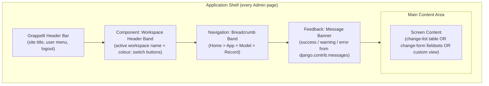
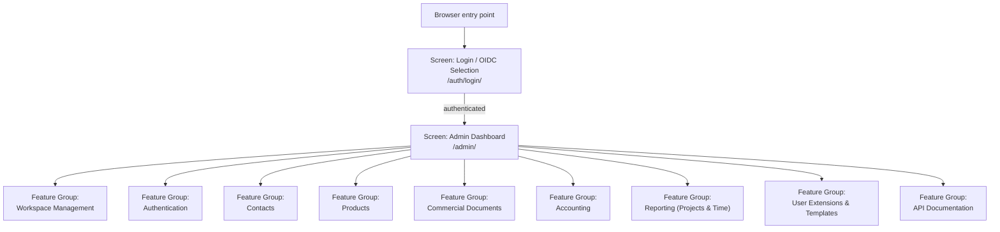
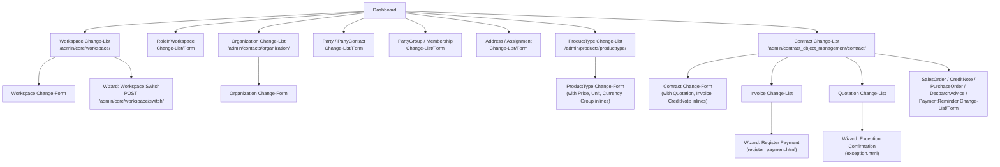
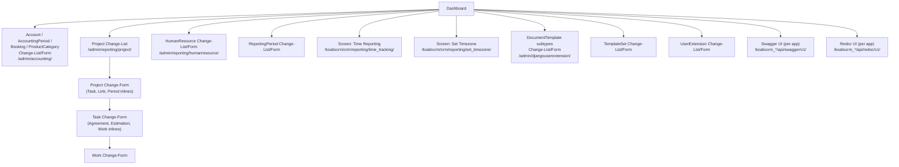
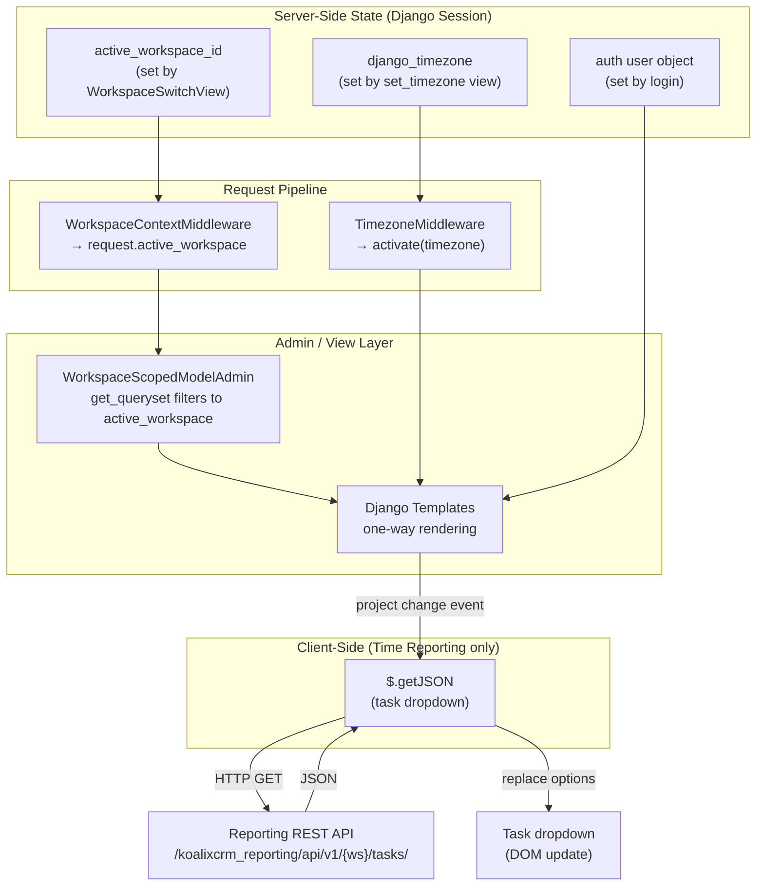
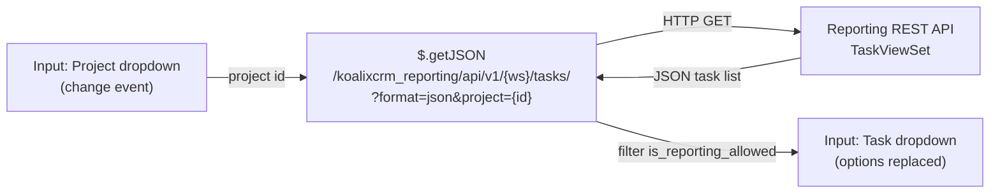

# UI Architecture

## Summary

| Property | Value |
|----------|-------|
| **UI Technology** | Django Admin 5.2.13 with django-grappelli 3.0.10 skin |
| **Application Type** | Server-Side Rendered (SSR) — Django Template Language |
| **Target Platforms** | Web browser |
| **Component Library** | django-grappelli 3.0.10 (CSS grid, bundled jQuery fork `grp.jQuery`) |
| **State Management** | Django session (server-side); no client-side state store |
| **Styling Approach** | Grappelli skin CSS; workspace accent colour applied via inline style; no separate CSS build step |
| **Internationalization** | Yes — 5 languages (`de`, `en`, `es`, `fr`, `pt_BR`) via Django gettext `.po`/`.mo` files |
| **Accessibility Target** | Not formally defined; standard server-rendered HTML form controls |

The application delivers its user interface exclusively through Django's server-side template
rendering. Django Admin is the primary user-facing shell; django-grappelli provides a customised
Admin skin with its own CSS/JavaScript bundle (including a bundled jQuery fork). No separate
frontend build process, no `package.json`, no Node.js toolchain, and no JavaScript framework are
present anywhere in the repository. The single exception to fully server-rendered interaction is a
`$.getJSON` call in the time-reporting screen that dynamically repopulates a task dropdown.

## Universal Abstraction Mapping

The table below maps the universal UI abstraction terms used throughout this document to their
Django/Grappelli equivalents.

| Universal Term | Framework-Specific Term | Notes |
|---------------|------------------------|-------|
| Screen / Page | `ModelAdmin` class registration (change-list + change-form pages) or function/class-based view | Each registered model automatically produces a change-list URL and a change-form URL |
| Component / Widget | Django Admin inline (`TabularInline`, `StackedInline`); Grappelli dashboard module | Inlines render as embedded sub-forms within a change-form page |
| Form | Django `ModelForm` with `ModelAdmin.fieldsets`; custom form classes; Django `BaseFormSet` | Validated and submitted server-side on every page navigation |
| Wizard / Flow | Admin action with intermediate confirmation template | Two-step server-side POST flow; no client-side routing |
| Dialog / Modal | Grappelli popup (related-object lookup, add-another) | Triggered by `showRelatedObjectLookupPopup` / `showAddAnotherPopup` — opens a child browser window |
| Navigation | Django URL routing + Grappelli breadcrumb band | All navigation is URL-based; every transition is a full-page server round-trip |
| Layout | Grappelli grid classes (`grp-module`, `g-d-*`, `l-2cr-fluid`) | CSS grid defined entirely by the Grappelli skin |
| State Management | Django session + server-side context processors | `WorkspaceContextMiddleware` injects active workspace; `TimezoneMiddleware` applies user timezone |
| Theme / Styling | Grappelli skin CSS + workspace accent colour via inline style | No design-token file; accent colour per workspace defined as `active_workspace_color` |
| Data Binding | Django Template Language one-way rendering; jQuery `$.getJSON` for one AJAX dropdown | One-way server-to-client; AJAX used only for the task dropdown in the time-reporting screen |

## Application Shell / Layout

### Figure 1 — Application Shell Composition

*Figure 1: The application shell rendered on every Admin page. The Grappelli header bar, workspace header band, breadcrumb band, and message banner form the persistent frame; the screen content area changes with each URL.*

### Shell Components

| Component | Source Template | Description |
|-----------|----------------|-------------|
| Grappelli Header Bar | Grappelli built-in | Renders the site title, logged-in user name, and logout link |
| Workspace Header Band | `koalixcrm/core/templates/admin/workspace_header.html` | Colour-coded band showing the active workspace; renders switch-form buttons when the user can access more than one workspace |
| Breadcrumb Band | `koalixcrm/templates/admin/change_form.html`, `change_list.html` | Project-wide override of the Grappelli breadcrumb; links Home > App > Model > Record |
| Message Banner | Grappelli built-in (populated by `django.contrib.messages`) | Non-persistent success, warning, and error notifications from admin actions |

**Responsive Behavior:** The application is targeted at desktop browsers. Grappelli provides basic responsive breakpoints via its grid classes, but no mobile-first design is applied. No orientation-specific or touch-specific adaptations are present.

### Layout Variants

| Layout | Used By | Characteristics |
|--------|---------|----------------|
| Dashboard layout | Admin landing page (`/admin/`) | Grappelli `CustomIndexDashboard`; two-column module layout |
| Change-list layout | All `ModelAdmin` change-list pages | Filterable table with pagination; sidebar filter panel |
| Change-form layout | All `ModelAdmin` change-form pages | Fieldset groups; collapsible inline components below the main form |
| Custom view layout | Time reporting, Set Timezone screens | Plain HTML within the Grappelli page chrome; no Admin fieldset wrapping |
| Auth layout | Login selection, OAuth callback | Rendered outside the Admin chrome when OIDC is not configured |

## Navigation Map

**Navigation Pattern:** The Grappelli `CustomIndexDashboard` (defined in `projectsettings/dashboard.py`)
serves as the navigation hub. It organises all Admin-registered models into collapsible module
groups and provides explicit link lists for custom views (time reporting, timezone selection). Every
page carries a breadcrumb band for backward navigation. Grappelli popup windows handle related-object
selection without navigating away from the current screen.

**Navigation Guards:** All `/admin/*` URLs are protected by Django's `is_staff` check enforced in
`AdminSite.has_permission`. Custom views (`/koalixcrm/crm/*`) use the `@login_required` decorator.
The workspace-switch endpoint additionally validates that the requesting user holds a
`RoleInWorkspace` for the target workspace before writing to the session.

**Deep Linking / URL Strategy:** Every change-list (`/admin/<app>/<model>/`) and change-form
(`/admin/<app>/<model>/<pk>/change/`) URL is directly addressable. Custom reporting views are
mounted under `/koalixcrm/crm/reporting/`.

**Back Navigation:** Browser-native back button; no custom history management. All navigation is
full-page server round-trips.

### Figure 2 — Complete Navigation Map

*Figure 2: Top-level navigation map. The admin dashboard is the single hub from which all nine feature groups are reachable. Detail navigation within each feature group is shown in Figures 3 and 4.*

### Figure 3 — Core Feature Groups Navigation Detail

*Figure 3: Navigation detail for Workspace Management, Contacts, Products, and Commercial Documents feature groups.*

### Figure 4 — Domain Feature Groups Navigation Detail

*Figure 4: Navigation detail for Accounting, Reporting, User Extensions, and API Documentation feature groups.*

## Screen Inventory

| Screen Name | Route / Path | Feature Group | Access Control | Description |
|------------|-------------|--------------|----------------|-------------|
| Login / OIDC Selection | `/auth/login/` | Authentication | Public | Entry point; redirects to OIDC provider when configured, otherwise renders username/password form |
| OAuth Callback | `/auth/callback/<provider>/` | Authentication | Public | Receives OIDC code, establishes Django session |
| Logout | `/auth/logout/` | Authentication | Authenticated | Clears session; OIDC end-session redirect when applicable |
| Admin Dashboard | `/admin/` | All | `is_staff` | Grappelli custom dashboard; navigation hub for all feature groups |
| Workspace Change-List | `/admin/core/workspace/` | Workspace Management | `is_staff` | Lists all accessible workspaces |
| Workspace Change-Form | `/admin/core/workspace/<pk>/change/` | Workspace Management | `is_staff` | Create or edit a workspace record |
| RoleInWorkspace Change-List/Form | `/admin/core/roleinworkspace/` | Workspace Management | `is_staff` | Assign auth groups to roles within workspaces |
| Organization Change-List/Form | `/admin/contacts/organization/` | Contacts | `is_staff`, workspace-scoped | List and edit organisation records |
| PartyContact Change-List/Form | `/admin/contacts/partycontact/` | Contacts | `is_staff`, workspace-scoped | List and edit natural person records |
| Party Change-List | `/admin/contacts/party/` | Contacts | `is_staff`, workspace-scoped | Base-entity party list |
| PartyRole / OrganizationMembership / OrganizationRelationship | `/admin/contacts/*/` | Contacts | `is_staff`, workspace-scoped | Role and relationship management for parties |
| Address / AddressAssignment | `/admin/contacts/address/`, `/admin/contacts/addressassignment/` | Contacts | `is_staff`, workspace-scoped | Postal address CRUD and party assignment |
| PhoneNumber / PhoneAssignment | `/admin/contacts/phonenumber/`, `/admin/contacts/phoneassignment/` | Contacts | `is_staff`, workspace-scoped | Phone number CRUD and party assignment |
| PartyEmail / EmailAssignment | `/admin/contacts/partyemail/`, `/admin/contacts/emailassignment/` | Contacts | `is_staff`, workspace-scoped | Email address CRUD and party assignment |
| PartyGroup / PartyGroupMembership | `/admin/contacts/partygroup/`, `/admin/contacts/partygroupmembership/` | Contacts | `is_staff`, workspace-scoped | Named party groups and membership |
| ProductType Change-List/Form | `/admin/products/producttype/` | Products | `is_staff`, workspace-scoped | Product type CRUD with pricing and unit-conversion inlines |
| Contract Change-List/Form | `/admin/contract_object_management/contract/` | Commercial Documents | `is_staff`, workspace-scoped | Contract header records |
| Quotation Change-List/Form | `/admin/contract_object_management/quotation/` | Commercial Documents | `is_staff`, workspace-scoped | Quotation documents with positions |
| SalesOrder Change-List/Form | `/admin/contract_object_management/salesorder/` | Commercial Documents | `is_staff`, workspace-scoped | Sales order documents |
| Invoice Change-List/Form | `/admin/contract_object_management/invoice/` | Commercial Documents | `is_staff`, workspace-scoped | Invoice documents; payment registration action |
| CreditNote / PurchaseOrder / DespatchAdvice / PaymentReminder | `/admin/contract_object_management/*/` | Commercial Documents | `is_staff`, workspace-scoped | Remaining commercial document types |
| Register Payment Wizard | Admin action on Invoice | Commercial Documents | `is_staff` | Two-step payment booking form |
| Exception Confirmation Wizard | Admin action on Quotation | Commercial Documents | `is_staff` | Confirmation page for exceptional state |
| Account Change-List/Form | `/admin/accounting/account/` | Accounting | `is_staff` | Chart of accounts (not workspace-scoped) |
| AccountingPeriod Change-List/Form | `/admin/accounting/accountingperiod/` | Accounting | `is_staff` | Fiscal period definitions; PDF export actions |
| Booking Change-List/Form | `/admin/accounting/booking/` | Accounting | `is_staff` | Double-entry booking records |
| ProductCategory Change-List/Form | `/admin/accounting/productcategory/` | Accounting | `is_staff` | Product categories with P&L account links |
| Project Change-List/Form | `/admin/reporting/project/` | Reporting | `is_staff`, workspace-scoped | Project records with task/period inlines |
| Task Change-List/Form | `/admin/reporting/task/` | Reporting | `is_staff`, workspace-scoped | Task records with agreement, estimation, work inlines |
| Work Change-List/Form | `/admin/reporting/work/` | Reporting | `is_staff`, workspace-scoped | Individual work entries |
| HumanResource Change-List/Form | `/admin/reporting/humanresource/` | Reporting | `is_staff`, workspace-scoped | User-to-resource linkage; work-report PDF action |
| ReportingPeriod Change-List/Form | `/admin/reporting/reportingperiod/` | Reporting | `is_staff`, workspace-scoped | Fiscal reporting periods with read-only work inline |
| Time Reporting | `/koalixcrm/crm/reporting/time_tracking/` | Reporting | `@login_required` | Formset-based time and expense entry for human resources |
| Set Timezone | `/koalixcrm/crm/reporting/set_timezone/` | Reporting | `@login_required` | User timezone selection stored in session |
| DocumentTemplate subtypes | `/admin/djangouserextension/<type>/` | User Extensions | `is_staff`, workspace-scoped | Upload XSL templates and FOP configs per document type (10 subtypes) |
| TemplateSet Change-List/Form | `/admin/djangouserextension/templateset/` | User Extensions | `is_staff`, workspace-scoped | Group one template per document type into a named set |
| UserExtension Change-List/Form | `/admin/djangouserextension/userextension/` | User Extensions | `is_staff`, workspace-scoped | Link users to default template sets and currencies |
| UserAddress / Phone / Email Assignment | `/admin/djangouserextension/user*assignment/` | User Extensions | `is_staff`, workspace-scoped | Assign contact data to individual users |
| Swagger UI (per app) | `/koalixcrm_*/api/swagger/v1/` | API Documentation | Not defined at view level | Interactive OpenAPI schema browser per app |
| Redoc UI (per app) | `/koalixcrm_*/api/redoc/v1/` | API Documentation | Not defined at view level | Read-only OpenAPI reference per app |

## Component Inventory

| Component Name | Type | Reusability | Used In | Description |
|---------------|------|-------------|---------|-------------|
| Workspace Header Band | Layout / Feedback Component | Shared (all pages) | Every Admin page | Colour-coded band; workspace-switch forms |
| Workspace Switcher Module | Container / Data Display | Shared | Admin Dashboard | Dashboard module listing accessible workspaces with role badges |
| CommercialDocumentInlinePosition | Input (TabularInline) | Feature-specific | All commercial document change-forms | Editable line items (positions) per document |
| CommercialDocumentTextParagraph | Input (StackedInline, collapsible) | Feature-specific | All commercial document change-forms | Free-text paragraphs included in PDF output |
| CommercialDocumentPostalAddress | Input (StackedInline, collapsible) | Feature-specific | All commercial document change-forms | Postal address assignment per document |
| CommercialDocumentPhoneAddress | Input (TabularInline, collapsible) | Feature-specific | All commercial document change-forms | Phone number assignment per document |
| CommercialDocumentEmailAddress | Input (TabularInline, collapsible) | Feature-specific | All commercial document change-forms | Email address assignment per document |
| CommercialDocumentMediaInline | Input (TabularInline) | Feature-specific | All commercial document change-forms | Media file attachments per document |
| InlineQuotation / InlineInvoice / InlineCreditNote | Data Display (TabularInline, collapsible) | Feature-specific | Contract Change-Form | Read-only embedded summaries of related documents |
| ProductPrice Inline | Input (TabularInline) | Feature-specific | ProductType Change-Form | Pricing rules per currency, unit, validity period, and party group |
| UnitTransform Inline | Input (TabularInline) | Feature-specific | ProductType Change-Form | Unit conversion factors for a product type |
| CurrencyTransform Inline | Input (TabularInline) | Feature-specific | ProductType Change-Form | Currency conversion factors for a product type |
| CustomerGroupTransform Inline | Input (TabularInline) | Feature-specific | ProductType Change-Form | Pricing transformation factors between party groups |
| TaskInlineAdminView | Input / Data Display (TabularInline) | Feature-specific | Project Change-Form | Embedded task summary; prevents deletion from project form |
| WorkInlineAdminView | Data Display (TabularInline, read-only) | Feature-specific | Task and ReportingPeriod Change-Forms | Read-only work entry list |
| AgreementInlineAdminView | Input (TabularInline) | Feature-specific | Task Change-Form | Resource agreements per task |
| EstimationInlineAdminView | Input (TabularInline) | Feature-specific | Task Change-Form | Effort estimations per task and reporting period |
| InlineBookings | Data Display (TabularInline) | Feature-specific | AccountingPeriod Change-Form | Read-only booking list per accounting period |
| ResourcePriceInlineAdminView | Input (TabularInline) | Feature-specific | HumanResource Change-Form | Resource cost rates |
| InlineTextParagraph | Input (StackedInline) | Feature-specific | DocumentTemplate Change-Forms | Optional text paragraphs for generated documents |
| Work Entry Formset | Input (BaseFormSet) | Feature-specific | Time Reporting Screen | Multiple work entries submitted in a single page POST |
| Grappelli Popup | Dialog / Modal | Shared (all pages) | Any screen with a related-object FK | Child-window related-object lookup and add-another |

## State Management Strategy

### Figure 5 — State Architecture Data Flow

*Figure 5: State flows entirely through the Django session and middleware layer. Client-side state is absent except for the single AJAX task-dropdown interaction on the time-reporting screen.*

### State Categories

| State Category | Mechanism | Persistence | Contents |
|---------------|-----------|-------------|----------|
| Authentication state | Django session / `request.user` | Browser session cookie | Logged-in Django user object |
| Active workspace | `session['active_workspace_id']` | Browser session cookie | PK of the workspace selected by the user |
| User timezone | `session['django_timezone']` | Browser session cookie | IANA timezone string (e.g. `Europe/Zurich`) |
| OIDC audit data | `session['auth_provider']`, `session['user_email']` | Browser session cookie | Provider name and email for audit log |
| Post-login redirect | `session['login_next_url']` | Browser session cookie | URL to redirect to after OIDC callback |
| CSRF token | Django CSRF middleware cookie + form hidden field | Per-session / per-form | Standard Django CSRF protection on all POST forms |

**State Persistence:** All state is held in the Django session, backed by the session engine configured in the project settings. No `localStorage` or `sessionStorage` is used. URL parameters are not used for state.

**Server State vs. Client State:** There is no client-side state store. Every navigation reloads the full page from the server; state is read from the session on each request.

## Theme and Design System

**Design System:** django-grappelli 3.0.10 provides the entire visual design system. No custom design token file is present.

**Theming Approach:** The Grappelli skin CSS defines all typography, colours, spacing, and grid classes. The one project-level customisation is the workspace accent colour: the `active_workspace_color` context variable (a hex string stored on each `Workspace` record) is applied as an inline `background-color` style on the Workspace Header Band component. No CSS custom property file or preprocessor is used.

**Color Scheme:** Base palette: Grappelli default (blues, greys, white). Workspace accent colour: per-workspace hex colour; falls back to `#417690` (Grappelli default header blue) when no colour is set. No dark mode support is present.

**Typography:** Grappelli default; no custom font stack is applied at the Admin level. XSL document templates (PDF output) use bundled fonts (in `koalixcrm/core/static/default_templates/generic/` and `projectsettings/static/default_templates/generic/`).

**Spacing and Layout Tokens:** Grappelli grid classes (`g-d-*`, `l-2cr-fluid`, `grp-module`). No custom spacing scale is defined.

**Iconography:** Grappelli built-in icon set. No additional icon library is imported.

### XSL Document Templates

PDF output for all commercial documents, accounting statements, and work reports is produced by Apache FOP processing XSL stylesheets. The default templates reside in:

| Location | Covers |
|----------|--------|
| `koalixcrm/core/static/default_templates/` | Invoice, Quotation, SalesOrder, PurchaseOrder, DespatchAdvice, WorkReport, ProjectReport — `de/` and `en/` |
| `koalixcrm/accounting/static/default_templates/` | BalanceSheet, ProfitLossStatement — `de/` and `en/` |
| `projectsettings/static/default_templates/` | All document types — `de/` and `en/` (project-level overrides) |

Administrators can upload custom XSL, FOP config, and logo files per document type via the DocumentTemplate admin screens.

## Internationalization

**Supported Languages:** German (`de`), English (`en`), Spanish (`es`), French (`fr`), Brazilian Portuguese (`pt_BR`) — translation catalogues are present in each app's `locale/` directory.

**Translation Approach:** Django gettext `.po`/`.mo` files, compiled by `django-admin compilemessages`. The `USE_I18N = True` Django setting activates Django's translation framework. The active language is controlled by Django's standard `LocaleMiddleware` or by the `LANGUAGE_CODE` project setting.

**RTL Support:** Not present. No RTL stylesheet or template override exists in the repository.

**Date/Number Formatting:** Django's `USE_L10N` / `USE_TZ` settings control locale-aware formatting. The active user timezone is stored in the session and applied by `TimezoneMiddleware` on every request.

**XSL Document Templates:** Separate `de/` and `en/` subdirectories provide language-specific PDF layouts. Additional languages require new XSL files and corresponding template set entries.

## Accessibility

**Target Compliance Level:** Not formally defined. No WCAG target, ARIA audit, or automated accessibility test configuration is present in the repository.

**Patterns in Use:**

| Pattern | Source |
|---------|--------|
| Standard HTML form controls (`<input>`, `<select>`, `<textarea>`) | Django Admin / Grappelli form rendering |
| `<label>` elements linked to form fields | Django Admin `ModelForm` rendering |
| Server-rendered error messages adjacent to fields | Django form `errorlist` rendering |
| Standard `<table>` elements for change-list tables | Django Admin change-list template |

No explicit ARIA roles, landmark regions, skip-navigation links, or focus-management logic are
added by the project's custom templates. The accessibility characteristics of the Admin interface
are those provided by Grappelli out of the box.

**Testing Tools:** No accessibility linting, automated audit (e.g. axe-core), or screen reader test documentation is present.

## Responsive and Adaptive Design

**Breakpoints:** Grappelli provides basic CSS breakpoints for its grid classes. No project-specific breakpoints or responsive overrides are defined.

**Platform Adaptations:** The application targets desktop web browsers. No mobile-native or platform-specific adaptations are present.

**Orientation Support:** Portrait and landscape are both supported as a natural consequence of server-rendered HTML; no orientation-specific layout logic is applied.

## The AJAX Interaction: Time Reporting Task Dropdown

The single client-side data-binding interaction in the entire UI is the dynamic task dropdown on the
Time Reporting screen. It is documented in full in
[QQ_UI_Doc_DomainAdminScreens.md — AJAX Task Dropdown](QQ_UI_Doc_DomainAdminScreens.md#data-binding-ajax-task-dropdown).

### Figure 6 — AJAX Task Dropdown Data Flow

*Figure 6: The only client-side data binding in the UI. When the user selects a project in a formset row, a jQuery AJAX call fetches the task list for that project from the REST API and replaces the task dropdown options, filtering to tasks where `is_reporting_allowed === "True"`.*

The API endpoint consumed is:
`/koalixcrm_reporting/api/v1/{active_workspace.id}/tasks/?format=json&project={selected_project_id}`

This endpoint is part of the Reporting REST API documented in
[QQ_SD_Interface_REST_Specifications.md](../03_system_scope_and_context/QQ_SD_Interface_REST_Specifications.md).

## Build and Deployment

**Build System:** No separate UI build step exists. The Django application is run directly via the Django development server or a WSGI server (e.g. Gunicorn). Static files are collected with `django-admin collectstatic`.

**Bundle Strategy:** Grappelli ships its CSS and JavaScript as pre-built files included with the package. No code splitting, lazy loading, or tree shaking applies to the UI layer.

**Environment Configuration:** Admin UI behaviour is influenced by the following settings (see the project settings files for values per environment):

| Setting | Effect on UI |
|---------|-------------|
| `ADMIN_OIDC_ISSUER` | When set, the login screen redirects directly to the OIDC provider instead of rendering the username/password form |
| `GRAPPELLI_ADMIN_TITLE` | Sets the Admin site title rendered in the Grappelli header bar |
| `LANGUAGE_CODE` | Default language for translated UI strings |
| `TIME_ZONE` | Server timezone (user timezone overridden per-session by `TimezoneMiddleware`) |
| `USE_I18N`, `USE_L10N`, `USE_TZ` | Enable Django's i18n, locale-aware formatting, and timezone support |
| `STATIC_URL`, `STATIC_ROOT` | URL prefix and filesystem path for collected static files |
| `MEDIA_URL`, `MEDIA_ROOT` | URL prefix and filesystem path for user-uploaded files (XSL templates, logos) |

**Asset Pipeline:** Static assets (Grappelli CSS/JS, XSL document templates, fonts) are served via Django's `STATICFILES_DIRS` configuration or collected with `collectstatic`. The `django-filebrowser` integration used in DocumentTemplate screens provides a file-upload interface for administrator-managed XSL/logo assets stored in `MEDIA_ROOT`.

## Cross-References

### Backend Interfaces

| Interface Document | Relevance to UI |
|-------------------|----------------|
| [QQ_SD_Interface_REST_Specifications.md](../03_system_scope_and_context/QQ_SD_Interface_REST_Specifications.md) | REST API endpoints consumed by the Swagger/Redoc UI pages and by the AJAX task-dropdown call in the time-reporting screen |
| [QQ_SD_Interface_Async_Specifications.md](../03_system_scope_and_context/QQ_SD_Interface_Async_Specifications.md) | Asynchronous interface specifications; PDF export actions queue tasks via this channel |

### Use Cases with UI Interaction

| Use Case Document | UI Involvement |
|------------------|---------------|
| [QQ_SD_Use_Case_WorkspaceAuth.md](../06_runtime_view/QQ_SD_Use_Case_WorkspaceAuth.md) | Login / OIDC flow; workspace-switch interaction; session state |
| [QQ_SD_Use_Case_Contacts.md](../06_runtime_view/QQ_SD_Use_Case_Contacts.md) | Organization, party, address, phone, email CRUD screens |
| [QQ_SD_Use_Case_ProductsPricing.md](../06_runtime_view/QQ_SD_Use_Case_ProductsPricing.md) | ProductType change-form with pricing and unit-conversion inlines |
| [QQ_SD_Use_Case_ContractsSales.md](../06_runtime_view/QQ_SD_Use_Case_ContractsSales.md) | Commercial document lifecycle screens; payment registration wizard |
| [QQ_SD_Use_Case_Accounting.md](../06_runtime_view/QQ_SD_Use_Case_Accounting.md) | Account, period, and booking admin screens; PDF export actions |
| [QQ_SD_Use_Case_ReportingExport.md](../06_runtime_view/QQ_SD_Use_Case_ReportingExport.md) | Project, task, work, and reporting-period screens; time-reporting formset; AJAX task dropdown |
| [QQ_SD_Use_Case_UserExtensions.md](../06_runtime_view/QQ_SD_Use_Case_UserExtensions.md) | DocumentTemplate, TemplateSet, and UserExtension admin screens |

### UI Feature Documentation

| Document | Scope |
|----------|-------|
| [QQ_SD_UIIdentification.md](QQ_SD_UIIdentification.md) | Framework detection, UI project boundaries, folder-to-abstraction mapping, feature inventory |
| [QQ_UI_Doc_CoreAdminScreens.md](QQ_UI_Doc_CoreAdminScreens.md) | Workspace Management, Authentication / OIDC, Contacts, Products, Commercial Documents — screens, components, forms, wizards, and data flows |
| [QQ_UI_Doc_DomainAdminScreens.md](QQ_UI_Doc_DomainAdminScreens.md) | Accounting, Reporting (Projects and Time), User Extensions and Templates, API Documentation — screens, components, forms, and the AJAX task-dropdown interaction |

### Security

[QQ_SD_Security_Report.md](QQ_SD_Security_Report.md) covers CSRF protection, session security, and OIDC authentication flows that directly govern the UI's security posture.

## List of Illustrations

- [Figure 1 — Application Shell Composition](#figure-1--application-shell-composition)
- [Figure 2 — Complete Navigation Map](#figure-2--complete-navigation-map)
- [Figure 3 — Core Feature Groups Navigation Detail](#figure-3--core-feature-groups-navigation-detail)
- [Figure 4 — Domain Feature Groups Navigation Detail](#figure-4--domain-feature-groups-navigation-detail)
- [Figure 5 — State Architecture Data Flow](#figure-5--state-architecture-data-flow)
- [Figure 6 — AJAX Task Dropdown Data Flow](#figure-6--ajax-task-dropdown-data-flow)
