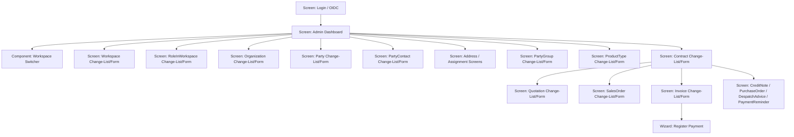
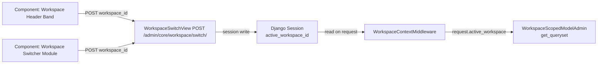
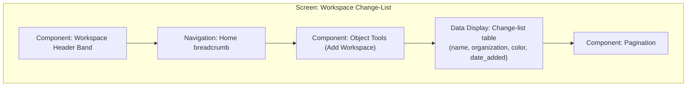
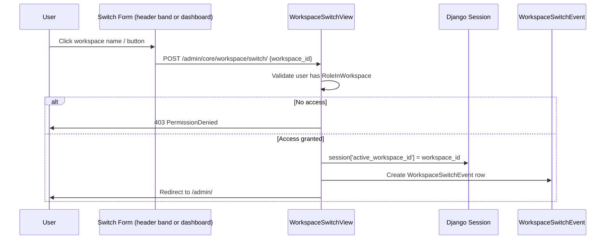
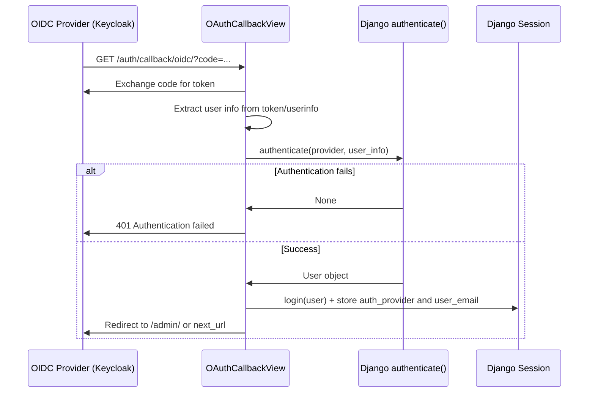
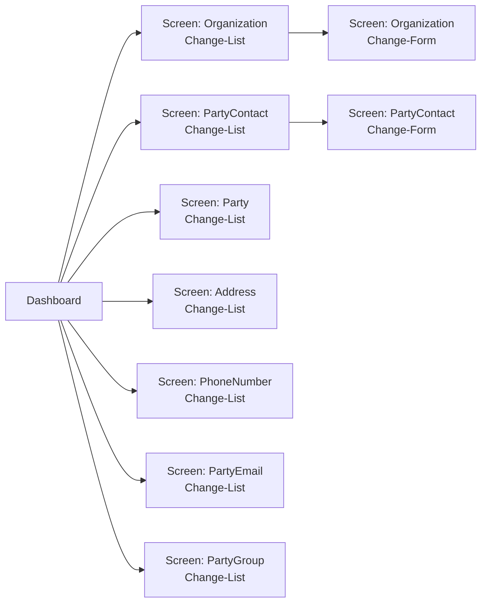
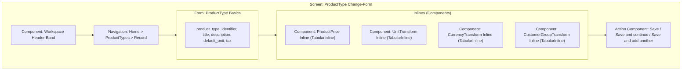
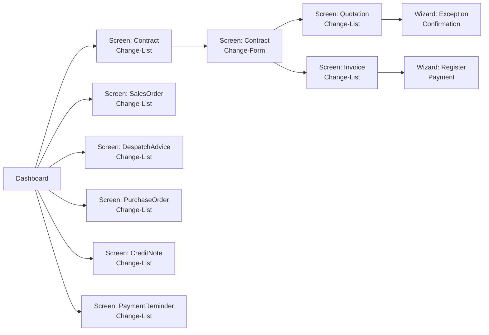
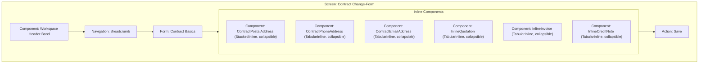
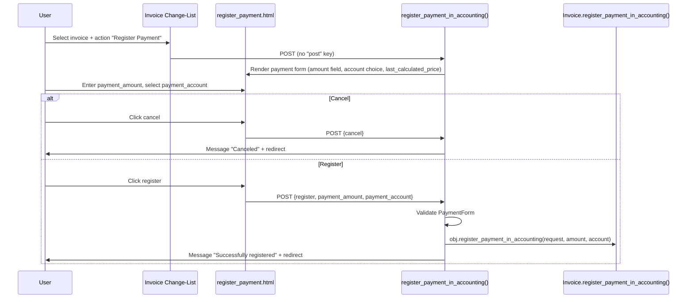

# Core Admin Screens

**Feature / Screen Group Name:** Core Admin Screens — Workspace/Auth, Contacts, Products, Commercial Documents

**UI Technology:** Django Admin with django-grappelli 3.0.10 (Django 5.2.13)

**Application Type:** Server-Side Rendered (SSR) — Django Template Language

## Abstraction Mapping

| Universal Term | Project-Specific Term |
|---|---|
| Screen / Page | `ModelAdmin` class registration (change-list + change-form pages) or function/class-based view |
| Component / Widget | Django Admin inline (`TabularInline`, `StackedInline`); Grappelli dashboard module |
| Form | Django `ModelForm` with `ModelAdmin.fieldsets`; custom form classes |
| Wizard / Flow | Admin action with intermediate confirmation template |
| Dialog / Modal | Grappelli popup (related-object lookup, add-another) via `showRelatedObjectLookupPopup` / `showAddAnotherPopup` |
| Navigation | Django URL routing + Grappelli breadcrumb band |
| Layout | Grappelli grid classes (`grp-module`, `g-d-*`, `l-2cr-fluid`) |
| State Management | Django session + `WorkspaceContextMiddleware` (active workspace); `TimezoneMiddleware` (user timezone) |
| Theme / Styling | Grappelli skin CSS; workspace accent colour (`active_workspace_color`) applied via inline style |
| Data Binding | Django Template Language (one-way server-side rendering) |

---

## Navigation

**Navigation Pattern:** Dashboard landing page with collapsible model-list groups; breadcrumb band on every page; Grappelli header bar with workspace colour band.

### Figure 1 — Core Admin Navigation Map

*Figure 1: Navigation map — core admin screens. Login leads to the Grappelli dashboard; each module group links to its own change-list and change-form pair.*

**Navigation Guards:** All Admin URLs are protected by Django's `is_staff` check. The `WorkspaceSwitchView` additionally requires the `staff_member_required` decorator and validates that the user holds a `RoleInWorkspace` for the requested workspace before switching.

**Deep Linking:** Every change-list and change-form URL is directly addressable under `/admin/<app>/<model>/` and `/admin/<app>/<model>/<pk>/change/`.

---

## State Management

**Approach:** Django session (server-side). No client-side state store is used.

### State Shape

| Session Key | Set By | Consumed By | Description |
|---|---|---|---|
| `active_workspace_id` | `WorkspaceSwitchView` POST handler | `WorkspaceContextMiddleware` | PK of the workspace currently active for the user's session |
| `auth_provider` | `OAuthCallbackView` | Session-level audit | Name of the OIDC provider used during login |
| `user_email` | `OAuthCallbackView` | Session-level audit | Email address of the authenticated user |
| `login_next_url` | `OAuthLoginView` | `OAuthCallbackView` | Post-login redirect target, stored in session during OIDC redirect |

### Figure 2 — Workspace State Data Flow

*Figure 2: Active-workspace state flows from workspace-switch forms through the POST handler into the session, where the middleware reads it and injects it into every subsequent request as `request.active_workspace`.*

---

## Feature Group: Workspace Management

### Screen: Workspace Change-List

**Route:** `/admin/core/workspace/`

**Purpose:** Lists all registered workspaces. Allows administrators to navigate to individual workspace records.

*Figure 3: Workspace change-list screen composition.*

**Screen States:** populated (default), empty (no workspaces).

**Access Control:** Django `is_staff` required; superusers see all workspaces; non-superusers see only workspaces accessible to them via `WorkspaceScopedModelAdmin.get_queryset`.

**List Columns:** `name`, `organization`, `color`, `date_added`.

**Search / Filter:** `search_fields = ('name', 'organization__party_ptr__matchcode')`.

---

### Screen: Workspace Change-Form

**Route:** `/admin/core/workspace/<pk>/change/`

**Purpose:** Create or edit a single workspace record.

| Field | Type | Required | Description |
|---|---|---|---|
| name | text input | Yes | Workspace display name |
| organization | FK lookup | No | Associated organisation (Grappelli related-object popup) |
| color | text input | No | Hex accent colour rendered in header band |
| date_added | read-only | — | Auto-populated timestamp |
| last_modified | read-only | — | Auto-populated timestamp |

**Timestamps fieldset:** collapsible (`classes: collapse`).

---

### Component: Workspace Header Band

**Component Type:** Feedback / Layout Component

**Source:** `koalixcrm/core/templates/admin/workspace_header.html`

**Purpose:** Displays the active workspace name as a colour-coded band above all admin pages; provides one-click workspace switching when the user belongs to multiple workspaces.

| Variable | Type | Description |
|---|---|---|
| `active_workspace` | Workspace object or None | Current workspace; band is hidden when None |
| `active_workspace_color` | string (hex) | Accent colour; falls back to `#417690` |
| `user_workspaces` | QuerySet | All workspaces accessible to the current user |

**Behavior:** When the user holds access to more than one workspace, a POST-submit button is rendered for each non-active workspace. Clicking the button submits to `/admin/core/workspace/switch/` with `workspace_id` as a hidden field.

**Styling:** Inline style only; background set to `active_workspace_color`.

---

### Component: Workspace Switcher Module (Dashboard)

**Component Type:** Container Component / Data Display Component

**Source:** `koalixcrm/core/templates/admin/dashboard/workspace_switcher.html`; `koalixcrm/core/admin/dashboard_modules.py`

**Purpose:** First dashboard module on the Admin landing page. Shows all workspaces accessible to the user with role badges and an active-workspace marker. Allows switching the active workspace from the dashboard.

#### Inputs (module attributes, populated by `WorkspaceSwitcherModule.init_with_context`)

| Attribute | Type | Description |
|---|---|---|
| `workspace_rows` | list of dicts | One entry per accessible workspace: `workspace_id`, `name`, `color`, `roles`, `is_active`, `switch_url` |
| `no_access` | boolean | When True, renders a "No workspace access" message instead of the list |

**Behavior:** When a single workspace exists the name renders as inert text (no switch action). When multiple workspaces exist, each non-active workspace renders as a POST-form button.

---

### Screen: RoleInWorkspace Change-List/Form

**Route:** `/admin/core/roleinworkspace/` and `/admin/core/roleinworkspace/<pk>/change/`

**Purpose:** Manage which Django auth groups are assigned which roles within which workspace.

**List Columns:** `group`, `workspace`, `role`.

**List Filters:** `workspace`, `role`.

**Search:** `group__name`, `workspace__name`.

**Form Fields:** `group` (raw-id field), `workspace` (FK), `role` (choice field).

---

### Wizard / Flow: Workspace Switch

**Source:** `koalixcrm/core/views/workspace_switch.py`

**Trigger:** POST form submitted from either the Workspace Header Band or the Workspace Switcher Module.

*Figure 4: Workspace switch flow — POST validation, session write, audit log, and redirect.*

---

## Feature Group: Authentication / OIDC

### Screen: Login Selection

**Route:** `/auth/login/` (also mounted as `admin.site.login` overriding the default admin login)

**Source:** `koalixcrm/auth/oidc_views.py — LoginSelectionView`

**Purpose:** Entry point for admin authentication. When OIDC is configured (`ADMIN_OIDC_ISSUER` setting present), it redirects directly to the OIDC provider. When OIDC is not configured (local development), it falls back to Django's built-in admin login form.

| State | Condition | Behavior |
|---|---|---|
| Already authenticated | `request.user.is_authenticated` | Redirects to `next` or `/admin/` |
| OIDC configured | `hasattr(oauth, 'oidc')` | Redirects to `/auth/login/oidc/` |
| OIDC not configured | No OIDC issuer | Renders `admin/login.html` with username/password form |

---

### Screen: OAuth Callback

**Route:** `/auth/callback/<provider>/` (e.g. `/auth/callback/oidc/`)

**Source:** `koalixcrm/auth/oidc_views.py — OAuthCallbackView`

**Purpose:** Receives the authorization code from the OIDC provider, exchanges it for tokens, creates or links the Django user, establishes the session, and redirects to the admin index.

*Figure 5: OIDC callback sequence — token exchange, user creation/lookup, session establishment.*

---

### Screen: Logout

**Route:** `/auth/logout/`

**Source:** `koalixcrm/auth/oidc_views.py — MultiProviderLogoutView`

**Purpose:** Clears the Django session and, when an OIDC `end_session_endpoint` is discoverable, redirects to the provider's logout URL with a `post_logout_redirect_uri` pointing back to the login selection screen.

---

## Feature Group: Contacts

### Navigation within Contacts

*Figure 6: Contacts navigation — each entity has its own change-list / change-form pair reached from the dashboard.*

---

### Screen: Organization Change-List

**Route:** `/admin/contacts/organization/`

**Purpose:** List and search all organisations in the active workspace.

**List Columns:** `id`, `display_name`, `legal_form`, `legal_name`, `legal_seat_country`.

**Filters:** `workspace`.

**Search:** `display_name`, `legal_name`, `registration_number`.

**Actions:** `convert_organizations_to_contacts`.

---

### Screen: Organization Change-Form

**Route:** `/admin/contacts/organization/<pk>/change/`

**Purpose:** Create or edit an organisation.

**Access Control:** `WorkspaceScopedModelAdmin` enforces workspace isolation; FK dropdowns are filtered to the active workspace.

---

### Screen: PartyContact Change-List

**Route:** `/admin/contacts/partycontact/`

**Purpose:** List all natural persons (contacts) in the active workspace.

**List Columns:** `id`, `display_name`, `given_name`, `family_name`, `gdpr_consent_date`.

**Filters:** `workspace`.

**Search:** `display_name`, `given_name`, `family_name`.

**Actions:** `convert_contacts_to_organizations`.

---

### Screen: Party Change-List

**Route:** `/admin/contacts/party/`

**Purpose:** List all party records (the base entity for both organisations and contacts).

**List Columns:** `id`, `display_name`, `default_language`, `created_at`.

**Filters:** `workspace`.

**Search:** `display_name`.

---

### Screen: PartyRole Change-List/Form

**Route:** `/admin/contacts/partyrole/`

**Purpose:** Manage role assignments (e.g. customer, supplier) to party records.

**List Columns:** `id`, `party`, `role_type`, `is_primary`, `valid_from`, `valid_to`.

**Filters:** `role_type`, `is_primary`, `workspace`.

---

### Screen: OrganizationMembership Change-List/Form

**Route:** `/admin/contacts/organizationmembership/`

**Purpose:** Manage person-to-organisation memberships with title and position.

**List Columns:** `id`, `contact`, `organization`, `title`, `position`, `is_primary`.

**Filters:** `is_primary`, `workspace`.

---

### Screen: OrganizationRelationship Change-List/Form

**Route:** `/admin/contacts/organizationrelationship/`

**Purpose:** Manage parent-child relationships between organisations.

**List Columns:** `id`, `parent`, `child`, `relationship_type`, `valid_from`, `valid_to`.

**Filters:** `relationship_type`, `workspace`.

---

### Screen: Address Change-List/Form

**Route:** `/admin/contacts/address/`

**Purpose:** Manage postal address records independent of their assignment to parties.

**List Columns:** `id`, `street`, `zip_code`, `town`, `country`.

**Filters:** `workspace`.

**Search:** `street`, `zip_code`, `town`.

---

### Screen: AddressAssignment Change-List/Form

**Route:** `/admin/contacts/addressassignment/`

**Purpose:** Link address records to parties with a purpose and validity period.

**List Columns:** `id`, `party`, `address`, `purpose`, `is_primary`, `valid_from`, `valid_to`.

**Filters:** `purpose`, `is_primary`, `workspace`.

---

### Screen: PhoneNumber / PhoneAssignment Change-List/Form

**Routes:** `/admin/contacts/phonenumber/`, `/admin/contacts/phoneassignment/`

**Purpose:** Manage phone number records and their assignment to parties.

**PhoneNumber List Columns:** `id`, `phone_e164`.

**PhoneAssignment List Columns:** `id`, `party`, `phone`, `purpose`, `is_primary`.

---

### Screen: PartyEmail / EmailAssignment Change-List/Form

**Routes:** `/admin/contacts/partyemail/`, `/admin/contacts/emailassignment/`

**Purpose:** Manage email addresses and their assignment to parties.

**PartyEmail List Columns:** `id`, `email`.

**EmailAssignment List Columns:** `id`, `party`, `email`, `purpose`, `is_primary`.

---

### Screen: PartyGroup Change-List/Form

**Route:** `/admin/contacts/partygroup/`

**Purpose:** Define named groups of parties (e.g. customer groups, price groups).

**List Columns:** `id`, `name`, `role_type_scope`.

**Filters:** `role_type_scope`, `workspace`.

**Search:** `name`.

---

### Screen: PartyGroupMembership Change-List/Form

**Route:** `/admin/contacts/partygroupmembership/`

**Purpose:** Assign individual party records to party groups.

**List Columns:** `id`, `party`, `party_group`.

**Filters:** `workspace`.

---

## Feature Group: Products

### Screen: ProductType Change-List

**Route:** `/admin/products/producttype/`

**Purpose:** List all product types in the active workspace.

**List Columns:** `product_type_identifier`, `title`, `default_unit`, `tax`.

**Filters:** `workspace`.

---

### Screen: ProductType Change-Form

**Route:** `/admin/products/producttype/<pk>/change/`

**Purpose:** Create or edit a product type, including pricing and unit conversion rules.

*Figure 7: ProductType change-form composition with inline components.*

| Field | Type | Required | Description |
|---|---|---|---|
| product_type_identifier | text | Yes | Short identifier code |
| title | text | Yes | Human-readable product name |
| description | text area | No | Extended description |
| default_unit | FK | No | Default unit of measure |
| tax | FK | No | Applicable tax record |

---

### Component: ProductPrice Inline

**Component Type:** Input Component (TabularInline)

**Purpose:** Define pricing rules per currency, unit, validity period, and party group.

**Fields:** `price`, `currency`, `unit`, `valid_from`, `valid_until`, `party_group`.

---

### Component: CustomerGroupTransform Inline

**Component Type:** Input Component (TabularInline)

**Purpose:** Define transformation factors between party groups for pricing.

**Fields:** `from_party_group`, `to_party_group`, `factor`.

---

## Feature Group: Commercial Documents

### Navigation within Commercial Documents

*Figure 8: Commercial documents navigation map.*

---

### Screen: Contract Change-List

**Route:** `/admin/contract_object_management/contract/`

**Purpose:** List all contracts in the active workspace.

**List Columns:** `id`, `description`, `buyer_party`, `supplier_party`, `staff`, `default_currency`, `date_of_creation`, `last_modification`, `last_modified_by`.

**Filters:** `workspace`, `buyer_party`, `supplier_party`, `staff`, `default_currency`.

**Search:** `id`, `contract`.

**Actions:** `create_quotation`, `create_invoice`, `create_purchase_order`, `create_credit_note`.

---

### Screen: Contract Change-Form

**Route:** `/admin/contract_object_management/contract/<pk>/change/`

**Purpose:** Create or edit a contract, with embedded quotation, invoice, and credit note summaries and contact assignments.

**Form Fieldset — Basics:** `description`, `buyer_party`, `staff`, `supplier_party`, `default_currency`, `default_template_set`.

*Figure 9: Contract change-form composition.*

---

### Screens: Quotation / SalesOrder / Invoice / CreditNote / PurchaseOrder / DespatchAdvice / PaymentReminder

All commercial document screens share a common base defined in `OptionCommercialDocument` (source: `koalixcrm/contracts/admin/commercial_document_admin.py`). Each subtype adds document-specific fieldsets and actions.

**Common Routes:** `/admin/contract_object_management/<doctype>/`

**Common List Columns:** `id`, `description`, `contract`, `party`, `currency`, `staff`, `last_modified_by`, `last_calculated_price`, `last_calculated_tax`, `last_pricing_date`, `last_modification`, `last_print_date`.

**Common List Filters:** `workspace`, `party`, `contract`, `currency`, `staff`, `last_modification`.

**Common Search:** `contract__id`, `party__display_name`, `currency__description`.

**Common Fieldset:** `contract`, `description`, `party`, `currency`, `discount`, `staff`, `party_reference`, `ext_business_appl_references`, `template_set`, `custom_date_field`.

| Component | Type | Purpose |
|---|---|---|
| `CommercialDocumentInlinePosition` | TabularInline | Line items (positions) |
| `CommercialDocumentTextParagraph` | StackedInline (collapsible) | Free-text paragraphs to include in the document |
| `CommercialDocumentPostalAddress` | StackedInline (collapsible) | Postal address assignment |
| `CommercialDocumentPhoneAddress` | TabularInline (collapsible) | Phone number assignment |
| `CommercialDocumentEmailAddress` | TabularInline (collapsible) | Email address assignment |
| `CommercialDocumentMediaInline` | TabularInline | Attached media files |

| Action | Available On |
|---|---|
| Create Quotation | Contract, SalesOrder, Invoice |
| Create Sales Order | Quotation, Invoice |
| Create Invoice | Contract, Quotation, SalesOrder |
| Create Despatch Advice | Contract, Quotation, SalesOrder, Invoice |
| Create Purchase Order | Contract, Quotation, SalesOrder, Invoice |
| Create Payment Reminder | Contract, Invoice |
| Create Credit Note | Contract |
| Create Credit Note from Invoice | Invoice |
| Create PDF | All commercial documents |
| Register Invoice in Accounting | Invoice |
| Register Payment in Accounting | Invoice |
| Create Project | Quotation |

| Document Type | Extra Fields |
|---|---|
| Quotation | `valid_until`, `status` |
| Invoice | `payable_until`, `status`, `payment_bank_reference` |

**Post-save price recalculation:** `OptionCommercialDocument.after_saving_model_and_related_inlines` automatically calls `Calculations.calculate_document_price` after every save, displaying a success or error message via `messages`.

---

### Wizard / Flow: Register Payment in Accounting

**Source:** `koalixcrm/core/templates/crm/admin/register_payment.html` rendered by `OptionInvoice.register_payment_in_accounting`

**Trigger:** Admin action "Register Payment in Accounting" selected on an Invoice change-list row.

**Purpose:** Collect a payment amount and accounting target account before booking the payment.

Step sequence:

*Figure 10: Payment registration wizard — two-step POST confirmation for booking a payment against an invoice.*

| Field | Type | Required | Description |
|---|---|---|---|
| payment_amount | decimal | Yes | Amount to register as payment |
| payment_account | model choice | Yes | Accounting account of type "A" (activa) |

---

### Wizard / Flow: Exception Confirmation

**Source:** `koalixcrm/core/templates/crm/admin/exception.html`

**Trigger:** An admin action that encounters an exception state requiring user confirmation before proceeding.

**Purpose:** Presents a description of the exception and a `next_steps` field, allowing the user to confirm or implicitly decline the action.

**Content:** The `description` context variable describes the exception. The `form.next_steps` widget renders the confirmation field. A hidden `post=yes` field and a submit button "Confirm Selection" complete the form.

---

### Component: CommercialDocumentMedia Inline

**Component Type:** Input Component (TabularInline)

**Source:** `koalixcrm/contracts/admin/commercial_document_media_admin.py`

**Purpose:** Attach media files (e.g. signed contracts, attachments) to a commercial document.

---

## Backend Integration

| API Endpoint / Admin URL | Method | Purpose | Source File |
|---|---|---|---|
| `/admin/core/workspace/switch/` | POST | Switch active workspace in session | `koalixcrm/core/views/workspace_switch.py` |
| `/auth/login/` | GET | Login selection / OIDC redirect | `koalixcrm/auth/oidc_views.py` |
| `/auth/login/<provider>/` | GET | Initiate OAuth flow | `koalixcrm/auth/oidc_views.py` |
| `/auth/callback/<provider>/` | GET | OAuth token exchange and session establishment | `koalixcrm/auth/oidc_views.py` |
| `/auth/logout/` | GET | OIDC end-session redirect | `koalixcrm/auth/oidc_views.py` |
| `/admin/contacts/*/` | GET/POST | Contacts CRUD | `koalixcrm/contacts/admin/party_admin.py` |
| `/admin/products/producttype/` | GET/POST | Product type CRUD | `koalixcrm/products/admin/product_type_admin.py` |
| `/admin/contract_object_management/*/` | GET/POST | Commercial document CRUD | `koalixcrm/contracts/admin/` |

**Error Handling:** Admin actions surface errors via `self.message_user(request, ..., level=messages.ERROR)`, which renders the standard Grappelli notification banner at the top of the redirected page. Price calculation failures (`NoPriceFound`) and accounting registration failures (`IncompleteInvoice`, `OpenInterestAccountMissing`) are reported this way.

---

## List of Illustrations

- [Figure 1 — Core Admin Navigation Map](#navigation)
- [Figure 2 — Workspace State Data Flow](#state-management)
- [Figure 3 — Workspace Change-List Screen Composition](#screen-workspace-change-list)
- [Figure 4 — Workspace Switch Flow](#wizard--flow-workspace-switch)
- [Figure 5 — OIDC Callback Sequence](#screen-oauth-callback)
- [Figure 6 — Contacts Navigation Map](#navigation-within-contacts)
- [Figure 7 — ProductType Change-Form Composition](#screen-producttype-change-form)
- [Figure 8 — Commercial Documents Navigation Map](#navigation-within-commercial-documents)
- [Figure 9 — Contract Change-Form Composition](#screen-contract-change-form)
- [Figure 10 — Payment Registration Wizard Sequence](#wizard--flow-register-payment-in-accounting)

## References

- [UI Identification](QQ_SD_UIIdentification.md)
- Source: `koalixcrm/core/admin/workspace_admin.py`
- Source: `koalixcrm/core/admin/role_in_workspace_admin.py`
- Source: `koalixcrm/core/admin/workspace_scoped_admin.py`
- Source: `koalixcrm/core/admin/dashboard_modules.py`
- Source: `koalixcrm/core/templates/admin/base_site.html`
- Source: `koalixcrm/core/templates/admin/workspace_header.html`
- Source: `koalixcrm/core/templates/admin/dashboard/workspace_switcher.html`
- Source: `koalixcrm/core/templates/crm/admin/register_payment.html`
- Source: `koalixcrm/core/templates/crm/admin/exception.html`
- Source: `koalixcrm/core/views/workspace_switch.py`
- Source: `koalixcrm/auth/oidc_views.py`
- Source: `koalixcrm/contacts/admin/party_admin.py`
- Source: `koalixcrm/products/admin/product_type_admin.py`
- Source: `koalixcrm/products/admin/product_price_admin.py`
- Source: `koalixcrm/products/admin/customer_group_transform_admin.py`
- Source: `koalixcrm/contracts/admin/commercial_document_admin.py`
- Source: `koalixcrm/contracts/admin/contract_admin.py`
- Source: `koalixcrm/contracts/admin/invoice_admin.py`
- Source: `koalixcrm/contracts/admin/quotation_admin.py`
- Source: `koalixcrm/contracts/admin/sales_order_admin.py`
- Source: `projectsettings/urls.py`
- Source: `projectsettings/dashboard.py`
