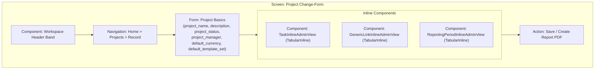
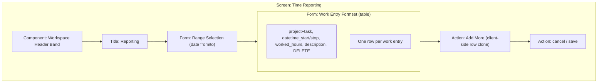
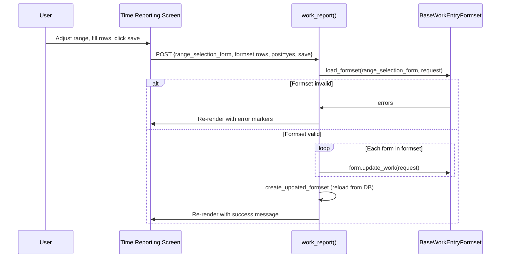
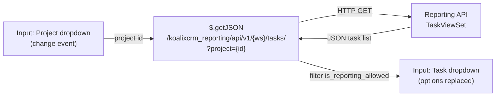
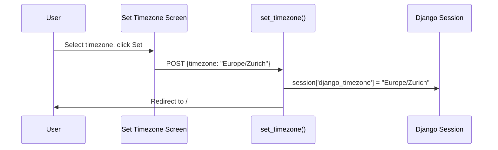
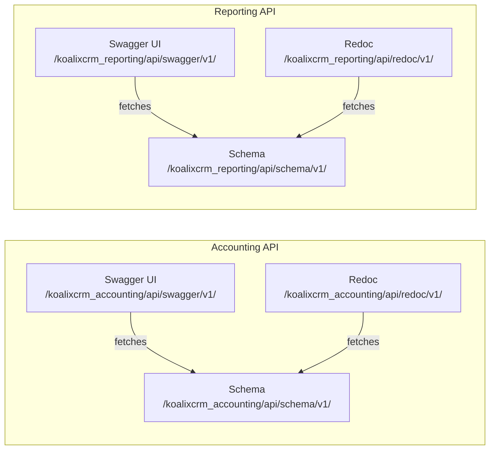

# Domain Admin Screens

**Feature / Screen Group Name:** Domain Admin Screens — Accounting, Reporting, User Extensions, API Documentation

**UI Technology:** Django Admin with django-grappelli 3.0.10 (Django 5.2.13)

**Application Type:** Server-Side Rendered (SSR) — Django Template Language; one AJAX-enhanced screen (`time_reporting.html`)

## Abstraction Mapping

| Universal Term | Project-Specific Term |
|---|---|
| Screen / Page | `ModelAdmin` class registration (change-list + change-form) or function/class-based view |
| Component / Widget | Django Admin inline (`TabularInline`, `StackedInline`); Grappelli dashboard module |
| Form | Django `ModelForm` with `ModelAdmin.fieldsets`; custom form classes; Django formset (`BaseFormSet`) |
| Wizard / Flow | Multi-step admin action with intermediate rendering |
| Dialog / Modal | Grappelli popup (related-object lookup, add-another) |
| Navigation | Django URL routing + Grappelli breadcrumb band + dashboard link list |
| Layout | Grappelli grid classes (`grp-module`, `g-d-*`, `l-2cr-fluid`) |
| State Management | Django session; `WorkspaceContextMiddleware`; `TimezoneMiddleware`; user timezone stored in `session['django_timezone']` |
| Theme / Styling | Grappelli skin CSS; workspace accent colour via `active_workspace_color` |
| Data Binding | Django Template Language (one-way); `$.getJSON` AJAX call in `time_reporting.html` for task dropdown |

---

## Navigation

**Navigation Pattern:** Grappelli dashboard with collapsible model-list groups and link lists. The "Report Work And Expenses" link list in the dashboard provides direct links to the time-tracking and timezone-selection screens, which are standalone views outside the standard Admin URL space.

### Figure 1 — Domain Admin Navigation Map

```mermaid
flowchart TD
    Dashboard["Screen: Admin Dashboard"]
    AcctList["Screen: Account Change-List/Form"]
    PeriodList["Screen: AccountingPeriod Change-List/Form"]
    BookList["Screen: Booking Change-List/Form"]
    PCatList["Screen: ProductCategory Change-List/Form"]
    ProjList["Screen: Project Change-List/Form"]
    TaskList["Screen: Task Change-List/Form"]
    WorkList["Screen: Work Change-List/Form"]
    HRList["Screen: HumanResource Change-List/Form"]
    RPList["Screen: ReportingPeriod Change-List/Form"]
    TimeRep["Screen: Time Reporting (Formset View)"]
    SetTZ["Screen: Set Timezone"]
    DocTpl["Screen: DocumentTemplate subtypes\nChange-List/Form"]
    TplSet["Screen: TemplateSet Change-List/Form"]
    UserExt["Screen: UserExtension Change-List/Form"]
    SwaggerUI["Screen: Swagger UI (per app)"]
    RedocUI["Screen: Redoc UI (per app)"]

    Dashboard --> AcctList
    Dashboard --> PeriodList
    Dashboard --> BookList
    Dashboard --> PCatList
    Dashboard --> ProjList
    ProjList --> TaskList
    ProjList --> RPList
    TaskList --> WorkList
    Dashboard --> HRList
    Dashboard --> TimeRep
    Dashboard --> SetTZ
    Dashboard --> DocTpl
    Dashboard --> TplSet
    Dashboard --> UserExt
    Dashboard --> SwaggerUI
    Dashboard --> RedocUI
```



*Figure 1: Domain admin navigation map — accounting, reporting, user extension, and API documentation screens reachable from the dashboard.*

---

## State Management

**Timezone State:** The `TimezoneMiddleware` reads `session['django_timezone']` on every request and activates the stored timezone. Users set their timezone via the standalone Set Timezone screen. All datetime values rendered in templates reflect this session-level timezone.

**Workspace State:** All `WorkspaceScopedModelAdmin` subclasses (Project, Task, Work, HumanResource, ReportingPeriod, DocumentTemplate, TemplateSet, UserExtension) filter their querysets to `request.active_workspace`. See [QQ_UI_Doc_CoreAdminScreens.md — State Management](QQ_UI_Doc_CoreAdminScreens.md#state-management) for the workspace state flow.

---

## Feature Group: Accounting

### Screen: Account Change-List

**Route:** `/admin/accounting/account/`

**Purpose:** List all accounts in the chart of accounts.

**List Columns:** `account_number`, `account_type`, `title`, `sum_of_all_bookings`.

| Field | Type | Description |
|---|---|---|
| account_number | integer | Unique account number |
| account_type | choice | Account type (e.g. A=activa, P=passiva, E=expense, I=income) |
| title | text | Account name |
| description | text area | Extended description |
| is_open_reliabilities_account | boolean | Flag for open-liabilities tracking |
| is_open_interest_account | boolean | Flag for open-interest tracking |
| is_product_inventory_activa | boolean | Flag for inventory accounts |
| is_a_customer_payment_account | boolean | Flag for customer payment accounts |

**Note:** Account records are not workspace-scoped (`OptionAccount` does not use `WorkspaceScopedModelAdmin`).

---

### Screen: AccountingPeriod Change-List

**Route:** `/admin/accounting/accountingperiod/`

**Purpose:** Define fiscal periods and associate balance-sheet and profit-loss templates.

**List Columns:** `title`, `begin`, `end`, `template_set_balance_sheet`, `template_profit_loss_statement`.

**Form Fields:** `title`, `begin`, `end`, `template_set_balance_sheet`, `template_profit_loss_statement`.

**Inline Component:** `InlineBookings` (TabularInline) — lists bookings within the accounting period.

**Admin Actions:** `create_balance_sheet_pdf`, `create_profit_loss_statement_pdf` (queue `PDFExportProcess` rows).

**Note:** `OptionAccountingPeriod` is not workspace-scoped.

---

### Screen: Booking Change-List

**Route:** `/admin/accounting/booking/`

**Purpose:** List and manage individual double-entry bookings.

**List Columns:** `from_account`, `to_account`, `amount`, `booking_date_only`, `staff`.

**Form Fields:** `from_account`, `to_account`, `amount`, `booking_date`, `staff`, `description`, `booking_reference`, `accounting_period`.

**Note:** `OptionBooking` is not workspace-scoped.

---

### Screen: ProductCategory Change-List/Form

**Route:** `/admin/accounting/productcategory/`

**Purpose:** Define product categories with associated profit and loss accounts for accounting integration.

**List Columns:** `title`, `profit_account`, `loss_account`.

**Form Fields:** `title`, `profit_account`, `loss_account`.

---

## Feature Group: Reporting (Projects and Time)

### Screen: Project Change-List

**Route:** `/admin/reporting/project/`

**Purpose:** List all projects with planning and cost summary columns.

**List Columns:** `id`, `project_name`, `project_manager`, `project_status`, `planned_total_costs`, `planned_duration`, `effective_duration`, `effective_effort`, `effective_costs_confirmed`, `effective_costs_not_confirmed`.

**Access Control:** `WorkspaceScopedModelAdmin` — queryset filtered to active workspace.

**Admin Actions:** `create_report_pdf` (queues a `PDFExportProcess` for the monthly project summary template).

---

### Screen: Project Change-Form

**Route:** `/admin/reporting/project/<pk>/change/`

**Purpose:** Create or edit a project with associated tasks, links, and reporting periods.



*Figure 2: Project change-form composition with task, generic link, and reporting period inlines.*

| Field | Type | Required | Description |
|---|---|---|---|
| project_name | text | Yes | Project title |
| description | text area | No | Extended description |
| project_status | FK | No | Current status record |
| project_manager | FK | No | Assigned manager user |
| default_currency | FK | No | Default currency for cost tracking |
| default_template_set | FK | No | Template set for PDF generation |

---

### Component: TaskInlineAdminView

**Component Type:** Input Component (TabularInline)

**Source:** `koalixcrm/reporting/admin/task_admin.py`

**Purpose:** Embedded summary of all tasks belonging to a project. Read-only except for adding new task rows.

**Displayed Fields:** `link_to_task`, `title`, `planned_start`, `planned_end`, `status`, `last_status_change`, `planned_duration`, `planned_total_costs`, `effective_duration`, `effective_effort_overall`, `effective_costs_confirmed`, `effective_costs_not_confirmed`.

**Behavior:** `has_delete_permission` returns False — tasks cannot be deleted from the project form.

---

### Screen: Task Change-List

**Route:** `/admin/reporting/task/`

**Purpose:** List all tasks with planning and cost metrics.

**List Columns:** `link_to_task`, `planned_start`, `planned_end`, `project`, `status`, `last_status_change`, `planned_duration`, `planned_total_costs`, `effective_duration`, `effective_effort_overall`, `effective_costs_confirmed`, `effective_costs_not_confirmed`.

**Filters:** `project`.

**Access Control:** `WorkspaceScopedModelAdmin`.

---

### Screen: Task Change-Form

**Route:** `/admin/reporting/task/<pk>/change/`

**Purpose:** Create or edit a task with agreements, estimations, links, and work records.

**Form Fields:** `title`, `project`, `description`, `status`.

**Inlines:** `AgreementInlineAdminView`, `EstimationInlineAdminView`, `InlineGenericTaskLink`, `WorkInlineAdminView`.

---

### Component: AgreementInlineAdminView

**Component Type:** Input Component (TabularInline)

**Source:** `koalixcrm/reporting/admin/agreement_admin.py`

**Purpose:** Define resource agreements (who does what, for how long, at what cost) attached to a task.

**Fields:** `task`, `resource`, `amount`, `unit`, `costs`, `date_from`, `date_until`, `type`, `status`.

---

### Component: EstimationInlineAdminView

**Component Type:** Input Component (TabularInline)

**Source:** `koalixcrm/reporting/admin/estimation_admin.py`

**Purpose:** Record effort estimations per task and reporting period.

**Fields:** `task`, `amount`, `resource`, `date_from`, `date_until`, `status`, `reporting_period`.

---

### Component: WorkInlineAdminView

**Component Type:** Data Display Component (TabularInline, read-only)

**Source:** `koalixcrm/reporting/admin/work_admin.py`

**Purpose:** Embedded read-only summary of work entries on a task or within a reporting period.

**Displayed Fields:** `link_to_work`, `get_short_description`, `human_resource`, `date`, `effort_as_string`, `confirmed`, `task`, `reporting_period`.

**Behavior:** `has_add_permission` and `has_delete_permission` both return False — the inline is read-only within the task change-form.

---

### Screen: Work Change-List

**Route:** `/admin/reporting/work/`

**Purpose:** List individual work entries.

**List Columns:** `link_to_work`, `human_resource`, `task`, `get_short_description`, `date`, `reporting_period`, `effort_as_string`, `confirmed`.

**Filters:** `task`, `date`.

**Admin Actions:** `delete_work` — deletes selected work entries unless their reporting period is marked as done.

---

### Screen: Work Change-Form

**Route:** `/admin/reporting/work/<pk>/change/`

**Purpose:** Create or edit an individual work entry.

**Form Fields:** `human_resource`, `date`, `start_time`, `stop_time`, `worked_hours`, `short_description`, `description`, `task`, `reporting_period`.

---

### Screen: HumanResource Change-List

**Route:** `/admin/reporting/humanresource/`

**Purpose:** List all human resource registrations linking Django users to resource records.

**List Columns:** `id`, `user`, `resource_manager`, `resource_type`.

**Filters:** `user`.

**Search:** `id`, `user`.

**Inline Component:** `ResourcePriceInlineAdminView`.

**Admin Actions:** `create_work_report_pdf` — queues a `PDFExportProcess` for the work report template of the selected human resource's user extension.

---

### Screen: ReportingPeriod Change-List

**Route:** `/admin/reporting/reportingperiod/`

**Purpose:** List reporting periods with their project associations and status.

**List Columns:** `id`, `project`, `title`, `begin`, `end`, `status`.

**Access Control:** `WorkspaceScopedModelAdmin`.

**Admin Actions:** `create_report_pdf` — queues a `PDFExportProcess` for the monthly project summary template.

---

### Screen: ReportingPeriod Change-Form

**Route:** `/admin/reporting/reportingperiod/<pk>/change/`

**Purpose:** Create or edit a reporting period; view embedded work entries.

**Form Fields:** `project`, `title`, `begin`, `end`, `status`.

**Inline Component:** `WorkInlineAdminView` (read-only).

---

### Screen: Time Reporting (Formset View)

**Route:** `/koalixcrm/crm/reporting/time_tracking/`

**Source:** `koalixcrm/reporting/views/time_tracking.py` — `work_report` function-based view; template `koalixcrm/core/templates/crm/admin/time_reporting.html`

**Purpose:** Allow a human resource to view and submit multiple work entries within a date range in a single formset. This is the primary time-entry screen for non-admin users.

**Access Control:** `@login_required`; redirects to error screens if the user has no `UserExtension`, no `HumanResource` record, or no open `ReportingPeriod`.



*Figure 3: Time reporting screen composition with formset and client-side row-add button.*

| State | Condition |
|---|---|
| No UserExtension | Redirects to `UserExtensionMissing.view` error page |
| No HumanResource record | Redirects to `UserIsNoHumanResource.view` error page |
| No open ReportingPeriod | Redirects to `ReportingPeriodNotFound.view` error page |
| Default (GET) | Renders formset pre-populated with existing work for a 30-day forward window |
| After save (POST save) | Saves entries, re-renders with updated data |
| Cancel | Redirects to `/admin/` |

---

### Form: Range Selection

**Purpose:** Select the date range for which work entries are displayed.

**Fields:** `from_date` (date input), `to_date` (date input).

**Source:** `koalixcrm/reporting/views/range_selection_form.py`

---

### Form: Work Entry Formset

**Purpose:** Submit multiple work entries simultaneously for the selected date range.

| Field | Type | Description |
|---|---|---|
| project | FK dropdown | Project to which work is attributed |
| task | FK dropdown | Task within the selected project (dynamically filtered via AJAX) |
| datetime_start | datetime | Start of the work interval |
| datetime_stop | datetime | End of the work interval |
| worked_hours | decimal | Actual hours worked |
| description | text | Work description |
| DELETE | checkbox | Mark row for deletion |

**Validation Strategy:** Client-side Grappelli date/time pickers for datetime fields. Server-side formset validation via Django's `BaseFormSet`. Validation errors are rendered inline per row.



*Figure 4: Time reporting formset submission sequence.*

---

### Data Binding: AJAX Task Dropdown

**Source:** `koalixcrm/core/templates/crm/admin/time_reporting.html` — `$(document).ready` block

**Mechanism:** When the user changes the project dropdown in any formset row, a `$.getJSON` call is made to:

```text
/koalixcrm_reporting/api/v1/{active_workspace.id}/tasks/?format=json&project={selected_project_id}
```

The response is a JSON array of task objects. Only tasks with `is_reporting_allowed === "True"` are added as `<option>` elements to the corresponding task dropdown (`#id_form-{row_index}-task`).

Figure 5 — AJAX Task Dropdown Data Flow:



*Figure 5: AJAX data binding for the task dropdown — the only client-side data binding in the entire UI.*

**Client-Side Add Row:** The "Add More" button triggers `cloneMore('#single_form', 'form')`. This function clones the last formset row, increments all field name and id indices, resets values, re-initialises Grappelli date/time pickers on the cloned row, and updates the `TOTAL_FORMS` management form input.

---

### Screen: Set Timezone

**Route:** `/koalixcrm/crm/reporting/set_timezone/`

**Source:** `koalixcrm/core/views/set_timezone.py`; template `koalixcrm/core/templates/crm/admin/set_timezone.html`

**Purpose:** Allow the authenticated user to select their display timezone, which is stored in the session and applied to all datetime rendering.

**Access Control:** `@login_required`.

| Field | Type | Description |
|---|---|---|
| timezone | select (dropdown) | All IANA timezone names from `zoneinfo.available_timezones()`, sorted alphabetically; current timezone pre-selected |



*Figure 6: Timezone selection submission — POST writes timezone to session, then redirects to root.*

---

## Feature Group: User Extensions and Templates

### Screen: DocumentTemplate Subtype Change-List/Form

**Routes:** One Admin registration per template subtype under `/admin/djangouserextension/<templatetype>/`

**Registered Subtypes:** `InvoiceTemplate`, `QuotationTemplate`, `DespatchAdviceTemplate`, `PaymentReminderTemplate`, `PurchaseOrderTemplate`, `SalesOrderTemplate`, `ProfitLossStatementTemplate`, `BalanceSheetTemplate`, `MonthlyProjectSummaryTemplate`, `WorkReportTemplate`.

**Purpose:** Upload and manage XSL document template files, FOP configuration files, and logo images for a specific document type.

**List Columns:** `id`, `title`.

**Filters:** `workspace`.

**Search:** `id`, `title`.

**Access Control:** `WorkspaceScopedModelAdmin`.

| Field | Type | Description |
|---|---|---|
| title | text | Template name |
| xsl_file | file upload (filebrowser) | XSL stylesheet for PDF rendering |
| fop_config_file | file upload (filebrowser) | Apache FOP configuration file |
| logo | file upload (filebrowser) | Logo image for document header |

**Inline Component:** `InlineTextParagraph` (StackedInline) — optional text paragraphs to include in generated documents.

---

### Screen: TemplateSet Change-List/Form

**Route:** `/admin/djangouserextension/templateset/`

**Purpose:** Group one template of each document type into a named set that can be assigned to contracts, users, and projects.

**List Columns:** `id`, `title`.

**Filters:** `workspace`.

**Search:** `id`, `title`.

**Access Control:** `WorkspaceScopedModelAdmin`.

| Field | Type | Description |
|---|---|---|
| title | text | Template set name |
| invoice_template | FK | `InvoiceTemplate` |
| quotation_template | FK | `QuotationTemplate` |
| despatch_advice_template | FK | `DespatchAdviceTemplate` |
| payment_reminder_template | FK | `PaymentReminderTemplate` |
| sales_order_template | FK | `SalesOrderTemplate` |
| purchase_order_template | FK | `PurchaseOrderTemplate` |
| profit_loss_statement_template | FK | `ProfitLossStatementTemplate` |
| balance_sheet_statement_template | FK | `BalanceSheetTemplate` |
| monthly_project_summary_template | FK | `MonthlyProjectSummaryTemplate` |
| work_report_template | FK | `WorkReportTemplate` |

---

### Screen: UserExtension Change-List/Form

**Route:** `/admin/djangouserextension/userextension/`

**Purpose:** Associate a Django user with a default template set and default currency.

**List Columns:** `id`, `user`, `default_template_set`, `default_currency`.

**Filters:** `workspace` (and additional filters defined in `OptionUserExtension`).

**Access Control:** `WorkspaceScopedModelAdmin`.

**Form Fields:** `user` (FK to Django user), `default_template_set` (FK), `default_currency` (FK).

---

### Screen: UserAddressAssignment / UserPhoneAssignment / UserEmailAssignment Change-List/Form

**Routes:** `/admin/djangouserextension/useraddressassignment/`, `/admin/djangouserextension/userphoneassignment/`, `/admin/djangouserextension/useremailassignment/`

**Purpose:** Assign postal addresses, phone numbers, and email addresses to individual users (separate from contact party assignments).

**UserAddressAssignment List Columns:** `id`, `user`, `address`, `purpose`, `is_primary`, `valid_from`, `valid_to`.

**Filters:** `purpose`, `is_primary`, `workspace`.

---

## Feature Group: API Documentation (Swagger / Redoc)

### Overview

The application generates per-app OpenAPI 3.0 schemas via drf-spectacular 0.27.2. Each app has three dedicated routes: a schema endpoint (`SpectacularAPIView`), a Swagger UI page (`SpectacularSwaggerView`), and a Redoc page (`SpectacularRedocView`). These are read-only, stateless browser-based API browsers.

Figure 7 — API Documentation Screens:



*Figure 7: Relationship between schema endpoint and UI screens for two representative apps.*

### Registered API Documentation Endpoints

| App | Schema URL | Swagger URL | Redoc URL | Schema Title |
|---|---|---|---|---|
| Accounting | `/koalixcrm_accounting/api/schema/v1/` | `/koalixcrm_accounting/api/swagger/v1/` | `/koalixcrm_accounting/api/redoc/v1/` | koalixcrm Accounting API |
| Contacts | `/koalixcrm_contacts/api/schema/v1/` | `/koalixcrm_contacts/api/swagger/v1/` | `/koalixcrm_contacts/api/redoc/v1/` | koalixcrm Contacts API |
| Products | `/koalixcrm_products/api/schema/v1/` | `/koalixcrm_products/api/swagger/v1/` | `/koalixcrm_products/api/redoc/v1/` | koalixcrm Products API |
| Core | `/koalixcrm_core/api/schema/v1/` | `/koalixcrm_core/api/swagger/v1/` | `/koalixcrm_core/api/redoc/v1/` | koalixcrm Core API |
| Contracts | `/koalixcrm_contracts/api/schema/v1/` | `/koalixcrm_contracts/api/swagger/v1/` | `/koalixcrm_contracts/api/redoc/v1/` | koalixcrm Contracts API |
| Reporting | `/koalixcrm_reporting/api/schema/v1/` | `/koalixcrm_reporting/api/swagger/v1/` | `/koalixcrm_reporting/api/redoc/v1/` | koalixcrm Reporting API |

**Source:** `projectsettings/urls.py`

### Screen: Swagger UI

**Purpose:** Interactive browser for exploring and manually executing REST API endpoints. The schema is scoped to a single app's URL patterns via the `urlconf` parameter of `SpectacularAPIView`.

**Screen States:** populated (schema successfully generated), error (schema generation failure renders an error page).

**Access Control:** Information not available — no explicit permission class is applied at the schema view level in the URL configuration.

### Screen: Redoc UI

**Purpose:** Read-only, document-style rendering of the same OpenAPI schema. Provides a searchable, hierarchically organised reference for the API.

---

## Backend Integration

| API Endpoint | Method | Purpose | Consumed By |
|---|---|---|---|
| `/koalixcrm_reporting/api/v1/{workspace_id}/tasks/?format=json&project={id}` | GET | Dynamic task list for time-reporting AJAX dropdown | `time_reporting.html` `$.getJSON` |
| `/admin/reporting/project/` (action) | POST | Queue `PDFExportProcess` for project report | `ProjectAdminView.create_report_pdf` |
| `/admin/reporting/humanresource/` (action) | POST | Queue `PDFExportProcess` for work report | `HumanResourceAdminView.create_work_report_pdf` |
| `/admin/reporting/reportingperiod/` (action) | POST | Queue `PDFExportProcess` for period report | `ReportingPeriodAdmin.create_report_pdf` |
| `/admin/accounting/accountingperiod/` (action) | POST | Queue `PDFExportProcess` for balance sheet / profit-loss | `OptionAccountingPeriod` actions |
| `/koalixcrm_**/api/schema/v1/` | GET | OpenAPI schema per app | Swagger UI / Redoc UI |

**Error Handling for PDF Actions:** When a required template is missing from the template set, `self.message_user(..., level=messages.ERROR)` renders the error in the Grappelli notification banner. Successful job queuing is confirmed with a `messages.SUCCESS` banner showing the count of queued jobs.

**Error Handling for Time Reporting:** Server-side formset validation errors are rendered inline per row using Django's `errorlist` CSS class. Non-field errors span the full row width. Grappelli collapsible groups containing errors are automatically expanded on page load.

---

## List of Illustrations

- [Figure 1 — Domain Admin Navigation Map](#navigation)
- [Figure 2 — Project Change-Form Composition](#screen-project-change-form)
- [Figure 3 — Time Reporting Screen Composition](#screen-time-reporting-formset-view)
- [Figure 4 — Time Reporting Formset Submission Sequence](#form-work-entry-formset)
- [Figure 5 — AJAX Task Dropdown Data Flow](#data-binding-ajax-task-dropdown)
- [Figure 6 — Timezone Selection Submission Sequence](#screen-set-timezone)
- [Figure 7 — API Documentation Screens](#feature-group-api-documentation-swagger--redoc)

---

## References

- [UI Identification](QQ_SD_UIIdentification.md)
- [Core Admin Screens](QQ_UI_Doc_CoreAdminScreens.md)
- Source: `koalixcrm/accounting/admin/account_admin.py`
- Source: `koalixcrm/accounting/admin/accounting_period_admin.py`
- Source: `koalixcrm/accounting/admin/booking_admin.py`
- Source: `koalixcrm/accounting/admin/product_category_admin.py`
- Source: `koalixcrm/accounting/models/account.py` (OptionAccount class)
- Source: `koalixcrm/accounting/models/accounting_period.py` (OptionAccountingPeriod class)
- Source: `koalixcrm/accounting/models/booking.py` (OptionBooking class)
- Source: `koalixcrm/reporting/admin/project_admin.py`
- Source: `koalixcrm/reporting/admin/task_admin.py`
- Source: `koalixcrm/reporting/admin/work_admin.py`
- Source: `koalixcrm/reporting/admin/human_resource_admin.py`
- Source: `koalixcrm/reporting/admin/reporting_period_admin.py`
- Source: `koalixcrm/reporting/admin/agreement_admin.py`
- Source: `koalixcrm/reporting/admin/estimation_admin.py`
- Source: `koalixcrm/reporting/views/time_tracking.py`
- Source: `koalixcrm/core/templates/crm/admin/time_reporting.html`
- Source: `koalixcrm/core/templates/crm/admin/set_timezone.html`
- Source: `koalixcrm/core/views/set_timezone.py`
- Source: `koalixcrm/djangoUserExtension/admin/document_template_admin.py`
- Source: `koalixcrm/djangoUserExtension/admin/user_extension_admin.py`
- Source: `koalixcrm/djangoUserExtension/models/document_template.py` (OptionDocumentTemplate class)
- Source: `koalixcrm/djangoUserExtension/models/template_set.py` (OptionTemplateSet class)
- Source: `koalixcrm/djangoUserExtension/models/user_extension.py` (OptionUserExtension class)
- Source: `projectsettings/urls.py`
- Source: `projectsettings/dashboard.py`
