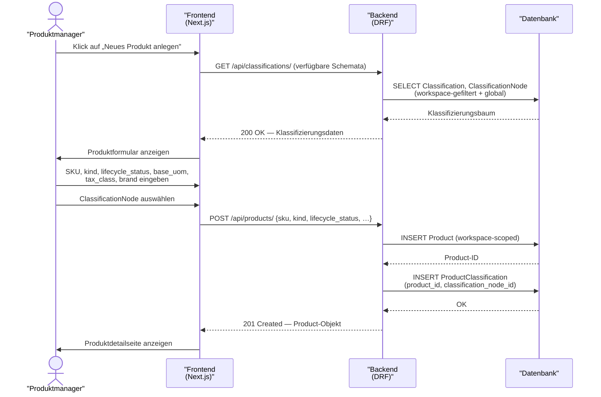

# UC-0001: Produkt anlegen und klassifizieren

**ID:** UC-0001  
**Bezug:** ADR-0003, ADR-0004, REQ-0001, REQ-0005, REQ-0008  
**Lizenzseite:** Open-Source-Backend (Datenmodell und API); Closed-Source-Frontend (UI-Interaktion)

---

## Akteure
- **Primär:** Produktmanager (eingeloggter Benutzer mit Schreibrecht auf den aktiven Workspace)
- **System:** KoalixCRM-Backend (DRF), KoalixCRM-Frontend (Next.js/Refine)

## Vorbedingungen
- Der Produktmanager ist authentifiziert und hat einen aktiven Workspace.
- Mindestens eine `Classification` (z. B. UNSPSC) und der zugehörige `ClassificationNode`-Baum sind im System geladen.
- Die Basismaßeinheit (`base_uom`) und die Steuerklasse (`tax_class`) für den Workspace sind konfiguriert.

## Auslöser
Der Produktmanager navigiert zur Produktlistenseite und klickt auf „Neues Produkt anlegen".

## Hauptablauf

## Alternativablauf A: Doppelte SKU
- Im Schritt „POST /api/products/" erkennt das Backend, dass die Kombination `(workspace, sku)` bereits existiert.
- Das Backend antwortet mit HTTP 400 und einer Fehlermeldung, die die doppelte SKU benennt.
- Das Frontend zeigt die Fehlermeldung im Formular an; der Produktmanager korrigiert die SKU.

## Alternativablauf B: Kein ClassificationNode ausgewählt
- Das Frontend erlaubt das Absenden des Formulars ohne Klassifizierung.
- Das `ProductClassification`-Eintrag entfällt; das `Product`-Objekt wird ohne Klassifizierung angelegt.
- Der Produktmanager kann die Klassifizierung später in der Produktdetailansicht nachtragen.

## Nachbedingungen
- Genau ein `Product`-Objekt mit dem gewählten `kind` und `lifecycle_status = DRAFT` ist im Workspace angelegt.
- Optional: Genau ein `ProductClassification`-Eintrag verknüpft das neue Produkt mit dem gewählten `ClassificationNode`.

## Behavioral Acceptance Criteria

### BAC-1: Formular-Verhalten
- [ ] Das Produktformular zeigt einen Pflichtfeld-Hinweis, wenn `kind`, `sku`, `base_uom` oder `tax_class` leer sind, bevor der Produktmanager absenden kann.
- [ ] Das Produktformular zeigt die `kind`-Enum-Werte als lesbare Auswahlliste (`SERVICE`, `TRADING_GOOD`, `MANUFACTURED_GOOD`, `KIT`, `RAW_MATERIAL`).
- [ ] Nach erfolgreichem Anlegen navigiert das Frontend automatisch zur Produktdetailseite des neuen Produkts.

### BAC-2: Fehlerdarstellung
- [ ] Eine HTTP-400-Antwort wegen doppelter SKU erzeugt eine inline Fehlermeldung am SKU-Feld; kein generisches Toast.
- [ ] Das Formular behält die eingegebenen Werte nach einem Fehler.

### BAC-3: Klassifizierungsbaum
- [ ] Der Klassifizierungsbaum ist durchsuchbar; der Produktmanager gibt einen Suchbegriff ein und sieht passende Knoten.
