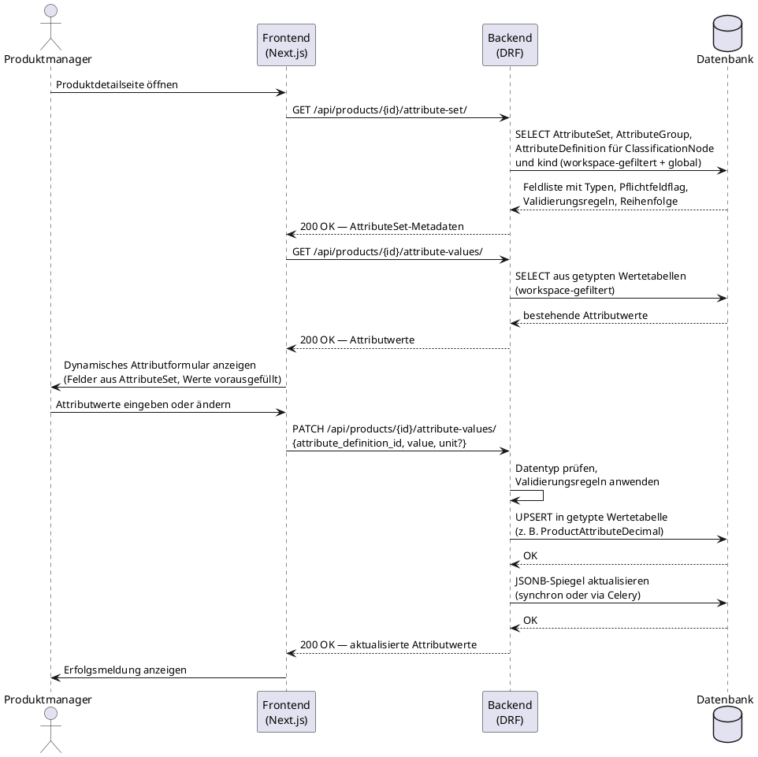

# UC-0002: Erweiterbare Attribute für ein Produkt pflegen

**ID:** UC-0002  
**Bezug:** ADR-0004, REQ-0009, REQ-0010  
**Lizenzseite:** Open-Source-Backend (Datenmodell und API); Closed-Source-Frontend (dynamisches Formular-Rendering)

---

## Akteure
- **Primär:** Produktmanager (eingeloggter Benutzer mit Schreibrecht auf den aktiven Workspace)
- **System:** KoalixCRM-Backend (DRF), KoalixCRM-Frontend (Next.js/Refine)

## Vorbedingungen
- Das `Product` existiert im aktiven Workspace (UC-0001 abgeschlossen).
- Das `Product` ist unter mindestens einem `ClassificationNode` eingehängt, dem ein `AttributeSet` zugeordnet ist.
- Der Produktmanager hat Schreibrecht auf Attributwerte.

## Auslöser
Der Produktmanager öffnet die Produktdetailseite und navigiert zum Attributbereich.

## Hauptablauf

## Alternativablauf A: Validierungsfehler
- Das Backend wendet die Validierungsregel der `AttributeDefinition` an (z. B. `value > max`).
- Das Backend antwortet mit HTTP 400 und einer Fehlermeldung, die das betreffende Attribut und die verletzte Regel benennt.
- Das Frontend zeigt die Fehlermeldung am betreffenden Formularfeld an.

## Alternativablauf B: Pflichtfeld fehlt
- Der Produktmanager versucht, ein Produkt mit `lifecycle_status = ACTIVE` zu setzen, obwohl ein Pflichtfeld (`is_required = true` in `AttributeDefinition`) leer ist.
- Das Backend antwortet mit HTTP 400 und einer Liste der fehlenden Pflichtattribute.
- Das Frontend zeigt die fehlenden Pflichtfelder hervorgehoben an.

## Alternativablauf C: Workspace-eigenes Attribut anlegen
- Der Produktmanager wechselt in den Attribut-Konfigurationsbereich des Workspace.
- Er legt eine neue `AttributeDefinition` mit `scope = WORKSPACE` und einem Datentyp an.
- Das neue Attribut erscheint im Attributformular aller Produkte des Workspace, denen das zugehörige `AttributeSet` zugeordnet ist.

## Nachbedingungen
- Die eingegebenen Attributwerte sind in den getypten Wertetabellen persistiert.
- Der `attribute_mirror`-JSONB-Block auf dem `Product`-Objekt enthält die aktuellen Werte.
- Kein `ProductAttributeDecimal`-, `ProductAttributeString`- oder anderer Werteintrag aus diesem Workspace ist in einem anderen Workspace sichtbar.

## Behavioral Acceptance Criteria

### BAC-1: Dynamisches Formular
- [ ] Das Attributformular zeigt ausschließlich die Felder, die im `AttributeSet` des jeweiligen `ClassificationNode` und `kind` definiert sind.
- [ ] Pflichtfelder (`is_required = true`) sind im Formular visuell als Pflichtfelder markiert.
- [ ] Felder mit `is_localized = true` zeigen je Sprache eine separate Eingabe.

### BAC-2: Typspezifische Eingabeelemente
- [ ] Felder mit Datentyp `bool` werden als Checkbox dargestellt.
- [ ] Felder mit Datentyp `enum` werden als Auswahlliste mit den erlaubten Enum-Werten dargestellt.
- [ ] Felder mit Datentyp `decimal` oder `measure` zeigen eine Einheitenauswahl neben dem Zahlenwert.

### BAC-3: Fehlerdarstellung
- [ ] Eine HTTP-400-Antwort wegen Validierungsfehler erzeugt eine inline Fehlermeldung am betreffenden Feld.
- [ ] Die Fehlermeldung nennt die verletzte Regel (z. B. „Wert muss kleiner als 100 sein").
