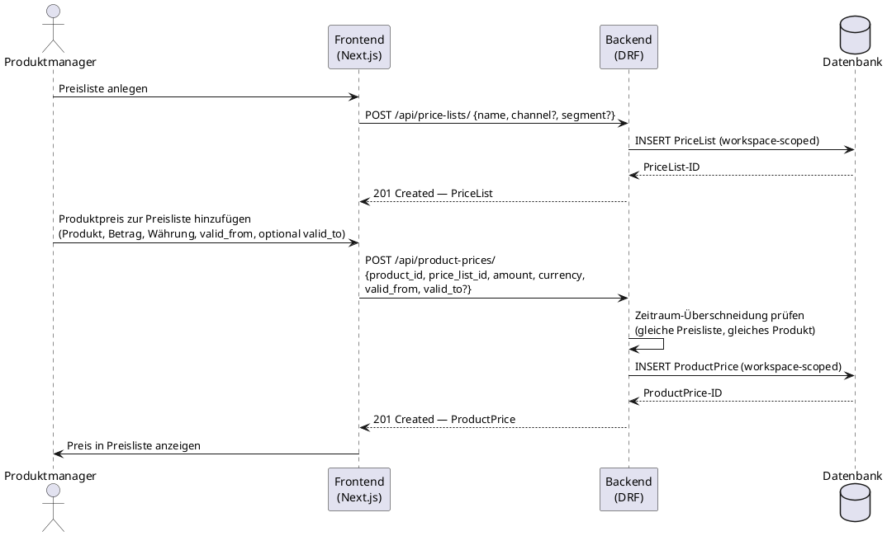

# UC-0004: Preisliste und Produktpreise verwalten

**ID:** UC-0004  
**Bezug:** ADR-0005, REQ-0011, REQ-0012  
**Lizenzseite:** Open-Source-Backend (Datenmodell und API); Closed-Source-Frontend (UI)

---

## Akteure
- **Primär:** Produktmanager oder Pricing-Verantwortlicher (eingeloggter Benutzer mit Schreibrecht auf den aktiven Workspace)
- **System:** KoalixCRM-Backend (DRF), KoalixCRM-Frontend (Next.js/Refine)

## Vorbedingungen
- Der aktive Workspace existiert.
- Mindestens eine `PartyGroup` (Kundensegment) ist im Workspace konfiguriert (ADR-0001).
- Das `Product` existiert im aktiven Workspace.

## Auslöser
Der Produktmanager navigiert zum Preisbereich der Produktdetailseite oder zur zentralen Preislistenverwaltung.

## Hauptablauf

## Alternativablauf A: Zeitraum-Überschneidung
- Das Backend erkennt, dass ein bestehender `ProductPrice`-Eintrag für dasselbe Produkt und dieselbe Preisliste mit dem neuen Gültigkeitszeitraum überlappt.
- Das Backend antwortet mit HTTP 400 und benennt den überlappenden Eintrag.
- Das Frontend zeigt die Fehlermeldung an.

## Alternativablauf B: customer_group_transform anlegen
- Der Produktmanager navigiert zur `customer_group_transform`-Konfiguration.
- Er legt einen Umrechnungsfaktor für eine `PartyGroup`, eine Einheit und eine Währung an.
- Das Backend speichert den Faktor; die Preisberechnung für diese Kombination liefert fortan das deterministische Ergebnis.

## Nachbedingungen
- Die `PriceList` ist im Workspace angelegt.
- Der `ProductPrice`-Eintrag ist der Preisliste zugeordnet und trägt einen nicht-überlappenden Gültigkeitszeitraum.

## Behavioral Acceptance Criteria

### BAC-1: Preislistenübersicht
- [ ] Die Preislistenübersicht zeigt alle `PriceList`-Einträge des aktiven Workspace paginiert.
- [ ] Jede Zeile zeigt Name, Kanalbezeichnung (sofern gesetzt) und Anzahl der zugeordneten `ProductPrice`-Einträge.

### BAC-2: Preiseingabe
- [ ] Das Preisformular erzwingt eine positive Dezimalzahl für den Preis; Nullwerte werden abgelehnt.
- [ ] Das Preisformular zeigt eine Warnung, wenn `valid_to` kleiner als `valid_from` ist.

### BAC-3: Preisanzeige in Produktdetail
- [ ] Die Produktdetailseite zeigt alle aktiven `ProductPrice`-Einträge gruppiert nach Preisliste.
- [ ] Der aktuell gültige Preis (gemäß Systemdatum) ist visuell hervorgehoben.
