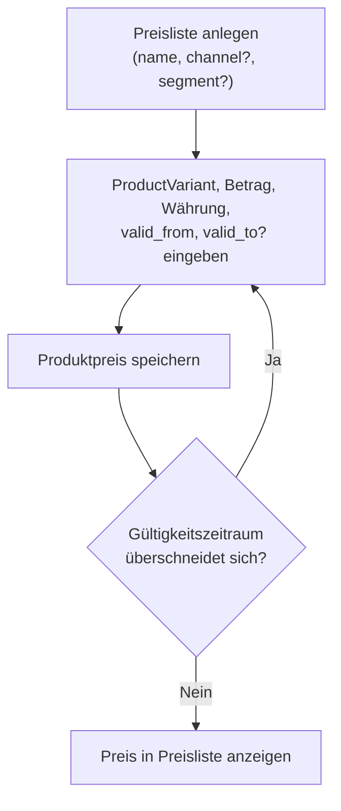
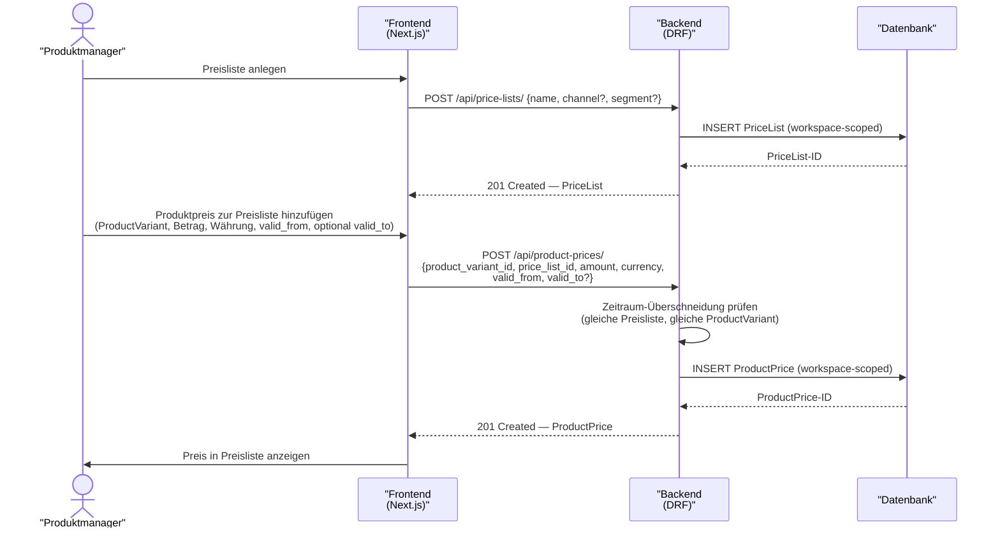

# UC-0004: Preisliste und Produktpreise verwalten

**ID:** UC-0004  
**Bezug:** [ADR-0005](../adr/0005-pricing-units-of-measure.md), [ADR-0021](../adr/0021-produkt-variantengranularitaet-topologie-schluesselung-attributkaskade.md), [REQ-0011](../requirements/REQ-0011.md), [REQ-0012](../requirements/REQ-0012.md)  
**Lizenzseite:** Open-Source-Backend (Datenmodell und API); Closed-Source-Frontend (UI)

---

## Akteure
- **Primär:** Produktmanager oder Pricing-Verantwortlicher (eingeloggter Benutzer mit Schreibrecht auf den aktiven Workspace)
- **System:** KoalixCRM-Backend (DRF), KoalixCRM-Frontend (Next.js/Refine)

## Vorbedingungen
- Der aktive Workspace existiert.
- Mindestens eine `PartyGroup` (Kundensegment) ist im Workspace konfiguriert ([ADR-0001](../adr/0001-contact-and-party-data-model.md)).
- Das `Product` existiert im aktiven Workspace und trägt mindestens eine `ProductVariant` ([ADR-0021](../adr/0021-produkt-variantengranularitaet-topologie-schluesselung-attributkaskade.md): „jedes `Product` besitzt ≥1 `ProductVariant`").
- Ein Preis wird an einer `ProductVariant` angelegt, nicht am `Product` selbst ([ADR-0021](../adr/0021-produkt-variantengranularitaet-topologie-schluesselung-attributkaskade.md): „`ProductPrice` ... trägt FK → `ProductVariant`"). Trägt das `Product` genau eine `ProductVariant`, wählt die Benutzeroberfläche diese einzige Variante vor.

## Auslöser
Der Produktmanager navigiert zum Preisbereich der Produktdetailseite oder zur zentralen Preislistenverwaltung.

## Hauptablauf

### Hauptablauf (Übersicht)
Der folgende Ablauf fasst den Standardfall aus Sicht des Produktmanagers zusammen#59; Details zu Schnittstellen zeigt das Sequenzdiagramm darunter.

## Alternativablauf A: Zeitraum-Überschneidung
- Das Backend erkennt, dass ein bestehender `ProductPrice`-Eintrag für dieselbe `ProductVariant` und dieselbe Preisliste mit dem neuen Gültigkeitszeitraum überlappt ([ADR-0021](../adr/0021-produkt-variantengranularitaet-topologie-schluesselung-attributkaskade.md): „`ProductPrice` trägt FK → `ProductVariant`; Preis ist variantenspezifisch").
- Das Backend antwortet mit HTTP 400 und benennt den überlappenden Eintrag.
- Das Frontend zeigt die Fehlermeldung an.

## Alternativablauf B: customer_group_transform anlegen
- Der Produktmanager navigiert zur `customer_group_transform`-Konfiguration.
- Er legt einen Umrechnungsfaktor für eine `PartyGroup`, eine Einheit und eine Währung an.
- Das Backend speichert den Faktor; die Preisberechnung für diese Kombination liefert fortan das deterministische Ergebnis.

## Nachbedingungen
- Die `PriceList` ist im Workspace angelegt.
- Der `ProductPrice`-Eintrag ist einer `ProductVariant` und der Preisliste zugeordnet und trägt einen nicht-überlappenden Gültigkeitszeitraum.

## Behavioral Acceptance Criteria

### BAC-1: Preislistenübersicht
- [ ] Die Preislistenübersicht zeigt alle `PriceList`-Einträge des aktiven Workspace paginiert.
- [ ] Jede Zeile zeigt Name, Kanalbezeichnung (sofern gesetzt) und Anzahl der zugeordneten `ProductPrice`-Einträge.

### BAC-2: Preiseingabe
- [ ] Das Preisformular erzwingt eine positive Dezimalzahl für den Preis; Nullwerte werden abgelehnt.
- [ ] Das Preisformular zeigt eine Warnung, wenn `valid_to` kleiner als `valid_from` ist.

### BAC-3: Preisanzeige in Produktdetail
- [ ] Die Produktdetailseite zeigt alle aktiven `ProductPrice`-Einträge gruppiert nach `ProductVariant` und innerhalb jeder Variante nach Preisliste.
- [ ] Der aktuell gültige Preis (gemäß Systemdatum) ist je `ProductVariant` visuell hervorgehoben.
- [ ] Trägt das `Product` genau eine `ProductVariant`, blendet die Produktdetailseite die Variantengruppierung optisch aus und zeigt die Preise direkt.

---

## Referenzen
- [ADR-0005](../adr/0005-pricing-units-of-measure.md) — Preislisten, `ProductPrice`, `customer_group_transform`
- [ADR-0021](../adr/0021-produkt-variantengranularitaet-topologie-schluesselung-attributkaskade.md) — `ProductPrice` FK → `ProductVariant` (variantenspezifische Preisschlüsselung)
- [ADR-0001](../adr/0001-contact-and-party-data-model.md) — `PartyGroup`/Workspace-Scoping
- [REQ-0011](../requirements/REQ-0011.md), [REQ-0012](../requirements/REQ-0012.md) — governing requirements
- [Glossar](../glossar.md) — Begriffsdefinitionen (`PriceList`, `ProductPrice`, `customer_group_transform`, `PartyGroup`, `ProductVariant`)

---

## Änderungsprotokoll
- 2026-07-04: Anpassung an [ADR-0021](../adr/0021-produkt-variantengranularitaet-topologie-schluesselung-attributkaskade.md): Preis-/Bestands-/GTIN-Schlüsselung auf ProductVariant.
