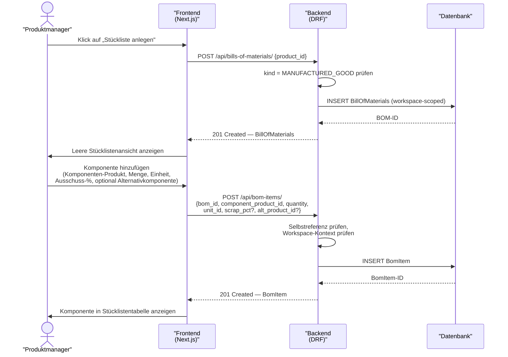

# UC-0005: Stückliste für ein Fertigprodukt pflegen

**ID:** UC-0005  
**Bezug:** ADR-0006, REQ-0015  
**Lizenzseite:** Open-Source-Backend (Datenmodell und API); Closed-Source-Frontend (UI)

---

## Akteure
- **Primär:** Produktmanager oder Fertigungsplaner (eingeloggter Benutzer mit Schreibrecht auf den aktiven Workspace)
- **System:** KoalixCRM-Backend (DRF), KoalixCRM-Frontend (Next.js/Refine)

## Vorbedingungen
- Das Produkt, für das eine Stückliste angelegt wird, existiert im aktiven Workspace mit `kind = MANUFACTURED_GOOD`.
- Mindestens ein Komponenten-`Product` existiert im aktiven Workspace.
- Der Benutzer hat Schreibrecht auf `BillOfMaterials` und `BomItem`.

## Auslöser
Der Produktmanager öffnet die Produktdetailseite eines Fertigprodukts und klickt auf „Stückliste anlegen".

## Hauptablauf

## Alternativablauf A: Falscher kind-Wert
- Der Produktmanager versucht, eine `BillOfMaterials` für ein Produkt mit `kind != MANUFACTURED_GOOD` anzulegen.
- Das Backend antwortet mit HTTP 400 und einer Fehlermeldung, die den kind-Wert und die Einschränkung benennt.
- Das Frontend blendet die Schaltfläche „Stückliste anlegen" für Produkte mit anderen kind-Werten aus.

## Alternativablauf B: Selbstreferenz
- Der Produktmanager wählt das Fertigprodukt selbst als Komponente.
- Das Backend antwortet mit HTTP 400 und einer Fehlermeldung.

## Alternativablauf C: Stückliste bereits vorhanden
- Das Produkt hat bereits eine `BillOfMaterials`.
- Das Frontend zeigt die bestehende Stückliste an, anstatt eine neue anlegen zu können.
- Der Produktmanager bearbeitet die bestehende Stückliste durch Hinzufügen, Ändern oder Entfernen von `BomItem`-Einträgen.

## Nachbedingungen
- Genau eine `BillOfMaterials` ist dem Fertigprodukt zugeordnet.
- Alle `BomItem`-Einträge verweisen auf existierende Komponenten-Produkte im Workspace.
- Kein `BomItem` verweist auf das übergeordnete Fertigprodukt selbst.

## Behavioral Acceptance Criteria

### BAC-1: Stücklisten-Schaltfläche
- [ ] Die Schaltfläche „Stückliste anlegen" ist auf der Produktdetailseite nur sichtbar, wenn `kind = MANUFACTURED_GOOD`.
- [ ] Existiert bereits eine `BillOfMaterials`, wird anstelle der Anlegen-Schaltfläche die bestehende Stückliste angezeigt.

### BAC-2: Stücklistentabelle
- [ ] Die Stücklistentabelle zeigt Komponenten-SKU, Bezeichnung, Menge, Einheit, Ausschuss-Prozentsatz und Alternativkomponente (sofern gesetzt).
- [ ] Die Stücklistentabelle erlaubt das Löschen einzelner `BomItem`-Einträge per Schaltfläche.

### BAC-3: Fehlerdarstellung
- [ ] Eine HTTP-400-Antwort wegen Selbstreferenz erzeugt eine inline Fehlermeldung; das Formular bleibt geöffnet.
