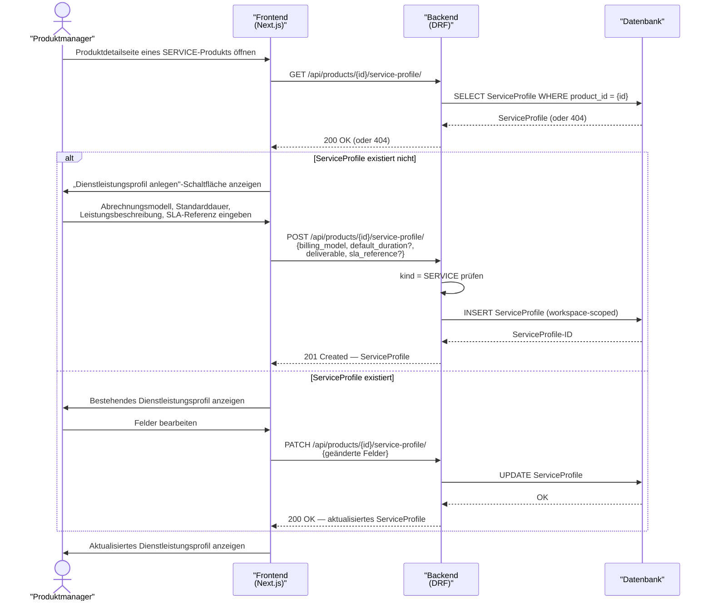

# UC-0006: Dienstleistungsprofil für ein SERVICE-Produkt anlegen und bearbeiten

**ID:** UC-0006  
**Bezug:** ADR-0007, REQ-0016  
**Lizenzseite:** Open-Source-Backend (Datenmodell und API); Closed-Source-Frontend (UI)

---

## Akteure
- **Primär:** Produktmanager (eingeloggter Benutzer mit Schreibrecht auf den aktiven Workspace)
- **System:** KoalixCRM-Backend (DRF), KoalixCRM-Frontend (Next.js/Refine)

## Vorbedingungen
- Das `Product` existiert im aktiven Workspace mit `kind = SERVICE`.
- Der Produktmanager hat Schreibrecht auf `ServiceProfile`.

## Auslöser
Der Produktmanager öffnet die Produktdetailseite eines SERVICE-Produkts. Das Frontend erkennt
`kind = SERVICE` und zeigt den Dienstleistungsprofil-Abschnitt an.

## Hauptablauf

## Alternativablauf A: Falscher kind-Wert
- Das Backend empfängt eine POST-Anfrage für ein Produkt mit `kind != SERVICE`.
- Das Backend antwortet mit HTTP 400 und einer Fehlermeldung.
- Das Frontend blendet den Dienstleistungsprofil-Abschnitt für Produkte mit anderen kind-Werten aus.

## Alternativablauf B: Doppeltes ServiceProfile
- Das Backend erkennt, dass bereits ein `ServiceProfile` für das Produkt existiert.
- Das Backend antwortet mit HTTP 400 (POST nicht erlaubt; PATCH verwenden).

## Nachbedingungen
- Genau ein `ServiceProfile` ist dem SERVICE-Produkt zugeordnet.
- `billing_model` trägt einen der erlaubten Werte `fixed`, `hourly`, `subscription`, `tiered`.

## Behavioral Acceptance Criteria

### BAC-1: Abschnittsanzeige
- [ ] Der Dienstleistungsprofil-Abschnitt ist auf der Produktdetailseite ausschließlich sichtbar, wenn `kind = SERVICE`.
- [ ] Für Produkte mit anderen kind-Werten ist kein Dienstleistungsprofil-Abschnitt sichtbar oder erreichbar.

### BAC-2: Formular-Verhalten
- [ ] Das Abrechnungsmodell-Feld ist eine Pflichtauswahlliste mit den Werten `fixed`, `hourly`, `subscription`, `tiered`.
- [ ] Das Standarddauer-Feld akzeptiert nur positive Ganzzahlen und zeigt die Einheit (Minuten) als Label.
- [ ] Das Leistungsbeschreibungsfeld (`deliverable`) ist als Pflichtfeld markiert.

### BAC-3: Gleichbehandlung in Produktliste
- [ ] Die Produktlistenseite zeigt SERVICE-Produkte in derselben Liste wie andere Produktarten.
- [ ] Der Filter `kind = SERVICE` in der Produktliste liefert ausschließlich Dienstleistungen.
