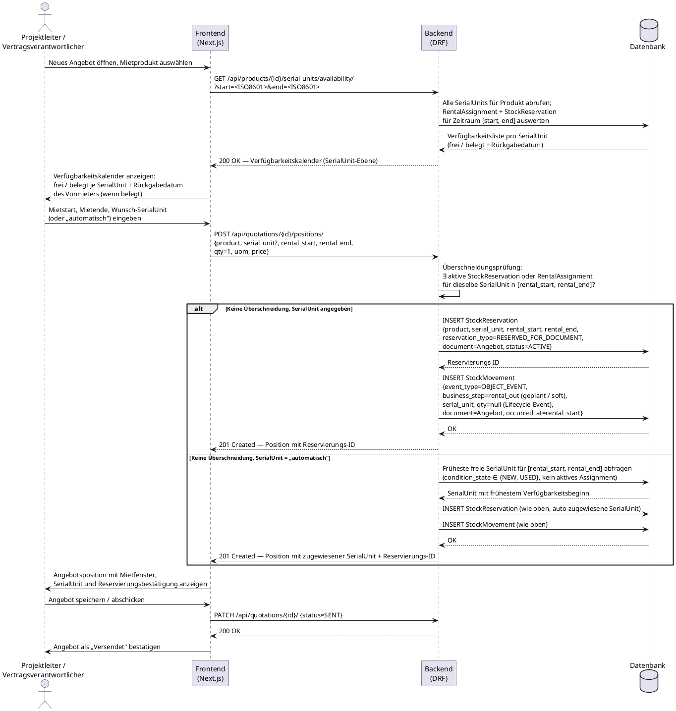

# UC-0007: Mietangebot für eine Einzeleinheit erstellen und Verfügbarkeit prüfen

**ID:** UC-0007
**Bezug:** ADR-0009, ADR-0010, ADR-0011, ADR-0012, ADR-0013, ADR-0015
**Lizenzseite:** Open-Source-Backend (Datenmodell, Reservierungslogik, Ereignis-Log und API); Closed-Source-Frontend (Verfügbarkeitskalender-UI, Angebotserstellungs-UI)

**Warum:** Mietflottenbetreiber verleihen Geräte zeitgebunden an Kunden; jede `SerialUnit` ist in einem Zeitfenster genau einem Mieter zugeordnet. Ohne eine zeitfensterbasierte Verfügbarkeitsprüfung und eine sofortige Soft-Reservierung beim Speichern des Angebots entstehen Doppelbuchungen, bei denen zwei Angebote dieselbe Einheit für denselben Zeitraum versprechen.

---

## Akteure

- **Primär:** Projektleiter oder Vertragsverantwortlicher (eingeloggter Benutzer mit Schreibrecht auf Angebote im aktiven Workspace)
- **System:** KoalixCRM-Backend (DRF), KoalixCRM-Frontend (Next.js/Refine)

## Vorbedingungen

- Das `Product` (`kind = TRADING_GOOD` oder ein anderer angemessener `kind`-Wert für Mietgüter; `tracking_mode = SERIAL`) existiert im aktiven Workspace mit `lifecycle_status = ACTIVE`.
- Mindestens eine `SerialUnit` dieses Produkts ist im Workspace vorhanden, trägt `condition_state ∈ {NEW, USED}` (nicht `DAMAGED`, nicht `IN_REPAIR`) und hat kein aktives `RentalAssignment` für den angefragten Zeitraum.
- Der Benutzer ist authentifiziert und hat einen aktiven Workspace.
- Eine Kundenpartei (`Party`, ADR-0001) für den Mieter existiert im Workspace.

## Auslöser

Der Projektleiter oder Vertragsverantwortliche öffnet die Angebotserstellungsmaske und fügt eine neue Angebotsposition hinzu, für die das Produkt der Mietbohrhammertyp ausgewählt wird.

---

## Hauptablauf

---

## Alternativablauf A: Keine SerialUnit im angefragten Zeitfenster verfügbar

- Das Backend stellt fest, dass alle `SerialUnit`-Einträge des Produkts im Zeitraum `[rental_start, rental_end]` durch aktive `StockReservation`- oder `RentalAssignment`-Einträge belegt sind oder `condition_state ∈ {DAMAGED, IN_REPAIR}` tragen.
- Das Backend antwortet mit HTTP 409 und gibt das früheste Datum zurück, an dem mindestens eine Einheit wieder verfügbar ist (berechnet aus `RentalAssignment.return_due_date` und `StockReservation.expires_at`).
- Das Frontend zeigt die Nichtverfügbarkeit im Kalender und schlägt das nächste freie Fenster vor.
- Der Projektleiter passt das Mietfenster an oder bricht den Vorgang ab.

## Alternativablauf B: Überschneidungskonflikt bei explizit gewählter SerialUnit

- Der Benutzer wählt eine konkrete `SerialUnit` und ein Mietfenster, für das diese Einheit bereits eine aktive `StockReservation` oder ein aktives `RentalAssignment` trägt.
- Das Backend erkennt die Überschneidung (`∃ Reservierung ∩ [rental_start, rental_end]`) und antwortet mit HTTP 409.
- Das Backend liefert die ID des kollidierenden Dokuments (Angebot oder Mietvertrag) und den belegten Zeitraum zurück.
- Das Frontend zeigt den Konflikt im Kalender hervor; der Benutzer wählt eine andere SerialUnit oder ein anderes Zeitfenster.

## Alternativablauf C: Angebot abgelaufen oder abgelehnt — Reservierung freigeben

- Das Angebot erreicht `status = EXPIRED` oder `status = REJECTED` (durch Zeitablauf oder manuelle Ablehnung).
- Das Backend setzt alle zugehörigen `StockReservation`-Einträge auf `status = CANCELLED`.
- Das Backend emittiert einen kompensierenden `StockMovement`-Eintrag mit `business_step = adjustment` und `compensates = FK auf den ursprünglichen geplanten rental_out-Event` (ADR-0011).
- Der freigegebene Zeitraum erscheint im Verfügbarkeitskalender aller anderen Angebote sofort als frei.

## Alternativablauf D: Frühzeitige Rückgabe durch den Kunden

- Der Mietvertrag wird bei der tatsächlichen Rückgabe durch einen `StockMovement`-Eintrag mit `business_step = rental_return` und `occurred_at = tatsächliches Rückgabedatum` abgeschlossen (ADR-0011).
- Das `RentalAssignment.returned_at` wird auf das tatsächliche Rückgabedatum gesetzt; `status = RETURNED`.
- `RentalAssignment.condition_at_return` wird mit dem festgestellten Zustand der Einheit belegt.
- Die `SerialUnit` wechselt den `condition_state` entsprechend des Rückgabezustands.
- Der Zeitraum zwischen tatsächlichem Rückgabedatum und ursprünglichem `return_due_date` wird für neue Reservierungen freigegeben.

## Alternativablauf E: Verspätete Rückgabe durch den Kunden

- Das `RentalAssignment.return_due_date` wird überschritten; das System setzt `status = OVERDUE`.
- Das Backend blockiert neue Reservierungen für diese `SerialUnit` ab `return_due_date` bis zur tatsächlichen Rückgabe.
- Der Verfügbarkeitskalender zeigt die Einheit weiterhin als belegt mit dem Label „Überfällig".
- Erst ein `StockMovement`-Eintrag mit `business_step = rental_return` schließt den Überfälligkeitsstatus und gibt die Einheit frei.

---

## Nachbedingungen

- Für jede bestätigte Angebotsposition mit Mietprodukt existiert genau eine aktive `StockReservation` mit `reservation_type = RESERVED_FOR_DOCUMENT`, verknüpft mit der Angebots-ID und einer konkreten `SerialUnit`.
- Der `StockMovement`-Log enthält einen Eintrag mit `business_step = rental_out` (geplant/soft) und `qty = null` für das Mietbeginn-Ereignis, verknüpft mit dem Angebot und der `SerialUnit`.
- Der `StockMovement`-Log für die `SerialUnit` ist als zeitliche Abfolge abfragbar und zeigt, wer die Einheit in welchem Zeitfenster hält (ADR-0015: alle `StockMovement`-Zeilen mit `serial_unit_id = <id>`, sortiert nach `occurred_at`).
- Jedes andere Angebot, das dieselbe `SerialUnit` im gleichen Zeitraum anfragen würde, erhält HTTP 409.
- Wird das Angebot storniert oder abgelehnt, ist die `StockReservation` aufgehoben und die Einheit ist im Kalender sofort wieder frei (Alternativablauf C).

---

## Behavioral Acceptance Criteria

### BAC-1: Verfügbarkeitskalender — Granularität

- [ ] Der Verfügbarkeitskalender zeigt den Belegungsstatus je individueller `SerialUnit` (nicht aggregiert nach Produkttyp) für den gesamten vom Benutzer gewählten Datumsbereich.
- [ ] Eine belegte `SerialUnit` zeigt das früheste mögliche Rückgabedatum (`RentalAssignment.return_due_date`) als frühesten Zeitpunkt, ab dem die Einheit wieder verfügbar sein kann.
- [ ] Eine `SerialUnit` mit `condition_state ∈ {DAMAGED, IN_REPAIR}` erscheint im Kalender als dauerhaft nicht verfügbar, unabhängig vom angefragten Zeitraum.

### BAC-2: Zeitgebundene Angebotsposition

- [ ] Eine Mietangebotsposition trägt einen `rental_start`-Zeitstempel und einen `rental_end`-Zeitstempel; beide Felder sind Pflichtfelder für die Anlage einer Mietposition.
- [ ] Das Backend lehnt die Anlage einer `StockReservation` ab, wenn eine zweite bestätigte Reservierung existiert, die dieselbe `SerialUnit` und einen überschneidenden Zeitraum `[rental_start, rental_end]` trägt; die Antwort hat HTTP-Status 409.

### BAC-3: Soft-Reservierung beim Angebotsspeichern

- [ ] Das Speichern einer Mietangebotsposition erzeugt synchron im selben Datenbank-Transaktion eine `StockReservation` mit `status = ACTIVE`, `reservation_type = RESERVED_FOR_DOCUMENT` und einem FK auf das Angebotsdokument (ADR-0010: „generische Dokumentreferenz für Verkaufsauftrag, Angebot, Transferauftrag").
- [ ] Wird keine konkrete `SerialUnit` gewählt, weist das Backend automatisch die `SerialUnit` mit dem frühesten Verfügbarkeitsbeginn für den Zeitraum zu; die zugewiesene `SerialUnit` ist in der API-Antwort ausgewiesen.
- [ ] Die `StockReservation` ist für alle anderen API-Aufrufe im selben Workspace sofort nach dem Commit sichtbar (keine asynchrone Verzögerung).

### BAC-4: Freigabe der Reservierung bei Angebotsrückzug

- [ ] Sobald das Angebot `status = EXPIRED` oder `status = REJECTED` erhält, setzt das Backend alle zugehörigen `StockReservation`-Einträge auf `status = CANCELLED`.
- [ ] Nach der Stornierung des Angebots liefert der Verfügbarkeitskalender die zuvor belegte `SerialUnit` für denselben Zeitraum als frei.

### BAC-5: Lebenszyklus-Log — Halter-Zeitlinie

- [ ] Der `StockMovement`-Log enthält für die reservierte `SerialUnit` einen Eintrag mit `business_step = rental_out` (Planungsereignis, `qty = null`), `document_type` = Angebot und `occurred_at = rental_start` spätestens nach dem Commit der Angebotsposition.
- [ ] Eine Abfrage aller `StockMovement`-Zeilen mit `serial_unit_id = <id>`, sortiert aufsteigend nach `occurred_at`, ergibt eine lückenlose Zeitleiste der Halter- und Standortwechsel der Einheit (ADR-0015: „vollständige Einheitenhistorie durch eine einzige Abfrage auf dem `StockMovement`-Log").
- [ ] Jede Mietrückgabe emittiert einen `StockMovement`-Eintrag mit `business_step = rental_return`, `occurred_at = tatsächliches Rückgabedatum` und FK auf den Mietvertrag.

### BAC-6: EPCIS-CBV-Konsistenz

- [ ] Alle `StockMovement`-Einträge dieses Use Cases tragen `event_type = OBJECT_EVENT` (ADR-0011: „OBJECT_EVENT" für Lager- und Mietbewegungen).
- [ ] Die verwendeten `business_step`-Werte sind ausschließlich Werte aus dem in ADR-0011 definierten Wertebereich: `rental_out`, `rental_return`, `adjustment`, `commissioning`.
- [ ] Ein `StockMovement`-Eintrag mit `business_step = rental_out` trägt `qty = null`, da er ein Lifecycle-Planungsereignis ist und keine Mengenbewegung (ADR-0011: „ein Ereignis mit `qty = null` ist ein gültiges Lebenszyklus-Event").

---

## Architectural gaps surfaced

Die folgenden Lücken wurden beim Durcharbeiten dieses Use Cases gegenüber den ADRs 0009–0015 identifiziert. Sie sind als Kandidaten für ADR-Ergänzungen oder neue ADRs an `kxcrm-architect` eskaliert. Offene Fragen sind in `/app/koalixcrm-system/open_questions.md` unter OQ-0010 bis OQ-0014 eingetragen.

### Lücke 1 — CBV-Businessstep `rental_out` als Planungsereignis (soft) vs. physisches Ereignis (OQ-0010)

ADR-0011 enthält `rental_out` und `rental_return` im `business_step`-Wertebereich. Die semantische Unterscheidung zwischen einem *geplanten* Mietbeginn (Angebot gespeichert, Gerät noch im Lager) und einem *physisch vollzogenen* Mietbeginn (Übergabe an Kunden stattgefunden) ist im CBV-Wertebereich von ADR-0011 nicht explizit definiert. GS1 EPCIS 2.0 CBV unterscheidet `bizStep` von `disposition`; eine `disposition = in_progress` würde den Planungszustand kennzeichnen. Ohne diese Unterscheidung ist aus dem Event-Log nicht ableitbar, ob ein `rental_out`-Eintrag eine bestätigte physische Übergabe oder eine Soft-Reservierung auf Angebotsebene beschreibt. ADR-0011 muss klären, ob `disposition` als Feld in `StockMovement` eingeführt wird oder ob ein separater Soft-Reservierungs-Businessstep (z. B. `planned_rental_out`) dem Wertebereich hinzugefügt wird.

### Lücke 2 — Zeitfensterbasierte ATP-Funktion fehlt (OQ-0011)

ADR-0010 definiert ATP als skalare Formel: `ATP = qty_on_hand − qty_booked − qty_reserved_for_document + qty_ordered`. Diese Formel ist für Mietanwendungen unzureichend, da Miet-ATP keine Mengenfrage ist, sondern eine Zeitfensterfrage: „Ist `SerialUnit` X im Intervall `[start, end]` frei?" Die skalare ATP-Formel liefert keine verwertbare Antwort auf diese Frage. Kein bestehendes ADR definiert eine zeitfensterbasierte Verfügbarkeitsfunktion `is_free(serial_unit, [start, end])` oder einen entsprechenden API-Endpunkt. Ohne diese Funktion ist der Verfügbarkeitskalender (BAC-1) nicht aus dem bestehenden Datenmodell ableitbar.

### Lücke 3 — Angebote partizipieren nicht am Reservierungsmechanismus (OQ-0012)

ADR-0010 definiert `StockReservation` mit einer generischen Dokumentreferenz, die ausdrücklich Angebote einschließt. Kein bestehendes ADR beschreibt jedoch, welche Angebotszustände eine `StockReservation` erzeugen, welche sie freigeben und wie der Angebots-Lebenszyklus (DRAFT → SENT → ACCEPTED / REJECTED / EXPIRED) die `StockReservation.status`-Übergänge steuert. Diese fehlende Kopplung ist eine strukturelle Lücke: Ein Angebot kann ohne diese Regel mehrfach gespeichert werden, ohne dass eine bestehende Reservierung erkannt oder freigegeben wird. Das Verhalten bei gleichzeitigen Angeboten verschiedener Projektleiter auf dieselbe Einheit ist nicht spezifiziert.

### Lücke 4 — `RentalAssignment` hat kein zeitgebundenes Reservierungskonzept vor Übergabe (OQ-0013)

ADR-0013 definiert `RentalAssignment` als Bindung einer `SerialUnit` an einen aktiven Mietvertrag (`rental_start`, `return_due_date`). `RentalAssignment` entsteht jedoch erst bei physischer Übergabe (Mietbeginn). Zwischen Angebotsannahme und physischer Übergabe existiert ein Zeitraum, in dem die Einheit faktisch reserviert ist, aber weder ein aktives `RentalAssignment` noch eine formelle Bindung an die Einheit besteht — außer über `StockReservation`. Die Frage, ob `StockReservation` oder `RentalAssignment` die verbindliche Reservierungsquelle für den Verfügbarkeitskalender ist, ist zwischen ADR-0010 und ADR-0013 nicht abgestimmt. Eine doppelte Zählung (sowohl `StockReservation` als auch `RentalAssignment` blockieren denselben Slot) ist möglich.

### Lücke 5 — Halter-Zeitleiste als dedizierter Abfragepfad nicht definiert (OQ-0014)

ADR-0015 definiert den Abfragepfad „Vollständige Einheitenhistorie" als alle `StockMovement`-Zeilen mit `serial_unit_id = <id>`, sortiert nach `occurred_at`. Dieser Pfad enthält alle Ereignistypen: Lager-, Lifecycle- und Mietbewegungen gemischt. Eine explizite Projektion „Wer hat die Einheit in welchem Zeitfenster gehalten?" — d. h. eine Halter-Zeitleiste aus nur den `rental_out`/`rental_return`/`owner_type`-Paaren — ist kein definierter Abfragepfad in ADR-0015. Für den Verfügbarkeitskalender (BAC-1) und die Rückgabehistorie muss diese Projektion entweder als dedizierter API-Endpunkt oder als materialisierte Sicht spezifiziert werden. Ohne diese Spezifikation implementieren verschiedene Entwickler inkonsistente Auswertungslogiken.
