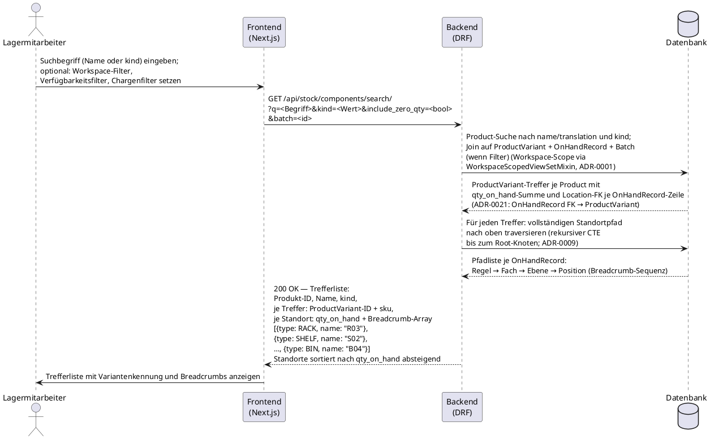

# UC-0008: Komponenten-Bestandssuche mit Stellplatz-Anzeige

**ID:** UC-0008
**Bezug:** ADR-0003, ADR-0009, ADR-0010, ADR-0011, ADR-0021
**Lizenzseite:** Open-Source-Backend (Datenmodell, Suchendpunkt, Aggregationslogik und API); Closed-Source-Frontend (Suchmaske, Breadcrumb-Darstellung, Filter-UI)

**Warum:** Lagermitarbeiter verlieren Zeit bei der manuellen Suche nach Komponenten, wenn Bestandsdaten und Standortpfade nicht in einer einzigen Abfrage abrufbar sind. Ohne einen strukturierten Suchendpunkt, der `OnHandRecord`-Aggregate und den vollständigen Standortpfad zusammenführt, entstehen Kommissionierfehler durch veraltete oder falsch lokalisierte Bestandsinformationen.

---

## Akteure

- **Primär:** Lagermitarbeiter (eingeloggter Benutzer mit Leserecht auf Lagerbestand im aktiven Workspace)
- **System:** KoalixCRM-Backend (DRF), KoalixCRM-Frontend (Next.js/Refine)

## Vorbedingungen

- Der Lagermitarbeiter ist authentifiziert und hat einen aktiven Workspace.
- Mindestens ein `Product` mit mindestens einer `ProductVariant` existiert im aktiven Workspace; die Variante trägt zugehörige `OnHandRecord`-Zeilen und `Location`-Zuordnungen (ADR-0021: „`OnHandRecord` FK → `ProductVariant` ist autoritativer Schlüssel").
- Die `Location`-Hierarchie des Workspace enthält die vier Ebenen Regal (`RACK`), Fach (`SHELF`), Ebene (`AISLE` oder angepasster Typ je Konfiguration) und Position (`BIN`) gemäß ADR-0009: „n-stufige Standorthierarchie mit `location_type`-Enum".

## Auslöser

Der Lagermitarbeiter benötigt eine Komponente und sucht ihren Lagerort im System.

---

## Hauptablauf

---

## Alternativablauf A: Kein Treffer

- Das Backend findet keine `Product`-Zeile, die dem Suchbegriff entspricht, oder alle Treffer haben `qty_on_hand = 0` und der Filter „inkl. Nullbestand" ist nicht gesetzt.
- Das Backend antwortet mit HTTP 200 und einer leeren Ergebnisliste (`results: []`).
- Das Frontend zeigt eine Meldung, dass kein passender Bestand gefunden wurde.

## Alternativablauf B: Mehrere Standorte für dieselbe ProductVariant

- Das Backend findet mehrere `OnHandRecord`-Zeilen für dieselbe `ProductVariant` an verschiedenen `Location`-Knoten (ADR-0021: `OnHandRecord` FK → `ProductVariant`).
- Das Backend gibt alle Standorte als separate Einträge in der Trefferliste zurück, jeweils mit eigenem Breadcrumb, eigener `qty_on_hand`-Menge und der `ProductVariant`-Kennung (`sku`).
- Die Einträge sind nach `qty_on_hand` absteigend sortiert, sodass der Standort mit dem höchsten verfügbaren Bestand zuerst erscheint.
- Das Frontend zeigt alle Standorte der Variante untereinander.
- Trägt ein `Product` mehrere `ProductVariant`-Einträge, gruppiert das Frontend die Standorteinträge zusätzlich nach Variante.

## Alternativablauf C: Treffer mit qty_on_hand = 0

- Das Backend findet Treffer, bei denen `qty_on_hand = 0` gilt, der Filter „inkl. Nullbestand" aber nicht gesetzt ist.
- Das Backend filtert diese Treffer aus der Antwort heraus; sie erscheinen nicht in der Trefferliste.
- Ist der Filter „inkl. Nullbestand" gesetzt, liefert das Backend alle Treffer inklusive Nullbestände; Nullbestand-Einträge sind am Ende der sortierten Liste platziert.

## Alternativablauf D: Suche nach kind ohne Namensterm

- Der Lagermitarbeiter gibt keinen Namensbegriff ein, setzt aber einen `kind`-Filter (z. B. `kind=RAW_MATERIAL`).
- Das Backend liefert alle `Product`-Einträge des angegebenen `kind`-Werts mit ihren Bestandsdaten und Standortpfaden.

---

## Nachbedingungen

- Der Lagermitarbeiter erhält eine vollständige Liste aller passenden `ProductVariant`-Treffer (mit Produkt- und Variantenkennung) mit `qty_on_hand`-Aggregat und vollständigem 4-stufigen Standortpfad als Breadcrumb-Array.
- Kein `OnHandRecord`-Eintrag aus einem anderen Workspace erscheint in der Antwort.
- Einträge mit `qty_on_hand = 0` sind nur sichtbar, wenn der Filter „inkl. Nullbestand" explizit gesetzt ist.

---

## Behavioral Acceptance Criteria

### BAC-1: Suche nach Produktname

- [ ] Eine Suchanfrage mit einem Teilstring des Produktnamens liefert alle `Product`-Einträge, deren `ProductTranslation.name` den Teilstring enthält (ADR-0003: „`ProductTranslation` speichert mehrsprachige Bezeichnung").
- [ ] Die Suche ist unabhängig von Groß- und Kleinschreibung.
- [ ] Treffer aus anderen Workspaces erscheinen nicht in der Antwort.

### BAC-2: Suche nach kind

- [ ] Eine Suchanfrage mit `kind=<Wert>` liefert ausschließlich `Product`-Einträge, deren `kind`-Feld den angegebenen Wert trägt (ADR-0003: „Das `kind`-Enum klassifiziert das Produkt als `SERVICE`, `TRADING_GOOD`, `MANUFACTURED_GOOD`, `KIT` oder `RAW_MATERIAL`").
- [ ] Name-Suche und `kind`-Filter lassen sich kombinieren; das Backend wendet beide Bedingungen mit AND-Semantik an.

### BAC-3: Vollständiger Standortpfad über alle 4 Ebenen

- [ ] Die Antwort für jeden Treffer enthält für jede `OnHandRecord`-Zeile ein Breadcrumb-Array, das alle Vorfahren des `BIN`-Knotens bis einschließlich zum `RACK`-Knoten beinhaltet (Regal → Fach → Ebene → Position), in der Reihenfolge von der obersten zur untersten Ebene.
- [ ] Fehlt eine Zwischenebene in der `Location`-Hierarchie des Workspace, gibt das Backend nur die tatsächlich vorhandenen Knoten zurück; das Breadcrumb-Array ist kürzer als vier Einträge, aber strukturell korrekt.

### BAC-4: Mehrere Standorte gleichzeitig

- [ ] Existieren für eine `ProductVariant` `n > 1` `OnHandRecord`-Zeilen an verschiedenen `Location`-Knoten (ADR-0021: `OnHandRecord` FK → `ProductVariant` ist autoritativer Schlüssel), enthält die Antwort `n` Standorteinträge für diese Variante, jeder mit eigenem Breadcrumb, eigener Menge und der `ProductVariant`-Kennung (`sku`).
- [ ] Die Standorteinträge für dieselbe `ProductVariant` sind nach `qty_on_hand` absteigend sortiert.
- [ ] Trägt ein `Product` mehrere `ProductVariant`-Einträge, weist jeder Standorteintrag eindeutig aus, zu welcher Variante er gehört.

### BAC-5: Leeres Ergebnis

- [ ] Liefert die Suche keine Treffer, antwortet das Backend mit HTTP 200 und `results: []`.
- [ ] Das Frontend zeigt eine aussagekräftige Rückmeldung, wenn die Ergebnisliste leer ist.

### BAC-6: Nullbestand-Filter

- [ ] `OnHandRecord`-Zeilen mit `qty_on_hand = 0` erscheinen nicht in der Standardantwort.
- [ ] Setzt der Aufrufer den Parameter `include_zero_qty=true`, liefert das Backend auch Zeilen mit `qty_on_hand = 0`; diese erscheinen am Ende der sortierten Trefferliste.

### BAC-7: Workspace-Scope-Trennung

- [ ] Die Suchanfrage liefert ausschließlich `OnHandRecord`-, `ProductVariant`- und `Product`-Einträge des aktiven Workspace (ADR-0001: „Tenant-owned data inherits `WorkspaceScopedModel` and is filtered by `request.active_workspace`").
- [ ] Ein Lagermitarbeiter ohne Leserecht auf einen anderen Workspace erhält keinen Treffer aus diesem Workspace, auch wenn die gesuchte Komponente dort vorhanden ist.

---

## Architectural gaps surfaced

Es bestehen keine architektonischen Lücken über die bereits in ADR-0009 angekündigte Erweiterung des `location_type`-Enums (`LAYER`-Amendment) hinaus. Dieses ADR legt fest, dass die `Location`-Hierarchie durch einen einzelnen rekursiven Selbstverweis n-stufig abgebildet wird; die genaue Enum-Benennung der Zwischenebenen hat keinen Einfluss auf die Suchlogik dieses Use Cases, da der Breadcrumb-Pfad strukturell traversiert wird.

---

## Änderungsprotokoll
- 2026-07-04: Anpassung an ADR-0021: Preis-/Bestands-/GTIN-Schlüsselung auf ProductVariant.
