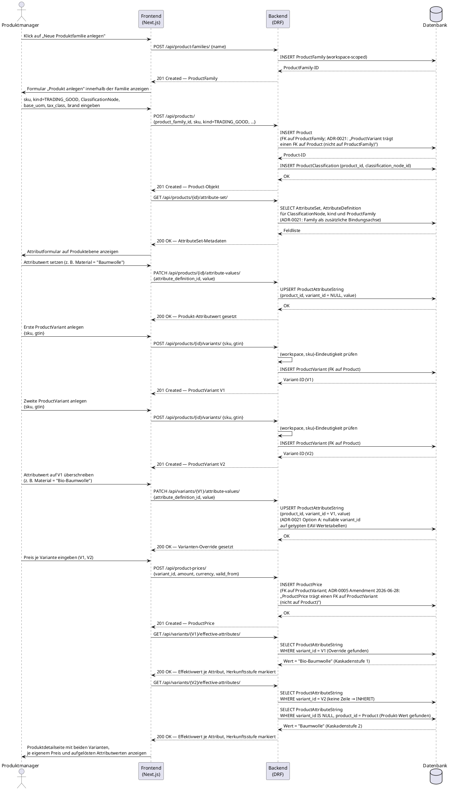

# UC-0011: Produktfamilie mit Varianten anlegen und Attribute kaskadieren

**ID:** UC-0011
**Bezug:** ADR-0021, ADR-0003, ADR-0004, ADR-0005, REQ-0001, REQ-0002, REQ-0010, REQ-0011
**Lizenzseite:** Open-Source-Backend (Datenmodell, Kaskadenauflösung im Serializer und API); Closed-Source-Frontend (Formular-UI, TypeScript-Kaskadenauflösung)

**Warum:** Ohne einen Use Case, der die 3-Ebenen-Topologie und die Attribut-Vererbungskaskade aus ADR-0021 end-to-end durchspielt, bleibt unklar belegt, ob `ProductVariant` korrekt an `Product` (nicht an `ProductFamily`) hängt, ob Varianten-Overrides über Option A funktionieren und ob die Lesekaskade Variante → Produkt → Familie in Serializer und Frontend-Evaluator übereinstimmend implementiert ist.

---

## Akteure
- **Primär:** Produktmanager (eingeloggter Benutzer mit Schreibrecht auf den aktiven Workspace)
- **System:** KoalixCRM-Backend (DRF), KoalixCRM-Frontend (Next.js/Refine)

## Vorbedingungen
- Der Produktmanager ist authentifiziert und hat einen aktiven Workspace.
- Mindestens eine `Classification` mit `ClassificationNode`-Baum ist im System geladen (ADR-0004).
- Ein `AttributeSet` mit mindestens einer `AttributeDefinition` ist an `kind = TRADING_GOOD` oder den gewählten `ClassificationNode` gebunden (ADR-0004).
- Die Basismaßeinheit (`base_uom`) und die Steuerklasse (`tax_class`) für den Workspace sind konfiguriert.

## Auslöser
Der Produktmanager navigiert zur Produktlistenseite und klickt auf „Neue Produktfamilie anlegen".

---

## Hauptablauf

---

## Alternativablauf A: Doppelte Variant-SKU

- Im Schritt „POST /api/products/{id}/variants/" erkennt das Backend, dass die Kombination `(workspace, sku)` bereits über eine bestehende `ProductVariant` belegt ist (REQ-0002 AC-2).
- Das Backend antwortet mit HTTP 400 und einer Fehlermeldung, die die doppelte SKU benennt.
- Das Frontend zeigt die Fehlermeldung im Variantenformular an; der Produktmanager korrigiert die SKU.

## Alternativablauf B: Löschung der letzten verbleibenden Variante

- Der Produktmanager versucht, die einzige verbleibende `ProductVariant` eines `Product` zu löschen.
- Das Backend prüft die Invariante „jedes `Product` besitzt ≥1 `ProductVariant`" (ADR-0021).
- Das Backend lehnt die Löschung mit HTTP 400 ab und benennt die verletzte Invariante.
- Das Frontend zeigt einen Hinweis, dass zuerst eine Ersatzvariante angelegt oder das gesamte `Product` gelöscht werden muss.

## Alternativablauf C: Override-zu-null

- Der Produktmanager versucht, einen bestehenden Varianten-Override auf einen leeren/`null`-Wert zu setzen, um zur Vererbung zurückzukehren.
- Das Backend lehnt diese Eingabe mit HTTP 400 ab (ADR-0021: „Ein Override-zu-null existiert nicht. Ein Varianten-Override-Wert ist immer ein konkreter, nicht-null Domänenwert").
- Das Frontend zeigt einen Hinweis, dass eine Rückkehr zur Vererbung ausschließlich über das Löschen der Override-Zeile (`DELETE /api/variants/{id}/attribute-values/{attribute_definition_id}/`) möglich ist, nicht über das Setzen von `null`.
- Nach dem Löschen der Override-Zeile liefert `GET /api/variants/{id}/effective-attributes/` wieder den Produkt- oder Familienwert (INHERIT).

---

## Nachbedingungen

- Genau eine `ProductFamily` mit genau einem `Product` (`kind = TRADING_GOOD`) und genau zwei `ProductVariant`-Objekten ist im Workspace angelegt; jede `ProductVariant` trägt einen FK auf `Product` (nicht auf `ProductFamily`).
- Jede `ProductVariant` trägt eine eigene, workspace-weit eindeutige `sku` und `gtin`.
- Ein Produkt-Attributwert (`variant_id IS NULL`) und genau ein Varianten-Override (`variant_id = V1`) für dasselbe Attribut existieren in der getypten EAV-Wertetabelle.
- `GET /api/variants/{V1}/effective-attributes/` liefert den Override-Wert; `GET /api/variants/{V2}/effective-attributes/` liefert den Produkt-Wert (INHERIT).
- Für V1 und V2 existiert je ein eigener `ProductPrice`-Eintrag mit FK auf die jeweilige `ProductVariant`.

---

## Behavioral Acceptance Criteria

### BAC-1: Formular-Verhalten Familie/Produkt/Variante
- [ ] Das Produktformular erlaubt die Auswahl oder das Neuanlegen einer `ProductFamily`, bevor ein `Product` angelegt wird; die Auswahl bleibt optional.
- [ ] Das Variantenformular verlangt `sku` als Pflichtfeld und zeigt `gtin` als optionales Feld.
- [ ] Nach dem Anlegen einer zweiten `ProductVariant` zeigt die Produktdetailseite beide Varianten in einer Liste, jede mit eigenem Preis- und Attribut-Abschnitt.

### BAC-2: Attribut-Override-Formular
- [ ] Das Attributformular auf Variantenebene zeigt für jedes Attribut, ob der angezeigte Wert ein Varianten-Override, ein geerbter Produkt-Wert oder ein geerbter Familie-/AttributeSet-Standard ist (Herkunftskennzeichnung sichtbar, z. B. Badge „Eigener Wert" vs. „Geerbt von Produkt").
- [ ] Ein Klick auf „Überschreiben" bei einem geerbten Wert öffnet ein Eingabefeld für einen konkreten, nicht-leeren Wert; das Absenden eines leeren Werts ist im Formular blockiert, bevor die Anfrage an das Backend geht.
- [ ] Ein Klick auf „Vererbung wiederherstellen" bei einem Override löst `DELETE /api/variants/{id}/attribute-values/{attribute_definition_id}/` aus, nicht ein `PATCH` mit `value = null`.

### BAC-3: Preis je Variante
- [ ] Das Preisformular ist an eine konkrete `ProductVariant` gebunden; es existiert kein Preisformular, das direkt an `Product` bindet.
- [ ] Zwei Varianten desselben Produkts können unterschiedliche Preise tragen; die Änderung des Preises einer Variante wirkt sich nicht auf den Preis der anderen Variante aus.

### BAC-4: Fehlerdarstellung
- [ ] Eine HTTP-400-Antwort wegen doppelter Variant-SKU erzeugt eine inline Fehlermeldung am SKU-Feld des Variantenformulars.
- [ ] Eine HTTP-400-Antwort wegen Löschversuchs der letzten Variante erzeugt eine Fehlermeldung mit Verweis auf die ≥1-Varianten-Invariante.
- [ ] Eine HTTP-400-Antwort wegen Override-zu-null erzeugt eine Fehlermeldung, die auf die „Vererbung wiederherstellen"-Aktion verweist statt auf ein leeres Eingabefeld.

---

## Änderungsprotokoll
- 2026-07-04: Ersterstellung. Schließt die Validierungslücke, dass kein Use Case die 3-Ebenen-Topologie, die Schlüsselungstabelle und die Attribut-Vererbungskaskade aus ADR-0021 end-to-end durchspielt.
