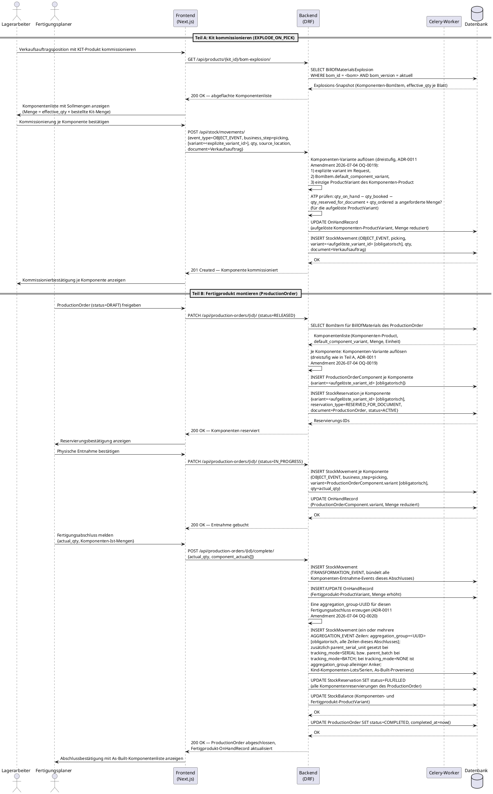

# UC-0012: Kit kommissionieren und Fertigprodukt montieren

**ID:** UC-0012
**Bezug:** ADR-0014, ADR-0006, ADR-0019, ADR-0021, ADR-0009, ADR-0010, ADR-0011, REQ-0015; ADR-0006 Nachtrag 2026-07-04, ADR-0011 Amendments 2026-07-04 (OQ-0019, OQ-0020) und ADR-0014 Nachtrag 2026-07-04 (Komponenten-Variantenauflösung und As-Built-Eltern-Anker), je in Verbindung mit ADR-0021 §Ripple-Liste Komponenten-Variantenauflösung und As-Built-Anker
**Lizenzseite:** Open-Source-Backend (Datenmodell, Reservierungs-/Event-Log-Logik, Celery-Explosionstask und API); Closed-Source-Frontend (Kommissionier-UI, Fertigungsauftrags-UI)

**Warum:** Kein bestehender Use Case durchläuft das Kitting-Modell (ADR-0014, `kind = KIT`, `EXPLODE_ON_PICK`) oder das Montagemodell (`ProductionOrder`/`ProductionOrderComponent`, `kind = MANUFACTURED_GOOD`) end-to-end. Ohne diesen Durchlauf bleibt unbelegt, ob die Bestandsbindung über `StockReservation`, die Fertigstellungsbuchung über `TRANSFORMATION_EVENT`/`AGGREGATION_EVENT` und die durchgängige Varianten-Schlüsselung (ADR-0021, Amendment 2026-07-04) im Zusammenspiel funktionieren.

---

## Akteure
- **Primär:** Lagerarbeiter (Kit-Kommissionierung) und Fertigungsplaner (Produktionsauftrag) — beide eingeloggte Benutzer mit Schreibrecht auf Lagerbewegungen im aktiven Workspace
- **System:** KoalixCRM-Backend (DRF), KoalixCRM-Frontend (Next.js/Refine), Celery-Worker (BOM-Explosion)

## Vorbedingungen
- Ein `Product` mit `kind = KIT` und `kit_mode = EXPLODE_ON_PICK` existiert im aktiven Workspace; seine `BillOfMaterials` trägt mindestens einen `BomItem` und einen aktuellen `BillOfMaterialsExplosion`-Snapshot (`bom_version` entspricht dem aktuellen `BillOfMaterials`-Stand, ADR-0014).
- Für jede Komponente der Kit-Explosion existiert ein ausreichender `OnHandRecord`-Bestand der jeweiligen Komponenten-`ProductVariant` (ADR-0021: „`OnHandRecord` FK → `ProductVariant` ist der autoritative Lager-Schlüssel").
- Ein `Product` mit `kind = MANUFACTURED_GOOD` existiert im aktiven Workspace mit einer `BillOfMaterials` (ADR-0006, REQ-0015); ein `ProductionOrder` mit `status = DRAFT` referenziert diese `BillOfMaterials`.
- Für jede Komponente des Fertigungsauftrags ist ausreichender `OnHandRecord`-Bestand der jeweiligen Komponenten-`ProductVariant` verfügbar oder disponierbar (ATP-Formel, ADR-0010).
- Der Benutzer ist authentifiziert und hat einen aktiven Workspace.

## Auslöser
Eine Verkaufsauftragsposition mit dem KIT-Produkt wird zur Kommissionierung freigegeben; unabhängig davon gibt der Fertigungsplaner den `ProductionOrder` für das Fertigprodukt frei.

---

## Hauptablauf

---

## Alternativablauf A: Unzureichender Komponentenbestand

- Beim Kit-Pick (Teil A) oder bei der `StockReservation`-Anlage bzw. physischen Entnahme (Teil B) stellt das Backend fest, dass die ATP-Formel (`ATP = qty_on_hand − qty_booked − qty_reserved_for_document + qty_ordered`, ADR-0010) für mindestens eine Komponenten-`ProductVariant` nicht die angeforderte Menge deckt.
- Das Backend antwortet mit HTTP 422 und benennt die betroffene Komponenten-`ProductVariant` sowie die verfügbare Menge.
- Das Frontend zeigt die Unterdeckung an der betroffenen Komponentenzeile an; der Benutzer reduziert die Menge, wählt eine Alternativkomponente (`BomItem`, ADR-0006 AC-2) oder bricht den Vorgang ab.
- Keine `StockMovement`- oder `StockReservation`-Zeile wird für die unterdeckte Komponente angelegt; bereits erfolgreich gebuchte Komponenten anderer Zeilen bleiben gebucht (keine Rückabwicklung des gesamten Vorgangs).

## Alternativablauf B: BOM-Explosions-Snapshot veraltet oder fehlt

- Beim Lesen von `GET /api/products/{kit_id}/bom-explosion/` stellt das Backend fest, dass kein `BillOfMaterialsExplosion`-Snapshot existiert oder dessen `bom_version` vom aktuellen `BillOfMaterials`-Stand abweicht (ADR-0014, OQ-0007).
- Die Applikationsschicht löst eine synchrone Neuberechnung der Explosion aus (kein Rückgriff auf den veralteten Snapshot).
- Überschreitet der BOM-Baum die weiche Tiefengrenze von 10 Ebenen, gibt das Backend eine Warnung zurück und empfiehlt `kit_mode = PREASSEMBLE`; die Kommissionierung wird dennoch fortgesetzt.
- Überschreitet der BOM-Baum die harte Tiefengrenze von 20 Ebenen, verweigert das Backend die Kommissionierung mit HTTP 422 und verweist auf `PREASSEMBLE` als einzige zulässige Betriebsart.
- Ein Celery-Task berechnet den Snapshot im Hintergrund neu, sodass nachfolgende Picks den aktuellen Snapshot lesen.

## Alternativablauf C: `kind`-Gating verletzt

- Der Benutzer versucht, eine `BillOfMaterials` oder einen `ProductionOrder` für ein `Product` mit `kind ∈ {SERVICE, TRADING_GOOD, RAW_MATERIAL}` anzulegen.
- Das Backend weist die Anfrage mit HTTP 400 ab; die `ProductKindPolicy` (ADR-0019) benennt den erlaubten Wertebereich `{MANUFACTURED_GOOD, KIT}` (REQ-0015 AC-1).
- Das Frontend zeigt die Fehlermeldung am Produktauswahlfeld an.

## Alternativablauf D: Komponenten-Variante nicht eindeutig auflösbar

- Beim Kit-Pick (Teil A) oder bei der `ProductionOrderComponent`-Reservierung (Teil B) durchläuft das Backend die dreistufige Komponenten-Variantenauflösung (ADR-0011, Amendment 2026-07-04, OQ-0019): (1) explizite `ProductVariant` im Request, (2) `BomItem.default_component_variant`, (3) die einzige `ProductVariant` des Komponenten-`Product`.
- Trägt das Komponenten-`Product` mehr als eine `ProductVariant`, ist kein `default_component_variant` gesetzt und enthält der Request keine explizite `ProductVariant`, bricht die Auflösung ergebnislos ab.
- Das Backend antwortet mit HTTP 422 und benennt die betroffene Komponentenzeile sowie die zur Auswahl stehenden `ProductVariant`-Werte des Komponenten-`Product`.
- Das Frontend zeigt an der betroffenen Komponentenzeile eine Auswahl der verfügbaren `ProductVariant`-Werte an; der Benutzer wählt eine Variante explizit oder bricht den Vorgang für diese Komponentenzeile ab.
- Keine `StockMovement`-, `StockReservation`- oder `ProductionOrderComponent`-Zeile wird für die nicht auflösbare Komponente angelegt; bereits erfolgreich aufgelöste und gebuchte Komponenten anderer Zeilen bleiben unverändert (keine Rückabwicklung des gesamten Vorgangs).

---

## Nachbedingungen

- Für jede kommissionierte Kit-Position (Teil A) existiert je Komponenten-`ProductVariant` genau ein `StockMovement`-Eintrag mit `event_type = OBJECT_EVENT`, `business_step = picking`, dessen `variant`-Feld die dreistufig aufgelöste Komponenten-`ProductVariant` obligatorisch trägt (ADR-0011, Amendment 2026-07-04, OQ-0019); kein eigener `OnHandRecord`-Eintrag für das KIT-Produkt selbst entsteht (`EXPLODE_ON_PICK` erzeugt keinen Vorlagerbestand, ADR-0014).
- Jeder `ProductionOrderComponent`-Eintrag (Teil B) trägt die dreistufig aufgelöste Komponenten-`ProductVariant` obligatorisch im `variant`-Feld (ADR-0014, Nachtrag 2026-07-04, OQ-0019); dasselbe gilt für die zugehörige `StockReservation`.
- Für jeden abgeschlossenen `ProductionOrder` (Teil B) existiert genau ein `StockMovement`-Eintrag mit `event_type = TRANSFORMATION_EVENT` sowie mindestens ein `StockMovement`-Eintrag mit `event_type = AGGREGATION_EVENT`, der die As-Built-Provenienz des Fertigprodukts dokumentiert; alle `AGGREGATION_EVENT`-Zeilen desselben Fertigungsabschlusses tragen denselben obligatorischen `aggregation_group`-Wert (ADR-0011, Amendment 2026-07-04, OQ-0020), unabhängig vom `tracking_mode` der Fertigprodukt-`ProductVariant`; zusätzlich ist `parent_serial_unit` gesetzt bei `tracking_mode = SERIAL` bzw. `parent_batch` bei `tracking_mode = BATCH`, während bei `tracking_mode = NONE` `aggregation_group` der alleinige Anker bleibt.
- Die `OnHandRecord`-Zeile der Fertigprodukt-`ProductVariant` ist um `actual_qty` erhöht; die `OnHandRecord`-Zeilen der Komponenten-`ProductVariant`-Objekte sind um die entnommenen Mengen reduziert.
- Alle `StockReservation`-Einträge des `ProductionOrder` tragen `status = FULFILLED`.
- `ProductionOrder.status = COMPLETED` und `completed_at` ist gesetzt.
- Sämtliche in diesem Use Case erzeugten `OnHandRecord`-, `StockReservation`- und `StockMovement`-Zeilen sind auf die jeweilige `ProductVariant` geschlüsselt (ADR-0021, Amendment 2026-07-04), nicht auf `Product`; `StockMovement.variant` ist dabei durchgängig obligatorisch (ADR-0011, Amendment 2026-07-04, OQ-0019).

---

## Behavioral Acceptance Criteria

### BAC-1: Kit-Kommissionierliste
- [ ] Die Kommissionierliste einer Kit-Position zeigt jede Komponente mit Sollmenge (`effective_qty × bestellte Kit-Menge`) und aktuellem verfügbarem Bestand der Komponenten-`ProductVariant`.
- [ ] Die Kommissionierliste zeigt einen Hinweis, wenn der zugrundeliegende Explosions-Snapshot bei der letzten Leseoperation neu berechnet wurde (Alternativablauf B).
- [ ] Nach vollständiger Kommissionierung aller Komponenten zeigt das Frontend die Kit-Position als „kommissioniert" ohne einen eigenen Lagerbestandseintrag für das KIT-Produkt.

### BAC-2: Fertigungsauftrag-Statusfluss
- [ ] Der `ProductionOrder`-Status durchläuft ausschließlich die Übergänge `DRAFT → RELEASED → IN_PROGRESS → COMPLETED`; ein direkter Sprung von `DRAFT` nach `COMPLETED` ist im Frontend nicht auswählbar.
- [ ] Die Freigabe (`RELEASED`) zeigt dem Fertigungsplaner die Liste der neu angelegten `StockReservation`-Einträge mit Komponenten-`ProductVariant` und reservierter Menge.
- [ ] Der Abschlussdialog verlangt die Eingabe der Komponenten-Ist-Mengen, bevor `POST /api/production-orders/{id}/complete/` ausgelöst wird.

### BAC-3: As-Built-Anzeige
- [ ] Nach Abschluss zeigt die Produktionsauftragsdetailseite die As-Built-Komponentenliste, gruppiert nach dem `aggregation_group`-Wert der `AGGREGATION_EVENT`-Zeilen des Fertigungsabschlusses (nicht nach einer Eltern-`SerialUnit`).
- [ ] Trägt die Fertigprodukt-`ProductVariant` `tracking_mode = SERIAL` oder `BATCH`, navigiert ein Klick auf die Fertigprodukt-Einheit zusätzlich zur vollständigen Einheitenhistorie (ADR-0015-Abfragepfad) und zeigt sowohl `TRANSFORMATION_EVENT` als auch `AGGREGATION_EVENT` in der Zeitleiste.
- [ ] Trägt die Fertigprodukt-`ProductVariant` `tracking_mode = NONE`, zeigt die As-Built-Komponentenliste die über `aggregation_group` gruppierten Kind-Komponenten-Lots/Serien des Fertigungsabschlusses ohne Verweis auf eine einzelne Fertigprodukt-Einheit.

### BAC-4: Fehlerdarstellung Bestandsunterdeckung und Variantenauflösung
- [ ] Eine HTTP-422-Antwort wegen unzureichenden Komponentenbestands erzeugt eine inline Fehlermeldung an der betroffenen Komponentenzeile, nicht als generischer Toast.
- [ ] Die Fehlermeldung benennt die verfügbare Menge und bietet — sofern in `BomItem` hinterlegt — die Alternativkomponente als Auswahl an.
- [ ] Eine HTTP-422-Antwort wegen nicht eindeutig auflösbarer Komponenten-Variante (Alternativablauf D) erzeugt eine inline Fehlermeldung an der betroffenen Komponentenzeile und zeigt die zur Auswahl stehenden `ProductVariant`-Werte des Komponenten-`Product` als Auswahlliste an.

### BAC-5: Varianten-Schlüsselung durchgängig
- [ ] Jede im Rahmen dieses Use Cases erzeugte `StockMovement`-, `StockReservation`-, `ProductionOrderComponent`- oder `OnHandRecord`-Zeile zeigt in der API-Antwort die konkrete Komponenten- oder Fertigprodukt-`ProductVariant` (nicht nur das übergeordnete `Product`); `variant` ist dabei ein obligatorisches Feld, kein optionales.

---

## Änderungsprotokoll
- 2026-07-04: Lücke 1 (OQ-0019) geschlossen: `BomItem` bleibt Product-gekeyt und trägt neu ein optionales, nicht-bindendes `default_component_variant`-Feld (ADR-0006, Nachtrag 2026-07-04); die verbindliche Komponenten-Variantenauflösung bindet erst am Buchungspunkt, dreistufig — (1) explizite Angabe im Request, (2) `BomItem.default_component_variant`, (3) die einzige `ProductVariant` des Komponenten-`Product` — mit HTTP 422 bei Nichtauflösbarkeit (ADR-0011, Amendment 2026-07-04). `ProductionOrderComponent.variant` (ADR-0014, Nachtrag 2026-07-04) und `StockMovement.variant` (ADR-0011, Amendment 2026-07-04) sind dazu beide obligatorisch geworden; die von ADR-0021 offengelassene Ripple-Lücke (`ADR-0011` fehlte in der Ripple-Liste) ist damit geschlossen. Hauptablauf (Teil A und Teil B) um die dreistufige Auflösung ergänzt; neuer Alternativablauf D für den 422-Fall; BAC-4 und BAC-5 entsprechend erweitert. Siehe ADR-0006, ADR-0011 und ADR-0014, je Nachtrag/Amendment 2026-07-04, sowie ADR-0021 §Ripple-Liste Komponenten-Variantenauflösung und As-Built-Anker.
- 2026-07-04: Lücke 2 (OQ-0020) geschlossen: `StockMovement` trägt neu ein tracking-mode-unabhängiges Gruppierungsfeld `aggregation_group` (UUID, obligatorisch bei `event_type = AGGREGATION_EVENT`), das alle `AGGREGATION_EVENT`-Zeilen desselben Fertigungsabschlusses verknüpft, unabhängig davon, ob eine Eltern-`SerialUnit` existiert; ergänzend tragen die Zeilen `parent_serial_unit` (bei `tracking_mode = SERIAL`) bzw. `parent_batch` (bei `tracking_mode = BATCH`), bei `tracking_mode = NONE` bleibt `aggregation_group` alleiniger Anker (ADR-0011, Amendment 2026-07-04; ADR-0014, Nachtrag 2026-07-04). Hauptablauf (Teil B, Fertigungsabschluss) um die `aggregation_group`-Erzeugung ergänzt; BAC-3 auf Gruppierung nach `aggregation_group` statt Eltern-`SerialUnit` umgestellt. Siehe ADR-0011 und ADR-0014, je Amendment/Nachtrag 2026-07-04.
- 2026-07-04: Ersterstellung. Schließt die Validierungslücke, dass kein Use Case das Kitting-Modell (`EXPLODE_ON_PICK`) und das Montagemodell (`ProductionOrder`/`ProductionOrderComponent`, `TRANSFORMATION_EVENT` + `AGGREGATION_EVENT`) end-to-end unter durchgängiger Varianten-Schlüsselung (ADR-0021, Amendment 2026-07-04) durchspielt. Lücke 1 (OQ-0019) und Lücke 2 (OQ-0020) an `kxcrm-architect` eskaliert.
